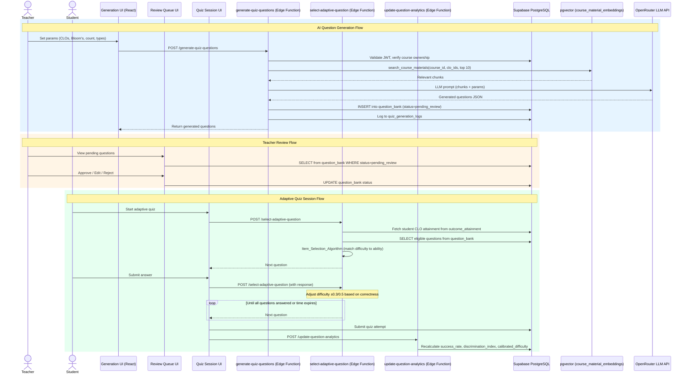

# Design Document — AI-Powered Adaptive Quiz Generation

## Overview

This design covers the AI-Powered Adaptive Quiz Generation system for the Edeviser platform. The feature extends the existing Quiz Module (Requirement 79) with three major capabilities:

1. **AI Question Generation** — An Edge Function (`generate-quiz-questions`) that accepts teacher parameters (CLOs, Bloom's levels, question types, count) and calls the LLM via OpenRouter, grounded by course material chunks retrieved from the existing `course_material_embeddings` Vector_Store (from the AI Tutor RAG feature)
2. **Adaptive Difficulty Engine** — A per-student item-level adaptation system that selects questions from the Question Bank based on the student's CLO attainment profile and in-session performance, targeting the zone of proximal development
3. **Question Analytics** — A per-question metrics pipeline (success rate, average response time, discrimination index) that recalibrates difficulty ratings empirically and helps teachers identify weak questions

The system integrates with:
- The existing OBE engine (`outcome_attainment` for CLO attainment data, evidence rollup)
- The AI Tutor RAG feature (`course_material_embeddings` Vector_Store, `search_course_materials` function)
- The gamification engine (`award-xp` Edge Function for quiz completion XP)
- Supabase Auth (JWT validation, RLS), Edge Functions, and Realtime

### Key Design Decisions

| Decision | Choice | Rationale |
|----------|--------|-----------|
| Question storage | Separate `question_bank` table | Decouples questions from quizzes; enables reuse across adaptive and non-adaptive quizzes |
| LLM gateway | OpenRouter API (same as AI Tutor) | Consistent with existing LLM integration; single API key management |
| RAG grounding | Reuse `search_course_materials` pgvector function | Avoids duplicating the Vector_Store; leverages existing HNSW index |
| Adaptive algorithm | Simple step-up/step-down with CLO-based initial ability | Transparent, debuggable; avoids IRT complexity while still personalizing |
| Difficulty scale | 1.0–5.0 numeric | Maps cleanly to Bloom's levels (1–6) and attainment thresholds |
| Analytics computation | Inline after quiz submission via Edge Function | Keeps analytics fresh; avoids cron job complexity for real-time teacher feedback |
| Question versioning | New row on edit, original preserved | Preserves historical analytics integrity |
| Adaptation toggle | `is_adaptive` boolean on `quizzes` table | Minimal schema change; teachers opt-in per quiz |
| PBT library | fast-check | Consistent with project conventions (project-conventions.md) |
| Mastery recovery detection | 2-failure threshold per CLO | Research-backed (Bloom, 1968); simple to implement, avoids false positives |
| Explanation confidence | Average RAG similarity of top 3 chunks | Direct proxy for grounding quality; 0.8 threshold balances sensitivity |
| Verified explanations | Separate cache table | Decouples teacher edits from AI generation; enables cache hit tracking |
| Practice mode | `mode` column on `quiz_attempts` | Minimal schema change; reuses adaptive engine without grade side effects |
| Bloom's Climb | 3-consecutive-correct trigger | Balances progression speed with confidence; independent of difficulty axis |

## Architecture

### High-Level Data Flow



### Component Architecture

```
src/
├── pages/teacher/quiz-generation/
│   ├── GenerateQuestionsPage.tsx    # AI generation form (CLO, Bloom's, count, types)
│   ├── ReviewQueuePage.tsx          # Pending question review with approve/edit/reject
│   └── QuestionBankPage.tsx         # Full question bank with filters and analytics
├── pages/teacher/quiz-analytics/
│   ├── QuestionAnalyticsDashboard.tsx  # Per-question metrics dashboard
│   └── QuizCLOCorrelationPage.tsx      # Quiz vs CLO attainment correlation
├── pages/student/quiz/
│   ├── AdaptiveQuizSession.tsx      # One-at-a-time adaptive quiz UI
│   └── PostQuizReview.tsx           # Post-quiz review with AI explanations
├── components/shared/
│   ├── QuestionPreview.tsx          # Renders a question (MCQ, T/F, short answer, fill-in)
│   ├── DifficultyBadge.tsx          # Color-coded difficulty rating badge
│   ├── BloomsBadge.tsx              # Bloom's level badge (reuses existing color coding)
│   ├── QuestionQualityIndicator.tsx # Green/yellow/red quality status
│   ├── AnswerDistributionChart.tsx  # Bar chart for MCQ option distribution
│   ├── MasteryRecoveryPanel.tsx     # Recovery pathway steps UI (AI Tutor, practice, peer)
│   ├── ExplanationConfidenceBadge.tsx # Confidence indicator on AI explanations
│   ├── PracticeModeToggle.tsx       # Toggle for enabling practice mode on quiz settings
│   ├── PracticeModeBanner.tsx       # "Practice Mode" banner during quiz session
│   ├── BloomsProgressionLadder.tsx  # Vertical ladder visualization per CLO
│   └── BloomsPioneerBadge.tsx       # Badge display for Bloom's progression achievements
├── hooks/
│   ├── useQuestionBank.ts           # CRUD + filters for question_bank
│   ├── useGenerateQuestions.ts      # Mutation for AI generation
│   ├── useReviewQueue.ts           # Pending questions + approve/edit/reject mutations
│   ├── useAdaptiveQuiz.ts          # Adaptive session state + question selection
│   ├── useQuestionAnalytics.ts     # Per-question analytics queries
│   ├── useQuizCLOCorrelation.ts    # Quiz vs CLO attainment data
│   ├── useMasteryRecovery.ts       # Recovery pathway state, step completion, retry gating
│   ├── useExplanationConfidence.ts # Confidence scores, verified explanation queries
│   ├── usePracticeMode.ts          # Practice mode toggle, practice attempt queries
│   └── useBloomsProgression.ts     # Bloom's ladder data, climb state, badge checks
├── lib/
│   ├── adaptiveEngine.ts           # Client-side ability estimation + difficulty targeting
│   ├── questionAnalytics.ts        # Analytics computation helpers
│   ├── quizGenerationSchemas.ts    # Zod schemas for generation requests/responses
│   ├── difficultyCalibration.ts    # Calibrated difficulty formula
│   ├── masteryRecovery.ts          # Recovery pathway logic, failure counting, step validation
│   ├── explanationConfidence.ts    # Confidence score computation, threshold checks
│   └── bloomsClimb.ts             # Bloom's level progression logic, consecutive tracking
supabase/functions/
├── generate-quiz-questions/index.ts    # AI question generation Edge Function
├── select-adaptive-question/index.ts   # Adaptive question selection Edge Function
└── update-question-analytics/index.ts  # Post-quiz analytics recalculation
```

## Components and Interfaces

### Edge Function: `generate-quiz-questions`

Accepts a teacher's generation request, retrieves relevant course material via RAG, and calls the LLM to produce quiz questions.

```typescript
// Request payload
interface GenerateQuestionsRequest {
  course_id: string;
  clo_ids: string[];              // 1–5 target CLOs
  bloom_levels: number[];         // 1–6 target Bloom's levels
  question_count: number;         // 1–50
  question_types: QuestionType[]; // mcq, true_false, short_answer, fill_in_blank
}

type QuestionType = 'mcq' | 'true_false' | 'short_answer' | 'fill_in_blank';

// Response payload
interface GenerateQuestionsResponse {
  generation_id: string;
  questions: GeneratedQuestion[];
  warnings: string[];             // e.g., insufficient course material
  chunks_used: number;
}

interface GeneratedQuestion {
  id: string;
  clo_id: string;
  bloom_level: number;
  question_type: QuestionType;
  question_text: string;
  options: MCQOption[] | null;    // null for non-MCQ types
  correct_answer: CorrectAnswer;
  explanation: string;            // AI-generated explanation for post-quiz review
  difficulty_rating: number;      // 1.0–5.0 LLM estimate
  source_chunks: ChunkReference[];
}

interface MCQOption {
  key: string;                    // 'A', 'B', 'C', 'D'
  text: string;
  is_correct: boolean;
}

interface CorrectAnswer {
  value: string | string[];       // single answer or array for multi-select
  explanation: string;
}

interface ChunkReference {
  chunk_id: string;
  chunk_text: string;
  source_filename: string;
  similarity_score: number;
}
```

Processing pipeline:
1. Validate JWT → extract `teacher_id`, verify course ownership via `courses.teacher_id`
2. Validate request params with Zod schema
3. Call `search_course_materials(course_id, clo_ids, top 10)` from the AI Tutor RAG Vector_Store
4. If fewer than 3 chunks returned with similarity ≥ 0.7, add warning about insufficient material
5. Construct LLM prompt with: retrieved chunks, target Bloom's levels, question types, distractor instructions
6. Call OpenRouter LLM API with structured JSON output format
7. Parse and validate LLM response against expected schema
8. INSERT generated questions into `question_bank` with `status = 'pending_review'`, `generation_source = 'ai'`
9. Log generation request to `quiz_generation_logs` (teacher_id, course_id, model, tokens, latency)
10. Return generated questions to the teacher UI

### Edge Function: `select-adaptive-question`

Handles item-level adaptive question selection during an adaptive quiz session.

```typescript
// Request payload
interface SelectQuestionRequest {
  quiz_id: string;
  quiz_attempt_id: string;
  student_id: string;             // from JWT
  previous_question_id?: string;  // null for first question
  previous_answer_correct?: boolean;
  previous_response_time_ms?: number;
}

// Response payload
interface SelectQuestionResponse {
  question: QuizSessionQuestion;
  question_number: number;
  total_questions: number;
  current_target_difficulty: number;
  session_complete: boolean;
}

interface QuizSessionQuestion {
  id: string;
  question_text: string;
  question_type: QuestionType;
  options: MCQOption[] | null;    // options shuffled, is_correct stripped
  bloom_level: number;
  clo_id: string;
}
```

Processing pipeline:
1. Validate JWT → extract `student_id`
2. If first question: fetch student CLO attainment from `outcome_attainment`, compute initial target difficulty
3. If subsequent question: adjust target difficulty (+0.3 for correct, −0.5 for incorrect), record response time
4. Query `question_bank` for eligible questions: `status = 'approved'`, matching quiz CLOs, `difficulty_rating` within ±0.5 of target
5. Exclude previously answered questions (from `quiz_attempt.question_sequence`)
6. If fewer than 3 eligible questions, expand range to ±1.0 and log warning
7. Prefer questions at higher Bloom's levels for High-ability students, lower for Low-ability
8. Select one question, strip `correct_answer` and `is_correct` from options
9. Append question to `quiz_attempt.question_sequence`
10. Return question to student UI

### Edge Function: `update-question-analytics`

Triggered after quiz attempt submission. Recalculates per-question analytics.

```typescript
interface UpdateAnalyticsRequest {
  quiz_attempt_id: string;
}
```

Processing pipeline:
1. Fetch the quiz attempt record with `question_sequence`, `answers`, `per_question_times`
2. For each question answered:
   a. UPSERT `question_analytics`: increment `total_attempts`, update `correct_count` if correct
   b. Recalculate `success_rate = correct_count / total_attempts`
   c. Recalculate `avg_response_time_seconds`
   d. If `total_attempts >= 10`: compute `calibrated_difficulty = 5.0 - (4.0 × success_rate)`, blend with original estimate
   e. If `total_attempts >= 20`: compute `discrimination_index` (top 27% vs bottom 27% by CLO attainment)
3. Flag questions with `discrimination_index < 0.2` or `success_rate > 0.95` or `success_rate < 0.10`

### React Components

**GenerateQuestionsPage** — Teacher form for AI question generation:
- Multi-select CLO picker (from course CLOs)
- Bloom's level checkboxes (1–6 with verb labels)
- Question type checkboxes (MCQ, T/F, short answer, fill-in-blank)
- Question count slider (1–50)
- "Generate" gradient CTA button with loading state
- Results panel showing generated questions with approve/edit/reject inline

**ReviewQueuePage** — Pending question review:
- Grouped by CLO and Bloom's level
- Each question card shows: question text, options (for MCQ), source material excerpt, estimated difficulty
- Approve (✓), Edit (✏️), Reject (✗) action buttons per question
- Approval rate summary per generation batch
- Bulk approve/reject actions

**QuestionBankPage** — Full question bank management:
- DataTable with columns: question text (truncated), CLO, Bloom's level, type, status, difficulty, analytics
- Filters via nuqs: CLO, Bloom's level, question_type, status, generation_source
- Inline analytics badges (success rate, discrimination index)
- Click to expand question detail with full text, options, explanation, analytics chart
- "Add Question" button for manual question creation
- Custom label tagging

**AdaptiveQuizSession** — Student adaptive quiz UI:
- One question at a time, no backward navigation
- Progress bar: "Question X of Y"
- Timer display (countdown from time limit)
- Question rendering via `QuestionPreview` component
- Submit answer → immediate next question (target < 500ms)
- On completion: redirect to PostQuizReview

**PostQuizReview** — Student post-quiz review:
- Each question with: student's answer, correct answer, correct/incorrect indicator
- AI-generated explanation per question (cached from generation)
- CLO and Bloom's level badges per question
- "Get Help" link → opens AI Tutor scoped to question's CLO
- Per-CLO score breakdown vs current CLO attainment

**QuestionAnalyticsDashboard** — Teacher analytics:
- Per-question metrics table: success rate, avg response time, discrimination index, attempt count
- Color-coded quality: green (good), yellow (marginal), red (flagged)
- Sort/filter by CLO, Bloom's, type, quality status
- Click flagged question → detail panel with answer distribution chart + suggested action

**QuizCLOCorrelationPage** — Teacher CLO correlation:
- Per-CLO comparison chart (Recharts bar chart): quiz score vs CLO attainment
- Discrepancy highlighting (>15 percentage points)
- Bloom's level distribution chart

### TanStack Query Hooks

```typescript
// useQuestionBank.ts
export const useQuestionBank = (courseId: string, filters: QuestionBankFilters) => useQuery({...});
export const useCreateQuestion = () => useMutation({...});
export const useUpdateQuestion = () => useMutation({...});

// useGenerateQuestions.ts
export const useGenerateQuestions = () => useMutation({...});

// useReviewQueue.ts
export const useReviewQueue = (courseId: string) => useQuery({...});
export const useApproveQuestion = () => useMutation({...});
export const useRejectQuestion = () => useMutation({...});
export const useBulkApproveQuestions = () => useMutation({...});

// useAdaptiveQuiz.ts
export const useStartAdaptiveQuiz = () => useMutation({...});
export const useSelectNextQuestion = () => useMutation({...});
export const useSubmitQuizAttempt = () => useMutation({...});

// useQuestionAnalytics.ts
export const useQuestionAnalytics = (courseId: string, filters?: AnalyticsFilters) => useQuery({...});
export const useQuestionDetail = (questionId: string) => useQuery({...});

// useQuizCLOCorrelation.ts
export const useQuizCLOCorrelation = (quizId: string) => useQuery({...});
```

### Zod Schemas

```typescript
// quizGenerationSchemas.ts
export const generateQuestionsSchema = z.object({
  course_id: z.string().uuid(),
  clo_ids: z.array(z.string().uuid()).min(1).max(5),
  bloom_levels: z.array(z.number().int().min(1).max(6)).min(1),
  question_count: z.number().int().min(1).max(50),
  question_types: z.array(z.enum(['mcq', 'true_false', 'short_answer', 'fill_in_blank'])).min(1),
});

export const questionBankEntrySchema = z.object({
  course_id: z.string().uuid(),
  clo_id: z.string().uuid(),
  bloom_level: z.number().int().min(1).max(6),
  question_type: z.enum(['mcq', 'true_false', 'short_answer', 'fill_in_blank']),
  question_text: z.string().min(1).max(5000),
  options: z.array(z.object({
    key: z.string(),
    text: z.string().min(1),
    is_correct: z.boolean(),
  })).nullable(),
  correct_answer: z.object({
    value: z.union([z.string(), z.array(z.string())]),
    explanation: z.string(),
  }),
  explanation: z.string().optional(),
  difficulty_rating: z.number().min(1.0).max(5.0),
  labels: z.array(z.string()).optional(),
});

export const adaptiveQuizConfigSchema = z.object({
  is_adaptive: z.boolean(),
  initial_difficulty: z.number().min(1.0).max(5.0).optional(),
  difficulty_step_up: z.number().default(0.3),
  difficulty_step_down: z.number().default(0.5),
  difficulty_range: z.number().default(0.5),
});

export type GenerateQuestionsInput = z.infer<typeof generateQuestionsSchema>;
export type QuestionBankEntry = z.infer<typeof questionBankEntrySchema>;
export type AdaptiveQuizConfig = z.infer<typeof adaptiveQuizConfigSchema>;
```

## Data Models

### New Database Tables

```sql
-- ============================================================
-- question_bank — Centralized question storage
-- ============================================================
CREATE TABLE question_bank (
  id UUID PRIMARY KEY DEFAULT gen_random_uuid(),
  institution_id UUID NOT NULL REFERENCES institutions(id),
  course_id UUID NOT NULL REFERENCES courses(id),
  clo_id UUID NOT NULL REFERENCES clos(id),
  bloom_level SMALLINT NOT NULL CHECK (bloom_level BETWEEN 1 AND 6),
  question_type VARCHAR(20) NOT NULL CHECK (question_type IN (
    'mcq', 'true_false', 'short_answer', 'fill_in_blank'
  )),
  question_text TEXT NOT NULL,
  options JSONB,                    -- array of { key, text, is_correct } for MCQ/T-F; null for others
  correct_answer JSONB NOT NULL,    -- { value, explanation }
  explanation TEXT,                  -- AI-generated explanation for post-quiz review
  difficulty_rating NUMERIC(3,1) NOT NULL CHECK (difficulty_rating BETWEEN 1.0 AND 5.0),
  status VARCHAR(20) NOT NULL DEFAULT 'pending_review' CHECK (status IN (
    'pending_review', 'approved', 'rejected'
  )),
  generation_source VARCHAR(20) NOT NULL CHECK (generation_source IN (
    'ai', 'ai_edited', 'manual'
  )),
  source_chunks JSONB DEFAULT '[]', -- array of { chunk_id, chunk_text, source_filename, similarity_score }
  labels TEXT[] DEFAULT '{}',
  parent_question_id UUID REFERENCES question_bank(id), -- for versioning: points to original
  generation_request_id UUID,       -- groups questions from same generation batch
  created_by UUID NOT NULL REFERENCES profiles(id),
  created_at TIMESTAMPTZ NOT NULL DEFAULT now(),
  updated_at TIMESTAMPTZ NOT NULL DEFAULT now()
);

CREATE INDEX idx_qbank_course_status ON question_bank (course_id, status);
CREATE INDEX idx_qbank_clo ON question_bank (clo_id);
CREATE INDEX idx_qbank_bloom ON question_bank (bloom_level);
CREATE INDEX idx_qbank_difficulty ON question_bank (difficulty_rating);
CREATE INDEX idx_qbank_generation ON question_bank (generation_request_id);

-- ============================================================
-- question_analytics — Per-question performance metrics
-- ============================================================
CREATE TABLE question_analytics (
  id UUID PRIMARY KEY DEFAULT gen_random_uuid(),
  question_id UUID NOT NULL REFERENCES question_bank(id) ON DELETE CASCADE,
  total_attempts INTEGER NOT NULL DEFAULT 0,
  correct_count INTEGER NOT NULL DEFAULT 0,
  success_rate NUMERIC(5,4) DEFAULT 0,          -- 0.0000 to 1.0000
  avg_response_time_seconds NUMERIC(8,2) DEFAULT 0,
  discrimination_index NUMERIC(5,4) DEFAULT 0,  -- -1.0000 to 1.0000
  calibrated_difficulty NUMERIC(3,1),            -- null until 10+ attempts
  quality_flag VARCHAR(20) CHECK (quality_flag IN (
    'good', 'low_discrimination', 'too_easy', 'too_hard', NULL
  )),
  last_calculated_at TIMESTAMPTZ NOT NULL DEFAULT now(),
  UNIQUE (question_id)
);

CREATE INDEX idx_qanalytics_question ON question_analytics (question_id);
CREATE INDEX idx_qanalytics_flag ON question_analytics (quality_flag) WHERE quality_flag IS NOT NULL;

-- ============================================================
-- quiz_generation_logs — LLM API call monitoring for quiz generation
-- ============================================================
CREATE TABLE quiz_generation_logs (
  id UUID PRIMARY KEY DEFAULT gen_random_uuid(),
  institution_id UUID NOT NULL REFERENCES institutions(id),
  teacher_id UUID NOT NULL REFERENCES profiles(id),
  course_id UUID NOT NULL REFERENCES courses(id),
  generation_request_id UUID NOT NULL,
  model_used VARCHAR(100) NOT NULL,
  prompt_tokens INTEGER NOT NULL,
  completion_tokens INTEGER NOT NULL,
  total_tokens INTEGER NOT NULL,
  latency_ms INTEGER NOT NULL,
  question_count_requested INTEGER NOT NULL,
  question_count_generated INTEGER NOT NULL,
  chunks_retrieved INTEGER NOT NULL,
  status VARCHAR(20) NOT NULL CHECK (status IN ('success', 'error', 'timeout')),
  error_message TEXT,
  created_at TIMESTAMPTZ NOT NULL DEFAULT now()
);

CREATE INDEX idx_gen_logs_institution ON quiz_generation_logs (institution_id, created_at DESC);
CREATE INDEX idx_gen_logs_course ON quiz_generation_logs (course_id);
```

### Schema Modifications to Existing Tables

```sql
-- Add adaptive quiz support to existing quizzes table
ALTER TABLE quizzes ADD COLUMN is_adaptive BOOLEAN NOT NULL DEFAULT false;
ALTER TABLE quizzes ADD COLUMN adaptation_config JSONB DEFAULT '{}';
-- adaptation_config: { initial_difficulty, difficulty_step_up, difficulty_step_down, difficulty_range }

-- Add adaptive session data to existing quiz_attempts table
ALTER TABLE quiz_attempts ADD COLUMN question_sequence JSONB DEFAULT '[]';
-- array of { question_id, difficulty_rating, bloom_level }
ALTER TABLE quiz_attempts ADD COLUMN difficulty_trajectory JSONB DEFAULT '[]';
-- array of { question_number, target_difficulty, actual_difficulty, was_correct }
ALTER TABLE quiz_attempts ADD COLUMN per_question_times JSONB DEFAULT '[]';
-- array of { question_id, response_time_ms }
```

### New Database Tables (Gap Analysis Additions)

```sql
-- ============================================================
-- mastery_recovery_pathways — Tracks recovery sessions for stuck students
-- ============================================================
CREATE TABLE mastery_recovery_pathways (
  id UUID PRIMARY KEY DEFAULT gen_random_uuid(),
  institution_id UUID NOT NULL REFERENCES institutions(id),
  student_id UUID NOT NULL REFERENCES profiles(id),
  clo_id UUID NOT NULL REFERENCES clos(id),
  course_id UUID NOT NULL REFERENCES courses(id),
  failure_count INTEGER NOT NULL DEFAULT 2,
  status VARCHAR(20) NOT NULL DEFAULT 'active' CHECK (status IN ('active', 'completed', 'expired')),
  ai_tutor_completed BOOLEAN NOT NULL DEFAULT false,
  ai_tutor_completed_at TIMESTAMPTZ,
  practice_completed BOOLEAN NOT NULL DEFAULT false,
  practice_completed_at TIMESTAMPTZ,
  peer_suggestion_shown BOOLEAN NOT NULL DEFAULT false,
  peer_suggestion_applicable BOOLEAN NOT NULL DEFAULT true,
  retry_quiz_attempt_id UUID,                    -- quiz attempt after recovery
  retry_outcome VARCHAR(10) CHECK (retry_outcome IN ('pass', 'fail', NULL)),
  activated_at TIMESTAMPTZ NOT NULL DEFAULT now(),
  completed_at TIMESTAMPTZ,
  expired_at TIMESTAMPTZ,
  created_at TIMESTAMPTZ NOT NULL DEFAULT now(),
  updated_at TIMESTAMPTZ NOT NULL DEFAULT now()
);

CREATE INDEX idx_recovery_student_clo ON mastery_recovery_pathways (student_id, clo_id);
CREATE INDEX idx_recovery_course ON mastery_recovery_pathways (course_id, status);
CREATE INDEX idx_recovery_status ON mastery_recovery_pathways (status) WHERE status = 'active';
CREATE UNIQUE INDEX idx_recovery_active_unique ON mastery_recovery_pathways (student_id, clo_id) WHERE status = 'active';

-- ============================================================
-- verified_explanations — Teacher-approved explanation cache
-- ============================================================
CREATE TABLE verified_explanations (
  id UUID PRIMARY KEY DEFAULT gen_random_uuid(),
  institution_id UUID NOT NULL REFERENCES institutions(id),
  question_id UUID NOT NULL REFERENCES question_bank(id) ON DELETE CASCADE,
  explanation_text TEXT NOT NULL,
  source VARCHAR(20) NOT NULL CHECK (source IN ('teacher_approved', 'teacher_edited')),
  verified_by UUID NOT NULL REFERENCES profiles(id),
  is_active BOOLEAN NOT NULL DEFAULT true,
  created_at TIMESTAMPTZ NOT NULL DEFAULT now(),
  updated_at TIMESTAMPTZ NOT NULL DEFAULT now()
);

CREATE UNIQUE INDEX idx_verified_active ON verified_explanations (question_id) WHERE is_active = true;
CREATE INDEX idx_verified_question ON verified_explanations (question_id);

-- ============================================================
-- blooms_progression — Tracks highest Bloom's level reached per student-CLO
-- ============================================================
CREATE TABLE blooms_progression (
  id UUID PRIMARY KEY DEFAULT gen_random_uuid(),
  institution_id UUID NOT NULL REFERENCES institutions(id),
  student_id UUID NOT NULL REFERENCES profiles(id),
  clo_id UUID NOT NULL REFERENCES clos(id),
  course_id UUID NOT NULL REFERENCES courses(id),
  highest_bloom_level SMALLINT NOT NULL DEFAULT 1 CHECK (highest_bloom_level BETWEEN 1 AND 6),
  correct_count_at_highest INTEGER NOT NULL DEFAULT 0,
  bloom_explorer_awarded BOOLEAN NOT NULL DEFAULT false,   -- level 4
  bloom_challenger_awarded BOOLEAN NOT NULL DEFAULT false,  -- level 5
  bloom_pioneer_awarded BOOLEAN NOT NULL DEFAULT false,     -- level 6
  updated_at TIMESTAMPTZ NOT NULL DEFAULT now(),
  UNIQUE (student_id, clo_id)
);

CREATE INDEX idx_blooms_student ON blooms_progression (student_id, course_id);
CREATE INDEX idx_blooms_clo ON blooms_progression (clo_id);
```

### Additional Schema Modifications (Gap Analysis Additions)

```sql
-- Add explanation confidence to question_bank
ALTER TABLE question_bank ADD COLUMN explanation_confidence NUMERIC(3,2) CHECK (
  explanation_confidence IS NULL OR (explanation_confidence BETWEEN 0.0 AND 1.0)
);

-- Add practice mode support to quizzes table
ALTER TABLE quizzes ADD COLUMN practice_mode_enabled BOOLEAN NOT NULL DEFAULT false;

-- Add mode and bloom's climb data to quiz_attempts table
ALTER TABLE quiz_attempts ADD COLUMN mode VARCHAR(10) NOT NULL DEFAULT 'graded' CHECK (
  mode IN ('graded', 'practice')
);
ALTER TABLE quiz_attempts ADD COLUMN blooms_climb_state JSONB DEFAULT '{}';
-- { current_bloom_level, consecutive_correct_at_level, bloom_transitions: [...] }
```

### New RLS Policies (Gap Analysis Additions)

```sql
-- ============================================================
-- mastery_recovery_pathways — RLS
-- ============================================================
ALTER TABLE mastery_recovery_pathways ENABLE ROW LEVEL SECURITY;

-- Students: read their own recovery pathways
CREATE POLICY "recovery_student_read" ON mastery_recovery_pathways
  FOR SELECT USING (student_id = auth.uid());

-- Teachers: read recovery pathways for their courses
CREATE POLICY "recovery_teacher_read" ON mastery_recovery_pathways
  FOR SELECT USING (
    auth_user_role() = 'teacher'
    AND course_id IN (SELECT id FROM courses WHERE teacher_id = auth.uid())
  );

-- System (Edge Functions with service role) handles INSERT/UPDATE
-- Admins: read all within institution
CREATE POLICY "recovery_admin_read" ON mastery_recovery_pathways
  FOR SELECT USING (
    auth_user_role() = 'admin'
    AND institution_id = auth_institution_id()
  );

-- Coordinators: read for metrics dashboard
CREATE POLICY "recovery_coordinator_read" ON mastery_recovery_pathways
  FOR SELECT USING (
    auth_user_role() = 'coordinator'
    AND institution_id = auth_institution_id()
  );

-- ============================================================
-- verified_explanations — RLS
-- ============================================================
ALTER TABLE verified_explanations ENABLE ROW LEVEL SECURITY;

-- Teachers: full CRUD for their course questions
CREATE POLICY "verified_teacher_all" ON verified_explanations
  FOR ALL USING (
    auth_user_role() = 'teacher'
    AND question_id IN (
      SELECT id FROM question_bank
      WHERE course_id IN (SELECT id FROM courses WHERE teacher_id = auth.uid())
    )
  );

-- Students: read active verified explanations (served via post-quiz review)
CREATE POLICY "verified_student_read" ON verified_explanations
  FOR SELECT USING (
    auth_user_role() = 'student'
    AND is_active = true
  );

-- Admins: read all within institution
CREATE POLICY "verified_admin_read" ON verified_explanations
  FOR SELECT USING (
    auth_user_role() = 'admin'
    AND institution_id = auth_institution_id()
  );

-- ============================================================
-- blooms_progression — RLS
-- ============================================================
ALTER TABLE blooms_progression ENABLE ROW LEVEL SECURITY;

-- Students: read their own progression
CREATE POLICY "blooms_student_read" ON blooms_progression
  FOR SELECT USING (student_id = auth.uid());

-- Teachers: read progression for their courses
CREATE POLICY "blooms_teacher_read" ON blooms_progression
  FOR SELECT USING (
    auth_user_role() = 'teacher'
    AND course_id IN (SELECT id FROM courses WHERE teacher_id = auth.uid())
  );

-- Admins: read all within institution
CREATE POLICY "blooms_admin_read" ON blooms_progression
  FOR SELECT USING (
    auth_user_role() = 'admin'
    AND institution_id = auth_institution_id()
  );
```

### RLS Policies

```sql
-- ============================================================
-- question_bank — RLS
-- ============================================================
ALTER TABLE question_bank ENABLE ROW LEVEL SECURITY;

-- Teachers: full CRUD for their own courses
CREATE POLICY "qbank_teacher_all" ON question_bank
  FOR ALL USING (
    auth_user_role() = 'teacher'
    AND course_id IN (SELECT id FROM courses WHERE teacher_id = auth.uid())
  );

-- Admins: read all within institution
CREATE POLICY "qbank_admin_read" ON question_bank
  FOR SELECT USING (
    auth_user_role() = 'admin'
    AND institution_id = auth_institution_id()
  );

-- Students: NO direct access (questions served via Edge Function)
-- No student policy = no access

-- ============================================================
-- question_analytics — RLS
-- ============================================================
ALTER TABLE question_analytics ENABLE ROW LEVEL SECURITY;

-- Teachers: read analytics for their courses
CREATE POLICY "qanalytics_teacher_read" ON question_analytics
  FOR SELECT USING (
    auth_user_role() = 'teacher'
    AND question_id IN (
      SELECT id FROM question_bank
      WHERE course_id IN (SELECT id FROM courses WHERE teacher_id = auth.uid())
    )
  );

-- Admins: read all within institution
CREATE POLICY "qanalytics_admin_read" ON question_analytics
  FOR SELECT USING (
    auth_user_role() = 'admin'
    AND question_id IN (
      SELECT id FROM question_bank WHERE institution_id = auth_institution_id()
    )
  );

-- ============================================================
-- quiz_generation_logs — RLS
-- ============================================================
ALTER TABLE quiz_generation_logs ENABLE ROW LEVEL SECURITY;

-- Teachers: read their own generation logs
CREATE POLICY "gen_logs_teacher_read" ON quiz_generation_logs
  FOR SELECT USING (teacher_id = auth.uid());

-- Admins: read all within institution
CREATE POLICY "gen_logs_admin_read" ON quiz_generation_logs
  FOR SELECT USING (
    auth_user_role() = 'admin'
    AND institution_id = auth_institution_id()
  );
```

### Adaptive Engine: Ability Estimation Algorithm

```typescript
// adaptiveEngine.ts

interface StudentAbilityProfile {
  clo_abilities: Map<string, AbilityLevel>;  // clo_id → ability
  overall_target_difficulty: number;          // 1.0–5.0
}

type AbilityLevel = 'high' | 'medium' | 'low';

/**
 * Maps CLO attainment percentage to ability level.
 * High: ≥85%, Medium: 50–84%, Low: <50%
 */
function classifyAbility(attainmentPercent: number): AbilityLevel {
  if (attainmentPercent >= 85) return 'high';
  if (attainmentPercent >= 50) return 'medium';
  return 'low';
}

/**
 * Maps ability level to initial target difficulty on the 1.0–5.0 scale.
 * High → 3.5, Medium → 2.5, Low → 1.5
 */
function abilityToTargetDifficulty(ability: AbilityLevel): number {
  switch (ability) {
    case 'high': return 3.5;
    case 'medium': return 2.5;
    case 'low': return 1.5;
  }
}

/**
 * Adjusts target difficulty after each answer.
 * Correct: +0.3 (capped at 5.0)
 * Incorrect: -0.5 (floored at 1.0)
 */
function adjustDifficulty(
  current: number,
  wasCorrect: boolean,
  stepUp = 0.3,
  stepDown = 0.5
): number {
  if (wasCorrect) return Math.min(5.0, current + stepUp);
  return Math.max(1.0, current - stepDown);
}

/**
 * Selects preferred Bloom's levels based on ability.
 * High: prefer 4–6 (Analyzing, Evaluating, Creating)
 * Medium: prefer 2–4 (Understanding, Applying, Analyzing)
 * Low: prefer 1–2 (Remembering, Understanding)
 */
function preferredBloomLevels(ability: AbilityLevel): number[] {
  switch (ability) {
    case 'high': return [4, 5, 6];
    case 'medium': return [2, 3, 4];
    case 'low': return [1, 2];
  }
}
```

### Difficulty Calibration Formula

```typescript
// difficultyCalibration.ts

/**
 * Blends LLM-estimated difficulty with empirical calibrated difficulty.
 * Weight shifts toward empirical as sample size grows.
 * 
 * calibrated = 5.0 - (4.0 × success_rate)
 * blended = (empirical_weight × calibrated) + ((1 - empirical_weight) × original)
 * empirical_weight = min(1.0, total_attempts / 50)
 */
function computeCalibratedDifficulty(
  originalDifficulty: number,
  successRate: number,
  totalAttempts: number
): number {
  const calibrated = 5.0 - (4.0 * successRate);
  const empiricalWeight = Math.min(1.0, totalAttempts / 50);
  return empiricalWeight * calibrated + (1 - empiricalWeight) * originalDifficulty;
}

/**
 * Computes discrimination index using top/bottom 27% method.
 * Returns value between -1.0 and 1.0.
 */
function computeDiscriminationIndex(
  topGroupSuccessRate: number,
  bottomGroupSuccessRate: number
): number {
  return topGroupSuccessRate - bottomGroupSuccessRate;
}

/**
 * Determines quality flag based on analytics thresholds.
 */
function determineQualityFlag(
  successRate: number,
  discriminationIndex: number,
  totalAttempts: number
): string | null {
  if (totalAttempts < 20) return null;
  if (discriminationIndex < 0.2) return 'low_discrimination';
  if (successRate > 0.95) return 'too_easy';
  if (successRate < 0.10) return 'too_hard';
  return 'good';
}
```

## Correctness Properties

*A property is a characteristic or behavior that should hold true across all valid executions of a system — essentially, a formal statement about what the system should do. Properties serve as the bridge between human-readable specifications and machine-verifiable correctness guarantees.*

### Property 1: Generation request schema validation

*For any* combination of `clo_ids` (array of 1–5 UUIDs), `bloom_levels` (array of integers 1–6), `question_count` (integer 1–50), and `question_types` (non-empty array of valid types), the `generateQuestionsSchema` should accept the input. *For any* input violating these bounds (0 CLOs, 6+ CLOs, count 0, count 51, empty types, bloom level 0 or 7), the schema should reject it.

**Validates: Requirements 1.1**

### Property 2: Generated question output completeness

*For any* generated question, the output must contain: a non-null `clo_id` (valid UUID), a `bloom_level` between 1 and 6, a `difficulty_rating` between 1.0 and 5.0, a non-empty `question_text`, a non-empty `source_chunks` array, and a non-null `correct_answer`. Additionally, *for any* generated MCQ question, the `options` array must contain exactly 4 items with exactly 1 marked `is_correct = true`.

**Validates: Requirements 1.5, 2.1**

### Property 3: AI-generated questions inserted with pending review status

*For any* batch of questions produced by the Quiz_Generator, every inserted `question_bank` record must have `status = 'pending_review'` and `generation_source = 'ai'`.

**Validates: Requirements 3.1**

### Property 4: Question status transitions

*For any* question in `pending_review` status: approving it must set `status = 'approved'`; editing it must set `status = 'approved'` and `generation_source = 'ai_edited'`; rejecting it must set `status = 'rejected'`. *For any* manually created question, it must have `status = 'approved'` and `generation_source = 'manual'`. No other status transitions are valid from `pending_review`.

**Validates: Requirements 3.3, 3.4, 3.5, 3.6**

### Property 5: Question versioning preserves original

*For any* approved question that is edited, the edit must create a new `question_bank` row with `parent_question_id` pointing to the original, and the original row must remain unchanged (same `question_text`, `options`, `correct_answer`, `difficulty_rating`).

**Validates: Requirements 4.3**

### Property 6: Question schema enforces single CLO and Bloom's level

*For any* valid `questionBankEntrySchema` input, `clo_id` must be exactly one UUID (not null, not an array) and `bloom_level` must be exactly one integer between 1 and 6. Inputs with null `clo_id`, multiple CLOs, or `bloom_level` outside 1–6 must be rejected.

**Validates: Requirements 4.5**

### Property 7: Ability classification from attainment percentage

*For any* attainment percentage in [0, 100], `classifyAbility` must return `'high'` when attainment ≥ 85, `'medium'` when 50 ≤ attainment < 85, and `'low'` when attainment < 50. *For any* null or undefined attainment, the system must default to `'medium'`.

**Validates: Requirements 5.2, 5.3**

### Property 8: Difficulty adjustment is bounded

*For any* current difficulty in [1.0, 5.0] and any answer correctness (true/false), `adjustDifficulty` must return a value in [1.0, 5.0]. Specifically: correct answers increase by 0.3 (capped at 5.0), incorrect answers decrease by 0.5 (floored at 1.0). The output must always satisfy `1.0 ≤ result ≤ 5.0`.

**Validates: Requirements 6.2, 6.3**

### Property 9: Selected question respects difficulty range

*For any* target difficulty and set of approved questions, the selected question's `difficulty_rating` must be within ±0.5 of the target. If fewer than 3 questions exist in the ±0.5 range, the range expands to ±1.0.

**Validates: Requirements 6.1, 6.6**

### Property 10: Preferred Bloom's levels match ability

*For any* ability level, `preferredBloomLevels` must return: [4, 5, 6] for `'high'`, [2, 3, 4] for `'medium'`, and [1, 2] for `'low'`. The returned array must be non-empty and contain only integers in [1, 6].

**Validates: Requirements 6.4**

### Property 11: No previously answered questions selected

*For any* set of previously answered question IDs and a candidate question pool, the selected question's ID must not be in the previously answered set.

**Validates: Requirements 6.5**

### Property 12: Adaptive session stores complete trajectory data

*For any* completed adaptive quiz session with N questions, the stored `question_sequence`, `difficulty_trajectory`, and `per_question_times` arrays must each have exactly N entries, and every entry in `question_sequence` must reference a valid `question_bank` ID.

**Validates: Requirements 7.6**

### Property 13: Calibrated difficulty formula correctness

*For any* `success_rate` in [0, 1] and `total_attempts` ≥ 10, `computeCalibratedDifficulty(original, success_rate, total_attempts)` must return a value in [1.0, 5.0]. The empirical weight must equal `min(1.0, total_attempts / 50)`, and the result must equal `weight × (5.0 - 4.0 × success_rate) + (1 - weight) × original`.

**Validates: Requirements 9.2**

### Property 14: Discrimination index computation

*For any* top-group success rate and bottom-group success rate both in [0, 1], `computeDiscriminationIndex` must return a value in [-1.0, 1.0] equal to `topGroupSuccessRate - bottomGroupSuccessRate`.

**Validates: Requirements 9.3**

### Property 15: Quality flag determination

*For any* question with `total_attempts` ≥ 20: if `discrimination_index < 0.2`, the flag must be `'low_discrimination'`; if `success_rate > 0.95`, the flag must be `'too_easy'`; if `success_rate < 0.10`, the flag must be `'too_hard'`; if none of these conditions hold, the flag must be `'good'`. *For any* question with `total_attempts < 20`, the flag must be `null`.

**Validates: Requirements 9.4, 9.5, 11.2**

### Property 16: Per-CLO score breakdown calculation

*For any* set of quiz questions tagged with CLO IDs and a student's answers (correct/incorrect per question), the per-CLO score must equal `(correct answers for CLO / total questions for CLO) × 100` for each CLO represented in the quiz.

**Validates: Requirements 10.5**

### Property 17: CLO discrepancy detection

*For any* pair of quiz score percentage and CLO attainment percentage, if the absolute difference exceeds 15 percentage points, the system must flag the discrepancy. If the difference is ≤ 15, no flag.

**Validates: Requirements 12.2**

### Property 18: Approval rate calculation

*For any* generation batch with `total` generated questions and `approved` approved questions (where `approved ≤ total` and `total > 0`), the approval rate must equal `approved / total`.

**Validates: Requirements 3.7**

### Property 19: Hard question bonus XP capped at 50

*For any* set of correctly answered questions with their difficulty ratings, the bonus XP must equal `10 × count(questions where difficulty_rating ≥ 4.0)`, capped at a maximum of 50.

**Validates: Requirements 13.3**

### Property 20: LLM prompt excludes student PII

*For any* prompt constructed for the LLM during question generation, the prompt string must not contain any student full names, email addresses, or student ID values. Only course material content and pedagogical parameters are permitted.

**Validates: Requirements 17.4**

### Property 21: Mastery failure count triggers recovery at threshold

*For any* sequence of quiz attempts by a student on a CLO, if exactly 2 attempts have a per-CLO score below the mastery threshold (70%), `shouldActivateRecovery(countMasteryFailures(...))` must return `true`. For 0 or 1 failures, it must return `false`.

**Validates: Requirements 18.1, 18.2**

### Property 22: Recovery pathway blocks quiz retry until complete

*For any* active Recovery_Session, `isRecoveryComplete` must return `false` when either `ai_tutor_completed` or `practice_completed` is `false`. It must return `true` only when both are `true`. The peer suggestion step does not gate retry.

**Validates: Requirements 18.3, 19.5**

### Property 23: Recovery Bloom's level is floored at 1

*For any* CLO Bloom's level in [1, 6], `recoveryBloomLevel` must return `max(1, level - 1)`. For level 1, the result must be 1 (not 0).

**Validates: Requirements 19.1**

### Property 24: Explanation confidence computation

*For any* array of chunk similarity scores (each in [0, 1]), `computeExplanationConfidence` must return the average of the top 3 scores (or all scores if fewer than 3). The result must be in [0, 1]. For an empty array, the result must be 0.

**Validates: Requirements 21.1**

### Property 25: Explanation confidence threshold classification

*For any* confidence score in [0, 1], `needsTeacherVerification` must return `true` when the score is below 0.8 and `false` when the score is 0.8 or above.

**Validates: Requirements 21.2, 21.3**

### Property 26: Frequently missed question identification

*For any* question with `success_rate` in [0, 1] and `total_attempts` ≥ 0, `isFrequentlyMissed` must return `true` only when `success_rate < 0.5` AND `total_attempts >= 10`. All other combinations must return `false`.

**Validates: Requirements 22.1**

### Property 27: Practice mode XP is fixed at 10

*For any* completed Practice_Mode quiz attempt, `computePracticeXP()` must return exactly 10, regardless of question difficulty, correctness, or any other factor.

**Validates: Requirements 25.1, 25.3**

### Property 28: Bloom's Climb advancement after 3 consecutive correct

*For any* `currentLevel` in [1, 6] and `consecutiveCorrectAtLevel` in [0, ∞), `shouldAdvanceBloom` must return `currentLevel + 1` when `consecutiveCorrectAtLevel >= 3` and `currentLevel < 6`. When `currentLevel = 6`, it must return 6 (capped at Creating). When `consecutiveCorrectAtLevel < 3`, it must return `currentLevel`.

**Validates: Requirements 27.1**

### Property 29: Bloom's Climb revert on incorrect at new level

*For any* current and previous Bloom's levels, `handleBloomRevert` must return `previousLevel` when `wasCorrect = false` and `justAdvanced = true`. In all other cases, it must return `currentLevel`.

**Validates: Requirements 27.2**

### Property 30: Highest Bloom's level reached requires 2 correct answers

*For any* set of quiz question attempts with Bloom's levels and correctness, `highestBloomReached` must return the highest Bloom's level where the student has at least 2 correct answers. If no level has 2+ correct answers, it must return 0.

**Validates: Requirements 28.2**

### New Components (Gap Analysis Additions)

**MasteryRecoveryPanel** — Student recovery pathway UI:
- Displays 3-step recovery pathway: AI Tutor session, lower Bloom's practice, peer study suggestion
- Step completion checkmarks with progress tracking
- "Start AI Tutor Session" button opens AI Tutor pre-scoped to the CLO
- Practice questions rendered inline via `QuestionPreview` in Practice_Mode
- Peer study group cards with join links (or "No active groups" message)
- "Retry Quiz" button unlocked only after steps (a) and (b) are completed

**ExplanationConfidenceBadge** — Confidence indicator on explanations:
- Green "Verified by course materials" badge when confidence ≥ 0.8
- Amber "This explanation may need teacher verification" warning when confidence < 0.8
- Blue "Teacher verified" badge when a Verified_Explanation exists
- Tooltip showing the numeric confidence score

**PracticeModeToggle** — Teacher quiz settings toggle:
- Switch component in quiz creation/edit form
- Label: "Allow Practice Mode"
- Description text: "Students can take this quiz without grade impact"

**PracticeModeBanner** — Student quiz session banner:
- Fixed banner at top of quiz session: "Practice Mode — This attempt will not affect your grades"
- Uses `bg-blue-50 text-blue-700 border-blue-200` styling
- Visible throughout the entire practice quiz session

**BloomsProgressionLadder** — Vertical ladder visualization:
- 6-level vertical ladder per CLO (Remembering at bottom, Creating at top)
- Each level uses Bloom's taxonomy color coding from design system
- Highlighted levels show the student's highest reached level
- Animated level-up transition when a new level is reached (Framer Motion)
- Accessible from student course detail page and PostQuizReview

**BloomsPioneerBadge** — Badge display component:
- Renders Bloom's Explorer (level 4), Bloom's Challenger (level 5), Bloom's Pioneer (level 6) badges
- Uses existing `BadgeCollection` component pattern
- Badge pop animation on award (reuses `animate-badge-pop`)

### New TanStack Query Hooks (Gap Analysis Additions)

```typescript
// useMasteryRecovery.ts
export const useMasteryRecoveryStatus = (studentId: string, cloId: string) => useQuery({...});
export const useRecoveryPathway = (recoverySessionId: string) => useQuery({...});
export const useActivateRecovery = () => useMutation({...});
export const useCompleteRecoveryStep = () => useMutation({...});
export const useRecoveryMetrics = (courseId?: string, cloId?: string) => useQuery({...});

// useExplanationConfidence.ts
export const useExplanationConfidence = (questionId: string) => useQuery({...});
export const useVerifiedExplanation = (questionId: string) => useQuery({...});
export const useApproveExplanation = () => useMutation({...});
export const useEditExplanation = () => useMutation({...});
export const useExplanationReviewQueue = (courseId: string) => useQuery({...});

// usePracticeMode.ts
export const usePracticeModeConfig = (quizId: string) => useQuery({...});
export const useTogglePracticeMode = () => useMutation({...});
export const usePracticeAttempts = (quizId: string, studentId: string) => useQuery({...});

// useBloomsProgression.ts
export const useBloomsProgression = (studentId: string, courseId: string) => useQuery({...});
export const useBloomsClimbState = (quizAttemptId: string) => useQuery({...});
export const useBloomsPioneerBadges = (studentId: string) => useQuery({...});
```

### New Zod Schemas (Gap Analysis Additions)

```typescript
// Added to quizGenerationSchemas.ts

export const recoverySessionSchema = z.object({
  student_id: z.string().uuid(),
  clo_id: z.string().uuid(),
  course_id: z.string().uuid(),
  status: z.enum(['active', 'completed', 'expired']),
  ai_tutor_completed: z.boolean(),
  practice_completed: z.boolean(),
  peer_suggestion_shown: z.boolean(),
});

export const verifiedExplanationSchema = z.object({
  question_id: z.string().uuid(),
  explanation_text: z.string().min(1).max(5000),
  source: z.enum(['teacher_approved', 'teacher_edited']),
  verified_by: z.string().uuid(),
});

export const practiceModeConfigSchema = z.object({
  practice_mode_enabled: z.boolean(),
});

export const bloomsClimbStateSchema = z.object({
  current_bloom_level: z.number().int().min(1).max(6),
  consecutive_correct_at_level: z.number().int().min(0).max(3),
  bloom_transitions: z.array(z.object({
    from_level: z.number().int().min(1).max(6),
    to_level: z.number().int().min(1).max(6),
    question_number: z.number().int().min(1),
  })),
});

export type RecoverySession = z.infer<typeof recoverySessionSchema>;
export type VerifiedExplanation = z.infer<typeof verifiedExplanationSchema>;
export type PracticeModeConfig = z.infer<typeof practiceModeConfigSchema>;
export type BloomsClimbState = z.infer<typeof bloomsClimbStateSchema>;
```

### New Library Functions (Gap Analysis Additions)

```typescript
// masteryRecovery.ts

/**
 * Counts consecutive failures for a student-CLO pair.
 * Returns the number of failed attempts (per-CLO score < mastery threshold).
 */
function countMasteryFailures(
  attempts: { clo_scores: Record<string, number> }[],
  cloId: string,
  masteryThreshold: number = 70
): number {
  return attempts.filter(a => (a.clo_scores[cloId] ?? 0) < masteryThreshold).length;
}

/**
 * Determines if a recovery pathway should be activated.
 * Returns true when failure count reaches 2.
 */
function shouldActivateRecovery(failureCount: number): boolean {
  return failureCount >= 2;
}

/**
 * Determines the practice Bloom's level for recovery (one below CLO target, floored at 1).
 */
function recoveryBloomLevel(cloBloomLevel: number): number {
  return Math.max(1, cloBloomLevel - 1);
}

/**
 * Checks if a recovery session is complete (AI Tutor + practice done).
 */
function isRecoveryComplete(session: {
  ai_tutor_completed: boolean;
  practice_completed: boolean;
}): boolean {
  return session.ai_tutor_completed && session.practice_completed;
}
```

```typescript
// explanationConfidence.ts

/**
 * Computes explanation confidence as the average similarity of top chunks.
 * Returns a value between 0.0 and 1.0.
 */
function computeExplanationConfidence(
  chunkSimilarities: number[]
): number {
  if (chunkSimilarities.length === 0) return 0;
  const topChunks = chunkSimilarities
    .sort((a, b) => b - a)
    .slice(0, 3);
  return topChunks.reduce((sum, s) => sum + s, 0) / topChunks.length;
}

/**
 * Determines if an explanation needs teacher verification.
 */
function needsTeacherVerification(confidence: number): boolean {
  return confidence < 0.8;
}

/**
 * Determines if a question is frequently missed (success_rate < 0.5 and attempts >= 10).
 */
function isFrequentlyMissed(successRate: number, totalAttempts: number): boolean {
  return successRate < 0.5 && totalAttempts >= 10;
}
```

```typescript
// bloomsClimb.ts

/**
 * Determines if the Bloom's level should advance.
 * Returns the next Bloom's level if 3 consecutive correct at current level, else current.
 */
function shouldAdvanceBloom(
  currentLevel: number,
  consecutiveCorrectAtLevel: number
): number {
  if (consecutiveCorrectAtLevel >= 3 && currentLevel < 6) {
    return currentLevel + 1;
  }
  return currentLevel;
}

/**
 * Handles Bloom's level revert on incorrect answer at a newly introduced level.
 * Returns the previous level if the student just advanced and got it wrong.
 */
function handleBloomRevert(
  currentLevel: number,
  previousLevel: number,
  wasCorrect: boolean,
  justAdvanced: boolean
): number {
  if (!wasCorrect && justAdvanced) {
    return previousLevel;
  }
  return currentLevel;
}

/**
 * Determines the highest Bloom's level reached for a CLO.
 * Requires at least 2 correct answers at that level across all attempts.
 */
function highestBloomReached(
  attempts: { bloom_level: number; was_correct: boolean }[]
): number {
  const correctCountByLevel = new Map<number, number>();
  for (const a of attempts) {
    if (a.was_correct) {
      correctCountByLevel.set(a.bloom_level, (correctCountByLevel.get(a.bloom_level) ?? 0) + 1);
    }
  }
  let highest = 0;
  for (const [level, count] of correctCountByLevel) {
    if (count >= 2 && level > highest) highest = level;
  }
  return highest;
}

/**
 * Computes practice mode XP (10 instead of 50, no hard question bonus).
 */
function computePracticeXP(): number {
  return 10;
}
```

## Error Handling

### Edge Function Errors

| Error Scenario | Handling | User Feedback |
|----------------|----------|---------------|
| LLM API timeout (>30s) | Retry once with 2s backoff; if retry fails, return error | Sonner toast: "Question generation timed out. Please try again." |
| LLM API error (non-timeout) | Retry once with 2s backoff; log to `quiz_generation_logs` | Sonner toast: "AI generation failed. Please try again later." |
| RAG pipeline unavailable | Generate with LLM general knowledge; tag `grounded = false` | Warning banner: "Questions generated without course material grounding. Review carefully." |
| Insufficient course material (<3 chunks) | Return warning in response; proceed with available chunks | Warning in generation results: "Limited course material found for [CLO]. Consider uploading more content." |
| Invalid generation params | Zod validation error; 400 response | Form validation errors inline |
| JWT validation failure | 401 response | Redirect to login |
| Course ownership check failure | 403 response | Sonner toast: "You don't have access to this course." |
| No eligible questions for adaptive selection | Expand range to ±1.0; if still none, fall back to random approved | Silent fallback; log warning for teacher |
| Question analytics calculation failure | Queue for retry on next attempt submission | Silent; no user impact |
| Recovery pathway activation failure | Retry once; if fails, allow quiz retry without recovery | Sonner toast to teacher: "Recovery pathway could not be created. Student can retry quiz." |
| No active Team Challenges for recovery peer step | Skip peer suggestion step; mark as not applicable | Recovery panel shows "No active study groups for this topic" |
| Verified explanation lookup failure | Fall back to AI-generated explanation | Silent fallback; no user impact |
| Bloom's Climb: no questions at target higher level | Remain at current Bloom's level; log warning for teacher | Silent; teacher sees warning in analytics |
| Recovery session expiry (14 days) | Cron job updates status to expired; notifies teacher | Teacher dashboard alert: "Recovery session expired for [student]" |

### Client-Side Errors

| Error Scenario | Handling |
|----------------|----------|
| Network failure during quiz session | Cache current answer locally; retry submission on reconnect; show "Connection lost" banner |
| Quiz session timeout (time limit expired) | Auto-submit all answered questions; show "Time's up" modal |
| Generation request while another is in progress | Disable "Generate" button; show loading state |
| Empty question bank for quiz creation | Show empty state with "Generate Questions" CTA |

### Error Boundaries

- `AdaptiveQuizSession` wrapped in error boundary → fallback to "Quiz session error. Your progress has been saved." with retry button
- `PostQuizReview` wrapped in error boundary → fallback to "Unable to load review. Please try again."
- `QuestionAnalyticsDashboard` wrapped in error boundary → fallback to "Analytics temporarily unavailable."

## Testing Strategy

### Dual Testing Approach

This feature uses both unit tests and property-based tests for comprehensive coverage:

- **Unit tests** (`*.test.ts`): Specific examples, edge cases, integration points, error conditions
- **Property-based tests** (`*.property.test.ts`): Universal properties across all valid inputs using fast-check

### Property-Based Testing Configuration

- Library: **fast-check** (consistent with project conventions)
- Minimum **100 iterations** per property test
- Each property test references its design document property with a comment tag:
  ```
  // Feature: adaptive-quiz-generation, Property N: [property title]
  ```
- Each correctness property is implemented by a **single** property-based test

### Property Tests

| Property | Test File | What It Tests |
|----------|-----------|---------------|
| Property 1 | `generateQuestionsSchema.property.test.ts` | Generation request schema accepts valid inputs, rejects invalid |
| Property 2 | `generatedQuestionOutput.property.test.ts` | Generated question output has all required fields; MCQ has 4 options |
| Property 3 | `questionInsertion.property.test.ts` | AI-generated questions inserted with pending_review + ai |
| Property 4 | `questionStatusTransitions.property.test.ts` | Status transitions produce correct status and generation_source |
| Property 5 | `questionVersioning.property.test.ts` | Edit creates new row, original unchanged |
| Property 6 | `questionBankSchema.property.test.ts` | Single CLO and Bloom's level enforced |
| Property 7 | `abilityClassification.property.test.ts` | Attainment → ability level mapping |
| Property 8 | `difficultyAdjustment.property.test.ts` | adjustDifficulty bounded in [1.0, 5.0] |
| Property 9 | `questionSelection.property.test.ts` | Selected question within difficulty range |
| Property 10 | `preferredBloomLevels.property.test.ts` | Ability → Bloom's level preference mapping |
| Property 11 | `noPreviousQuestions.property.test.ts` | Selected question not in previously answered set |
| Property 12 | `adaptiveSessionData.property.test.ts` | Session arrays have matching lengths |
| Property 13 | `calibratedDifficulty.property.test.ts` | Calibration formula produces correct bounded result |
| Property 14 | `discriminationIndex.property.test.ts` | Discrimination index = top - bottom, in [-1, 1] |
| Property 15 | `qualityFlag.property.test.ts` | Quality flag determination based on thresholds |
| Property 16 | `perCLOScore.property.test.ts` | Per-CLO score breakdown calculation |
| Property 17 | `cloDiscrepancy.property.test.ts` | Discrepancy detection at >15pp threshold |
| Property 18 | `approvalRate.property.test.ts` | Approval rate = approved / total |
| Property 19 | `bonusXP.property.test.ts` | Hard question bonus XP capped at 50 |
| Property 20 | `promptPII.property.test.ts` | LLM prompt excludes student PII |
| Property 21 | `masteryFailureCount.property.test.ts` | Mastery failure count triggers recovery at threshold |
| Property 22 | `recoveryCompletion.property.test.ts` | Recovery pathway blocks retry until complete |
| Property 23 | `recoveryBloomLevel.property.test.ts` | Recovery Bloom's level floored at 1 |
| Property 24 | `explanationConfidence.property.test.ts` | Explanation confidence computation from chunk similarities |
| Property 25 | `confidenceThreshold.property.test.ts` | Confidence threshold classification |
| Property 26 | `frequentlyMissed.property.test.ts` | Frequently missed question identification |
| Property 27 | `practiceXP.property.test.ts` | Practice mode XP is fixed at 10 |
| Property 28 | `bloomsClimbAdvance.property.test.ts` | Bloom's Climb advancement after 3 consecutive correct |
| Property 29 | `bloomsClimbRevert.property.test.ts` | Bloom's Climb revert on incorrect at new level |
| Property 30 | `highestBloomReached.property.test.ts` | Highest Bloom's level requires 2 correct answers |

### Unit Tests

| Area | Test File | What It Tests |
|------|-----------|---------------|
| Schema validation | `quizGenerationSchemas.test.ts` | Specific valid/invalid input examples for all Zod schemas |
| Adaptive engine | `adaptiveEngine.test.ts` | Edge cases: null attainment defaults to medium, difficulty at bounds (1.0, 5.0), empty question pool |
| Difficulty calibration | `difficultyCalibration.test.ts` | Edge cases: 0% success rate, 100% success rate, exactly 10 attempts, exactly 50 attempts |
| Question analytics | `questionAnalytics.test.ts` | Analytics update with first attempt, cumulative updates, flagging thresholds |
| Bonus XP | `quizBonusXP.test.ts` | 0 hard questions, exactly 5 hard questions (max), mix of difficulties |
| Post-quiz review | `postQuizReview.test.ts` | Per-CLO score with single CLO, multiple CLOs, all correct, all incorrect |
| Review queue | `reviewQueue.test.ts` | Approve/reject/edit mutations, bulk operations |
| Generation warnings | `generationWarnings.test.ts` | Insufficient material warning (<3 chunks), grounded=false fallback |
| Mastery recovery | `masteryRecovery.test.ts` | Failure counting, recovery activation, step completion, expiry |
| Explanation confidence | `explanationConfidence.test.ts` | Confidence computation, threshold checks, frequently missed detection |
| Bloom's climb | `bloomsClimb.test.ts` | Advancement, revert, highest level reached, edge cases at level 1 and 6 |
| Practice mode | `practiceMode.test.ts` | XP calculation, mode flag, no evidence generation |

### Component Tests

| Component | Test File | What It Tests |
|-----------|-----------|---------------|
| QuestionPreview | `questionPreview.test.tsx` | Renders MCQ, T/F, short answer, fill-in-blank correctly |
| DifficultyBadge | `difficultyBadge.test.tsx` | Color coding for difficulty ranges |
| QuestionQualityIndicator | `questionQualityIndicator.test.tsx` | Green/yellow/red rendering based on quality flag |
| AdaptiveQuizSession | `adaptiveQuizSession.test.tsx` | Progress bar, timer, one-at-a-time rendering, no back navigation |
| PostQuizReview | `postQuizReview.test.tsx` | Explanation display, CLO badges, "Get Help" link |
| MasteryRecoveryPanel | `masteryRecoveryPanel.test.tsx` | 3-step display, step completion, retry button gating |
| ExplanationConfidenceBadge | `explanationConfidenceBadge.test.tsx` | Green/amber/blue badge rendering based on confidence and verification |
| PracticeModeBanner | `practiceModeBanner.test.tsx` | Banner visibility, correct styling, text content |
| BloomsProgressionLadder | `bloomsProgressionLadder.test.tsx` | 6-level rendering, color coding, highlighted level |
| BloomsPioneerBadge | `bloomsPioneerBadge.test.tsx` | Badge rendering for Explorer, Challenger, Pioneer |
