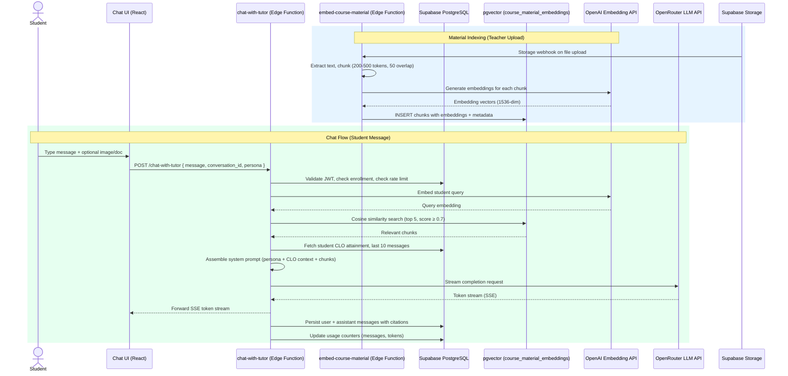

# Design Document — AI Chat Tutor with RAG Engine

## Overview

This design covers the AI Chat Tutor with RAG Engine for the Edeviser platform — a conversational AI tutoring interface for students grounded in course materials via pgvector vector similarity search. The feature adds:

1. A RAG pipeline that chunks, embeds, and indexes course materials (PDFs, DOCX, plain text) and assignment/rubric descriptions into a pgvector-backed vector store
2. A conversation engine (Supabase Edge Functions) that assembles context from the student's CLO attainment, retrieved material chunks, and selected persona, then streams LLM responses via OpenRouter
3. A React chat UI with multi-persona selection, source citations, image/document upload, conversation history, and contextual entry points from assignments and CLO progress
4. Content safety guardrails enforcing academic integrity (no direct answers to graded assignments)
5. Per-student rate limiting and token budget controls for cost management
6. Anonymized aggregate tutor usage analytics for teachers
7. XP integration for meaningful tutor engagement

The system integrates with the existing OBE engine (CLO attainment data for personalized context), gamification engine (XP awards), Supabase Auth (JWT validation, RLS), and Supabase Storage (file uploads).

Additionally, the system supports:
8. Explicit autonomy levels (L1–L3) configurable per assignment/CLO by teachers, with a student-facing toggle
9. Proactive learning plan updates generated after accumulated tutor interactions on a CLO
10. Personality-based persona auto-selection using the student's Big Five profile from onboarding
11. AI dependency prevention via independence nudges, independence scoring, and a "Self-Reliant Scholar" badge
12. Teacher-AI collaboration through a handoff mechanism, handoff dashboard, and coverage gap analytics

### Key Design Decisions

| Decision | Choice | Rationale |
|----------|--------|-----------|
| Vector store | pgvector extension in Supabase PostgreSQL | Native to existing stack, RLS-compatible, no external vector DB needed |
| Embedding model | text-embedding-ada-002 (via OpenAI API) | Industry standard, 1536-dim, good cost/quality tradeoff |
| Vector index | HNSW on embedding column | Better recall than IVFFlat, sub-200ms at 100K chunks |
| LLM gateway | OpenRouter API | Single endpoint for OpenAI/DeepSeek model switching and fallback |
| Streaming | Server-Sent Events (SSE) from Edge Function | Native browser support, simpler than WebSocket for unidirectional streaming |
| Chunking strategy | 200–500 tokens with 50-token overlap | Balances context granularity with retrieval relevance |
| Chat state | TanStack Query + optimistic local append | Consistent with platform patterns; messages appear instantly |
| File processing | Edge Function async queue via `pgmq` or DB status column | Decouples upload from indexing; handles large docs without timeout |
| Persona system | System prompt templates stored in Edge Function config | Simple, no DB overhead; easy to add new personas |
| Rate limiting | DB counter table (`tutor_usage_limits`) checked per request | Leverages existing RLS; no external rate limiter needed |
| Autonomy levels | L1/L2/L3 stored as column on assignments and CLOs, injected into system prompt | Simple config, teacher-controlled, no complex rule engine |
| Persona auto-selection | Big Five percentile mapping in Edge Function logic | Leverages existing onboarding data; no ML model needed |
| Independence scoring | Derived metric from submission + conversation timestamps | No new data collection; uses existing tables |
| Teacher handoff | DB table + notification system | Async, consent-gated, integrates with existing notifications |
| Learning plan updates | Generated in-conversation after 5 interactions per CLO | Contextual, non-intrusive, student-controlled acceptance |

## Architecture

### High-Level Data Flow



### Component Architecture

```
src/
├── pages/student/tutor/
│   ├── TutorPage.tsx              # Main tutor page with sidebar + chat area
│   ├── ChatPanel.tsx              # Message list + input area
│   ├── ConversationSidebar.tsx    # Past conversations list
│   └── PersonaSelector.tsx        # Persona picker (modal or inline)
├── components/shared/
│   ├── ChatMessage.tsx            # Single message bubble (user/assistant)
│   ├── SourceCitationPanel.tsx    # Expandable citation detail
│   ├── TutorEntryButton.tsx       # "Ask Tutor" button for contextual entry
│   ├── SatisfactionRating.tsx     # Thumbs up/down per message
│   ├── AutonomyToggle.tsx         # "Figure it out" / "Just explain it" toggle
│   ├── LearningPlanCard.tsx       # Learning plan update suggestion card
│   ├── IndependenceScoreBadge.tsx # Independence score display component
│   └── TeacherHandoffCard.tsx     # "Connect with Teacher" suggestion card
├── hooks/
│   ├── useTutorConversations.ts   # CRUD for conversations
│   ├── useTutorMessages.ts        # Message history + streaming
│   ├── useTutorUsage.ts           # Rate limit status
│   ├── useTutorAnalytics.ts       # Teacher analytics queries
│   ├── useTutorAutonomy.ts        # Autonomy level config per assignment/CLO
│   ├── useIndependenceScore.ts    # Independence score per student per CLO
│   └── useTeacherHandoffs.ts      # Teacher handoff requests CRUD
├── lib/
│   ├── tutorApi.ts                # Edge Function call helpers (SSE streaming)
│   ├── tutorSchemas.ts            # Zod schemas for tutor payloads
│   ├── tutorAutonomy.ts           # Autonomy level resolution logic
│   └── independenceCalculator.ts  # Independence score calculation
├── pages/teacher/tutor-analytics/
│   ├── TutorAnalyticsPage.tsx     # Teacher analytics dashboard
│   └── TeacherHandoffPage.tsx     # Handoff requests + AI insights tab
supabase/functions/
├── chat-with-tutor/index.ts       # Main chat Edge Function (SSE streaming)
├── embed-course-material/index.ts # Chunking + embedding pipeline
├── tutor-analytics/index.ts       # Aggregate analytics queries
└── generate-plan-update/index.ts  # Learning plan update generation
```

## Components and Interfaces

### Edge Function: `chat-with-tutor`

The primary Edge Function handling student chat requests. Accepts POST with JSON body, returns SSE stream.

```typescript
// Request payload
interface ChatRequest {
  conversation_id?: string;  // null for new conversation
  course_id?: string;        // required for new conversation
  message: string;           // student message text (max 2000 chars)
  persona?: TutorPersona;    // optional persona override
  image_urls?: string[];     // max 2 Supabase Storage URLs
  document_url?: string;     // optional PDF/DOCX for in-chat analysis
  clo_scope?: string[];      // optional CLO IDs for focused context
  autonomy_override?: AutonomyLevel; // student toggle override (L1 or L3)
}

type TutorPersona = 'socratic_guide' | 'step_by_step_coach' | 'quick_explainer';
type AutonomyLevel = 'L1' | 'L2' | 'L3';

// SSE event types streamed back
type SSEEvent =
  | { type: 'token'; data: string }
  | { type: 'citations'; data: SourceCitation[] }
  | { type: 'done'; data: { message_id: string; tokens_used: number } }
  | { type: 'error'; data: { code: string; message: string } }
  | { type: 'plan_update'; data: LearningPlanUpdate }
  | { type: 'independence_nudge'; data: { message: string } }
  | { type: 'handoff_suggestion'; data: { reason: string; message: string } };

interface SourceCitation {
  chunk_id: string;
  chunk_text: string;
  source_filename: string;
  material_type: string;
  similarity_score: number;
}

interface LearningPlanUpdate {
  id: string;
  clo_id: string;
  clo_title: string;
  study_time_recommendation: string;       // e.g., "Increase to 3 hours/week"
  recommended_materials: Array<{
    chunk_id: string;
    source_filename: string;
    section_title: string;
  }>;
  suggested_planner_sessions: number;       // e.g., 2 sessions/week
  interaction_count: number;                // how many interactions triggered this
}

interface TeacherHandoffRequest {
  id: string;
  conversation_id: string;
  student_id: string;
  teacher_id: string;
  course_id: string;
  clo_id?: string;
  conversation_summary: string;             // LLM-generated summary of last 5 messages
  suggested_intervention: string;
  trigger_reason: 'low_rag_confidence' | 'repeated_question' | 'low_satisfaction';
  student_consent: boolean;
  status: 'pending' | 'resolved' | 'dismissed';
  teacher_response?: string;
  created_at: string;
  resolved_at?: string;
}
```

Processing pipeline:
1. Validate JWT → extract `student_id` from token
2. Verify course enrollment via `student_courses` table
3. Check daily message count and token budget from `tutor_usage_limits`
4. If `conversation_id` is null, create new `tutor_conversations` record
5. Resolve autonomy level: assignment config → CLO config → student toggle override (capped by teacher ceiling)
6. Embed the student query via OpenAI embedding API
7. Run pgvector cosine similarity search (top 5, score ≥ 0.7, filtered by enrolled course_ids)
8. Check for independence nudge trigger (3 consecutive same-topic questions in session)
9. Check for teacher handoff trigger (low RAG confidence, repeated questions, low satisfaction)
10. Fetch student's CLO attainment for the scoped course from `outcome_attainment`
11. If student has Big Five profile and no persona selected, auto-select persona
12. Fetch last 10 messages from `tutor_messages` for conversation context
13. Assemble system prompt: persona instructions + autonomy level + CLO context + retrieved chunks
14. Stream LLM response via OpenRouter, forwarding tokens as SSE events
15. On completion: persist user message + assistant message (with citations, autonomy_level, nudge metadata) to `tutor_messages`
16. Increment usage counters in `tutor_usage_limits`
17. If message count ≥ 3 in conversation and no XP awarded yet, invoke `award-xp` for tutor engagement
18. Check if 5 interactions on same CLO in 7 days → trigger learning plan update generation

### Edge Function: `embed-course-material`

Triggered by Supabase Storage webhook or direct invocation when a teacher uploads/updates course material.

```typescript
interface EmbedRequest {
  file_url: string;          // Supabase Storage URL
  course_id: string;
  clo_ids?: string[];        // optional CLO association
  bloom_level?: string;      // optional Bloom's level tag
  material_type: 'lecture_notes' | 'slides' | 'assignment_description' | 'rubric_criteria' | 'other';
  source_filename: string;
}
```

Processing pipeline:
1. Download file from Supabase Storage
2. Extract text (PDF via `pdf-parse`, DOCX via `mammoth`, plain text direct)
3. Chunk text into 200–500 token segments with 50-token overlap
4. Generate embeddings for each chunk via OpenAI API (batch of up to 100 per request)
5. Insert chunks into `course_material_embeddings` with metadata
6. Update `course_materials` record status to `indexed`
7. For documents > 100 pages: process asynchronously, notify teacher on completion

### Edge Function: `tutor-analytics`

Returns anonymized aggregate analytics for a teacher's courses.

```typescript
interface AnalyticsRequest {
  course_id: string;
  date_range?: { start: string; end: string };
}

interface AnalyticsResponse {
  total_conversations: number;
  total_messages: number;
  avg_messages_per_conversation: number;
  avg_satisfaction_rating: number;
  top_questioned_clos: Array<{ clo_id: string; clo_title: string; conversation_count: number }>;
  common_topics: Array<{ topic: string; frequency: number }>;
  usage_over_time: Array<{ date: string; conversation_count: number }>;
}
```

### React Components

**TutorPage** — Main container with responsive layout:
- Desktop: sidebar (conversation list) + main chat panel
- Mobile: full-screen chat with hamburger toggle for sidebar
- Mounted at `/student/tutor` and `/student/tutor/:conversationId`

**ChatPanel** — Core chat interface:
- Virtualized message list (handles 100+ messages efficiently)
- Text input with character counter (max 2000)
- Image attach button (max 2, JPG/PNG, 5MB each)
- Document attach button (max 1, PDF/DOCX, 10MB)
- Typing indicator during SSE streaming
- Auto-scroll to bottom on new messages
- Persona selector in header

**ChatMessage** — Individual message bubble:
- User messages: right-aligned, blue background
- Assistant messages: left-aligned, white background with avatar
- Inline citation markers `[1]`, `[2]` as clickable badges
- Expandable source panel below assistant messages
- Satisfaction rating (thumbs up/down) on assistant messages
- Markdown rendering for assistant responses (code blocks, lists, bold)

**ConversationSidebar** — Past conversations:
- Ordered by `updated_at` descending
- Shows first message preview (truncated to 60 chars)
- "New Conversation" button at top
- Delete conversation with confirmation dialog

**TutorEntryButton** — Contextual "Ask Tutor" button:
- Placed on AssignmentDetailPage, CLO progress bars, grade notifications
- Passes context params (assignment_id, clo_ids) to create pre-scoped conversation

**TutorAnalyticsPage** — Teacher dashboard tab:
- KPI cards: total conversations, total messages, avg satisfaction
- "Top Questioned CLOs" horizontal bar chart (Recharts)
- "Common Topics" frequency list
- "Usage Over Time" line chart (last 30 days)
- "Coverage Gaps" section: CLOs with avg RAG similarity < 0.75
- "Material Effectiveness" ranking: most-cited course materials

### New Edge Function: `generate-plan-update`

Triggered by `chat-with-tutor` when a student reaches 5 interactions on the same CLO within 7 days.

```typescript
interface PlanUpdateRequest {
  student_id: string;
  clo_id: string;
  course_id: string;
  conversation_id: string;
  recent_interaction_count: number;
}
```

Processing pipeline:
1. Fetch student's CLO attainment and recent tutor messages for the CLO
2. Retrieve top 3 relevant course material sections via RAG
3. Generate study time and planner session recommendations via LLM
4. Return `LearningPlanUpdate` object to be streamed as SSE `plan_update` event
5. Persist the suggestion to `tutor_plan_updates` table

### New React Components

**AutonomyToggle** — Student-facing toggle:
- Two-state toggle: "Figure it out" (L1) / "Just explain it" (L3)
- Displayed in ChatPanel header next to persona selector
- Persisted per conversation in `tutor_conversations.autonomy_override`
- Visually distinct: L1 shows a lightbulb icon, L3 shows a book icon

**LearningPlanCard** — In-conversation suggestion card:
- Gradient-bordered card visually distinct from chat messages
- Shows: study time recommendation, material links, planner session count
- Three action buttons: "Accept", "Modify", "Dismiss"
- Accept triggers planner integration (if weekly planner feature is active)

**IndependenceScoreBadge** — Inline metric display:
- Small badge/chip showing independence score as percentage
- Color-coded: green (≥70%), yellow (40–69%), red (<40%)
- Displayed next to CLO attainment on student dashboard

**TeacherHandoffCard** — In-conversation suggestion:
- Appears when handoff trigger conditions are met
- Shows reason for suggestion and "Connect with Teacher" CTA
- Consent checkbox: "I agree to share a summary of this conversation with my teacher"
- Dismiss option to decline

**TeacherHandoffPage** — Teacher dashboard tab:
- List of pending handoff requests with conversation summaries
- "Most Asked Questions" section (anonymized)
- "Low Confidence Topics" section (CLOs with low RAG scores)
- "High AI Dependency" section (students with Independence_Score < 0.3, anonymized unless consent given)

### TanStack Query Hooks

```typescript
// useTutorConversations.ts
export const useTutorConversations = (courseId?: string) => useQuery({...});
export const useCreateConversation = () => useMutation({...});
export const useDeleteConversation = () => useMutation({...});

// useTutorMessages.ts
export const useTutorMessages = (conversationId: string) => useQuery({...});
export const useSendMessage = () => useMutation({...}); // triggers SSE stream
export const useRateMessage = () => useMutation({...}); // thumbs up/down

// useTutorUsage.ts
export const useTutorUsage = () => useQuery({...}); // daily limits status

// useTutorAnalytics.ts (teacher)
export const useTutorAnalytics = (courseId: string, dateRange?: DateRange) => useQuery({...});

// useTutorAutonomy.ts
export const useAssignmentAutonomy = (assignmentId: string) => useQuery({...}); // get autonomy config
export const useUpdateAssignmentAutonomy = () => useMutation({...}); // teacher sets autonomy level
export const useCLOAutonomy = (cloId: string) => useQuery({...});
export const useUpdateCLOAutonomy = () => useMutation({...});

// useIndependenceScore.ts
export const useIndependenceScore = (studentId: string, cloId?: string) => useQuery({...});
export const useIndependenceScores = (studentId: string, courseId: string) => useQuery({...}); // all CLOs

// useTeacherHandoffs.ts (teacher)
export const useTeacherHandoffs = (courseId: string) => useQuery({...}); // pending requests
export const useRespondToHandoff = () => useMutation({...}); // teacher responds
export const useCreateHandoff = () => useMutation({...}); // student accepts handoff
```

### Zod Schemas

```typescript
// tutorSchemas.ts
export const sendMessageSchema = z.object({
  conversation_id: z.string().uuid().optional(),
  course_id: z.string().uuid().optional(),
  message: z.string().min(1).max(2000),
  persona: z.enum(['socratic_guide', 'step_by_step_coach', 'quick_explainer']).optional(),
  image_urls: z.array(z.string().url()).max(2).optional(),
  document_url: z.string().url().optional(),
  clo_scope: z.array(z.string().uuid()).optional(),
});

export const rateMessageSchema = z.object({
  message_id: z.string().uuid(),
  rating: z.enum(['thumbs_up', 'thumbs_down']),
});

export const tutorAnalyticsRequestSchema = z.object({
  course_id: z.string().uuid(),
  start_date: z.string().datetime().optional(),
  end_date: z.string().datetime().optional(),
});

export const autonomyLevelSchema = z.enum(['L1', 'L2', 'L3']);

export const updateAssignmentAutonomySchema = z.object({
  assignment_id: z.string().uuid(),
  autonomy_level: autonomyLevelSchema,
});

export const updateCLOAutonomySchema = z.object({
  clo_id: z.string().uuid(),
  autonomy_level: autonomyLevelSchema,
});

export const planUpdateResponseSchema = z.object({
  plan_update_id: z.string().uuid(),
  response: z.enum(['accepted', 'modified', 'dismissed']),
  modifications: z.string().optional(),
});

export const createHandoffSchema = z.object({
  conversation_id: z.string().uuid(),
  student_consent: z.boolean().refine(val => val === true, { message: 'Student consent is required' }),
});

export const respondToHandoffSchema = z.object({
  handoff_id: z.string().uuid(),
  response_message: z.string().min(1).max(2000),
});
```

## Data Models

### New Database Tables

```sql
-- ============================================================
-- Enable pgvector extension
-- ============================================================
CREATE EXTENSION IF NOT EXISTS vector;

-- ============================================================
-- course_material_embeddings — Vector store for RAG
-- ============================================================
CREATE TABLE course_material_embeddings (
  id UUID PRIMARY KEY DEFAULT gen_random_uuid(),
  institution_id UUID NOT NULL REFERENCES institutions(id),
  course_id UUID NOT NULL REFERENCES courses(id),
  chunk_text TEXT NOT NULL,
  embedding vector(1536) NOT NULL,
  source_filename VARCHAR(500) NOT NULL,
  material_type VARCHAR(50) NOT NULL CHECK (material_type IN (
    'lecture_notes', 'slides', 'assignment_description', 'rubric_criteria', 'other'
  )),
  clo_ids UUID[] DEFAULT '{}',
  bloom_level VARCHAR(20),
  chunk_index INTEGER NOT NULL,          -- position within source document
  token_count INTEGER NOT NULL,
  source_material_id UUID,               -- FK to course_materials if applicable
  indexing_status VARCHAR(20) NOT NULL DEFAULT 'indexed' CHECK (indexing_status IN (
    'pending', 'indexed', 'indexing_failed'
  )),
  created_at TIMESTAMPTZ NOT NULL DEFAULT now(),
  updated_at TIMESTAMPTZ NOT NULL DEFAULT now()
);

-- HNSW index for fast cosine similarity search
CREATE INDEX idx_embeddings_hnsw ON course_material_embeddings
  USING hnsw (embedding vector_cosine_ops)
  WITH (m = 16, ef_construction = 64);

-- Composite index for filtered searches
CREATE INDEX idx_embeddings_course ON course_material_embeddings (course_id, indexing_status);
CREATE INDEX idx_embeddings_institution ON course_material_embeddings (institution_id);

-- ============================================================
-- tutor_conversations — Chat sessions
-- ============================================================
CREATE TABLE tutor_conversations (
  id UUID PRIMARY KEY DEFAULT gen_random_uuid(),
  student_id UUID NOT NULL REFERENCES profiles(id),
  institution_id UUID NOT NULL REFERENCES institutions(id),
  course_id UUID REFERENCES courses(id),       -- null for general conversations
  persona VARCHAR(30) NOT NULL DEFAULT 'socratic_guide' CHECK (persona IN (
    'socratic_guide', 'step_by_step_coach', 'quick_explainer'
  )),
  title VARCHAR(200),                           -- auto-generated from first message
  clo_scope UUID[] DEFAULT '{}',                -- optional CLO focus
  message_count INTEGER NOT NULL DEFAULT 0,
  xp_awarded BOOLEAN NOT NULL DEFAULT false,    -- track if engagement XP was given
  created_at TIMESTAMPTZ NOT NULL DEFAULT now(),
  updated_at TIMESTAMPTZ NOT NULL DEFAULT now()
);

CREATE INDEX idx_conversations_student ON tutor_conversations (student_id, updated_at DESC);
CREATE INDEX idx_conversations_course ON tutor_conversations (course_id);

-- ============================================================
-- tutor_messages — Individual chat messages
-- ============================================================
CREATE TABLE tutor_messages (
  id UUID PRIMARY KEY DEFAULT gen_random_uuid(),
  conversation_id UUID NOT NULL REFERENCES tutor_conversations(id) ON DELETE CASCADE,
  role VARCHAR(10) NOT NULL CHECK (role IN ('user', 'assistant')),
  content TEXT NOT NULL,
  source_citations JSONB DEFAULT '[]',          -- array of { chunk_id, chunk_text, source_filename, similarity_score }
  image_urls TEXT[] DEFAULT '{}',
  document_url TEXT,
  token_count INTEGER NOT NULL DEFAULT 0,
  satisfaction_rating VARCHAR(15) CHECK (satisfaction_rating IN ('thumbs_up', 'thumbs_down')),
  flagged_integrity BOOLEAN NOT NULL DEFAULT false,
  created_at TIMESTAMPTZ NOT NULL DEFAULT now()
);

CREATE INDEX idx_messages_conversation ON tutor_messages (conversation_id, created_at);

-- ============================================================
-- tutor_usage_limits — Per-student daily usage tracking
-- ============================================================
CREATE TABLE tutor_usage_limits (
  id UUID PRIMARY KEY DEFAULT gen_random_uuid(),
  student_id UUID NOT NULL REFERENCES profiles(id),
  institution_id UUID NOT NULL REFERENCES institutions(id),
  usage_date DATE NOT NULL DEFAULT CURRENT_DATE,
  message_count INTEGER NOT NULL DEFAULT 0,
  token_count INTEGER NOT NULL DEFAULT 0,
  created_at TIMESTAMPTZ NOT NULL DEFAULT now(),
  UNIQUE (student_id, usage_date)
);

CREATE INDEX idx_usage_student_date ON tutor_usage_limits (student_id, usage_date);

-- ============================================================
-- tutor_llm_logs — LLM API call monitoring
-- ============================================================
CREATE TABLE tutor_llm_logs (
  id UUID PRIMARY KEY DEFAULT gen_random_uuid(),
  institution_id UUID NOT NULL REFERENCES institutions(id),
  student_id UUID NOT NULL REFERENCES profiles(id),
  conversation_id UUID REFERENCES tutor_conversations(id),
  model_used VARCHAR(100) NOT NULL,
  prompt_tokens INTEGER NOT NULL,
  completion_tokens INTEGER NOT NULL,
  total_tokens INTEGER NOT NULL,
  latency_ms INTEGER NOT NULL,
  status VARCHAR(20) NOT NULL CHECK (status IN ('success', 'error', 'timeout', 'rate_limited')),
  error_message TEXT,
  created_at TIMESTAMPTZ NOT NULL DEFAULT now()
);

CREATE INDEX idx_llm_logs_institution ON tutor_llm_logs (institution_id, created_at DESC);

-- ============================================================
-- tutor_plan_updates — Learning plan update suggestions
-- ============================================================
CREATE TABLE tutor_plan_updates (
  id UUID PRIMARY KEY DEFAULT gen_random_uuid(),
  student_id UUID NOT NULL REFERENCES profiles(id),
  institution_id UUID NOT NULL REFERENCES institutions(id),
  course_id UUID NOT NULL REFERENCES courses(id),
  clo_id UUID NOT NULL,
  conversation_id UUID NOT NULL REFERENCES tutor_conversations(id),
  study_time_recommendation TEXT NOT NULL,
  recommended_materials JSONB NOT NULL DEFAULT '[]',
  suggested_planner_sessions INTEGER NOT NULL DEFAULT 1,
  interaction_count INTEGER NOT NULL,
  response VARCHAR(20) CHECK (response IN ('accepted', 'modified', 'dismissed')),
  modifications TEXT,
  created_at TIMESTAMPTZ NOT NULL DEFAULT now(),
  responded_at TIMESTAMPTZ
);

CREATE INDEX idx_plan_updates_student_clo ON tutor_plan_updates (student_id, clo_id, created_at DESC);

-- ============================================================
-- teacher_handoff_requests — AI-to-teacher escalation
-- ============================================================
CREATE TABLE teacher_handoff_requests (
  id UUID PRIMARY KEY DEFAULT gen_random_uuid(),
  conversation_id UUID NOT NULL REFERENCES tutor_conversations(id),
  student_id UUID NOT NULL REFERENCES profiles(id),
  teacher_id UUID NOT NULL REFERENCES profiles(id),
  institution_id UUID NOT NULL REFERENCES institutions(id),
  course_id UUID NOT NULL REFERENCES courses(id),
  clo_id UUID,
  conversation_summary TEXT NOT NULL,
  suggested_intervention TEXT NOT NULL,
  trigger_reason VARCHAR(30) NOT NULL CHECK (trigger_reason IN (
    'low_rag_confidence', 'repeated_question', 'low_satisfaction'
  )),
  student_consent BOOLEAN NOT NULL DEFAULT false,
  status VARCHAR(20) NOT NULL DEFAULT 'pending' CHECK (status IN ('pending', 'resolved', 'dismissed')),
  teacher_response TEXT,
  created_at TIMESTAMPTZ NOT NULL DEFAULT now(),
  resolved_at TIMESTAMPTZ
);

CREATE INDEX idx_handoffs_teacher ON teacher_handoff_requests (teacher_id, status, created_at DESC);
CREATE INDEX idx_handoffs_student ON teacher_handoff_requests (student_id, created_at DESC);

-- ============================================================
-- ALTER existing tables for new features
-- ============================================================

-- Add autonomy level to assignments (teacher-configurable)
ALTER TABLE assignments ADD COLUMN tutor_autonomy_level VARCHAR(2) DEFAULT 'L1'
  CHECK (tutor_autonomy_level IN ('L1', 'L2', 'L3'));

-- Add autonomy level to CLOs (teacher-configurable)
ALTER TABLE clos ADD COLUMN tutor_autonomy_level VARCHAR(2) DEFAULT 'L2'
  CHECK (tutor_autonomy_level IN ('L1', 'L2', 'L3'));

-- Add autonomy override to conversations (student toggle)
ALTER TABLE tutor_conversations ADD COLUMN autonomy_override VARCHAR(2)
  CHECK (autonomy_override IN ('L1', 'L3'));

-- Add metadata columns to tutor_messages for nudge and autonomy tracking
ALTER TABLE tutor_messages ADD COLUMN autonomy_level VARCHAR(2)
  CHECK (autonomy_level IN ('L1', 'L2', 'L3'));
ALTER TABLE tutor_messages ADD COLUMN nudge_type VARCHAR(20)
  CHECK (nudge_type IN ('independence'));
```

### RLS Policies

```sql
-- ============================================================
-- course_material_embeddings — RLS
-- ============================================================
ALTER TABLE course_material_embeddings ENABLE ROW LEVEL SECURITY;

-- Students can read embeddings for courses they are enrolled in
CREATE POLICY "embeddings_student_read" ON course_material_embeddings
  FOR SELECT USING (
    auth_user_role() = 'student'
    AND course_id IN (
      SELECT course_id FROM student_courses WHERE student_id = auth.uid()
    )
  );

-- Teachers can read/write embeddings for their courses
CREATE POLICY "embeddings_teacher_all" ON course_material_embeddings
  FOR ALL USING (
    auth_user_role() = 'teacher'
    AND course_id IN (
      SELECT id FROM courses WHERE teacher_id = auth.uid()
    )
  );

-- Admins can manage all embeddings in their institution
CREATE POLICY "embeddings_admin_all" ON course_material_embeddings
  FOR ALL USING (
    auth_user_role() = 'admin'
    AND institution_id = auth_institution_id()
  );

-- ============================================================
-- tutor_conversations — RLS (student-private)
-- ============================================================
ALTER TABLE tutor_conversations ENABLE ROW LEVEL SECURITY;

-- Students can only access their own conversations
CREATE POLICY "conversations_student_own" ON tutor_conversations
  FOR ALL USING (student_id = auth.uid());

-- ============================================================
-- tutor_messages — RLS (student-private)
-- ============================================================
ALTER TABLE tutor_messages ENABLE ROW LEVEL SECURITY;

-- Students can access messages in their own conversations
CREATE POLICY "messages_student_own" ON tutor_messages
  FOR ALL USING (
    conversation_id IN (
      SELECT id FROM tutor_conversations WHERE student_id = auth.uid()
    )
  );

-- ============================================================
-- tutor_usage_limits — RLS
-- ============================================================
ALTER TABLE tutor_usage_limits ENABLE ROW LEVEL SECURITY;

-- Students can read their own usage
CREATE POLICY "usage_student_read" ON tutor_usage_limits
  FOR SELECT USING (student_id = auth.uid());

-- ============================================================
-- tutor_llm_logs — RLS (admin-only read)
-- ============================================================
ALTER TABLE tutor_llm_logs ENABLE ROW LEVEL SECURITY;

CREATE POLICY "llm_logs_admin_read" ON tutor_llm_logs
  FOR SELECT USING (
    auth_user_role() = 'admin'
    AND institution_id = auth_institution_id()
  );

-- ============================================================
-- tutor_plan_updates — RLS (student-private)
-- ============================================================
ALTER TABLE tutor_plan_updates ENABLE ROW LEVEL SECURITY;

CREATE POLICY "plan_updates_student_own" ON tutor_plan_updates
  FOR ALL USING (student_id = auth.uid());

-- ============================================================
-- teacher_handoff_requests — RLS
-- ============================================================
ALTER TABLE teacher_handoff_requests ENABLE ROW LEVEL SECURITY;

-- Students can see and create their own handoff requests
CREATE POLICY "handoffs_student_own" ON teacher_handoff_requests
  FOR ALL USING (student_id = auth.uid());

-- Teachers can see handoff requests for their courses (only with student consent)
CREATE POLICY "handoffs_teacher_read" ON teacher_handoff_requests
  FOR SELECT USING (
    auth_user_role() = 'teacher'
    AND teacher_id = auth.uid()
    AND student_consent = true
  );

-- Teachers can update status of handoff requests they own
CREATE POLICY "handoffs_teacher_update" ON teacher_handoff_requests
  FOR UPDATE USING (
    auth_user_role() = 'teacher'
    AND teacher_id = auth.uid()
    AND student_consent = true
  );
```

### Similarity Search Function

```sql
-- pgvector cosine similarity search scoped to enrolled courses
CREATE OR REPLACE FUNCTION search_course_materials(
  query_embedding vector(1536),
  match_course_ids UUID[],
  match_clo_ids UUID[] DEFAULT NULL,
  match_threshold FLOAT DEFAULT 0.7,
  match_count INT DEFAULT 5
)
RETURNS TABLE (
  id UUID,
  chunk_text TEXT,
  source_filename VARCHAR,
  material_type VARCHAR,
  clo_ids UUID[],
  bloom_level VARCHAR,
  similarity FLOAT
)
LANGUAGE plpgsql
SECURITY DEFINER
AS $$
BEGIN
  RETURN QUERY
  SELECT
    cme.id,
    cme.chunk_text,
    cme.source_filename,
    cme.material_type,
    cme.clo_ids,
    cme.bloom_level,
    1 - (cme.embedding <=> query_embedding) AS similarity
  FROM course_material_embeddings cme
  WHERE cme.course_id = ANY(match_course_ids)
    AND cme.indexing_status = 'indexed'
    AND (match_clo_ids IS NULL OR cme.clo_ids && match_clo_ids)
    AND 1 - (cme.embedding <=> query_embedding) >= match_threshold
  ORDER BY cme.embedding <=> query_embedding
  LIMIT match_count;
END;
$$;
```

### Persona System Prompt Templates

```typescript
const PERSONA_PROMPTS: Record<TutorPersona, string> = {
  socratic_guide: `You are a Socratic tutor. Ask probing questions to guide the student toward the answer. 
Never give direct answers. Instead, break the problem into smaller questions that lead to understanding. 
Use phrases like "What do you think would happen if...?" and "Can you explain why...?"`,

  step_by_step_coach: `You are a patient step-by-step coach. Break down every problem into numbered steps. 
Explain each step clearly before moving to the next. Check understanding at each step. 
Use phrases like "Step 1: Let's start by..." and "Now that we understand X, let's move to..."`,

  quick_explainer: `You are a concise explainer. Give clear, direct explanations with examples. 
Keep responses focused and to the point. Use analogies when helpful. 
Prioritize clarity over thoroughness — the student can ask follow-up questions.`,
};

// Autonomy level prompt modifiers
const AUTONOMY_PROMPTS: Record<AutonomyLevel, string> = {
  L1: `AUTONOMY LEVEL L1 (Hints Only): You must NEVER provide direct answers or solutions. 
Only ask guiding questions, provide hints, and encourage the student to work through the problem. 
If the student asks for a direct answer, redirect them with a question.`,

  L2: `AUTONOMY LEVEL L2 (Guided Discovery): Provide scaffolded hints and partial explanations. 
Guide the student toward understanding step by step, but do not give complete solutions. 
You may explain concepts but should encourage the student to apply them independently.`,

  L3: `AUTONOMY LEVEL L3 (Direct Explanation): You may provide complete, direct explanations of concepts. 
Give clear answers with examples. The student is in review/practice mode and benefits from direct instruction.`,
};

// Autonomy level resolution logic
function resolveAutonomyLevel(
  assignmentAutonomy: AutonomyLevel | null,
  cloAutonomy: AutonomyLevel | null,
  studentOverride: 'L1' | 'L3' | null,
  teacherCeiling: AutonomyLevel | null
): AutonomyLevel {
  // 1. Assignment-level takes precedence over CLO-level
  const baseLevel = assignmentAutonomy ?? cloAutonomy ?? 'L2';
  
  // 2. Student override applies but cannot exceed teacher ceiling
  if (studentOverride) {
    const ceiling = teacherCeiling ?? baseLevel;
    const levels: AutonomyLevel[] = ['L1', 'L2', 'L3'];
    const ceilingIdx = levels.indexOf(ceiling);
    const overrideIdx = levels.indexOf(studentOverride);
    return levels[Math.min(overrideIdx, ceilingIdx)];
  }
  
  return baseLevel;
}

// Persona auto-selection from Big Five profile
function autoSelectPersona(bigFiveProfile: {
  openness: number;
  conscientiousness: number;
  extraversion: number;
  agreeableness: number;
  neuroticism: number;
}): { persona: TutorPersona; toneModifier?: string } {
  const traits = [
    { trait: 'openness', score: bigFiveProfile.openness },
    { trait: 'conscientiousness', score: bigFiveProfile.conscientiousness },
    { trait: 'neuroticism', score: bigFiveProfile.neuroticism },
  ].sort((a, b) => b.score - a.score);

  const dominant = traits[0];
  let persona: TutorPersona;
  let toneModifier: string | undefined;

  if (dominant.trait === 'openness' && dominant.score >= 70) {
    persona = 'socratic_guide';
  } else if (dominant.trait === 'conscientiousness' && dominant.score >= 70) {
    persona = 'step_by_step_coach';
  } else {
    persona = 'quick_explainer'; // default
  }

  // High neuroticism adds supportive tone regardless of persona
  if (bigFiveProfile.neuroticism >= 70) {
    toneModifier = `Use an especially warm, encouraging, and supportive tone. 
Validate the student's effort frequently. Avoid language that could feel critical or pressuring.`;
  }

  return { persona, toneModifier };
}
```


## Correctness Properties

*A property is a characteristic or behavior that should hold true across all valid executions of a system — essentially, a formal statement about what the system should do. Properties serve as the bridge between human-readable specifications and machine-verifiable correctness guarantees.*

### Property 1: Chunking produces valid segments

*For any* non-empty document text, the chunking function should produce chunks where each chunk contains between 200 and 500 tokens (except possibly the last chunk which may be shorter), and consecutive chunks overlap by exactly 50 tokens.

**Validates: Requirements 1.1**

### Property 2: Stored chunks contain complete metadata

*For any* chunk inserted into the vector store, the record must contain non-null values for: `course_id`, `source_filename`, `material_type`, `chunk_text`, `embedding` (1536 dimensions), `chunk_index`, and `token_count`.

**Validates: Requirements 1.2**

### Property 3: Failed embedding marks status as indexing_failed

*For any* document that fails text extraction or embedding generation, the corresponding record in the vector store must have `indexing_status = 'indexing_failed'`.

**Validates: Requirements 1.4**

### Property 4: Auto-indexed assignment/rubric chunks have correct metadata

*For any* assignment with a title, description, and linked rubric criteria, the auto-indexing function should produce chunks where: assignment-derived chunks have `material_type = 'assignment_description'`, rubric-derived chunks have `material_type = 'rubric_criteria'`, all chunks have the correct `course_id`, and `clo_ids` matches the assignment's CLO weights.

**Validates: Requirements 2.1, 2.2, 2.3**

### Property 5: Similarity search results are scoped to enrolled courses

*For any* similarity search executed on behalf of a student, all returned chunks must have a `course_id` that is in the student's set of enrolled course IDs.

**Validates: Requirements 3.2, 20.3**

### Property 6: Similarity search excludes low-relevance chunks

*For any* similarity search result set, every returned chunk must have a cosine similarity score greater than or equal to 0.7.

**Validates: Requirements 3.3**

### Property 7: Re-indexing replaces old chunks

*For any* course material file that is replaced, after re-indexing completes, zero chunks with the old `source_material_id` should exist in the vector store, and new chunks for the updated content should be present.

**Validates: Requirements 4.1**

### Property 8: Material deletion removes all associated chunks

*For any* deleted course material, zero chunks with that material's `source_material_id` should remain in the vector store.

**Validates: Requirements 4.2**

### Property 9: Deleted chunk text preserved in existing citations

*For any* message that references a chunk via `source_citations`, if that chunk is later deleted from the vector store, the `chunk_text` field in the message's `source_citations` JSONB must still contain the original text.

**Validates: Requirements 4.3**

### Property 10: System prompt includes CLO competency gaps

*For any* student with CLO attainment data for a scoped course, the assembled system prompt must mention every CLO whose attainment is below 70%, including its title and attainment percentage.

**Validates: Requirements 5.2**

### Property 11: System prompt includes retrieved chunks

*For any* set of chunks returned by the similarity search, the assembled system prompt must contain the `chunk_text` of each retrieved chunk.

**Validates: Requirements 5.3**

### Property 12: Message persistence includes all required fields

*For any* completed chat exchange, both the user message and assistant message must be persisted in `tutor_messages` with non-null `conversation_id`, `role`, `content`, and `token_count`. Assistant messages must include `source_citations` (may be empty array).

**Validates: Requirements 6.3**

### Property 13: Context window contains last 10 messages

*For any* conversation with N messages, the context sent to the LLM must include exactly `min(N, 10)` most recent messages, ordered chronologically.

**Validates: Requirements 6.4**

### Property 14: Each persona maps to a distinct system prompt

*For any* persona selection, the system prompt must contain the persona-specific instructional text, and no two personas produce identical system prompt instructions.

**Validates: Requirements 7.2**

### Property 15: Persona switch preserves conversation history

*For any* conversation where the persona is changed mid-conversation, all previously persisted messages must remain unchanged (same content, same role, same timestamps).

**Validates: Requirements 7.3**

### Property 16: Assistant messages with citations render source information

*For any* assistant message with non-empty `source_citations`, the rendered output must include: inline citation markers (e.g., `[1]`, `[2]`) for each citation, and a sources section listing `source_filename` and `material_type` for each referenced chunk.

**Validates: Requirements 8.1, 8.3**

### Property 17: Conversations are ordered by most recent activity

*For any* list of conversations returned for a student, the list must be sorted by `updated_at` in descending order.

**Validates: Requirements 9.1**

### Property 18: Conversation deletion cascades to messages

*For any* deleted conversation, zero messages with that `conversation_id` should remain in the `tutor_messages` table.

**Validates: Requirements 9.4**

### Property 19: Contextual entry scopes conversation to correct CLOs

*For any* "Ask Tutor" action triggered from an assignment page, the created conversation's `clo_scope` must match the CLO IDs from the assignment's `clo_weights`.

**Validates: Requirements 10.1**

### Property 20: Text input validation enforces character limit

*For any* string longer than 2000 characters, the message validation schema must reject it. *For any* non-empty string of 2000 characters or fewer, the schema must accept it.

**Validates: Requirements 11.1**

### Property 21: File attachment validation enforces limits

*For any* set of image attachments exceeding 2 files, or any single image exceeding 5MB, or any image not in JPG/PNG format, validation must reject. *For any* document attachment exceeding 10MB or not in PDF/DOCX format, validation must reject.

**Validates: Requirements 11.2, 12.1**

### Property 22: Student-uploaded documents are not indexed into the vector store

*For any* document uploaded by a student within a chat message, after processing, zero new chunks should appear in `course_material_embeddings` with that document as the source.

**Validates: Requirements 12.3**

### Property 23: Academic integrity detection flags assignment-solving requests

*For any* student message containing intent keywords ("solve", "write", "complete", "do my", "finish") in the context of a graded assignment, the system must flag the interaction with `flagged_integrity = true` on the assistant message.

**Validates: Requirements 13.2, 13.3**

### Property 24: Conversation privacy — students access only their own data

*For any* student, querying `tutor_conversations` and `tutor_messages` must return only records where the conversation's `student_id` matches the requesting student's ID. No teacher or admin role (under normal operation) should receive any rows.

**Validates: Requirements 14.1, 14.2, 14.3**

### Property 25: Daily message limit enforcement

*For any* student whose `tutor_usage_limits.message_count` for today equals or exceeds the configured daily limit (default 50), the next chat request must be rejected with a rate limit error.

**Validates: Requirements 15.1**

### Property 26: Usage warning at 80% threshold

*For any* student whose daily message count is at or above 80% of the daily limit, the usage status response must include a warning flag and the remaining message count.

**Validates: Requirements 15.2**

### Property 27: Daily token budget enforcement

*For any* student whose `tutor_usage_limits.token_count` for today equals or exceeds the configured daily token budget (default 50,000), the next chat request must be rejected with a token budget error.

**Validates: Requirements 15.4, 15.5**

### Property 28: Analytics aggregation correctness

*For any* set of conversations and messages for a course, the analytics response must report: `total_conversations` equal to the count of distinct conversations, `total_messages` equal to the sum of all messages, and `avg_messages_per_conversation` equal to `total_messages / total_conversations`.

**Validates: Requirements 16.1**

### Property 29: Top questioned CLOs ordered by frequency

*For any* set of conversations with CLO scopes, the "Top Questioned CLOs" list must be sorted by conversation count in descending order, and each CLO's count must equal the number of conversations that include it in `clo_scope`.

**Validates: Requirements 16.2**

### Property 30: Analytics contain no student PII

*For any* analytics response, the response payload must not contain any student `full_name`, `email`, `student_id`, or individual conversation content.

**Validates: Requirements 16.3, 16.5**

### Property 31: Usage over time daily counts

*For any* set of conversations within a 30-day window, the "Usage Over Time" data must have one entry per day, and each day's `conversation_count` must equal the number of conversations created on that date.

**Validates: Requirements 16.4**

### Property 32: XP awarded after 3+ messages with correct transaction logging

*For any* conversation where the student has sent at least 3 messages and `xp_awarded` is false, the system must create an `xp_transactions` record with `xp_amount = 15`, `source = 'tutor_engagement'`, and `reference_id` equal to the `conversation_id`. For conversations with fewer than 3 student messages, no XP transaction should be created.

**Validates: Requirements 17.1, 17.3**

### Property 33: Rating XP capped at 3 per day

*For any* student who has already received XP for 3 satisfaction ratings today, subsequent ratings must not generate additional XP transactions. For students with fewer than 3 rating XP awards today, a rating must generate a 5 XP transaction.

**Validates: Requirements 17.2**

### Property 34: Retry delays follow exponential backoff

*For any* retry sequence of up to 3 attempts, the delay before attempt N must be `1000 * 2^(N-1)` milliseconds (1s, 2s, 4s).

**Validates: Requirements 19.3**

### Property 35: Requests without valid JWT or enrollment are rejected

*For any* chat request where the JWT is missing/invalid or the student is not enrolled in the specified course, the Edge Function must return a 401 or 403 error without processing the request.

**Validates: Requirements 20.2**

### Property 36: System prompt contains no student PII

*For any* assembled system prompt, the prompt text must not contain the student's `full_name`, `email`, or database `id`. Only anonymized references (e.g., "the student") are permitted.

**Validates: Requirements 20.4**

### Property 37: Every LLM API call is logged

*For any* LLM API call made by the Tutor_Engine, a corresponding record must exist in `tutor_llm_logs` with `model_used`, `prompt_tokens`, `completion_tokens`, `total_tokens`, `latency_ms`, and `status`.

**Validates: Requirements 20.5**

### Property 38: Autonomy level resolution precedence

*For any* conversation scoped to an assignment, the resolved autonomy level must equal the assignment's `tutor_autonomy_level` when set. When no assignment-level setting exists, the CLO-level setting must be used. When neither exists, the default L2 must be used.

**Validates: Requirements 21.2, 21.3, 21.4, 22.3**

### Property 39: Student autonomy override respects teacher ceiling

*For any* student autonomy toggle override, the effective autonomy level must not exceed the teacher-configured ceiling for the assignment. If the student selects L3 but the teacher ceiling is L1, the effective level must be L1.

**Validates: Requirements 23.3**

### Property 40: Autonomy level logged in every message

*For any* assistant message persisted to `tutor_messages`, the `autonomy_level` field must be non-null and contain the autonomy level (L1, L2, or L3) that was active when the message was generated.

**Validates: Requirements 22.4**

### Property 41: System prompt includes autonomy instructions

*For any* assembled system prompt, the prompt text must contain the autonomy level modifier text corresponding to the resolved autonomy level (L1, L2, or L3), and must not contain modifier text for any other level.

**Validates: Requirements 21.5**

### Property 42: L1 autonomy prompt prohibits direct answers

*For any* system prompt assembled with Autonomy_Level L1, the prompt must contain instructions to never provide direct answers and to only ask guiding questions and provide hints.

**Validates: Requirements 21.1 (L1 definition)**

### Property 43: Learning plan update triggered at 5 interactions

*For any* student who has completed exactly 5 tutor interactions on the same CLO within a rolling 7-day window, a Learning_Plan_Update must be generated. For students with fewer than 5 interactions on a CLO in 7 days, no plan update should be generated.

**Validates: Requirements 24.1**

### Property 44: Learning plan update contains required fields

*For any* generated Learning_Plan_Update, the update must contain: a non-empty `study_time_recommendation`, between 1 and 3 `recommended_materials` entries, and a `suggested_planner_sessions` value ≥ 1.

**Validates: Requirements 24.2**

### Property 45: Plan update response is recorded

*For any* student response (accepted, modified, or dismissed) to a Learning_Plan_Update, a corresponding record must exist in `tutor_plan_updates` with the correct `response` value, `clo_id`, and `student_id`.

**Validates: Requirements 25.1**

### Property 46: Plan update frequency adapts to acceptance rate

*For any* CLO where the acceptance rate over the last 10 suggestions is below 30%, the next plan update trigger threshold must be 10 interactions instead of 5.

**Validates: Requirements 25.3**

### Property 47: Persona auto-selection maps Big Five traits correctly

*For any* student with a completed Big Five profile where Openness is the highest trait at ≥70th percentile, the auto-selected persona must be "Socratic Guide". For Conscientiousness as highest at ≥70th percentile, the persona must be "Step-by-Step Coach".

**Validates: Requirements 26.1, 26.2**

### Property 48: Persona auto-selection falls back to manual when no profile

*For any* student without a completed Big Five personality profile, the persona selection must fall back to manual selection (no auto-recommendation).

**Validates: Requirements 26.4**

### Property 49: Independence nudge triggers after 3 same-topic questions

*For any* conversation where a student asks 3 consecutive questions on the same topic (determined by semantic similarity of the last 3 user messages), the system must inject an Independence_Nudge. For conversations with fewer than 3 consecutive same-topic questions, no nudge should be injected.

**Validates: Requirements 27.1**

### Property 50: Independence nudge is non-blocking

*For any* conversation where an Independence_Nudge has been delivered, subsequent student messages must still be accepted and processed normally.

**Validates: Requirements 27.3**

### Property 51: Independence score calculation correctness

*For any* student and CLO, the Independence_Score must equal `1 - (AI-assisted submissions / total submissions)`, where an AI-assisted submission is one preceded by a tutor conversation on the same CLO within 2 hours. For students with zero submissions, the score must be 1.0 (fully independent).

**Validates: Requirements 28.1**

### Property 52: Self-Reliant Scholar badge awarded correctly

*For any* student whose CLO attainment improves by at least 15 percentage points and whose Independence_Score for that CLO is above the course average, the "Self-Reliant Scholar" badge must be awarded exactly once per CLO per student.

**Validates: Requirements 29.1, 29.3**

### Property 53: Teacher handoff triggers on low effectiveness

*For any* conversation where the average RAG similarity score for the last 3 responses is below 0.7, or the student asks the same question 3 times, or the student gives 3 consecutive thumbs-down ratings, the system must suggest a teacher handoff.

**Validates: Requirements 30.1**

### Property 54: Teacher handoff requires student consent

*For any* teacher_handoff_request record, the `student_consent` field must be `true` before the teacher can view the conversation summary. Records with `student_consent = false` must not be visible to teachers.

**Validates: Requirements 30.4, 31.2**

### Property 55: Coverage gaps identify under-served CLOs

*For any* CLO where the average RAG similarity score across all student queries is below 0.75, that CLO must appear in the "Coverage Gaps" section of the analytics dashboard.

**Validates: Requirements 32.1**

## Error Handling

### Edge Function Errors

| Error Scenario | HTTP Status | User-Facing Message | System Action |
|---|---|---|---|
| Invalid/missing JWT | 401 | "Please log in again to continue." | Reject request |
| Student not enrolled in course | 403 | "You don't have access to this course's tutor." | Reject request, log attempt |
| Daily message limit reached | 429 | "You've reached your daily message limit. It resets at midnight." | Reject request, return `reset_at` timestamp |
| Daily token budget exceeded | 429 | "You've used your daily AI budget. It resets at midnight." | Reject request |
| LLM API timeout (30s) | 504 | "The AI Tutor is taking too long. Please try again." | Log timeout, offer retry |
| LLM API error (transient) | 502 | "Something went wrong. Retrying..." | Retry with exponential backoff (3 attempts) |
| LLM primary + fallback down | 503 | "The AI Tutor is temporarily unavailable. Please try again in a few minutes." | Log outage event |
| Embedding API failure | 500 | (Teacher notification) "Failed to index [filename]. Please try re-uploading." | Mark as `indexing_failed`, notify teacher |
| Invalid file format | 400 | "Unsupported file format. Please upload PDF, DOCX, or plain text." | Reject with validation error |
| File too large | 413 | "File exceeds the maximum size limit." | Reject before upload |
| Document text extraction failure | 422 | "Could not read the document. Try uploading in a different format." | Log error, inform student |
| Autonomy level conflict | 200 | (Silent) | Use teacher ceiling, log override in message metadata |
| Plan update generation failure | 200 | (Silent) | Skip plan update, log error, retry on next trigger |
| Handoff creation without consent | 400 | "Student consent is required to share conversation with teacher." | Reject request |
| Big Five profile unavailable | 200 | (Silent) | Fall back to manual persona selection |

### Client-Side Error Handling

- All Edge Function errors are caught in TanStack Query `onError` callbacks and displayed via Sonner toast
- SSE stream errors trigger a retry prompt in the chat UI with a "Retry" button
- Network disconnection during streaming: show "Connection lost" banner, buffer partial response, offer retry
- File upload errors: show inline validation message below the input area before sending
- Optimistic message display: if the server rejects the message, remove the optimistic entry and show error toast

### Retry Strategy

```
Attempt 1: immediate
Attempt 2: 1 second delay
Attempt 3: 2 second delay
Attempt 4: 4 second delay (final)
```

After all retries fail:
- If primary model failed: switch to fallback model and retry once
- If fallback also fails: show unavailability message

## Testing Strategy

### Property-Based Tests (fast-check, min 100 iterations each)

Each property test references its design document property and uses the tag format:
`// Feature: ai-tutor-rag, Property N: <property_text>`

| Property | Test Description | Generator Strategy |
|---|---|---|
| P1 | Chunking invariants | Generate random text strings (100–10,000 tokens), verify chunk sizes and overlap |
| P2 | Chunk metadata completeness | Generate random chunk insert payloads, verify all required fields present |
| P3 | Failure status marking | Generate invalid document inputs, verify status = 'indexing_failed' |
| P4 | Auto-index metadata | Generate random assignments with CLO weights and rubrics, verify chunk metadata |
| P5 | Search course scoping | Generate random enrolled course sets and chunk sets, verify results filtered |
| P6 | Similarity threshold | Generate random similarity scores, verify only ≥ 0.7 returned |
| P7 | Re-index replaces chunks | Generate file replacement scenarios, verify old chunks gone, new present |
| P8 | Deletion removes chunks | Generate deletion scenarios, verify zero remaining chunks |
| P10 | CLO gaps in prompt | Generate random CLO attainment arrays, verify all < 70% appear in prompt |
| P11 | Chunks in prompt | Generate random chunk sets, verify all chunk_text in prompt |
| P13 | Context window size | Generate conversations of 1–50 messages, verify context = min(N, 10) |
| P14 | Persona distinctness | For all persona pairs, verify distinct prompt text |
| P16 | Citation rendering | Generate messages with 0–5 citations, verify markers and sources section |
| P17 | Conversation ordering | Generate random conversation lists with timestamps, verify descending sort |
| P20 | Text input validation | Generate strings of 0–5000 chars, verify accept/reject boundary at 2000 |
| P21 | File validation | Generate random file metadata (size, type, count), verify validation rules |
| P23 | Integrity detection | Generate messages with/without solve-intent keywords, verify flagging |
| P25 | Message limit enforcement | Generate usage counts 0–100, verify rejection at/above limit |
| P26 | 80% warning threshold | Generate usage counts, verify warning flag at ≥ 80% of limit |
| P27 | Token budget enforcement | Generate token counts, verify rejection at/above budget |
| P28 | Analytics aggregation | Generate random conversation/message sets, verify computed aggregates |
| P29 | CLO frequency ranking | Generate conversations with CLO scopes, verify sorted by count |
| P30 | No PII in analytics | Generate analytics with student data, verify no PII in output |
| P32 | XP award threshold | Generate conversations with 1–10 messages, verify XP at ≥ 3 |
| P33 | Rating XP daily cap | Generate rating sequences of 1–10, verify XP stops at 3 |
| P34 | Exponential backoff | Generate retry attempt numbers 1–3, verify delay formula |
| P36 | No PII in prompt | Generate random student profiles, verify prompt excludes PII fields |
| P38 | Autonomy resolution precedence | Generate assignment/CLO/default autonomy combos, verify precedence |
| P39 | Student override ceiling | Generate student overrides with teacher ceilings, verify capping |
| P40 | Autonomy logged in messages | Generate messages with various autonomy levels, verify non-null field |
| P41 | Autonomy in system prompt | Generate prompts with each level, verify correct modifier present |
| P42 | L1 prohibits direct answers | Generate L1 prompts, verify "never provide direct answers" instruction |
| P43 | Plan update at 5 interactions | Generate interaction counts 1–10, verify trigger at exactly 5 |
| P44 | Plan update required fields | Generate plan updates, verify all required fields present |
| P46 | Adaptive frequency | Generate acceptance rates, verify threshold change at < 30% |
| P47 | Big Five persona mapping | Generate Big Five profiles, verify correct persona selection |
| P49 | Independence nudge trigger | Generate conversation sequences, verify nudge at 3 same-topic |
| P51 | Independence score calculation | Generate submission/conversation data, verify score formula |
| P52 | Self-Reliant Scholar badge | Generate attainment + independence combos, verify badge award |
| P53 | Handoff trigger conditions | Generate conversation metrics, verify handoff suggestion |
| P55 | Coverage gap detection | Generate CLO similarity averages, verify gap identification |

### Unit Tests (Vitest)

| Area | Test Cases |
|---|---|
| Zod schemas | Valid/invalid payloads for `sendMessageSchema`, `rateMessageSchema`, `tutorAnalyticsRequestSchema` |
| Persona prompts | Each persona key maps to non-empty, distinct prompt string |
| System prompt assembly | Includes persona, CLO context, chunks; excludes PII |
| Citation parsing | Extracts `[1]`, `[2]` markers from response text |
| SSE event parsing | Parses token, citations, done, error event types |
| Rate limit check | Returns correct status (ok, warning, blocked) based on usage counts |
| Conversation title generation | Auto-generates title from first message (truncated to 200 chars) |
| Chunk overlap calculation | Verifies 50-token overlap between consecutive chunks |
| Similarity score filtering | Filters out chunks below 0.7 threshold |
| Academic integrity keyword detection | Detects "solve", "write", "complete" in assignment context |
| Autonomy level resolution | Verifies precedence: assignment > CLO > default, student override capped by ceiling |
| Persona auto-selection | Maps Big Five profiles to correct personas, handles missing profiles |
| Independence score calculation | Computes ratio correctly, handles zero submissions |
| Plan update acceptance rate | Calculates rate over last 10/30 suggestions correctly |
| Handoff trigger detection | Detects low RAG confidence, repeated questions, low satisfaction |

### Integration Tests

| Flow | Description |
|---|---|
| Full chat round-trip | Send message → receive SSE stream → verify message persisted |
| Material indexing | Upload file → verify chunks created with correct metadata |
| Contextual entry | Click "Ask Tutor" on assignment → verify conversation scoped to CLOs |
| Rate limiting | Send messages up to limit → verify rejection on limit+1 |
| XP integration | Send 3 messages → verify XP transaction created |
| Autonomy level flow | Set assignment autonomy → send message → verify prompt includes correct level |
| Learning plan update | Send 5 messages on same CLO → verify plan update generated |
| Teacher handoff | Trigger low confidence → accept handoff → verify teacher sees summary |
| Independence nudge | Send 3 same-topic questions → verify nudge injected |
| Persona auto-selection | Create student with Big Five profile → start conversation → verify persona recommendation |

### Test File Naming

- Property tests: `src/__tests__/properties/tutorChunking.property.test.ts`, `src/__tests__/properties/tutorRateLimits.property.test.ts`, `src/__tests__/properties/tutorAutonomy.property.test.ts`, `src/__tests__/properties/tutorIndependence.property.test.ts`, etc.
- Unit tests: `src/__tests__/unit/tutorSchemas.test.ts`, `src/__tests__/unit/tutorPromptAssembly.test.ts`, `src/__tests__/unit/tutorAutonomyResolution.test.ts`, `src/__tests__/unit/tutorPersonaAutoSelect.test.ts`, etc.
- Property-based testing library: `fast-check` (already in project dependencies)
- Minimum 100 iterations per property test
- Each property test tagged: `// Feature: ai-tutor-rag, Property N: <title>`
