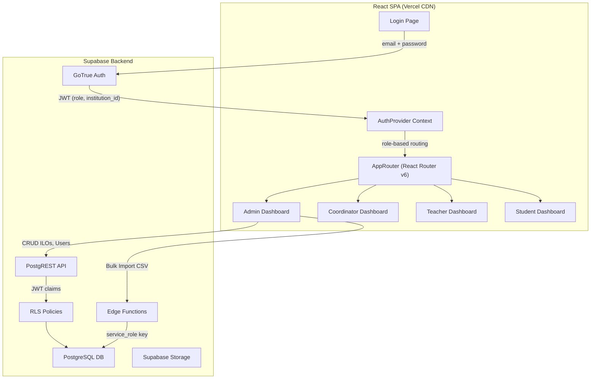
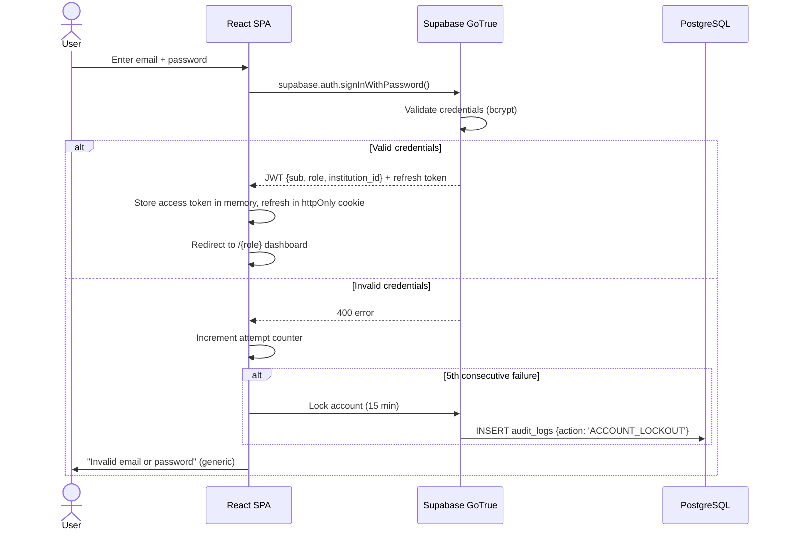
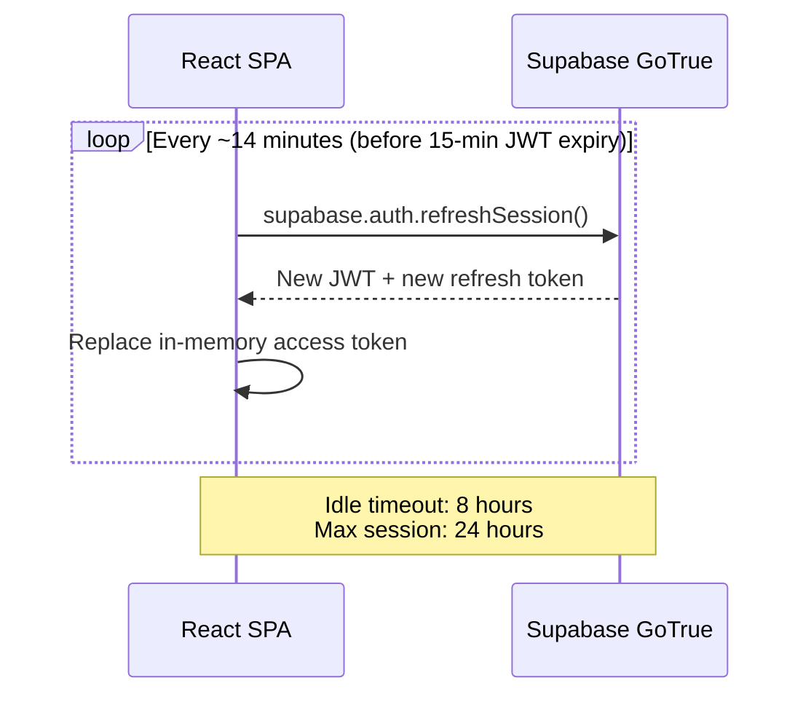

# Design Document — Edeviser Platform (MVP / Phase 1)

## Overview

This design covers the MVP (Phase 1) of the Edeviser platform, focusing on seven core feature areas: email/password authentication, role-based access control (RBAC), role-aware post-login redirect, session persistence, admin user provisioning, bulk user import, and Institutional Learning Outcome (ILO) management.

The platform is a React 18 SPA (TypeScript, Vite, Tailwind CSS 3, Shadcn/ui) backed by Supabase (PostgreSQL with RLS, GoTrue Auth, Edge Functions, Storage). All data access is enforced at the database layer via Row Level Security policies — the application layer never trusts client-side role claims for data filtering.

### Key Design Decisions

| Decision | Choice | Rationale |
|----------|--------|-----------|
| Auth provider | Supabase GoTrue | Native JWT issuance, bcrypt hashing, token refresh built-in; avoids custom auth |
| RBAC enforcement | PostgreSQL RLS + JWT claims | Security at the data layer; no application-layer trust boundary |
| Session storage | In-memory access token + httpOnly refresh cookie | Prevents XSS token theft; Supabase SDK handles refresh automatically |
| State management | TanStack Query | Server-state caching, optimistic updates, background refetch |
| Form validation | React Hook Form + Zod | Schema-first validation shared between client and Edge Functions |
| CSV processing | Supabase Edge Function | Server-side validation avoids client-side file parsing limits; atomic batch insert |
| Audit logging | Immutable `audit_logs` table | Append-only; before/after JSON diff for compliance |
| ILO soft limit | Configurable via `institutions.settings` JSONB | Avoids hard schema changes; admin-adjustable per institution |

## Architecture

### High-Level Component Flow



### Authentication Flow



### Session Refresh Flow



## Components and Interfaces

### 1. AuthProvider (`/src/providers/AuthProvider.tsx`)

Central authentication context wrapping the entire app. Exposes `useAuth()` hook.

```typescript
interface AuthContextValue {
  user: User | null;
  profile: Profile | null;
  role: 'admin' | 'coordinator' | 'teacher' | 'student' | null;
  institutionId: string | null;
  isLoading: boolean;
  signIn: (email: string, password: string) => Promise<AuthResult>;
  signOut: () => Promise<void>;
}

interface AuthResult {
  success: boolean;
  error?: string;
  lockoutUntil?: Date;
}

interface Profile {
  id: string;
  institution_id: string;
  full_name: string;
  email: string;
  role: 'admin' | 'coordinator' | 'teacher' | 'student';
  is_active: boolean;
  avatar_url: string | null;
}
```

Responsibilities:
- Calls `supabase.auth.signInWithPassword()` on login
- Fetches user profile from `profiles` table after auth
- Tracks failed login attempts per session (client-side counter; server-side lockout via Supabase rate limiting)
- Listens to `onAuthStateChange` for session refresh events
- Exposes `role` and `institutionId` derived from profile, not JWT (profile is source of truth for UI routing)

### 2. AppRouter (`/src/router/AppRouter.tsx`)

React Router v6 configuration with role-based route guards.

```typescript
interface RouteGuardProps {
  allowedRoles: Array<'admin' | 'coordinator' | 'teacher' | 'student'>;
  children: React.ReactNode;
}
```

Route structure:
- `/login` — Public, redirects to `/{role}` if already authenticated
- `/admin/*` — Protected, `allowedRoles: ['admin']`
- `/coordinator/*` — Protected, `allowedRoles: ['coordinator']`
- `/teacher/*` — Protected, `allowedRoles: ['teacher']`
- `/student/*` — Protected, `allowedRoles: ['student']`

Guard behavior:
- Unauthenticated → redirect to `/login`
- Wrong role → redirect to `/{user.role}` + toast "Access Denied"
- Redirect completes within 500ms of auth resolution

### 3. User Management Module (`/src/pages/admin/users/`)

Admin-only CRUD for user accounts within their institution.

```typescript
// TanStack Query hooks
interface UseUsersOptions {
  roleFilter?: 'admin' | 'coordinator' | 'teacher' | 'student';
  searchQuery?: string;
  page?: number;
  pageSize?: number;
}

interface CreateUserPayload {
  email: string;
  full_name: string;
  role: 'admin' | 'coordinator' | 'teacher' | 'student';
  program_id?: string;
}

interface UpdateUserPayload {
  id: string;
  full_name?: string;
  role?: 'admin' | 'coordinator' | 'teacher' | 'student';
  is_active?: boolean;
}
```

Key behaviors:
- List view with role filter dropdown and name/email search
- Create user: inserts into `profiles` with admin's `institution_id`
- Soft-delete: sets `is_active = false` (never hard-deletes)
- Role change: logs before/after to `audit_logs`
- Self-protection: admin cannot modify or delete their own account (UI disables actions + server-side RLS check)

### 4. Bulk Import Module (`/src/pages/admin/users/BulkImport.tsx` + Edge Function)

```typescript
// Client-side
interface BulkImportResult {
  total_rows: number;
  created: number;
  failed: number;
  errors: Array<{
    row: number;
    field: string;
    message: string;
  }>;
}

// Edge Function: /functions/v1/bulk-import-users
interface BulkImportRequest {
  file: File; // CSV via FormData
  institution_id: string; // From JWT
}
```

Processing pipeline:
1. Client validates file type (`.csv`) and size (< 5MB)
2. Edge Function parses CSV, validates each row:
   - `email`: valid format, not already registered
   - `full_name`: non-empty, max 255 chars
   - `role`: one of `admin | coordinator | teacher | student`
   - `program_id`: exists in `programs` table for the institution (if provided)
3. Rejects entire upload if > 1000 rows
4. Creates valid users atomically (transaction)
5. Sends invitation emails via email service
6. Returns `BulkImportResult` with per-row error details

### 5. ILO Management Module (`/src/pages/admin/outcomes/`)

```typescript
interface LearningOutcome {
  id: string;
  institution_id: string;
  type: 'ILO' | 'PLO' | 'CLO';
  title: string;
  description: string;
  sort_order: number;
  created_by: string;
  created_at: string;
  updated_at: string;
}

interface CreateILOPayload {
  title: string;        // max 255 chars
  description: string;
}

interface ReorderPayload {
  updates: Array<{ id: string; sort_order: number }>;
}
```

Key behaviors:
- CRUD operations via PostgREST with RLS (admin + institution_id scoping)
- Delete blocked if `outcome_mappings` exist where `target_outcome_id = ilo.id` — returns list of dependent PLOs
- Soft limit of 30 ILOs per institution (checked client-side from `institutions.settings.max_ilos`, warning displayed at limit)
- Reorder via drag-and-drop: batch PATCH of `sort_order` values
- All create/update/delete actions logged to `audit_logs` with before/after snapshots

### 6. Audit Logger Service (`/src/lib/auditLogger.ts`)

```typescript
interface AuditLogEntry {
  actor_id: string;
  action: string;       // e.g., 'CREATE_USER', 'UPDATE_ROLE', 'DELETE_ILO'
  target_type: string;  // Table name
  target_id: string;
  diff: {
    before: Record<string, unknown> | null;
    after: Record<string, unknown> | null;
  };
  ip_address?: string;
}

function logAuditEvent(entry: AuditLogEntry): Promise<void>;
```

Implemented as a utility that inserts into the `audit_logs` table. Called by mutation hooks after successful operations. The `audit_logs` table is append-only — no UPDATE or DELETE policies exist.

## Data Models

### Database Tables (Relevant to MVP Phase 1)

The following tables from the existing schema are directly used by the seven requirements:

#### `profiles`
| Column | Type | Constraints | Notes |
|--------|------|-------------|-------|
| `id` | uuid | PK, references `auth.users.id` | Supabase Auth user ID |
| `institution_id` | uuid | FK → `institutions.id`, NOT NULL | Multi-tenant isolation |
| `full_name` | varchar(255) | NOT NULL | |
| `email` | varchar(255) | UNIQUE, NOT NULL | Institutional email |
| `role` | enum | `admin`, `coordinator`, `teacher`, `student` | Single role per user |
| `is_active` | boolean | DEFAULT true | Soft-delete flag |
| `avatar_url` | varchar | NULLABLE | |
| `created_at` | timestamptz | DEFAULT now() | |
| `last_seen_at` | timestamptz | NULLABLE | Updated on login |

RLS policies:
- Users read own profile
- Admins read/write all profiles in their institution
- No user can hard-delete profiles

#### `institutions`
| Column | Type | Notes |
|--------|------|-------|
| `id` | uuid | PK |
| `name` | varchar | Institution name |
| `settings` | jsonb | `{ max_ilos: 30, ... }` — configurable limits |

#### `learning_outcomes`
| Column | Type | Constraints | Notes |
|--------|------|-------------|-------|
| `id` | uuid | PK | |
| `institution_id` | uuid | FK → `institutions.id` | |
| `type` | enum | `ILO`, `PLO`, `CLO` | Discriminator |
| `title` | varchar(255) | NOT NULL | |
| `description` | text | NULLABLE | |
| `sort_order` | integer | DEFAULT 0 | For drag-reorder |
| `program_id` | uuid | FK → `programs.id`, NULLABLE | NULL for ILOs |
| `course_id` | uuid | FK → `courses.id`, NULLABLE | NULL for ILOs and PLOs |
| `created_by` | uuid | FK → `profiles.id` | |
| `created_at` | timestamptz | | |
| `updated_at` | timestamptz | | |

RLS policies:
- All users in institution can SELECT outcomes
- Admins can CRUD ILOs (type = 'ILO', institution scoped)
- Coordinators can CRUD PLOs (type = 'PLO', program scoped)
- Teachers can CRUD CLOs (type = 'CLO', course scoped)
- Students cannot access ILOs (denied by RLS — returns empty set, API returns 403 if direct access attempted)

#### `outcome_mappings`
| Column | Type | Notes |
|--------|------|-------|
| `id` | uuid | PK |
| `source_outcome_id` | uuid | FK → `learning_outcomes.id` (CLO or PLO) |
| `target_outcome_id` | uuid | FK → `learning_outcomes.id` (PLO or ILO) |
| `weight` | numeric | 0.0 to 1.0 |

Used to check ILO deletion dependencies: if any mapping has `target_outcome_id = ilo.id`, deletion is blocked.

#### `audit_logs`
| Column | Type | Notes |
|--------|------|-------|
| `id` | uuid | PK |
| `actor_id` | uuid | FK → `profiles.id` |
| `action` | varchar | e.g., `CREATE_USER`, `DELETE_ILO`, `UPDATE_ROLE` |
| `target_type` | varchar | Table name |
| `target_id` | uuid | Record ID |
| `diff` | jsonb | `{ before: {...}, after: {...} }` |
| `ip_address` | inet | Client IP |
| `created_at` | timestamptz | Immutable |

RLS: Admin read-only. Inserts via service role or direct insert with actor's JWT.

### Zod Validation Schemas

```typescript
// /src/lib/schemas/auth.ts
const loginSchema = z.object({
  email: z.string().email('Invalid email format'),
  password: z.string().min(8, 'Password must be at least 8 characters'),
});

// /src/lib/schemas/user.ts
const createUserSchema = z.object({
  email: z.string().email(),
  full_name: z.string().min(1).max(255),
  role: z.enum(['admin', 'coordinator', 'teacher', 'student']),
  program_id: z.string().uuid().optional(),
});

const updateUserSchema = z.object({
  full_name: z.string().min(1).max(255).optional(),
  role: z.enum(['admin', 'coordinator', 'teacher', 'student']).optional(),
  is_active: z.boolean().optional(),
});

// /src/lib/schemas/ilo.ts
const createILOSchema = z.object({
  title: z.string().min(1, 'Title is required').max(255, 'Title must be 255 characters or less'),
  description: z.string().optional(),
});

const reorderSchema = z.object({
  updates: z.array(z.object({
    id: z.string().uuid(),
    sort_order: z.number().int().min(0),
  })).min(1),
});

// /src/lib/schemas/bulkImport.ts
const csvRowSchema = z.object({
  email: z.string().email(),
  full_name: z.string().min(1).max(255),
  role: z.enum(['admin', 'coordinator', 'teacher', 'student']),
  program_id: z.string().uuid().optional(),
});
```

### TanStack Query Key Structure

```typescript
// Query keys follow a hierarchical pattern for cache invalidation
const queryKeys = {
  users: {
    all: ['users'] as const,
    list: (filters: UseUsersOptions) => ['users', 'list', filters] as const,
    detail: (id: string) => ['users', 'detail', id] as const,
  },
  ilos: {
    all: ['learning_outcomes', 'ILO'] as const,
    list: (institutionId: string) => ['learning_outcomes', 'ILO', institutionId] as const,
    detail: (id: string) => ['learning_outcomes', 'ILO', 'detail', id] as const,
    dependencies: (id: string) => ['learning_outcomes', 'ILO', 'dependencies', id] as const,
  },
  auditLogs: {
    all: ['audit_logs'] as const,
    list: (filters: AuditLogFilters) => ['audit_logs', 'list', filters] as const,
  },
};
```

## Correctness Properties

*A property is a characteristic or behavior that should hold true across all valid executions of a system — essentially, a formal statement about what the system should do. Properties serve as the bridge between human-readable specifications and machine-verifiable correctness guarantees.*

### Property 1: Valid credentials produce a valid session

*For any* registered user with valid email and password, calling `signInWithPassword` should return a session containing a JWT with the user's `role` and `institution_id` matching their profile record.

**Validates: Requirements 1.1**

### Property 2: Generic error message on invalid credentials

*For any* login attempt with incorrect credentials (wrong email, wrong password, or both), the error message returned should be identical regardless of which field was wrong — never revealing whether the email exists or the password was incorrect.

**Validates: Requirements 1.3**

### Property 3: Password minimum length enforcement

*For any* string shorter than 8 characters, attempting to create an account or change a password should be rejected by validation. *For any* string of 8 or more characters (meeting other requirements), the length check should pass.

**Validates: Requirements 1.4**

### Property 4: Role-based data scoping for learning outcomes

*For any* user with a given role querying `learning_outcomes`:
- A `student` should receive zero ILO records (access denied)
- A `teacher` should receive only CLOs belonging to courses assigned to them
- A `coordinator` should receive only PLOs from their assigned programs, plus all institution ILOs
- An `admin` should receive only outcomes belonging to their institution

**Validates: Requirements 2.2, 2.3, 2.4, 2.5**

### Property 5: Admin institution data isolation

*For any* admin querying any table, all returned records should have an `institution_id` matching the admin's own `institution_id`. No cross-institution data leakage should occur.

**Validates: Requirements 2.5**

### Property 6: Role-to-dashboard redirect mapping

*For any* authenticated user with role R, the post-login redirect path should be `/{R}` (i.e., admin → `/admin`, coordinator → `/coordinator`, teacher → `/teacher`, student → `/student`).

**Validates: Requirements 3.1**

### Property 7: Cross-role navigation denied

*For any* authenticated user with role X navigating to `/{Y}` where Y ≠ X, the router should redirect them to `/{X}`.

**Validates: Requirements 3.2**

### Property 8: Unauthenticated access redirects to login

*For any* protected route path and any unauthenticated session, navigation should redirect to `/login`.

**Validates: Requirements 3.3**

### Property 9: User creation round-trip

*For any* valid `CreateUserPayload`, after an admin creates a user, querying the `profiles` table for that email should return a record with matching `full_name`, `email`, `role`, and the admin's `institution_id`.

**Validates: Requirements 5.1**

### Property 10: Soft-delete preserves historical data

*For any* user who is soft-deleted (is_active set to false), all their associated evidence and grade records should remain unchanged and queryable. The count of evidence records before and after soft-delete should be identical.

**Validates: Requirements 5.2**

### Property 11: Admin self-modification prevention

*For any* admin user, attempting to update their own role or soft-delete their own profile should be rejected by the system.

**Validates: Requirements 5.4**

### Property 12: User list institution scoping with filters

*For any* admin and any combination of role filter and search query, all returned user records should belong to the admin's institution, match the role filter (if specified), and contain the search query in their name or email (if specified).

**Validates: Requirements 5.5**

### Property 13: CSV row validation produces correct errors

*For any* CSV row with invalid data (missing required fields, invalid email format, invalid role value, non-existent program_id), the validation should reject that row and produce an error referencing the correct row number and the specific field that failed.

**Validates: Requirements 6.1, 6.2**

### Property 14: Valid CSV rows create users atomically

*For any* CSV containing only valid rows (within the 1000-row limit), all users should be created successfully. If any single row fails during creation, no users from the batch should be persisted (atomicity).

**Validates: Requirements 6.3**

### Property 15: ILO creation round-trip

*For any* valid ILO creation payload (title ≤ 255 chars, non-empty), after creation the `learning_outcomes` table should contain a record with `type = 'ILO'`, the specified title and description, and the admin's `institution_id`.

**Validates: Requirements 7.1**

### Property 16: ILO deletion blocked by dependent PLOs

*For any* ILO that has one or more PLOs mapped to it via `outcome_mappings`, attempting to delete that ILO should fail and return the list of dependent PLO IDs. *For any* ILO with zero mappings, deletion should succeed.

**Validates: Requirements 7.2**

### Property 17: ILO reorder consistency

*For any* permutation of ILO sort orders, after applying a reorder operation, querying ILOs ordered by `sort_order` should return them in the new specified order, and all `sort_order` values should be unique within the institution.

**Validates: Requirements 7.3**

### Property 18: Admin mutations produce audit logs

*For any* admin mutation (create, update, or delete) on `profiles` or `learning_outcomes`, an `audit_logs` record should be created with the correct `action`, `target_type`, `target_id`, and a `diff` containing accurate before/after snapshots.

**Validates: Requirements 5.3, 7.5**

## Error Handling

### Authentication Errors

| Error Scenario | User-Facing Message | Technical Handling |
|----------------|---------------------|--------------------|
| Invalid credentials | "Invalid email or password" | Generic message; never reveal which field failed |
| Account locked (5 failed attempts) | "Account temporarily locked. Try again in 15 minutes." | Client tracks attempt count; Supabase rate limiting enforces server-side |
| Supabase Auth unreachable | "Unable to connect. Retrying..." | Auto-retry once after 2s; if still failing, show "Service temporarily unavailable. Please try again later." |
| Session expired (idle 8h) | "Your session has expired. Please log in again." | Redirect to `/login` with return URL preserved |
| Session expired (24h max) | "Your session has expired. Please log in again." | Same handling as idle timeout |

### RBAC Errors

| Error Scenario | Handling |
|----------------|----------|
| Student accesses ILO endpoint | RLS returns empty result set; if direct API call, PostgREST returns 403 |
| User navigates to wrong role dashboard | Redirect to own dashboard + toast "Access Denied" |
| Unauthenticated access to protected route | Redirect to `/login` |

### User Management Errors

| Error Scenario | User-Facing Message |
|----------------|---------------------|
| Create user with duplicate email | "A user with this email already exists" |
| Admin tries to delete self | "You cannot modify your own admin account" |
| Admin tries to change own role | "You cannot modify your own admin account" |
| Update non-existent user | "User not found" (404) |

### Bulk Import Errors

| Error Scenario | Handling |
|----------------|----------|
| File not CSV | "Please upload a CSV file" (client-side check) |
| File > 5MB | "File size exceeds 5MB limit" |
| CSV > 1000 rows | "Maximum batch size is 1000 rows. Please split your file." |
| Invalid rows in CSV | Return `BulkImportResult` with per-row errors; valid rows still processed if partial success mode is off (MVP: atomic — all or nothing) |
| Duplicate email in CSV | Error on that row: "Email already registered" |
| Non-existent program_id | Error on that row: "Program not found" |

### ILO Management Errors

| Error Scenario | User-Facing Message |
|----------------|---------------------|
| Title empty | "Title is required" (Zod validation) |
| Title > 255 chars | "Title must be 255 characters or less" |
| Delete ILO with mapped PLOs | "Cannot delete this ILO. It is mapped to the following PLOs: [list]" |
| ILO count at soft limit | Warning banner: "Your institution has reached the recommended limit of {N} ILOs" (non-blocking) |
| Reorder fails (concurrent edit) | "ILO order was updated by another user. Refreshing..." + auto-refetch |

### Global Error Handling Strategy

- All API errors are caught by TanStack Query's `onError` callbacks
- Errors are displayed via Shadcn/ui toast notifications (non-blocking)
- Destructive errors (delete failures, permission denials) use the destructive toast variant
- Network errors trigger a single automatic retry before showing the error
- All error messages are user-friendly; technical details logged to console in development only
- Sentry captures unhandled exceptions in production

## Testing Strategy

### Dual Testing Approach

This feature set requires both unit tests and property-based tests for comprehensive coverage.

**Unit tests** cover:
- Specific examples and edge cases (account lockout at exactly 5 attempts, CSV with exactly 1000 vs 1001 rows, ILO count at soft limit)
- Integration points (Supabase Auth SDK calls, PostgREST responses, Edge Function invocations)
- UI behavior (redirect timing, toast messages, form validation feedback)
- Error conditions (service unreachable, concurrent edits)

**Property-based tests** cover:
- Universal properties that hold across all valid inputs (RBAC scoping, round-trip creation, audit log generation)
- Comprehensive input coverage through randomized generation

### Property-Based Testing Configuration

- **Library:** [fast-check](https://github.com/dubzzz/fast-check) (TypeScript-native, integrates with Vitest)
- **Runner:** Vitest (`vitest --run`)
- **Minimum iterations:** 100 per property test
- **Each property test must reference its design document property via comment tag:**
  ```typescript
  // Feature: edeviser-platform, Property 1: Valid credentials produce a valid session
  ```

### Test Organization

```
src/
├── __tests__/
│   ├── properties/
│   │   ├── auth.property.test.ts        # Properties 1-3
│   │   ├── rbac.property.test.ts        # Properties 4-5
│   │   ├── routing.property.test.ts     # Properties 6-8
│   │   ├── users.property.test.ts       # Properties 9-12
│   │   ├── bulk-import.property.test.ts # Properties 13-14
│   │   ├── ilo.property.test.ts         # Properties 15-17
│   │   └── audit.property.test.ts       # Property 18
│   ├── unit/
│   │   ├── auth.test.ts
│   │   ├── users.test.ts
│   │   ├── bulk-import.test.ts
│   │   ├── ilo.test.ts
│   │   └── routing.test.ts
```

### Key Unit Test Cases

- Login with valid credentials returns session (example)
- Login with wrong password shows generic error (example)
- 5th failed login triggers lockout (edge case from 1.2)
- Auth service unreachable triggers retry then error (edge case from 1.5)
- Session persists across simulated refresh (example from 4.1)
- Idle timeout at 8 hours expires session (edge case from 4.3)
- Max session at 24 hours requires re-auth (edge case from 4.4)
- CSV with exactly 1001 rows is rejected (edge case from 6.4)
- ILO count at configured limit shows warning (edge case from 7.4)

### Property Test Implementation Pattern

```typescript
import { fc } from '@fast-check/vitest';
import { describe, it } from 'vitest';

// Feature: edeviser-platform, Property 4: Role-based data scoping for learning outcomes
describe('RBAC data scoping', () => {
  it.prop(
    [fc.constantFrom('student', 'teacher', 'coordinator', 'admin'), fc.uuid()],
    { numRuns: 100 }
  )('returns only role-appropriate outcomes', (role, institutionId) => {
    // Generate user with role, query learning_outcomes, assert scoping
  });
});
```
