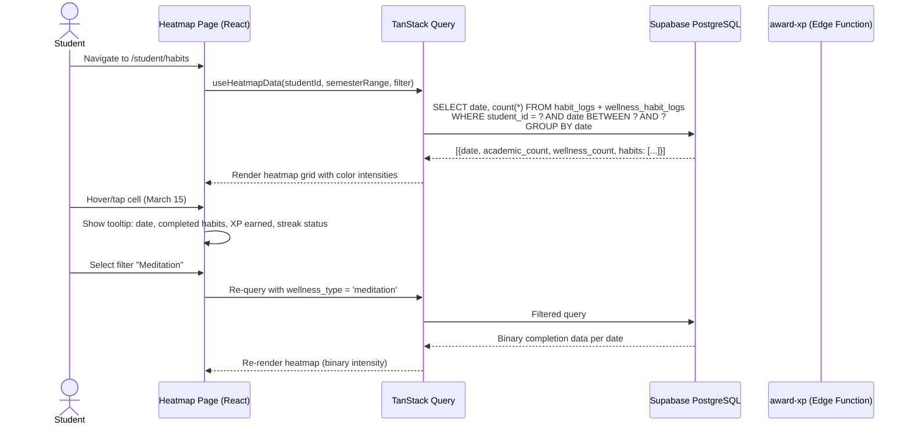
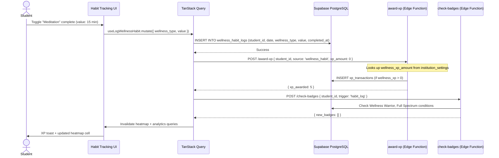
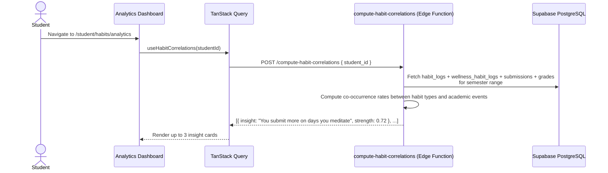

# Design Document — Habit Heatmap Visualization & Wellness Habits

## Overview

This design covers the Habit Heatmap Visualization & Wellness Habits feature for the Edeviser platform — extending the existing 7-day habit grid into a semester-long GitHub-style contribution heatmap and introducing optional wellness habits alongside the 4 existing academic habits. The feature adds:

1. A semester-long heatmap grid where each cell represents one calendar day, with color intensity encoding the number of habits completed (0–4+), hover/tap tooltips showing daily detail, and filtering by individual habit type via URL params
2. Summary statistics (current streak, longest streak, total active days) displayed above the heatmap
3. Wellness habits (Meditation, Hydration, Exercise, Sleep) as opt-in extensions that contribute to the heatmap but do NOT count toward Perfect Day
4. Privacy-first wellness data model with student-only default visibility and opt-in parent access
5. Admin-configurable wellness XP (0–25 per completion, default 5) flowing through the existing `award-xp` Edge Function
6. A Habit Analytics Dashboard with weekly/monthly completion rate charts, consistency score, best-day-of-week analysis, correlation insights, and CSV export
7. Three new badges (Habit Master, Wellness Warrior, Full Spectrum) integrated into the existing `check-badges` Edge Function
8. A `compute-habit-correlations` Edge Function for analyzing co-occurrence patterns between habits and academic events

The system integrates with the existing Supabase backend (PostgreSQL + RLS, Edge Functions), TanStack Query hooks, gamification engine (XP, streaks, badges), and the student dashboard. All new tables follow the append-only pattern for logs and enforce RLS scoped by role and privacy settings.

### Key Design Decisions

| Decision | Choice | Rationale |
|----------|--------|-----------|
| Heatmap rendering | Custom SVG grid component (no external library) | Full control over cell sizing, color tokens, ARIA labels, keyboard nav; avoids bundle bloat for a simple grid |
| Color palette | Streak gradient scale (red-500 → orange-500) with 5 intensity levels | Consistent with existing streak display design tokens per design system rules |
| Heatmap data query | Single aggregated query joining `habit_logs` + `wellness_habit_logs` grouped by date | Avoids N+1 per-day queries; returns ~120 rows for a full semester |
| Wellness data separation | Separate `wellness_habit_logs` table (not extending `habit_logs` enum) | Preserves existing academic habit logic untouched; different schema (value field); cleaner RLS policies |
| Wellness privacy | RLS-enforced student-only default + opt-in parent visibility via preferences table | Privacy by design; no application-level access control to bypass |
| Correlation insights | Edge Function with simple co-occurrence analysis | Avoids complex ML; runs on-demand per student; 14-day minimum data threshold |
| Heatmap filtering | nuqs URL params for filter state | Consistent with project conventions; survives navigation and enables sharing |
| CSV export | Client-side generation from cached TanStack Query data | No Edge Function needed; data already fetched for analytics display |
| Wellness XP | Lookup `institution_settings.wellness_xp_amount` in `award-xp` Edge Function | Reuses existing XP pipeline; admin-configurable; respects bonus multipliers |
| Mobile heatmap | Horizontal scroll with fixed cell size (min 12px) | Preserves readability; standard pattern for wide grids on mobile |

## Architecture

### Heatmap Data Flow



### Wellness Habit Logging Flow



### Correlation Insights Flow



## Components and Interfaces

### New Pages

| Page | Route | Description |
|------|-------|-------------|
| `HabitHeatmapPage` | `/student/habits` | Main heatmap view with grid, filters, summary stats, and wellness logging |
| `HabitAnalyticsPage` | `/student/habits/analytics` | Charts, consistency score, best day, correlations, export |
| `WellnessSettingsPanel` | Inline on `/student/habits` | Opt-in/out wellness habits, parent visibility toggle |
| `AdminWellnessSettingsSection` | Inline on admin institution settings | Wellness XP amount configuration |

### New Components

| Component | Location | Props |
|-----------|----------|-------|
| `HeatmapGrid` | `src/components/shared/HeatmapGrid.tsx` | `data: HeatmapDay[]`, `semesterRange: DateRange`, `onCellClick: (date) => void` |
| `HeatmapCell` | Internal to HeatmapGrid | `date: string`, `count: number`, `maxCount: number`, `isDisabled: boolean` |
| `HeatmapTooltip` | `src/components/shared/HeatmapTooltip.tsx` | `date: string`, `habits: CompletedHabit[]`, `xpEarned: number`, `streakActive: boolean` |
| `HeatmapLegend` | Internal to HeatmapGrid | `colorScale: string[]` |
| `HeatmapFilters` | `src/components/shared/HeatmapFilters.tsx` | `enabledWellnessHabits: WellnessType[]`, `activeFilter: string`, `onFilterChange: (filter) => void` |
| `HeatmapSummaryStats` | `src/components/shared/HeatmapSummaryStats.tsx` | `currentStreak: number`, `longestStreak: number`, `totalActiveDays: number` |
| `WellnessHabitLogger` | `src/components/shared/WellnessHabitLogger.tsx` | `enabledHabits: WellnessType[]`, `todayLogs: WellnessHabitLog[]`, `onLog: (type, value) => void` |
| `ConsistencyScoreRing` | `src/components/shared/ConsistencyScoreRing.tsx` | `score: number`, `label: string` |
| `HabitCompletionChart` | `src/components/shared/HabitCompletionChart.tsx` | `data: CompletionRateData[]`, `period: 'weekly' \| 'monthly'` |
| `BestDayChart` | `src/components/shared/BestDayChart.tsx` | `data: DayOfWeekData[]` |
| `CorrelationInsightCard` | `src/components/shared/CorrelationInsightCard.tsx` | `insight: CorrelationInsight` |
| `HabitMobileBottomSheet` | `src/components/shared/HabitMobileBottomSheet.tsx` | `date: string`, `habits: CompletedHabit[]`, `open: boolean`, `onClose: () => void` |

### New Hooks

| Hook | File | Purpose |
|------|------|---------|
| `useHeatmapData` | `src/hooks/useHeatmapData.ts` | Fetch aggregated habit data for semester range, supports filter param |
| `useWellnessPreferences` | `src/hooks/useWellnessPreferences.ts` | CRUD for student wellness preferences |
| `useLogWellnessHabit` | `src/hooks/useWellnessHabits.ts` | Mutation to log a wellness habit + trigger XP + badge check |
| `useWellnessHabitLogs` | `src/hooks/useWellnessHabits.ts` | Query today's wellness logs for the student |
| `useHabitAnalytics` | `src/hooks/useHabitAnalytics.ts` | Fetch completion rates, consistency score, best day data |
| `useHabitCorrelations` | `src/hooks/useHabitCorrelations.ts` | Invoke compute-habit-correlations Edge Function |
| `useHabitExport` | `src/hooks/useHabitExport.ts` | Generate and download CSV report from cached data |
| `useHeatmapSummary` | `src/hooks/useHeatmapData.ts` | Compute current streak, longest streak, total active days |

### New Edge Functions

| Function | Path | Trigger |
|----------|------|---------|
| `compute-habit-correlations` | `supabase/functions/compute-habit-correlations/index.ts` | On-demand from analytics page |

### Modified Existing Files

| File | Change |
|------|--------|
| `supabase/functions/award-xp/index.ts` | Add `wellness_habit` to `XPSource` type and `VALID_SOURCES`; lookup `wellness_xp_amount` from `institution_settings` when source is `wellness_habit` |
| `supabase/functions/check-badges/index.ts` | Add `habit_log` trigger type; add `checkHabitBadges()` for Habit Master, Wellness Warrior, Full Spectrum |
| `src/router/AppRouter.tsx` | Add `/student/habits` and `/student/habits/analytics` routes |
| `src/pages/student/StudentLayout.tsx` | Add "Habits" nav item with heatmap icon |

## Data Models

### New Tables

#### `wellness_habit_logs`

| Column | Type | Constraints | Description |
|--------|------|-------------|-------------|
| `id` | `uuid` | PK, default `gen_random_uuid()` | Primary key |
| `student_id` | `uuid` | FK → `profiles.id`, NOT NULL | Owning student |
| `date` | `date` | NOT NULL | Calendar date of completion |
| `wellness_type` | `wellness_habit_type` (enum) | NOT NULL | One of: meditation, hydration, exercise, sleep |
| `value` | `numeric` | NULLABLE | Contextual value (minutes, glasses, hours) |
| `completed_at` | `timestamptz` | NOT NULL, default `now()` | Timestamp of completion |
| `created_at` | `timestamptz` | NOT NULL, default `now()` | Record creation time |

Constraints:
- UNIQUE on `(student_id, date, wellness_type)` — one log per habit per day
- No DELETE policy — append-only (consistent with evidence immutability pattern)
- UPDATE allowed only on `value` field

Indexes:
- `idx_wellness_habit_logs_student_date` on `(student_id, date)` — heatmap range queries
- `idx_wellness_habit_logs_student_type_date` on `(student_id, wellness_type, date)` — filtered queries

#### `student_wellness_preferences`

| Column | Type | Constraints | Description |
|--------|------|-------------|-------------|
| `id` | `uuid` | PK, default `gen_random_uuid()` | Primary key |
| `student_id` | `uuid` | FK → `profiles.id`, UNIQUE, NOT NULL | One preferences record per student |
| `enabled_habits` | `text[]` | NOT NULL, default `'{}'` | Subset of ['meditation', 'hydration', 'exercise', 'sleep'] |
| `parent_visibility` | `boolean` | NOT NULL, default `false` | Whether linked parents can view wellness data |
| `created_at` | `timestamptz` | NOT NULL, default `now()` | Record creation time |
| `updated_at` | `timestamptz` | NOT NULL, default `now()` | Last update time |

### Modified Tables

#### `institution_settings` (add column)

| Column | Type | Default | Description |
|--------|------|---------|-------------|
| `wellness_xp_amount` | `integer` | `5` | XP awarded per wellness habit completion (0–25) |

### New Enums

```sql
CREATE TYPE wellness_habit_type AS ENUM ('meditation', 'hydration', 'exercise', 'sleep');
```

### Existing Table Index Additions

```sql
-- Optimize heatmap range queries on existing habit_logs
CREATE INDEX IF NOT EXISTS idx_habit_logs_student_date ON habit_logs(student_id, date);
```

### XP Source Extension

The `award-xp` Edge Function's `VALID_SOURCES` array gains `'wellness_habit'`. The `XPSource` type union gains `| 'wellness_habit'`.

### Badge Definitions Extension

Three new badge definitions added to `src/lib/badgeDefinitions.ts`:

| Badge ID | Name | Condition | XP Reward |
|----------|------|-----------|-----------|
| `habit_master` | Habit Master | 30+ active days (≥1 habit) in current semester | 100 |
| `wellness_warrior` | Wellness Warrior | 14 consecutive days with ≥1 wellness habit logged | 75 |
| `full_spectrum` | Full Spectrum | 7 days in semester with all 4 academic + ≥1 wellness habit | 150 |

### RLS Policies

#### `wellness_habit_logs`

```sql
-- Enable RLS
ALTER TABLE wellness_habit_logs ENABLE ROW LEVEL SECURITY;

-- Students: SELECT + INSERT own logs
CREATE POLICY "student_select_own_wellness_logs" ON wellness_habit_logs
  FOR SELECT TO authenticated
  USING (student_id = auth.uid());

CREATE POLICY "student_insert_own_wellness_logs" ON wellness_habit_logs
  FOR INSERT TO authenticated
  WITH CHECK (student_id = auth.uid() AND auth_user_role() = 'student');

-- Students: UPDATE value field only on own logs
CREATE POLICY "student_update_own_wellness_logs" ON wellness_habit_logs
  FOR UPDATE TO authenticated
  USING (student_id = auth.uid() AND auth_user_role() = 'student')
  WITH CHECK (student_id = auth.uid());

-- Parents: SELECT linked student logs when parent_visibility = true
CREATE POLICY "parent_read_linked_wellness_logs" ON wellness_habit_logs
  FOR SELECT TO authenticated
  USING (
    auth_user_role() = 'parent'
    AND student_id IN (
      SELECT psl.student_id FROM parent_student_links psl
      JOIN student_wellness_preferences swp ON swp.student_id = psl.student_id
      WHERE psl.parent_id = auth.uid()
        AND psl.verified = true
        AND swp.parent_visibility = true
    )
  );

-- No DELETE policy — append-only
-- No teacher SELECT policy — teachers cannot access wellness data
-- Admin aggregate access via database function (not direct table SELECT)
```

#### `student_wellness_preferences`

```sql
-- Enable RLS
ALTER TABLE student_wellness_preferences ENABLE ROW LEVEL SECURITY;

-- Students: full CRUD on own preferences
CREATE POLICY "student_manage_own_preferences" ON student_wellness_preferences
  FOR ALL TO authenticated
  USING (student_id = auth.uid() AND auth_user_role() = 'student')
  WITH CHECK (student_id = auth.uid() AND auth_user_role() = 'student');

-- No other role can access individual preferences
```

### Database Function for Admin Aggregate Access

```sql
CREATE OR REPLACE FUNCTION get_wellness_aggregate_stats(p_institution_id uuid)
RETURNS TABLE (
  wellness_type text,
  total_logs bigint,
  unique_students bigint
) AS $$
BEGIN
  RETURN QUERY
  SELECT
    whl.wellness_type::text,
    COUNT(*)::bigint AS total_logs,
    COUNT(DISTINCT whl.student_id)::bigint AS unique_students
  FROM wellness_habit_logs whl
  JOIN profiles p ON p.id = whl.student_id
  WHERE p.institution_id = p_institution_id
  GROUP BY whl.wellness_type;
END;
$$ LANGUAGE plpgsql SECURITY DEFINER;
```

### TypeScript Types

```typescript
// src/types/habits.ts

export type WellnessHabitType = 'meditation' | 'hydration' | 'exercise' | 'sleep';
export type AcademicHabitType = 'login' | 'submit' | 'journal' | 'read';
export type HabitType = AcademicHabitType | WellnessHabitType;

export interface HeatmapDay {
  date: string; // YYYY-MM-DD
  academicCount: number;
  wellnessCount: number;
  totalCount: number;
  habits: CompletedHabit[];
}

export interface CompletedHabit {
  type: HabitType;
  category: 'academic' | 'wellness';
  value?: number; // wellness-specific value
  completedAt: string;
}

export interface WellnessHabitLog {
  id: string;
  studentId: string;
  date: string;
  wellnessType: WellnessHabitType;
  value: number | null;
  completedAt: string;
}

export interface WellnessPreferences {
  id: string;
  studentId: string;
  enabledHabits: WellnessHabitType[];
  parentVisibility: boolean;
}

export interface HeatmapSummary {
  currentStreak: number;
  longestStreak: number;
  totalActiveDays: number;
}

export interface CompletionRateData {
  period: string; // "Week 1", "Jan", etc.
  rate: number; // 0-100
}

export interface DayOfWeekData {
  day: string; // "Monday", "Tuesday", etc.
  avgCompletions: number;
}

export interface CorrelationInsight {
  id: string;
  habitType: HabitType;
  academicMetric: string;
  description: string; // Plain language, no causation
  strength: number; // 0-1 correlation strength
}

export interface HabitReportRow {
  date: string;
  login: boolean;
  submit: boolean;
  journal: boolean;
  read: boolean;
  meditation?: boolean;
  hydration?: boolean;
  exercise?: boolean;
  sleep?: boolean;
  totalHabits: number;
  xpEarned: number;
  streakActive: boolean;
}

export interface DateRange {
  start: string; // YYYY-MM-DD
  end: string; // YYYY-MM-DD
}
```

### Heatmap Data Query

The primary heatmap query aggregates both academic and wellness habit data in a single call:

```sql
-- Heatmap data: aggregated counts per date for semester range
SELECT
  d.date,
  COALESCE(hl.academic_count, 0) AS academic_count,
  COALESCE(wl.wellness_count, 0) AS wellness_count,
  COALESCE(hl.academic_count, 0) + COALESCE(wl.wellness_count, 0) AS total_count
FROM generate_series(?::date, ?::date, '1 day'::interval) AS d(date)
LEFT JOIN (
  SELECT date, COUNT(*) AS academic_count
  FROM habit_logs
  WHERE student_id = ? AND date BETWEEN ? AND ?
  GROUP BY date
) hl ON hl.date = d.date
LEFT JOIN (
  SELECT date, COUNT(*) AS wellness_count
  FROM wellness_habit_logs
  WHERE student_id = ? AND date BETWEEN ? AND ?
  GROUP BY date
) wl ON wl.date = d.date
ORDER BY d.date;
```

When a specific habit filter is active, the query narrows to that habit type and returns binary (0 or 1) per date.

### Longest Streak Computation

The longest streak within a semester range is computed client-side from the heatmap data array (sorted dates with `totalCount > 0`). This avoids a complex SQL window function and the data is already fetched.

```typescript
export function computeLongestStreak(days: HeatmapDay[]): number {
  let longest = 0;
  let current = 0;
  // days are sorted by date ascending
  for (let i = 0; i < days.length; i++) {
    if (days[i].academicCount > 0) {
      current++;
      longest = Math.max(longest, current);
    } else {
      current = 0;
    }
  }
  return longest;
}
```

### Consistency Score Computation

```typescript
export function computeConsistencyScore(days: HeatmapDay[], totalDays: number): number {
  if (totalDays === 0) return 0;
  const activeDays = days.filter(d => d.totalCount > 0).length;
  return Math.round((activeDays / totalDays) * 100);
}
```

### Completion Rate Computation

```typescript
export function computeCompletionRate(
  totalCompleted: number,
  possiblePerDay: number,
  daysInPeriod: number,
): number {
  const totalPossible = possiblePerDay * daysInPeriod;
  if (totalPossible === 0) return 0;
  return Math.round((totalCompleted / totalPossible) * 100);
}
```


## Correctness Properties

*A property is a characteristic or behavior that should hold true across all valid executions of a system — essentially, a formal statement about what the system should do. Properties serve as the bridge between human-readable specifications and machine-verifiable correctness guarantees.*

### Property 1: Heatmap grid structure matches semester range

*For any* valid semester date range (start ≤ end, both valid dates), the heatmap grid SHALL produce exactly 7 rows (Monday–Sunday) and the correct number of week columns to span the full range, and month labels SHALL be positioned at the week index corresponding to the first day of each month within the range.

**Validates: Requirements 1.1, 1.4**

### Property 2: Habit count maps to correct intensity level

*For any* non-negative integer habit count, the intensity mapping function SHALL return: level 0 for count 0, level 1 for count 1, level 2 for count 2, level 3 for count 3, and level 4 for count ≥ 4.

**Validates: Requirements 1.2**

### Property 3: Tooltip content includes all required fields

*For any* heatmap day data (date, list of completed habits, XP earned, streak status), the tooltip render function SHALL produce output containing the date string, each completed habit name, the XP total, and the streak status indicator.

**Validates: Requirements 2.1**

### Property 4: Future dates produce disabled cells

*For any* date strictly after today (UTC), the heatmap cell state function SHALL return `disabled = true` with intensity level 0 and interaction disabled.

**Validates: Requirements 2.4**

### Property 5: Filter options match enabled habits

*For any* set of enabled wellness habits (subset of [meditation, hydration, exercise, sleep]), the filter options function SHALL return exactly: ["All Habits", "Login", "Submit", "Journal", "Read"] plus one entry per enabled wellness habit, in that order.

**Validates: Requirements 3.1**

### Property 6: Single-habit filter produces binary intensity

*For any* heatmap dataset and any single-habit filter selection, every cell intensity value SHALL be either 0 (not completed) or 1 (completed) for that specific habit on that day.

**Validates: Requirements 3.2**

### Property 7: "All Habits" filter sums all completions

*For any* heatmap dataset, when the filter is set to "All Habits", each cell's total count SHALL equal the sum of academic habit completions plus wellness habit completions for that date.

**Validates: Requirements 3.3**

### Property 8: Longest streak computation

*For any* sorted sequence of daily habit data (with academic counts), the longest streak function SHALL return the length of the longest consecutive subsequence of days where `academicCount > 0`. The result SHALL be ≥ 0 and ≤ the total number of days in the sequence.

**Validates: Requirements 4.3**

### Property 9: Total active days computation

*For any* set of heatmap day data within a date range, the total active days SHALL equal the count of distinct dates where `totalCount > 0`. This count SHALL be ≥ 0 and ≤ the total number of days in the range.

**Validates: Requirements 4.4**

### Property 10: Heatmap cell minimum size

*For any* container width (positive number) and number of weeks (positive integer), the computed cell size SHALL be `max(floor(containerWidth / numWeeks), 12)`, ensuring cells are never smaller than 12px.

**Validates: Requirements 5.3**

### Property 11: Enabling a wellness habit updates preferences

*For any* wellness habit type and any initial set of enabled habits, enabling a habit SHALL result in the enabled_habits array containing that habit type. Disabling a habit SHALL result in the enabled_habits array NOT containing that habit type, while all other enabled habits remain unchanged.

**Validates: Requirements 6.3, 6.4**

### Property 12: Wellness habit log contains required fields

*For any* valid wellness habit completion (student_id, date, wellness_type, value), the inserted log record SHALL contain all four fields plus a completed_at timestamp, and the wellness_type SHALL be one of [meditation, hydration, exercise, sleep].

**Validates: Requirements 7.2**

### Property 13: One wellness log per habit per day

*For any* student, date, and wellness_type combination, attempting to insert a second log for the same combination SHALL be rejected (unique constraint violation), and the original log SHALL remain unchanged.

**Validates: Requirements 7.3**

### Property 14: Perfect Day excludes wellness habits

*For any* combination of academic habit completions (0–4) and wellness habit completions (0–4), the Perfect Day check function SHALL return true if and only if all 4 academic habits are completed, regardless of how many wellness habits are completed.

**Validates: Requirements 7.4**

### Property 15: Wellness XP award equals configured amount

*For any* wellness habit log event where the institution's `wellness_xp_amount` is N (0 ≤ N ≤ 25), the XP awarded SHALL equal N (before bonus multipliers). When N = 0, no XP transaction SHALL be inserted.

**Validates: Requirements 7.5, 9.1**

### Property 16: Wellness XP amount validation

*For any* integer value, the wellness XP configuration SHALL accept values in the range [0, 25] and reject values outside this range.

**Validates: Requirements 9.1**

### Property 17: Completion rate formula

*For any* non-negative integers (totalCompleted, possiblePerDay, daysInPeriod) where possiblePerDay > 0 and daysInPeriod > 0, the completion rate SHALL equal `round((totalCompleted / (possiblePerDay × daysInPeriod)) × 100)`, clamped to [0, 100]. When possiblePerDay or daysInPeriod is 0, the rate SHALL be 0.

**Validates: Requirements 10.1, 10.2, 10.3**

### Property 18: Consistency score formula

*For any* set of heatmap day data and total days in range (> 0), the consistency score SHALL equal `round((activeDays / totalDays) × 100)` where activeDays is the count of days with ≥ 1 habit completed. The score SHALL be in [0, 100]. When totalDays is 0, the score SHALL be 0.

**Validates: Requirements 11.1, 11.4**

### Property 19: Day-of-week average computation and best day

*For any* non-empty set of daily habit data, the day-of-week averages SHALL correctly compute the mean habit count for each day (Monday–Sunday), and the "best day" SHALL be the day with the highest average. If multiple days tie, any of the tied days is acceptable.

**Validates: Requirements 12.1, 12.2**

### Property 20: Correlation insights capped at 3 and use non-causal language

*For any* set of correlation results, the displayed insights SHALL contain at most 3 items. Each insight description string SHALL NOT contain the words "because", "causes", "caused", or "due to", and SHOULD contain phrases like "on days when" or "tends to".

**Validates: Requirements 13.1, 13.2, 13.5**

### Property 21: CSV report structure

*For any* habit dataset over a date range with N days and M enabled wellness habits, the generated CSV SHALL contain exactly N data rows (one per day) plus 1 summary header row. Each data row SHALL have columns: date, login, submit, journal, read, [each enabled wellness habit], total_habits, xp_earned, streak_active. The summary row SHALL contain total_active_days, consistency_score, longest_streak, and total_xp values.

**Validates: Requirements 14.2, 14.3**

### Property 22: Habit Master badge condition

*For any* set of daily habit data within a semester, the Habit Master badge check SHALL return true if and only if the count of distinct dates with ≥ 1 habit completed is ≥ 30.

**Validates: Requirements 19.1**

### Property 23: Wellness Warrior badge condition

*For any* sequence of daily wellness habit logs, the Wellness Warrior badge check SHALL return true if and only if there exists a consecutive subsequence of ≥ 14 days where each day has ≥ 1 wellness habit logged.

**Validates: Requirements 19.2**

### Property 24: Full Spectrum badge condition

*For any* set of daily habit data within a semester, the Full Spectrum badge check SHALL return true if and only if there are ≥ 7 distinct dates where all 4 academic habits AND ≥ 1 wellness habit are completed on the same day.

**Validates: Requirements 19.3**

### Property 25: ARIA label format

*For any* heatmap cell with a valid date and non-negative habit count, the generated ARIA label SHALL contain the formatted date and the habit count (e.g., "March 15, 2025: 3 habits completed").

**Validates: Requirements 21.1**

### Property 26: Bonus multiplier applies to wellness XP

*For any* base wellness XP amount (> 0) and any active bonus multiplier (≥ 1), the final XP awarded SHALL equal `floor(baseXP × multiplier)`.

**Validates: Requirements 17.4**

## Error Handling

| Scenario | Handling | User Feedback |
|----------|----------|---------------|
| Heatmap data fetch fails | TanStack Query retry (3 attempts, exponential backoff) | Shimmer placeholder → error state with "Failed to load habit data" + retry button |
| Wellness habit log insert fails (unique constraint) | Catch 23505 error code | Sonner toast: "You've already logged this habit today" |
| Wellness habit log insert fails (other) | Catch and log error | Sonner error toast: "Failed to log habit. Please try again." |
| Wellness preferences update fails | Catch and log error | Sonner error toast: "Failed to update preferences" |
| award-xp Edge Function fails for wellness XP | Log error, don't block habit log | Habit logged successfully, XP toast skipped; console.error logged |
| check-badges Edge Function fails | Log error, don't block habit log | Badge check silently retried on next trigger |
| compute-habit-correlations fails | Return empty insights array | Show "Insights temporarily unavailable" message |
| Insufficient correlation data (< 14 days) | Edge Function returns empty + flag | Show "Keep tracking — insights appear after 2 weeks of data" |
| CSV export fails (data too large) | Catch error in client-side generation | Sonner error toast: "Export failed. Try a shorter date range." |
| Wellness XP config out of range (0–25) | Zod validation on admin form | Form field error: "Must be between 0 and 25" |
| Semester range not configured | Fall back to current calendar year | Show info banner: "Semester dates not configured — showing current year" |

### Error Boundaries

- `HabitHeatmapPage` wrapped in `ErrorBoundary` — catches rendering errors in heatmap grid
- `HabitAnalyticsPage` wrapped in `ErrorBoundary` — catches chart rendering errors
- Individual chart components (`HabitCompletionChart`, `BestDayChart`) catch their own errors and show inline fallback

## Testing Strategy

### Property-Based Tests (fast-check, min 100 iterations each)

Each property from the Correctness Properties section maps to a single property-based test. Tests live in `src/__tests__/properties/` with naming convention `habitHeatmap.property.test.ts`.

| Test File | Properties Covered |
|-----------|-------------------|
| `habitHeatmap.property.test.ts` | Properties 1–10, 25 (heatmap grid, intensity, tooltip, filters, computations) |
| `wellnessHabits.property.test.ts` | Properties 11–16, 26 (wellness preferences, logging, Perfect Day, XP) |
| `habitAnalytics.property.test.ts` | Properties 17–21 (completion rates, consistency, day-of-week, correlations, CSV) |
| `habitBadges.property.test.ts` | Properties 22–24 (Habit Master, Wellness Warrior, Full Spectrum) |

Property test tag format: `// Feature: habit-heatmap, Property N: {property_text}`

### Unit Tests

| Test File | Coverage |
|-----------|----------|
| `heatmapGrid.test.tsx` | HeatmapGrid rendering, cell click handlers, keyboard navigation, ARIA attributes |
| `heatmapTooltip.test.tsx` | Tooltip content for various day states (empty, partial, full, future) |
| `wellnessHabitLogger.test.tsx` | Logger UI: toggle states, value input, submit flow |
| `wellnessSettings.test.tsx` | Preferences panel: enable/disable habits, parent visibility toggle |
| `habitAnalyticsPage.test.tsx` | Analytics page rendering, chart presence, export button |
| `habitExport.test.ts` | CSV generation: header row, data rows, summary row format |
| `correlationInsightCard.test.tsx` | Insight card rendering, language validation |

### Testing Library

- Property-based testing: `fast-check` (already in project dependencies)
- Unit/component testing: `vitest` + `@testing-library/react`
- Minimum 100 iterations per property test
- Each property test references its design document property number

### Test Configuration

```typescript
// Example property test structure
import { fc } from 'fast-check';
import { describe, it, expect } from 'vitest';

describe('Habit Heatmap Properties', () => {
  // Feature: habit-heatmap, Property 2: Habit count maps to correct intensity level
  it('should map habit count to correct intensity level', () => {
    fc.assert(
      fc.property(fc.nat(), (count) => {
        const level = getIntensityLevel(count);
        if (count === 0) expect(level).toBe(0);
        else if (count === 1) expect(level).toBe(1);
        else if (count === 2) expect(level).toBe(2);
        else if (count === 3) expect(level).toBe(3);
        else expect(level).toBe(4);
      }),
      { numRuns: 100 },
    );
  });
});
```
