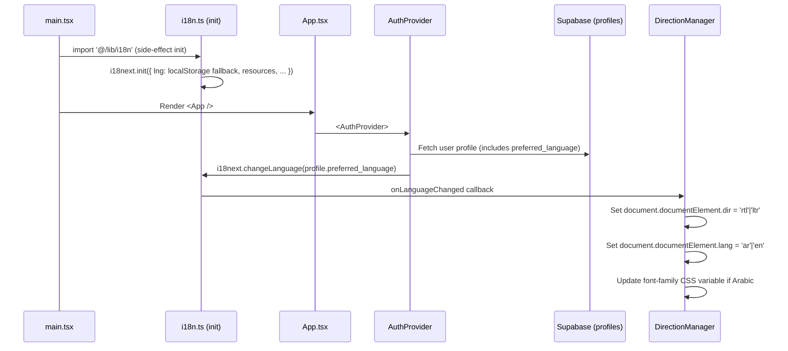
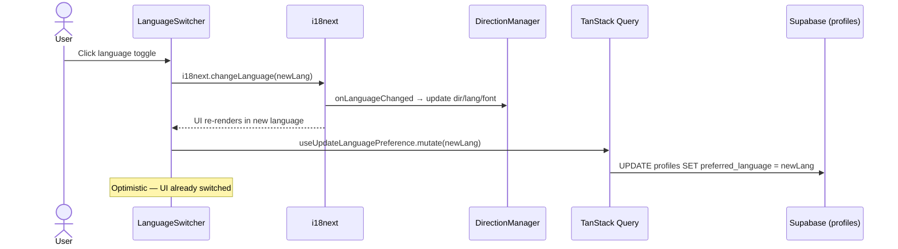

# Design Document — i18n & RTL Support (Arabic/English)

## Overview

This design covers the internationalization (i18n) and right-to-left (RTL) layout support for the Edeviser platform, enabling full Arabic and English bilingual operation for the Qatar education market. The feature adds:

1. An i18next initialization module with namespace-based translation loading, Arabic pluralization, and language detection priority chain
2. A Direction Manager that sets `dir`/`lang` on the HTML element and manages font loading for Arabic
3. Translation files organized by namespace (`common`, `auth`, `admin`, `student`, `teacher`, `coordinator`, `parent`) in JSON format
4. A Language Switcher component in the app header with profile-persisted preference
5. RTL-aware CSS using Tailwind logical properties (`ms-*`, `me-*`, `ps-*`, `pe-*`, `start-*`, `end-*`) replacing all physical direction classes
6. Bidirectional text utilities for mixed Arabic/English content (outcome codes, Bloom's verbs)
7. Locale-aware date and number formatting utilities wrapping `date-fns` and `Intl.NumberFormat`
8. A bilingual content resolver for entity fields (ILO/PLO/CLO titles, course names) with fallback logic
9. Database migration adding `preferred_language` to `profiles` and `default_language` to `institution_settings`

The system integrates with the existing React 18 + TypeScript stack, Shadcn/ui components, Tailwind CSS v4, and Supabase backend. The `i18next` and `react-i18next` packages are already in `package.json` but not yet initialized.

### Key Design Decisions

| Decision | Choice | Rationale |
|----------|--------|-----------|
| Translation loading | Bundled JSON imports (not HTTP fetch) | Small file count (2 languages × 7 namespaces = 14 files); avoids loading latency; Vite tree-shakes unused namespaces |
| Namespace strategy | Role-based namespaces + `common` + `auth` | Matches existing page structure; enables lazy loading per role; keeps files under 50KB |
| RTL approach | Tailwind logical properties + `dir` attribute on `<html>` | Tailwind v4 supports `ms-*`/`me-*` natively; Shadcn/ui Radix primitives respect `dir` attribute automatically |
| Physical → Logical migration | Replace `ml-*`/`mr-*`/`pl-*`/`pr-*`/`left-*`/`right-*` with logical equivalents | One-time migration; all future code uses logical properties by default |
| Font loading | Google Fonts `Noto Sans Arabic` with `display=swap` | Matches existing Noto Sans setup; no layout shift; Arabic glyphs load on demand |
| Language persistence | `profiles.preferred_language` column | Server-side persistence; works across devices; aligns with existing profile pattern |
| Bilingual content | Optional `_ar` suffix columns on key entities | Simple schema; no separate translation table; fallback logic in a pure utility function |
| Number display | Western Arabic numerals (0-9) in both languages | Consistent with data model; avoids confusion in grades/XP; standard in Qatar education |
| Date formatting | `date-fns` locale switching | Already in the stack; supports Arabic locale; consistent with existing date usage |
| Pluralization | i18next built-in ICU plural rules for Arabic | Handles all 6 Arabic plural forms (zero, one, two, few, many, other) natively |

## Architecture

### i18n Initialization Flow



### Language Switch Flow



### Component Architecture

```
src/
├── lib/
│   ├── i18n.ts                      # i18next initialization (side-effect module)
│   ├── directionManager.ts          # Set dir/lang/font on <html>
│   ├── bilingualContent.ts          # Resolve bilingual entity fields
│   ├── formatDate.ts                # Locale-aware date formatting (wraps date-fns)
│   ├── formatNumber.ts              # Locale-aware number formatting (wraps Intl)
│   ├── bidiText.ts                  # Bidirectional text utilities (LTR isolation)
│   └── schemas/
│       └── languagePrefs.ts         # Updated Zod schema (already exists)
├── locales/
│   ├── en/
│   │   ├── common.json
│   │   ├── auth.json
│   │   ├── admin.json
│   │   ├── student.json
│   │   ├── teacher.json
│   │   ├── coordinator.json
│   │   └── parent.json
│   └── ar/
│       ├── common.json
│       ├── auth.json
│       ├── admin.json
│       ├── student.json
│       ├── teacher.json
│       ├── coordinator.json
│       └── parent.json
├── components/shared/
│   └── LanguageSwitcher.tsx          # Language toggle component
├── hooks/
│   └── useLanguagePreference.ts     # TanStack Query hook for language persistence
└── providers/
    └── AuthProvider.tsx              # Modified: apply language on auth
```

## Components and Interfaces

### i18n Initialization Module: `src/lib/i18n.ts`

Side-effect module imported in `main.tsx` before React renders. Configures i18next with all resources, plugins, and language detection.

```typescript
import i18n from 'i18next';
import { initReactI18next } from 'react-i18next';

// English namespaces
import enCommon from '@/locales/en/common.json';
import enAuth from '@/locales/en/auth.json';
import enAdmin from '@/locales/en/admin.json';
import enStudent from '@/locales/en/student.json';
import enTeacher from '@/locales/en/teacher.json';
import enCoordinator from '@/locales/en/coordinator.json';
import enParent from '@/locales/en/parent.json';

// Arabic namespaces
import arCommon from '@/locales/ar/common.json';
import arAuth from '@/locales/ar/auth.json';
import arAdmin from '@/locales/ar/admin.json';
import arStudent from '@/locales/ar/student.json';
import arTeacher from '@/locales/ar/teacher.json';
import arCoordinator from '@/locales/ar/coordinator.json';
import arParent from '@/locales/ar/parent.json';

import { applyDirection } from '@/lib/directionManager';

const savedLang = localStorage.getItem('edeviser-language');

i18n.use(initReactI18next).init({
  resources: {
    en: {
      common: enCommon, auth: enAuth, admin: enAdmin,
      student: enStudent, teacher: enTeacher,
      coordinator: enCoordinator, parent: enParent,
    },
    ar: {
      common: arCommon, auth: arAuth, admin: arAdmin,
      student: arStudent, teacher: arTeacher,
      coordinator: arCoordinator, parent: arParent,
    },
  },
  lng: savedLang || undefined,
  fallbackLng: 'en',
  defaultNS: 'common',
  ns: ['common', 'auth', 'admin', 'student', 'teacher', 'coordinator', 'parent'],
  interpolation: { escapeValue: false }, // React already escapes
  pluralSeparator: '_',
  supportedLngs: ['en', 'ar'],
});

// Apply direction on init and on every language change
applyDirection(i18n.language);
i18n.on('languageChanged', applyDirection);

export default i18n;
```

### Direction Manager: `src/lib/directionManager.ts`

Pure function that updates the HTML document element attributes and font stack based on the active language.

```typescript
const RTL_LANGUAGES = ['ar', 'he', 'fa', 'ur'];

export const getDirection = (language: string): 'rtl' | 'ltr' => {
  return RTL_LANGUAGES.includes(language) ? 'rtl' : 'ltr';
};

export const applyDirection = (language: string): void => {
  const dir = getDirection(language);
  const htmlEl = document.documentElement;
  htmlEl.setAttribute('dir', dir);
  htmlEl.setAttribute('lang', language);

  // Add/remove Arabic font
  if (dir === 'rtl') {
    htmlEl.style.fontFamily =
      '"Noto Sans Arabic", "Noto Sans", ui-sans-serif, system-ui, sans-serif';
  } else {
    htmlEl.style.fontFamily =
      '"Noto Sans", ui-sans-serif, system-ui, sans-serif';
  }
};
```

### Bilingual Content Resolver: `src/lib/bilingualContent.ts`

Pure function that resolves bilingual entity fields based on the active language with fallback.

```typescript
interface BilingualField {
  en?: string | null;
  ar?: string | null;
}

/**
 * Resolves a bilingual field to the appropriate language version.
 * Falls back to the other language if the active language version is empty.
 */
export const resolveBilingualContent = (
  field: BilingualField,
  activeLanguage: string
): string => {
  const primary = activeLanguage === 'ar' ? field.ar : field.en;
  const fallback = activeLanguage === 'ar' ? field.en : field.ar;
  return primary?.trim() || fallback?.trim() || '';
};

/**
 * Creates a bilingual field object from separate values.
 */
export const createBilingualField = (
  en: string | null,
  ar: string | null
): BilingualField => ({ en, ar });
```

### Bidirectional Text Utilities: `src/lib/bidiText.ts`

Utilities for handling mixed-direction text in OBE contexts.

```typescript
/**
 * Wraps a string in Unicode LTR isolate characters for embedding
 * LTR content (codes, English terms) within RTL text.
 */
export const ltrIsolate = (text: string): string => {
  return `\u2066${text}\u2069`; // LRI ... PDI
};

/**
 * Wraps a string in Unicode RTL isolate characters for embedding
 * RTL content within LTR text.
 */
export const rtlIsolate = (text: string): string => {
  return `\u2067${text}\u2069`; // RLI ... PDI
};

/**
 * Detects if a string starts with an RTL character.
 */
export const startsWithRTL = (text: string): boolean => {
  const rtlRegex = /^[\u0591-\u07FF\u200F\u202B\u202E\uFB1D-\uFDFD\uFE70-\uFEFC]/;
  return rtlRegex.test(text.trim());
};
```

### Date Formatting Utility: `src/lib/formatDate.ts`

Locale-aware date formatting wrapping `date-fns`.

```typescript
import { format, formatDistanceToNow } from 'date-fns';
import { enUS } from 'date-fns/locale/en-US';
import { ar } from 'date-fns/locale/ar';
import i18n from '@/lib/i18n';

const localeMap: Record<string, Locale> = { en: enUS, ar };

const getLocale = (): Locale => localeMap[i18n.language] || enUS;

export const formatLocalDate = (
  date: Date | string,
  pattern: string = 'PPP'
): string => {
  const d = typeof date === 'string' ? new Date(date) : date;
  return format(d, pattern, { locale: getLocale() });
};

export const formatRelativeTime = (date: Date | string): string => {
  const d = typeof date === 'string' ? new Date(date) : date;
  return formatDistanceToNow(d, { addSuffix: true, locale: getLocale() });
};
```

### Number Formatting Utility: `src/lib/formatNumber.ts`

Locale-aware number formatting using `Intl.NumberFormat`.

```typescript
import i18n from '@/lib/i18n';

const getLocale = (): string => (i18n.language === 'ar' ? 'ar-QA' : 'en-US');

export const formatNumber = (value: number): string => {
  return new Intl.NumberFormat(getLocale()).format(value);
};

export const formatPercent = (value: number, decimals: number = 0): string => {
  return new Intl.NumberFormat(getLocale(), {
    style: 'percent',
    minimumFractionDigits: decimals,
    maximumFractionDigits: decimals,
  }).format(value / 100);
};

export const formatCompact = (value: number): string => {
  return new Intl.NumberFormat(getLocale(), { notation: 'compact' }).format(value);
};
```

### Language Switcher Component: `src/components/shared/LanguageSwitcher.tsx`

```typescript
import { useTranslation } from 'react-i18next';
import { Button } from '@/components/ui/button';
import {
  DropdownMenu,
  DropdownMenuContent,
  DropdownMenuItem,
  DropdownMenuTrigger,
} from '@/components/ui/dropdown-menu';
import { Globe } from 'lucide-react';
import { useUpdateLanguagePreference } from '@/hooks/useLanguagePreference';

const languages = [
  { code: 'en', label: 'English', nativeLabel: 'English' },
  { code: 'ar', label: 'Arabic', nativeLabel: 'العربية' },
] as const;

export const LanguageSwitcher = () => {
  const { i18n } = useTranslation();
  const updatePreference = useUpdateLanguagePreference();

  const handleLanguageChange = (langCode: string) => {
    i18n.changeLanguage(langCode);
    localStorage.setItem('edeviser-language', langCode);
    updatePreference.mutate(langCode);
  };

  const currentLang = languages.find((l) => l.code === i18n.language) || languages[0];

  return (
    <DropdownMenu>
      <DropdownMenuTrigger asChild>
        <Button variant="ghost" size="sm" className="gap-2">
          <Globe className="h-4 w-4" />
          {currentLang.nativeLabel}
        </Button>
      </DropdownMenuTrigger>
      <DropdownMenuContent align="end">
        {languages.map((lang) => (
          <DropdownMenuItem
            key={lang.code}
            onClick={() => handleLanguageChange(lang.code)}
            className={i18n.language === lang.code ? 'bg-accent' : ''}
          >
            {lang.nativeLabel}
          </DropdownMenuItem>
        ))}
      </DropdownMenuContent>
    </DropdownMenu>
  );
};
```

### Language Preference Hook: `src/hooks/useLanguagePreference.ts`

```typescript
import { useMutation, useQueryClient } from '@tanstack/react-query';
import { supabase } from '@/lib/supabase';
import { queryKeys } from '@/lib/queryKeys';

export const useUpdateLanguagePreference = () => {
  const queryClient = useQueryClient();

  return useMutation({
    mutationFn: async (language: string) => {
      const { data: { user } } = await supabase.auth.getUser();
      if (!user) throw new Error('Not authenticated');

      const { error } = await supabase
        .from('profiles')
        .update({ preferred_language: language })
        .eq('id', user.id);
      if (error) throw error;
    },
    onSuccess: () => {
      queryClient.invalidateQueries({ queryKey: queryKeys.profile.current() });
    },
  });
};
```

### Modified AuthProvider Integration

The existing `AuthProvider` is modified to apply the user's language preference on authentication:

```typescript
// In AuthProvider.tsx, after fetching the user profile:
useEffect(() => {
  if (profile?.preferred_language) {
    i18n.changeLanguage(profile.preferred_language);
  }
}, [profile?.preferred_language]);
```

### Translation File Example: `src/locales/en/common.json`

```json
{
  "save": "Save",
  "cancel": "Cancel",
  "delete": "Delete",
  "edit": "Edit",
  "search": "Search",
  "back": "Back",
  "next": "Next",
  "submit": "Submit",
  "loading": "Loading...",
  "noResults": "No results found",
  "confirmDelete": "Are you sure you want to delete this item?",
  "success": "Operation completed successfully",
  "error": "An error occurred",
  "required": "This field is required",
  "pagination": {
    "previous": "Previous",
    "next": "Next",
    "page": "Page {{current}} of {{total}}",
    "rowsPerPage": "Rows per page"
  },
  "attainment": {
    "excellent": "Excellent",
    "satisfactory": "Satisfactory",
    "developing": "Developing",
    "notYet": "Not Yet"
  },
  "blooms": {
    "remembering": "Remembering",
    "understanding": "Understanding",
    "applying": "Applying",
    "analyzing": "Analyzing",
    "evaluating": "Evaluating",
    "creating": "Creating"
  },
  "gamification": {
    "xp": "XP",
    "level": "Level",
    "streak": "Streak",
    "badge": "Badge",
    "habits": {
      "login": "Login",
      "submit": "Submit",
      "journal": "Journal",
      "read": "Read"
    }
  }
}
```

### Translation File Example: `src/locales/ar/common.json`

```json
{
  "save": "حفظ",
  "cancel": "إلغاء",
  "delete": "حذف",
  "edit": "تعديل",
  "search": "بحث",
  "back": "رجوع",
  "next": "التالي",
  "submit": "إرسال",
  "loading": "جاري التحميل...",
  "noResults": "لم يتم العثور على نتائج",
  "confirmDelete": "هل أنت متأكد أنك تريد حذف هذا العنصر؟",
  "success": "تمت العملية بنجاح",
  "error": "حدث خطأ",
  "required": "هذا الحقل مطلوب",
  "pagination": {
    "previous": "السابق",
    "next": "التالي",
    "page": "صفحة {{current}} من {{total}}",
    "rowsPerPage": "صفوف لكل صفحة"
  },
  "attainment": {
    "excellent": "ممتاز",
    "satisfactory": "مُرضٍ",
    "developing": "قيد التطوير",
    "notYet": "لم يتحقق بعد"
  },
  "blooms": {
    "remembering": "التذكر",
    "understanding": "الفهم",
    "applying": "التطبيق",
    "analyzing": "التحليل",
    "evaluating": "التقييم",
    "creating": "الإبداع"
  },
  "gamification": {
    "xp": "نقاط الخبرة",
    "level": "المستوى",
    "streak": "السلسلة",
    "badge": "الشارة",
    "habits": {
      "login": "تسجيل الدخول",
      "submit": "تقديم",
      "journal": "اليومية",
      "read": "القراءة"
    }
  }
}
```

### Tailwind CSS RTL Migration Pattern

All existing physical direction classes must be replaced with logical equivalents. The mapping:

| Physical (LTR) | Logical (Bidirectional) | Notes |
|----------------|------------------------|-------|
| `ml-*` | `ms-*` | margin-inline-start |
| `mr-*` | `me-*` | margin-inline-end |
| `pl-*` | `ps-*` | padding-inline-start |
| `pr-*` | `pe-*` | padding-inline-end |
| `left-*` | `start-*` | inset-inline-start |
| `right-*` | `end-*` | inset-inline-end |
| `text-left` | `text-start` | text-align |
| `text-right` | `text-end` | text-align |
| `rounded-l-*` | `rounded-s-*` | border-radius start |
| `rounded-r-*` | `rounded-e-*` | border-radius end |
| `border-l-*` | `border-s-*` | border-inline-start |
| `border-r-*` | `border-e-*` | border-inline-end |
| `translate-x-*` | Keep + add `rtl:-translate-x-*` | Transform needs explicit RTL variant |
| `rotate-*` (directional icons) | Add `rtl:-rotate-*` | Chevrons, arrows |
| `space-x-*` | Keep (works with `dir`) | Flexbox gap respects direction |
| `flex-row` | Keep (works with `dir`) | Flexbox respects direction |

Tailwind v4 logical properties (`ms-*`, `me-*`, `ps-*`, `pe-*`, `start-*`, `end-*`) automatically flip based on the `dir` attribute on the parent/document.

### Sidebar Layout RTL Adaptation

The sidebar layout uses logical properties to automatically flip:

```typescript
// Before (physical):
<aside className="w-64 border-r border-slate-200 bg-white p-4">
<main className="flex-1 overflow-auto p-6 bg-slate-50">

// After (logical):
<aside className="w-64 border-e border-slate-200 bg-white p-4">
<main className="flex-1 overflow-auto p-6 bg-slate-50">
```

The `flex` container with `dir="rtl"` on the document automatically places the sidebar on the right and main content on the left. The `border-e` (border-inline-end) renders on the right in LTR and left in RTL.

### Search Input RTL Adaptation

```typescript
// Before (physical):
<Search className="absolute left-3 top-1/2 -translate-y-1/2 h-4 w-4" />
<Input className="pl-9" />

// After (logical):
<Search className="absolute start-3 top-1/2 -translate-y-1/2 h-4 w-4" />
<Input className="ps-9" />
```

### Icon Mirroring for Directional Icons

Directional icons (chevrons, arrows, back/forward) need explicit RTL mirroring:

```typescript
// Utility component for directional icons
import { cn } from '@/lib/utils';

interface DirectionalIconProps {
  icon: React.ComponentType<{ className?: string }>;
  className?: string;
}

export const DirectionalIcon = ({ icon: Icon, className }: DirectionalIconProps) => (
  <Icon className={cn('rtl:-scale-x-100', className)} />
);
```

Icons that should mirror in RTL:
- `ChevronLeft` / `ChevronRight` (navigation arrows)
- `ArrowLeft` / `ArrowRight` (back/forward)
- `ExternalLink` (link indicator)

Icons that should NOT mirror:
- `Check`, `X`, `Plus`, `Minus` (universal)
- `Search`, `Settings`, `Bell` (non-directional)
- `Clock`, `Calendar` (non-directional)

## Data Models

### Database Migration: `preferred_language` on profiles

```sql
-- Add preferred_language column to profiles
ALTER TABLE profiles
  ADD COLUMN preferred_language VARCHAR(5) DEFAULT 'en'
  CHECK (preferred_language IN ('en', 'ar'));

-- Backfill existing users with institution default or 'en'
UPDATE profiles p
SET preferred_language = COALESCE(
  (SELECT (settings->>'default_language')::VARCHAR
   FROM institutions i
   WHERE i.id = p.institution_id),
  'en'
);
```

### Database Migration: `default_language` in institution_settings

The `institution_settings` is a JSONB column on the `institutions` table. The migration adds the `default_language` key:

```sql
-- Add default_language to institution_settings JSONB
UPDATE institutions
SET settings = settings || '{"default_language": "en"}'::jsonb
WHERE NOT (settings ? 'default_language');
```

### Bilingual Content Columns (Optional Enhancement)

For key entities that benefit from bilingual titles:

```sql
-- Add Arabic title columns to outcome tables
ALTER TABLE institution_learning_outcomes ADD COLUMN title_ar TEXT;
ALTER TABLE program_learning_outcomes ADD COLUMN title_ar TEXT;
ALTER TABLE course_learning_outcomes ADD COLUMN title_ar TEXT;
ALTER TABLE courses ADD COLUMN name_ar TEXT;
ALTER TABLE programs ADD COLUMN name_ar TEXT;
```

These columns are nullable — the bilingual content resolver falls back to the primary (English) field when the Arabic version is not provided.

### RLS Policy Updates

No new RLS policies needed. The `preferred_language` column on `profiles` is covered by existing profile RLS policies (users can read/update their own profile). The `institution_settings` JSONB is covered by existing institution RLS policies.

### Updated Zod Schema: `languagePrefs.ts`

```typescript
import { z } from 'zod';

export const supportedLanguages = ['en', 'ar'] as const;
export type SupportedLanguage = (typeof supportedLanguages)[number];

export const languagePreferenceSchema = z.object({
  language: z.enum(supportedLanguages),
});

export type LanguagePreferenceFormData = z.infer<typeof languagePreferenceSchema>;
```

### Google Fonts Update: `index.html`

Add Noto Sans Arabic to the existing Google Fonts link:

```html
<link
  href="https://fonts.googleapis.com/css2?family=Noto+Sans:wght@400;500;600;700;900&family=Noto+Sans+Arabic:wght@400;500;600;700;900&display=swap"
  rel="stylesheet"
/>
```

### CSS Updates: `src/index.css`

Add RTL-specific styles:

```css
/* ─── RTL Support ─────────────────────────────────────────────────────────── */

[dir="rtl"] {
  font-family: "Noto Sans Arabic", "Noto Sans", ui-sans-serif, system-ui, sans-serif;
}

/* Ensure Shadcn/ui dialogs and popovers respect direction */
[dir="rtl"] [data-radix-popper-content-wrapper] {
  direction: rtl;
}
```

## Correctness Properties

### Property 1: Language Detection Priority Chain

For any combination of stored user preference, institution default, and browser language, the language detection function SHALL return the highest-priority available language following the chain: user preference → institution default → browser language → English fallback.

```
detectLanguage(userPref, institutionDefault, browserLang) =>
  if userPref in ['en', 'ar'] → userPref
  else if institutionDefault in ['en', 'ar'] → institutionDefault
  else if browserLang starts with 'en' or 'ar' → matched language
  else → 'en'
```

Derived from: Requirement 1, Acceptance Criteria 3

### Property 2: Translation Key Parity Between Languages

For all translation keys present in any English namespace file, the corresponding key SHALL exist in the Arabic namespace file, and vice versa. This ensures no untranslated strings appear in either language.

```
for all namespaces N:
  keys(en/N.json) == keys(ar/N.json)
```

Derived from: Requirement 2, Acceptance Criteria 6-7; Requirement 10

### Property 3: Missing Key Fallback Invariant

For any translation key K that exists in the English translation but is missing from the Arabic translation, calling `t(K)` with Arabic as the active language SHALL return the English value (not the key string itself).

```
for all keys K where en[K] exists and ar[K] is missing:
  t(K, { lng: 'ar' }) == en[K]
```

Derived from: Requirement 1, Acceptance Criteria 5

### Property 4: Direction Manager Idempotence

Calling `applyDirection` with the same language multiple times SHALL produce the same document state as calling it once. The `dir` and `lang` attributes SHALL be identical after N calls.

```
applyDirection('ar'); applyDirection('ar');
document.dir == 'rtl' AND document.lang == 'ar'
// Same as single call
```

Derived from: Requirement 4, Acceptance Criteria 1-2

### Property 5: Bilingual Content Resolver Fallback

For any bilingual field, the resolver SHALL return a non-empty string if at least one language version is non-empty. If both are provided, the active language version is returned. If only one is provided, that version is returned regardless of active language.

```
for all fields F where F.en or F.ar is non-empty:
  resolveBilingualContent(F, lang) != ''

for all fields F where F.en and F.ar are both non-empty:
  resolveBilingualContent(F, 'en') == F.en
  resolveBilingualContent(F, 'ar') == F.ar

for all fields F where only F.en is non-empty:
  resolveBilingualContent(F, 'ar') == F.en  // fallback
```

Derived from: Requirement 11, Acceptance Criteria 4-5

### Property 6: Arabic Pluralization Correctness

For Arabic plural forms, the i18next pluralization SHALL select the correct form for all six Arabic plural categories based on the count value.

```
count == 0 → zero form
count == 1 → one form
count == 2 → two form
count in [3..10] → few form
count in [11..99] → many form
count >= 100 → other form
```

Derived from: Requirement 1, Acceptance Criteria 7

### Property 7: Direction Mapping Consistency

The `getDirection` function SHALL return 'rtl' for all RTL languages and 'ltr' for all other languages. For the supported set {en, ar}, 'ar' maps to 'rtl' and 'en' maps to 'ltr'.

```
getDirection('ar') == 'rtl'
getDirection('en') == 'ltr'
for all lang not in RTL_LANGUAGES: getDirection(lang) == 'ltr'
```

Derived from: Requirement 4, Acceptance Criteria 1-2

### Property 8: Number Formatting Locale Consistency

For any number N, `formatNumber(N)` with a given locale SHALL produce a string that, when parsed back to a number (stripping locale-specific formatting), equals the original number.

```
for all numbers N:
  parseLocaleNumber(formatNumber(N, locale), locale) == N
```

Derived from: Requirement 13, Acceptance Criteria 1-3

### Property 9: LTR Isolate Round-Trip

For any string S, wrapping it with `ltrIsolate` and then stripping the Unicode isolate characters SHALL return the original string.

```
for all strings S:
  stripIsolateChars(ltrIsolate(S)) == S
```

Derived from: Requirement 7, Acceptance Criteria 2-3

### Property 10: Logical Property Migration Completeness

No component source file SHALL contain physical direction Tailwind classes (`ml-`, `mr-`, `pl-`, `pr-`, `left-`, `right-`, `text-left`, `text-right`, `border-l-`, `border-r-`, `rounded-l-`, `rounded-r-`) except in explicitly exempted contexts (e.g., `translate-x` transforms with RTL variants).

```
for all .tsx files in src/components/ and src/pages/:
  grep(physical_direction_classes) == empty
  OR line contains 'rtl:' variant alongside
```

Derived from: Requirement 6, Acceptance Criteria 8
