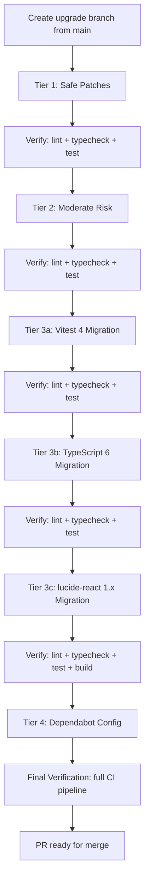

# Design Document: Pre-Deployment Dependency Upgrade

## Overview

This design covers a coordinated, tiered upgrade of all outdated npm dependencies on the Edeviser platform prior to production deployment. The upgrade is performed on a single branch (`chore/pre-deploy-deps-upgrade`) and follows a risk-tiered approach: safe patches first, then moderate-risk bumps, then major version upgrades one at a time. Each tier is verified (lint + typecheck + test) before proceeding to the next. The final step reconfigures Dependabot to security-only mode.

No database changes, no new features, no new components. This is purely a dependency and tooling upgrade with associated configuration migrations.

### Design Rationale

The tiered approach minimizes blast radius. If a safe patch breaks something, we catch it before layering on riskier changes. Major upgrades (Vitest 4, TypeScript 6, lucide-react 1.x) each have distinct migration surfaces and are isolated into their own steps so regressions can be attributed to a specific upgrade.

## Architecture

The upgrade does not change the application architecture. The existing stack remains:

- **Bundler**: Vite 6 (unchanged)
- **Framework**: React 18 (explicitly excluded from upgrade)
- **Test Runner**: Vitest 3 → 4 (major migration)
- **Compiler**: TypeScript 5.9 → 6.0 (major migration)
- **Icons**: lucide-react 0.575 → 1.x (major migration)
- **Property Testing**: fast-check 4.7 + @fast-check/vitest 0.3 → 0.4 (moderate risk)

## Components and Interfaces

### Tier 1: Safe Minor/Patch Updates

These are stable (≥1.0) packages with minor or patch bumps. No API changes expected.

| Package | Current | Target | Type |
|---------|---------|--------|------|
| @axe-core/react | 4.11.2 | ≥4.11.3 | devDep |
| @sentry/react | 10.49.0 | ≥10.51.0 | dep |
| @supabase/supabase-js | 2.104.0 | ≥2.105.1 | dep |
| @tanstack/react-query | 5.99.2 | ≥5.100.7 | dep |
| @tanstack/react-query-devtools | 5.99.2 | ≥5.100.7 | dep |
| @vercel/node | 5.6.20 | ≥5.7.15 | devDep |
| axe-core | 4.11.1 | ≥4.11.4 | devDep |
| globals | 17.5.0 | ≥17.6.0 | devDep |
| jsdom | 29.0.2 | ≥29.1.1 | devDep |
| react-hook-form | 7.73.1 | ≥7.74.0 | dep |
| typescript-eslint | 8.59.0 | ≥8.59.1 | devDep |

**Strategy**: Run `npm update` for each package or batch `npm install` with explicit version ranges. Verify with lint + typecheck + test after install.

### Tier 2: Moderate Risk Updates

These are pre-1.0 packages (where minor = breaking per semver) or packages with known API surface changes.

| Package | Current | Target | Risk Factor |
|---------|---------|--------|-------------|
| @fast-check/vitest | 0.3.0 | 0.4.x | Pre-1.0 minor bump; potential API changes to `test.prop` |
| react-i18next | 16.5.4 | 16.6.x | Minor bump with possible type changes |
| shadcn (CLI) | 3.8.5 | latest | CLI tool, not runtime; low runtime risk |

**@fast-check/vitest 0.3 → 0.4 Migration**:
- The `@fast-check/vitest` package wraps fast-check for Vitest integration. The 0.3→0.4 bump may change the `test.prop` API signature or configuration options.
- Strategy: Upgrade, run the full property test suite (`src/__tests__/properties/**`), and fix any API changes. The underlying `fast-check` 4.7 package itself is a patch-level update and should be stable.

**react-i18next 16.5 → 16.6 Migration**:
- Minor version bump within a stable major. Likely type refinements only.
- Strategy: Upgrade, run typecheck, verify i18n-related component tests pass.

**shadcn CLI**:
- This is a dev-time CLI tool for generating UI components. It does not affect runtime code.
- Strategy: Upgrade, verify `npm run build` succeeds.

### Tier 3a: Vitest 4 Migration

**Current**: vitest 3.2.4, @vitest/coverage-v8 3.2.4
**Target**: vitest 4.x, @vitest/coverage-v8 4.x

Key breaking changes from the [Vitest 4 migration guide](https://main.vitest.dev/guide/migration):

1. **Pool Rework**: `pool: 'forks'` still works, but `poolOptions` is removed. Top-level options replace nested pool config. The current config uses `pool: 'forks'` at the top level, which is fine. No `poolOptions` are used.

2. **Coverage Changes**:
   - `coverage.all` is removed (was not explicitly set in our config).
   - `coverage.extensions` is removed (was not used).
   - `coverage.include` should be explicitly defined. Our config already has `coverage.include: ['src/**/*.{ts,tsx}']` — no change needed.
   - V8 coverage uses new AST-based remapping. Coverage numbers may shift slightly. Thresholds may need adjustment.
   - `coverage.ignoreEmptyLines` is removed (not used).

3. **Test Options Position**: Providing test options as a third argument to `test()` is removed. Must use second argument. Need to audit test files for this pattern.

4. **Deprecated APIs Removed**: `poolMatchGlobs`, `environmentMatchGlobs`, `deps.external/inline/fallbackCJS` — none of these are used in our config.

5. **Simplified `exclude`**: Default excludes are reduced. Our config uses explicit `include` patterns, so this shouldn't affect us.

6. **Mock Changes**: `vi.fn().getMockName()` returns `vi.fn()` instead of `spy`. May affect snapshot tests that include mock names.

**Migration Steps**:
1. Update `vitest` and `@vitest/coverage-v8` to 4.x
2. Update `@vitejs/plugin-react` if needed for compatibility
3. Verify `vite.config.ts` test configuration — current config is compatible (no `poolOptions`, explicit `coverage.include`)
4. Run full test suite, fix any failures
5. Adjust coverage thresholds if V8 remapping changes numbers
6. Run `npm run test:coverage` to verify coverage report generation

### Tier 3b: TypeScript 6 Migration

**Current**: typescript 5.9.3
**Target**: typescript 6.x

Key breaking changes from the [TypeScript 6.0 announcement](https://devblogs.microsoft.com/typescript/announcing-typescript-6.0/):

1. **New Defaults** (most impactful):
   - `strict` defaults to `true` — our tsconfig already sets `"strict": true`, no impact.
   - `module` defaults to `esnext` — our tsconfig sets `"module": "ESNext"`, no impact.
   - `target` defaults to `es2025` — our tsconfig sets `"target": "ES2020"`, no impact (explicit value overrides default).
   - `rootDir` defaults to `.` — our tsconfig does NOT set `rootDir`, but we use `"noEmit": true` so this has no effect on output structure.
   - `types` defaults to `[]` — **this is the big one**. Our tsconfig does NOT set `"types"`. We need to add `"types": ["node"]` to avoid losing global type definitions from `@types/node`.

2. **Deprecated Options**:
   - `moduleResolution: "bundler"` — our tsconfig uses `"moduleResolution": "bundler"`, which is fine.
   - `baseUrl` is deprecated — our tsconfig does NOT use `baseUrl`. We use `paths` with `"@/*": ["src/*"]` which works without `baseUrl` since TS 4.1.
   - `esModuleInterop` and `allowSyntheticDefaultImports` can no longer be `false` — we don't set these, so the new always-true default is fine.

3. **Stricter Type Checking**: TS 6 may surface new type errors from improved inference. Strategy: run `npx tsc --noEmit`, fix any new errors.

**Migration Steps**:
1. Update `typescript` to 6.x
2. Add `"types": ["node"]` to `tsconfig.json` `compilerOptions`
3. Run `npx tsc --noEmit` and fix any new type errors
4. Verify ESLint with typescript-eslint remains compatible
5. Run full test suite

### Tier 3c: lucide-react 1.x Migration

**Current**: lucide-react 0.575.0
**Target**: lucide-react 1.x

Key changes in lucide-react 1.x:

1. **Icon Renames/Removals**: Some icons deprecated in 0.x are removed in 1.x. Brand icons (GitHub, Twitter, etc.) were removed earlier. Need to audit all icon imports in the codebase.

2. **Improved Tree-Shaking**: 1.x uses ESM-only exports with better tree-shaking. Should reduce bundle size.

3. **`aria-hidden` by default**: Icons now set `aria-hidden="true"` by default, which is the correct behavior for decorative icons.

4. **No UMD build**: Only ESM and CJS. Our Vite setup uses ESM, so no impact.

**Migration Steps**:
1. Update `lucide-react` to 1.x
2. Run `npx tsc --noEmit` to catch any import errors from renamed/removed icons
3. Fix any broken imports by mapping old icon names to 1.x equivalents
4. Run `npm run build` to verify production build succeeds
5. Check bundle size stays within 1200 KB budget

### Tier 4: Dependabot Configuration

Update `.github/dependabot.yml` to restrict npm updates to security-only PRs post-deployment.

**Changes**:
- Add `open-pull-requests-limit: 5` for npm (already present, keep as-is or reduce)
- Remove the `groups.production-dependencies` grouping for minor/patch updates
- Add `security-updates-only: true` or equivalent configuration to limit npm PRs to security advisories only
- Keep GitHub Actions monitoring on weekly schedule unchanged
- Retain all existing `ignore` rules for major version bumps on core tooling

### Security Remediation

- Run `npm audit` after all upgrades to verify zero high/critical vulnerabilities
- The uuid medium-severity vulnerability (missing buffer bounds check in v3/v5/v6) should be checked — if it's a transitive dependency that gets updated by the other upgrades, document the resolution; if not, document the risk assessment
- Target: reduce from current 7 GitHub security alerts to zero (or document remaining with mitigation)

## Data Models

No data model changes. This upgrade does not touch database schemas, migrations, RLS policies, or Edge Functions. The `src/types/database.ts` file is auto-generated and must not be modified.

## Error Handling

### Upgrade Failure Scenarios

| Scenario | Detection | Mitigation |
|----------|-----------|------------|
| Safe patch breaks tests | `npm test` fails after Tier 1 | Revert specific package, pin to current version, document in PR |
| @fast-check/vitest API change | Property tests fail after Tier 2 | Read changelog, update `test.prop` calls to match new API |
| Vitest 4 config incompatibility | Tests fail to start after Tier 3a | Consult migration guide, update `vite.config.ts` test block |
| Vitest 4 coverage threshold shift | `npm run test:coverage` fails | Adjust thresholds in `vite.config.ts` to match new V8 remapping |
| TypeScript 6 new type errors | `npx tsc --noEmit` reports errors | Fix type errors in source code; add `"types": ["node"]` to tsconfig |
| lucide-react icon removed/renamed | Build fails with import errors | Map old icon names to 1.x equivalents using lucide changelog |
| Bundle size exceeds budget | CI bundle-size job fails | Investigate with `npm run analyze`, check for duplicate dependencies |
| Peer dependency conflicts | `npm ci` warns about conflicts | Resolve by aligning versions or using `--legacy-peer-deps` as last resort |
| Security vulnerability persists | `npm audit` still reports issues | Document vulnerability, risk assessment, and mitigation strategy |

### Rollback Strategy

Each tier is committed separately. If a tier introduces unfixable regressions:
1. `git revert` the tier's commit(s)
2. Document the blocker in the PR description
3. Proceed with remaining tiers that don't depend on the reverted one

For major upgrades (Vitest 4, TypeScript 6, lucide-react 1.x), each is independent and can be reverted without affecting the others.

## Testing Strategy

### Why Property-Based Testing Does Not Apply

This spec is a dependency and configuration upgrade. There are no new pure functions, data transformations, parsers, serializers, or business logic being introduced. The acceptance criteria are entirely about:

- Specific dependency versions being installed (verifiable by inspecting `package.json` / `package-lock.json`)
- CI pipeline jobs passing (lint, typecheck, test, build, bundle size, security audit)
- Configuration files having correct content (`tsconfig.json`, `vite.config.ts`, `dependabot.yml`)
- Existing tests continuing to pass without regressions

These are all SMOKE, INTEGRATION, or EXAMPLE-type checks. No criterion varies meaningfully with random input, and no criterion tests new code logic. Property-based testing is not the right tool here.

### Verification Approach

The testing strategy is **tier-gated verification**: run the full existing test suite after each upgrade tier to catch regressions early.

#### Per-Tier Verification Commands

After each tier, run in order:

1. **Lint**: `npm run lint` — zero errors, zero warnings
2. **Typecheck**: `npx tsc --noEmit` — zero type errors
3. **Test**: `npm test` — all tests pass (currently 3624 tests across 338 files)
4. **Build** (Tiers 3c and final): `npm run build` — successful production build

#### Final Verification (after all tiers)

The full CI pipeline must pass on the upgrade branch:

| CI Job | What It Verifies |
|--------|-----------------|
| `lint` | ESLint passes with zero warnings |
| `typecheck` | TypeScript compiles with zero errors |
| `test` | All 3624+ tests pass with coverage |
| `build` | Production build succeeds |
| `bundle-size` | Total gzipped JS ≤ 1200 KB |
| `security-audit` | No high/critical vulnerabilities |
| `lockfile-check` | `npm ci` succeeds without drift |
| `lighthouse` | Lighthouse CI passes |
| `e2e` | Playwright tests pass (if backend available) |
| `sql-lint` | SQL migrations valid (unchanged) |

#### Coverage Threshold Adjustment

Vitest 4's new AST-based V8 coverage remapping may produce different coverage numbers than Vitest 3. If coverage thresholds fail after the Vitest 4 upgrade:

1. Run `npm run test:coverage` to see new numbers
2. Adjust thresholds in `vite.config.ts` to match the new baseline (within ±5% of current values)
3. Document the threshold change and reason in the PR

Current thresholds: statements 25%, branches 50%, functions 50%, lines 25%.

#### Existing Test Categories That Must Pass

- **Property-based tests** (`src/__tests__/properties/*.property.test.ts`): ~100+ property tests using fast-check with minimum 100 iterations each
- **Unit tests** (`src/__tests__/unit/*.test.ts`, `*.test.tsx`): Component tests, hook tests, utility tests
- **All 338 test files, 3624 tests**: Zero regressions allowed

### What Is NOT Tested

- E2E tests require a live Supabase backend and are skipped in CI when secrets are unavailable
- Lighthouse CI depends on build artifacts and is a post-build check
- Runtime behavior in production — this upgrade relies on the existing test suite as the correctness oracle
