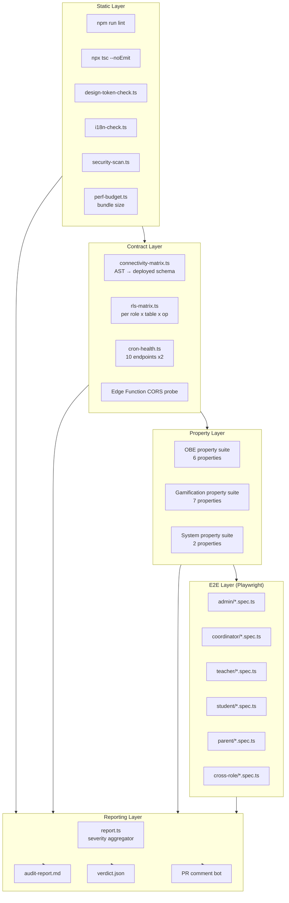
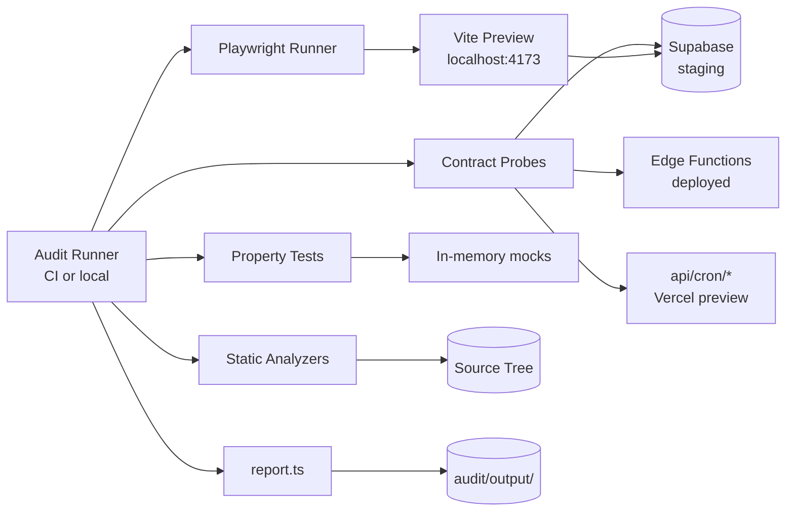
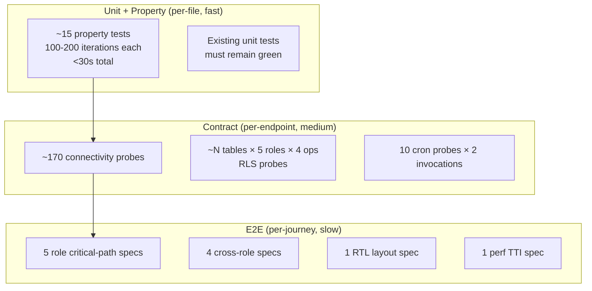
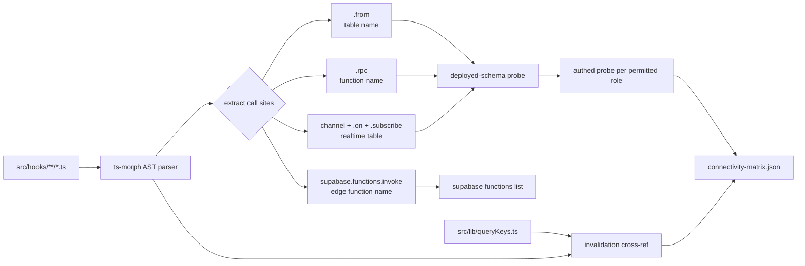
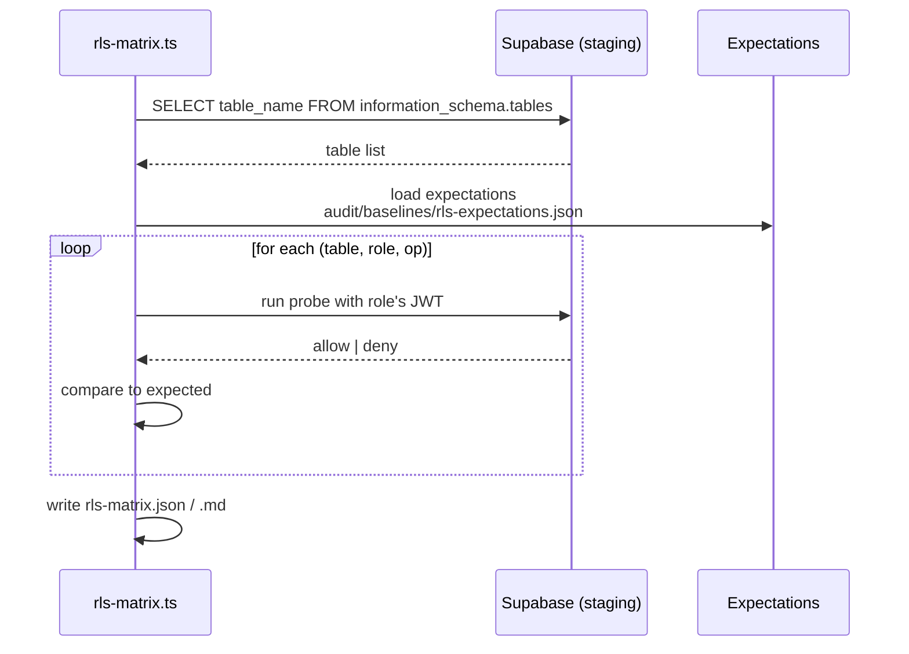
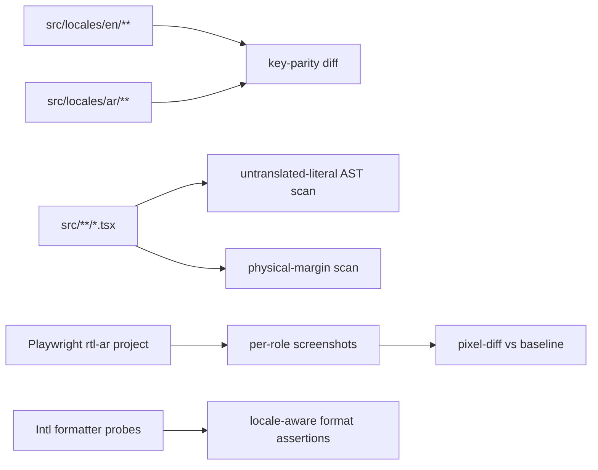
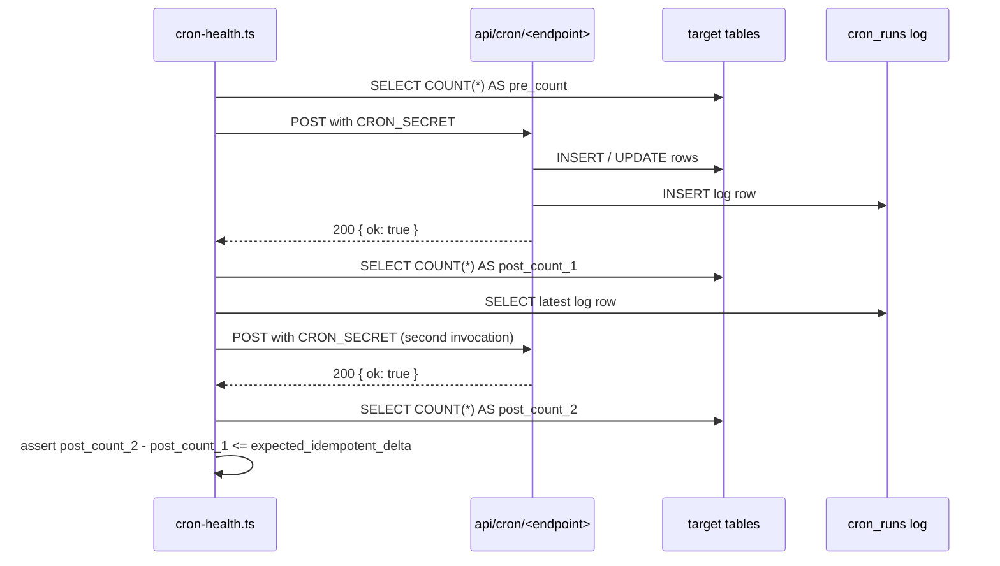
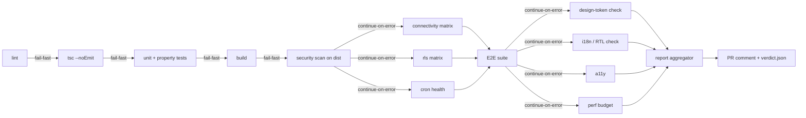

# Design Document: Pre-Deployment E2E Audit

## Overview

The **Pre-Deployment E2E Audit** is a release-readiness gate, not a product feature. Its deliverable is an executable, reproducible audit package that answers a single binary question — "is the composed Edeviser platform safe to deploy?" — for every one of the five application roles (Admin, Coordinator, Teacher, Student, Parent).

The audit is a layered verification pipeline. Each layer is independent, parallelizable where possible, and produces a machine-readable artifact that is aggregated into a human-readable `audit-report.md` with a Go / Go-with-backlog / No-Go verdict driven by the Severity_Ladder and Go_No_Go_Matrix defined in `requirements.md`.

### Deliverables

1. **E2E_Suite** — Playwright-driven browser tests, organized per Role and per cross-Role flow (Req 1, 2, 3, 6).
2. **Connectivity_Matrix** — a generated JSON + Markdown grid mapping every TanStack Query hook to its backend endpoint, RLS scope, and query-key invalidation (Req 4).
3. **RLS_Matrix** — a per-(table, role, operation) grid of positive and negative probes run against the deployed Supabase schema (Req 5).
4. **Property_Suite** — fifteen fast-check property-based tests validating the OBE and Gamification invariants enumerated in the requirements document (Req 7, 8, 15).
5. **Static Audit Scripts** — Design_Token_Checker, i18n/RTL checker, security/secret-boundary scan, performance budget scan (Req 9, 10, 11, 12, 13).
6. **Cron_Health_Probe** — 10 scheduled-endpoint invocations with idempotency verification (Req 15).
7. **Audit_Report** + **verdict.json** — the reviewable deliverable and its machine-readable twin (Req 16).
8. **CI Gate** — a GitHub Actions workflow that runs the entire pipeline and blocks deploy on failure (Req 17).

### Layers of the Audit Pipeline

| Layer     | Purpose                                                                | Typical runtime | Failure severity   |
| --------- | ---------------------------------------------------------------------- | --------------- | ------------------ |
| Static    | lint, tsc, design-token scan, i18n scan, bundle/secret scan            | seconds         | Major → Blocker    |
| Contract  | connectivity-matrix, RLS-matrix, cron-health, Edge-Function CORS probe | ~1–3 min        | Critical → Blocker |
| Property  | fast-check suites for OBE + Gamification + cron idempotency            | ~1–2 min        | Blocker            |
| E2E       | Playwright per-Role critical paths + cross-Role propagation            | ~8–15 min       | Critical           |
| Reporting | severity aggregator → `audit-report.md` + PR comment + `verdict.json`  | seconds         | —                  |

### Why This Design

The audit must **add files only**. It does not modify runtime code. This keeps its blast radius zero for the production bundle and lets the same pipeline run against any commit including historical ones for post-mortem re-runs.

Role coverage is the non-negotiable centerpiece. Every layer explicitly enumerates all five Roles; no layer is permitted to skip a Role on convenience grounds. The per-Role coverage matrix in §3 is the single source of truth that downstream artifacts (E2E specs, RLS matrix, report sections) derive from.

---

## Architecture

### Pipeline Overview



### Stage Ordering Rationale

Stages are ordered from cheapest-to-run + most-bug-dense to most-expensive:

1. **Static first.** Zero-infra, seconds to run, catches obvious regressions before paying for a Supabase probe.
2. **Contract next.** Confirms that the front-end and back-end are wired together before paying for a Playwright browser boot.
3. **Property tests.** Fast, deterministic, cover the irreducible domain correctness invariants.
4. **E2E last.** The most expensive stage; only worth running if the cheaper layers pass.
5. **Reporting consumes all.** Even if upstream layers fail, the reporter still aggregates partial artifacts so the report is actionable.

### Deployment-Layer Interactions



The audit targets a **staging** Supabase project with a dedicated `audit` institution. Production is never touched. Seed users are created once via a setup script and reused across runs; their data lives under a namespaced prefix for trivial teardown.

---

## Components and Interfaces

This section enumerates every script, test file, and configuration artifact that makes up the Audit_System. Every component below explicitly addresses the five Roles where Role-specific behavior exists.

### Audit Runner (entry point)

- **Location**: `scripts/audit/run.ts`
- **Responsibility**: orchestrates the pipeline stages listed in the Architecture diagram. Provides `--stage`, `--role`, `--skip`, `--incremental`, and `--env` flags.
- **CI invocation**: `npm run audit` (mapped to `tsx scripts/audit/run.ts --env=ci`).
- **Contract**: writes a manifest at `audit/output/manifest.json` describing the stages executed, their durations, and their output artifact paths.

### Playwright Runner (`playwright.config.ts`)

- **Projects**: five Role projects (`admin`, `coordinator`, `teacher`, `student`, `parent`) + one `cross-role` project + one `rtl-ar` project for Requirement 10.4.
- **Use**: `storageState` per Role pre-seeded by a global setup script that logs in each seed account once and persists the JWT.
- **Browsers**: Chromium primary; WebKit smoke pass for the Parent and Student roles only (mobile Safari is the dominant parent browser per analytics). Firefox deferred to keep CI time bounded.
- **Viewports**: `{ width: 1440, height: 900 }` desktop and `{ width: 390, height: 844 }` mobile (iPhone 13). Mobile viewport is required for Req 9.4 (44×44 touch targets).

### Connectivity Matrix Generator

- **Location**: `scripts/audit/connectivity-matrix.ts`
- **Inputs**: `src/hooks/**/*.ts`, `src/lib/queryKeys.ts`.
- **Outputs**: `audit/output/connectivity-matrix.json`, `audit/output/connectivity-matrix.md`.
- **Satisfies**: Requirement 4 (all sub-criteria).

### RLS Matrix Runner

- **Location**: `scripts/audit/rls-matrix.ts`
- **Inputs**: Supabase `information_schema.tables`, exclude list at `audit/baselines/rls-exclude.json` (internal-only tables like `schema_migrations`).
- **Outputs**: `audit/output/rls-matrix.json`, `audit/output/rls-matrix.md`.
- **Satisfies**: Requirement 5 (all sub-criteria).

### Cron Health Probe

- **Location**: `scripts/audit/cron-health.ts`
- **Inputs**: enumerates `api/cron/*.ts` dynamically (currently 10 endpoints — no hard-coded list) and reads `CRON_SECRET` from env.
- **Outputs**: `audit/output/cron-health.json`.
- **Satisfies**: Requirement 15.

### Design Token Checker

- **Location**: `scripts/audit/design-token-check.ts`
- **Inputs**: `src/components/**/*.tsx`, `src/pages/**/*.tsx`.
- **Outputs**: `audit/output/design-token-findings.json`.
- **Satisfies**: Requirement 9 (sub-criteria 1–3, 7, 8).

### i18n / RTL Checker

- **Location**: `scripts/audit/i18n-check.ts` + Playwright spec `tests/e2e/rtl/layout.spec.ts`.
- **Inputs**: `src/locales/en/**`, `src/locales/ar/**`, `src/**/*.{ts,tsx}`.
- **Outputs**: `audit/output/i18n-findings.json`, screenshots under `audit/output/rtl-screens/` + pixel-diff JSON.
- **Satisfies**: Requirement 10.

### Accessibility Baseline

- **Location**: `tests/e2e/_helpers/axe.ts` invoked from each Role spec.
- **Outputs**: per-page axe violations aggregated into `audit/output/a11y-findings.json`.
- **Satisfies**: Requirement 11.

### Security & Secret-Boundary Scan

- **Location**: `scripts/audit/security-scan.ts`.
- **Inputs**: built bundle under `dist/`, `.env` allowlist at `audit/baselines/vite-env.allowlist.json`, `src/pages/**/*.tsx`, `supabase/functions/**/*.ts` (if present).
- **Outputs**: `audit/output/security-findings.json`.
- **Satisfies**: Requirement 13 (and Req 14 sub-criterion 1 via Sentry init probe).

### Performance Budget

- **Location**: `scripts/audit/perf-budget.ts` + Playwright spec `tests/e2e/perf/tti.spec.ts`.
- **Inputs**: Vite build stats, `audit/baselines/bundle.json`, `audit/baselines/tti.json`.
- **Outputs**: `audit/output/perf-findings.json`.
- **Satisfies**: Requirement 12.

### Report Aggregator

- **Location**: `scripts/audit/report.ts`.
- **Inputs**: every artifact under `audit/output/*.json`.
- **Outputs**: `audit/output/audit-report.md`, `audit/output/verdict.json`.
- **Satisfies**: Requirement 16.

### Per-Role Test Helpers

Every Role has a matching helper module under `tests/e2e/_helpers/`:

| Role        | Helper                  | Responsibilities                                                                          |
| ----------- | ----------------------- | ----------------------------------------------------------------------------------------- |
| Admin       | `adminHelpers.ts`       | ILO create, user create, audit-log assertions, Bonus XP Event create                      |
| Coordinator | `coordinatorHelpers.ts` | PLO create, PLO↔ILO mapping, curriculum-matrix assertions, CQI action-plan lookup         |
| Teacher     | `teacherHelpers.ts`     | Course open, CLO create with Bloom, assignment create, grade submit, grade release        |
| Student     | `studentHelpers.ts`     | Learning-path open, assignment submit, XP/streak read, leaderboard read                   |
| Parent      | `parentHelpers.ts`      | Linked-child select, progress read, XP/attainment summary read, notification feed read    |
| Cross-Role  | `crossRoleHelpers.ts`   | Propagation waits (grade→XP, mute→leaderboard, Bonus XP window, parent link verification) |

### Fixture Endpoint (Edge Function)

- **Location**: `supabase/functions/audit-fixtures/index.ts` (created by this spec's task list, not yet present).
- **Gating**: only enabled when `ENV_ID == 'audit-staging'`; rejects every request in any other environment.
- **Endpoints**:
  - `POST /seed` — provisions the five seed accounts, a linked Parent-Student pair, an unlinked Parent, a seeded ILO→PLO→CLO chain with mapping weights summing to 100, a seeded assignment with a prerequisite gate, and a rubric.
  - `POST /teardown` — truncates rows in the audit namespace only.
  - `POST /event/bonus-xp` — creates a time-bounded Bonus XP Event for Req 3.4.

---

## Data Models

The audit does not introduce new runtime tables. It **reads** every table and it **writes only** to:

1. `audit_runs` — one row per audit execution with the commit SHA, migration head, timestamp, env id, and verdict.
2. `audit_findings` — one row per finding linked to `audit_runs.id`, severity, requirement id, reproduction payload.

Both are append-only and scoped to the `audit` institution. They are optional: the audit works without these tables by writing to filesystem only, but when present they enable historical trend analysis.

### Artifact Schemas

#### `audit/output/manifest.json`

```jsonc
{
  "runId": "uuid",
  "commitSha": "string",
  "migrationHead": "string",
  "envId": "audit-staging | ci | local",
  "startedAt": "ISO-8601",
  "finishedAt": "ISO-8601",
  "stages": [
    {
      "name": "lint",
      "durationMs": 0,
      "status": "passed | failed | skipped",
      "artifact": "path"
    }
  ]
}
```

#### `audit/output/connectivity-matrix.json`

```jsonc
{
  "generatedAt": "ISO-8601",
  "hooks": [
    {
      "file": "src/hooks/useAssignments.ts",
      "exportedName": "useAssignmentList",
      "kind": "query | mutation | subscription",
      "target": {
        "type": "table | rpc | edge-function",
        "name": "assignments"
      },
      "queryKeyPath": "queryKeys.assignment.list",
      "invalidates": ["queryKeys.assignment.lists"],
      "deployed": true,
      "corsOk": true,
      "authedOk": true
    }
  ],
  "orphans": [],
  "missingBackends": [],
  "missingInvalidations": []
}
```

#### `audit/output/rls-matrix.json`

```jsonc
{
  "generatedAt": "ISO-8601",
  "tables": [
    {
      "table": "assignments",
      "appendOnly": false,
      "probes": [
        {
          "role": "admin",
          "op": "SELECT",
          "expected": "allow",
          "actual": "allow",
          "passed": true
        },
        {
          "role": "admin",
          "op": "UPDATE",
          "expected": "allow",
          "actual": "allow",
          "passed": true
        },
        {
          "role": "coordinator",
          "op": "SELECT",
          "expected": "allow",
          "actual": "allow",
          "passed": true
        },
        {
          "role": "teacher",
          "op": "INSERT",
          "expected": "allow",
          "actual": "allow",
          "passed": true
        },
        {
          "role": "student",
          "op": "UPDATE",
          "expected": "deny",
          "actual": "deny",
          "passed": true
        },
        {
          "role": "parent",
          "op": "SELECT",
          "expected": "deny",
          "actual": "deny",
          "passed": true
        }
      ]
    }
  ],
  "summary": {
    "byRole": { "admin": { "pass": 0, "fail": 0 } }
  }
}
```

#### `audit/output/verdict.json`

```jsonc
{
  "verdict": "Go | Go-with-backlog | No-Go",
  "severityCounts": {
    "Blocker": 0,
    "Critical": 0,
    "Major": 0,
    "Minor": 0,
    "Trivial": 0
  },
  "waivers": [],
  "commitSha": "string",
  "migrationHead": "string",
  "envId": "string",
  "producedAt": "ISO-8601"
}
```

### Role Model

The audit reuses `UserRole` from `src/types/app`:

```typescript
type UserRole = "admin" | "coordinator" | "teacher" | "student" | "parent";
```

Seed accounts map 1:1 to this union. The audit does not introduce new roles or subtypes.

### Seed Data Model (for fixture endpoint)

```typescript
interface AuditSeed {
  institution: { id: "audit-inst"; name: "Audit Institution" };
  users: {
    admin: { email: "audit+admin@edeviser.test"; role: "admin" };
    coordinator: {
      email: "audit+coordinator@edeviser.test";
      role: "coordinator";
    };
    teacher: { email: "audit+teacher@edeviser.test"; role: "teacher" };
    student: { email: "audit+student@edeviser.test"; role: "student" };
    parentLinked: {
      email: "audit+parent-linked@edeviser.test";
      role: "parent";
      linkedTo: "student";
      verified: true;
    };
    parentUnlinked: {
      email: "audit+parent-unlinked@edeviser.test";
      role: "parent";
      linkedTo: null;
    };
  };
  outcomes: {
    ilo: { id: "audit-ilo-1"; institutionId: "audit-inst" };
    plo: {
      id: "audit-plo-1";
      programId: "audit-prog-1";
      mappingsToIlo: [{ parentId: "audit-ilo-1"; weight: 100 }];
    };
    clo: {
      id: "audit-clo-1";
      courseId: "audit-course-1";
      bloom: "Applying";
      mappingsToPlo: [{ parentId: "audit-plo-1"; weight: 100 }];
    };
  };
  assessment: {
    assignmentId: "audit-assign-1";
    cloIds: ["audit-clo-1"];
    rubric: { criteria: [{ id: "c1"; weight: 100 }] };
    prerequisite: { cloId: "audit-clo-0"; gatePercentage: 60 };
  };
  namespacePrefix: "audit-";
}
```

---

## Test Pyramid and Coverage Map

This is the audit's single source of truth for Role coverage. Every other artifact (E2E specs, RLS matrix, i18n/RTL screens, a11y scans, Playwright projects) derives its per-Role work from this grid.

### Per-Role Coverage Matrix

| Role            | Critical Path (→ Req 1.x)                                                                                                         | RLS Scope                                                                                                                                                        | Realtime Channels                                                                               | Cron Touchpoints                                                                  | i18n Pages Audited                                                             | A11y Pages Audited                                       |
| --------------- | --------------------------------------------------------------------------------------------------------------------------------- | ---------------------------------------------------------------------------------------------------------------------------------------------------------------- | ----------------------------------------------------------------------------------------------- | --------------------------------------------------------------------------------- | ------------------------------------------------------------------------------ | -------------------------------------------------------- |
| **Admin**       | login → create/edit ILO → create/edit user → institution dashboard → review audit log → logout (Req 1.2)                          | SELECT/INSERT/UPDATE/DELETE across all institution-scoped tables; UPDATE/DELETE denied on `evidence`, `audit_logs`, `xp_transactions`                            | `audit_logs` (INSERT), `users` (INSERT)                                                         | `ai-at-risk-prediction`, `compute-at-risk`, `fee-overdue-check`, `weekly-summary` | Dashboard, Users list, ILO form, Audit-log viewer                              | Dashboard, Users list, ILO form                          |
| **Coordinator** | login → create/edit PLO → map PLO→ILO → curriculum matrix → open CQI action plan → logout (Req 1.3)                               | SELECT on programs, plo, clo, outcome_mappings, curriculum_matrix; INSERT/UPDATE on plo, outcome_mappings, cqi_action_plans; append-only denied as above         | `outcome_mappings` (INSERT), `cqi_action_plans` (UPDATE)                                        | `compute-at-risk`, `weekly-summary`                                               | Dashboard, PLO form, Curriculum matrix, CQI list                               | Dashboard, PLO form, Curriculum matrix                   |
| **Teacher**     | login → open course → create CLO with Bloom → create assignment linking CLO → grade submission → release grade → logout (Req 1.4) | SELECT on own courses, students in own courses; INSERT/UPDATE on clo, assignments, grades; INSERT-only on evidence                                               | `submissions` (INSERT filtered by course_id), `grades` (UPDATE filtered by course_id)           | `notification-digest`, `exam-period-notify`                                       | Dashboard, CLO form, Assignment form, Grading page                             | Dashboard, CLO form, Assignment form, Grading page       |
| **Student**     | login → learning path → submit assignment → view XP → view streak → view leaderboard → logout (Req 1.5)                           | SELECT on own enrollments, own grades, own evidence, own xp_transactions, public leaderboard (opt-out respected); INSERT on own submissions, own journal entries | `xp_transactions` (INSERT filtered by student_id), `notifications` (INSERT filtered by user_id) | `streak-reset`, `streak-risk`, `perfect-day-prompt`, `leaderboard-refresh`        | Dashboard, Learning path, Assignment submit, XP page, Streak page, Leaderboard | Dashboard, Learning path, Assignment submit, Leaderboard |
| **Parent**      | login → linked child progress → XP + attainment summary → notification feed → logout (Req 1.6)                                    | SELECT on linked student data only when `parent_student_links.verified = true`; all other student data denied                                                    | `notifications` (INSERT filtered by user_id)                                                    | `notification-digest`, `weekly-summary`                                           | Dashboard, Child progress, Notifications                                       | Dashboard, Child progress                                |

### Cross-Role Coverage (→ Req 3.x)

| Flow                                  | Initiator   | Observer                                       | Propagation bound                          | Requirement |
| ------------------------------------- | ----------- | ---------------------------------------------- | ------------------------------------------ | ----------- |
| Grade-release → Student XP/attainment | Teacher     | Student                                        | ≤ 1 minute                                 | 3.1         |
| Progress visibility via linked parent | Student     | Linked Parent (allow) / Unlinked Parent (deny) | immediate on page load                     | 3.2         |
| PLO availability for CLO mapping      | Coordinator | Teacher                                        | immediate (same session refetch)           | 3.3         |
| Bonus XP Event multiplier             | Admin       | Student submission within event window         | immediate (written XP = base × multiplier) | 3.4         |

### Test-Pyramid Budget



**Wall-time budget (CI):** lint+tsc 60s, property suite 30s, contract layer 3 min, E2E layer 12 min, static scans 30s, reporting 10s → **~16 min end to end**. This fits inside the existing GitHub Actions job cap.

---

## E2E Test Suite Design (Playwright)

### Directory Layout

```
tests/e2e/
├── _fixtures/
│   ├── seed.ts                 # POSTs to audit-fixtures Edge Function
│   ├── teardown.ts             # POSTs to audit-fixtures teardown
│   └── storage-states/         # gitignored; produced by global setup
│       ├── admin.json
│       ├── coordinator.json
│       ├── teacher.json
│       ├── student.json
│       └── parent.json
├── _helpers/
│   ├── auth.ts                 # storageState loader, role-claim asserter
│   ├── adminHelpers.ts
│   ├── coordinatorHelpers.ts
│   ├── teacherHelpers.ts
│   ├── studentHelpers.ts
│   ├── parentHelpers.ts
│   ├── crossRoleHelpers.ts
│   ├── axe.ts                  # axe-core injection + violation collector
│   └── propagation.ts          # poll-with-timeout utility for Req 3.x
├── admin/
│   ├── critical-path.spec.ts
│   ├── ilo-crud.spec.ts
│   ├── audit-log.spec.ts
│   └── a11y-dashboard.spec.ts
├── coordinator/
│   ├── critical-path.spec.ts
│   ├── plo-mapping.spec.ts
│   ├── curriculum-matrix.spec.ts
│   ├── cqi.spec.ts
│   └── a11y-dashboard.spec.ts
├── teacher/
│   ├── critical-path.spec.ts
│   ├── clo-bloom.spec.ts
│   ├── assignment-create.spec.ts
│   ├── grade-release.spec.ts
│   └── a11y-dashboard.spec.ts
├── student/
│   ├── critical-path.spec.ts
│   ├── learning-path.spec.ts
│   ├── submit-assignment.spec.ts
│   ├── xp-and-streak.spec.ts
│   ├── leaderboard-opt-out.spec.ts
│   └── a11y-dashboard.spec.ts
├── parent/
│   ├── critical-path.spec.ts
│   ├── linked-child.spec.ts
│   ├── unlinked-denied.spec.ts
│   └── a11y-dashboard.spec.ts
├── cross-role/
│   ├── teacher-to-student.spec.ts
│   ├── student-to-parent.spec.ts
│   ├── coordinator-to-teacher.spec.ts
│   └── admin-bonus-xp.spec.ts
├── rtl/
│   └── layout.spec.ts
└── perf/
    └── tti.spec.ts
```

### Per-Role Spec File Coverage

Each bullet maps to one acceptance criterion in requirements.md. The ordering mirrors the Critical_Path definition.

**Admin (`tests/e2e/admin/critical-path.spec.ts`) → Req 1.2, 13.5, 14.3**

1. Load `/login`, sign in with `audit+admin@edeviser.test`, verify redirect to `/admin/dashboard`.
2. Navigate to ILO list, open create form, submit a new ILO with a unique namespaced title, assert list contains it.
3. Navigate to Users list, create a user with role `teacher`, assert audit_logs row written with `performed_by = admin.id`.
4. Open the institution dashboard, assert KPI cards render non-zero values (seed guarantees this).
5. Open audit-log viewer, assert the row created in step 3 is visible.
6. Sign out; verify redirect to `/login`.

**Coordinator (`tests/e2e/coordinator/critical-path.spec.ts`) → Req 1.3**

1. Sign in as coordinator; verify redirect.
2. Create a PLO under `audit-prog-1`; submit.
3. Open PLO mapping dialog; map to ILO `audit-ilo-1` with weight 100; submit.
4. Navigate to curriculum matrix; assert new PLO row is present.
5. Open CQI action plans list; open one action plan; assert detail renders.
6. Sign out.

**Teacher (`tests/e2e/teacher/critical-path.spec.ts`) → Req 1.4, 7.6**

1. Sign in as teacher; verify redirect.
2. Open course `audit-course-1`.
3. Create a CLO with Bloom = `Applying`; assert exactly one Bloom badge renders (Req 7.6 surface check; the property suite proves the invariant).
4. Create an assignment linking `audit-clo-1`; submit.
5. Open the grading queue; grade the seed student's submission; release the grade.
6. Sign out.

**Student (`tests/e2e/student/critical-path.spec.ts`) → Req 1.5, 8.7**

1. Sign in as student; verify redirect.
2. Open learning path; assert ordered by Bloom (Remembering → Creating).
3. Submit the seed assignment.
4. Open XP page; assert xp_total matches xp_transactions sum (Req 8.1 surface check).
5. Open streak page; assert streak value.
6. Open leaderboard; assert student's own position is visible; toggle opt-out; reload; assert self-row is anonymized for peer students (Req 8.7).
7. Sign out.

**Parent (`tests/e2e/parent/critical-path.spec.ts`) → Req 1.6, 5.6**

1. Sign in as linked parent; verify redirect.
2. Select linked child; assert progress renders.
3. Open XP + attainment summary.
4. Open notification feed.
5. Sign out.
6. Sign in as unlinked parent; navigate to the same child URL; assert access denied (Req 5.6).

### Cross-Role Specs → Req 3.x

- **`teacher-to-student.spec.ts`** (Req 3.1): Teacher session releases a grade → Student session (opened in parallel Playwright context) polls the XP page every 5s up to 60s; asserts `xp_total` increased by the base-schedule amount and attainment for the target CLO rose.
- **`student-to-parent.spec.ts`** (Req 3.2): Student submits assignment → linked Parent sees progress update within 60s; unlinked Parent in a third context asserts the child endpoint returns 403.
- **`coordinator-to-teacher.spec.ts`** (Req 3.3): Coordinator creates a PLO → Teacher session (opened immediately after) refetches the CLO-mapping target list and asserts the new PLO is selectable.
- **`admin-bonus-xp.spec.ts`** (Req 3.4): Admin creates a Bonus XP Event with multiplier 2 covering the next 5 minutes → Student submits an assignment → asserts `xp_transactions.amount == base × 2`.

### Test-Data Seeding Strategy

- **Seed endpoint**: `supabase/functions/audit-fixtures/seed` (Edge Function).
- **Per-run namespace**: every created entity has an `audit-<runId>-` prefix on its primary key so parallel runs do not collide.
- **Teardown hook**: a Playwright `globalTeardown` calls `audit-fixtures/teardown` which truncates by namespace prefix.
- **Idempotent seed**: the seed endpoint is safe to re-invoke; it uses `upsert` for the fixed seed users and only inserts new namespaced rows.

### Authentication Strategy

- **One test user per Role** at the fixed emails listed in §Data Models.
- **JWT injection via `storageState`**: a Playwright `globalSetup` logs each Role in once, captures the authenticated `storageState` to disk, and each spec's `use.storageState` loads the matching file.
- **Role-claim verification**: `tests/e2e/_helpers/auth.ts::assertRoleClaim(page, expectedRole)` decodes the JWT from the Supabase auth cookie and asserts the `role` claim matches (Req 6.2). Called once per spec's first navigation.
- **Password provisioning fallback**: if password provisioning is blocked in staging, the fixture endpoint exposes `POST /impersonate` that returns a magic-link-style signed JWT for each seed Role. This is the only impersonation surface and it is gated by `ENV_ID == 'audit-staging'`.

### Browser and Viewport Matrix

| Project                     | Browser  | Viewport                              | Locale | dir | prefers-reduced-motion |
| --------------------------- | -------- | ------------------------------------- | ------ | --- | ---------------------- |
| admin, coordinator, teacher | Chromium | 1440×900                              | en     | ltr | reduce (Req 9.5)       |
| student                     | Chromium | 390×844 (mobile) + 1440×900 (desktop) | en     | ltr | reduce                 |
| parent                      | WebKit   | 390×844 (mobile Safari)               | en     | ltr | reduce                 |
| cross-role                  | Chromium | 1440×900                              | en     | ltr | reduce                 |
| rtl-ar                      | Chromium | 1440×900                              | ar     | rtl | reduce                 |

`prefers-reduced-motion: reduce` is set via `playwright.config.ts` `use.contextOptions.reducedMotion = 'reduce'`. This lets us assert that the six custom keyframes (`shimmer`, `xp-pulse`, `badge-pop`, `float`, `streak-flame`, `fade-in-up`) are actually disabled by the CSS media query (Req 9.5).

---

## Connectivity Matrix Generator

### Problem

The app contains approximately 170 TanStack Query hooks. Manually mapping them to backend endpoints is intractable and becomes stale immediately. The audit must enumerate them automatically.

### Algorithm



### Implementation Details

1. **AST parse with `ts-morph`** (already a transitive dep). Walk every `CallExpression` in `src/hooks/**/*.ts`.
2. **Extractors:**
   - `.from('<table>')` → `{ type: 'table', name: '<table>' }`
   - `.rpc('<fn>')` → `{ type: 'rpc', name: '<fn>' }`
   - `supabase.functions.invoke('<name>')` → `{ type: 'edge-function', name: '<name>' }`
   - `supabase.channel(...).on(..., { table: '<t>' }, ...)` → records a subscription on `<t>` with the filter clause (for Req 12.4 check).
3. **Invalidation cross-ref:** for each `useMutation` hook, walk its `onSuccess` body for `queryClient.invalidateQueries({ queryKey: queryKeys.X.Y })` and record the invalidated keys. Join against `src/lib/queryKeys.ts` to confirm each referenced path exists.
4. **Deployed-schema probe:** `information_schema.tables` for table names; Supabase MCP `list_edge_functions` (or a staging-only REST call) for edge functions. Flag missing targets as Critical (Req 4.7).
5. **Authenticated probe:** for each hook, determine the "permitted role" from the hook's file path (`src/hooks/admin*.ts` → admin, `src/hooks/teacher*.ts` → teacher, etc.) or from a `@audit-role` JSDoc annotation if ambiguous. Use the Role's pre-seeded `storageState` JWT and issue an `OPTIONS` + minimal `GET` to confirm CORS + auth (Req 4.2, 4.5).
6. **Parallelism:** probes are issued in batches of 20 with a 30s timeout per batch. A cache at `audit/output/.cache/connectivity-probe-cache.json` is consulted first and entries are invalidated when the migration head changes, keeping incremental runs under 30s.
7. **Scaling plan (170 → 500+ hooks):** the parallel batch strategy + migration-keyed cache keeps this sub-linear in practice. Once the hook count crosses 300, we will add a sharded mode where `--shard=1/4` runs a quarter of hooks per CI job in parallel.

### Output

- `audit/output/connectivity-matrix.json` matching the schema in §Data Models.
- `audit/output/connectivity-matrix.md` — a per-hook table with columns: File, Hook, Target, Role(s), CORS, Auth, QueryKey, Invalidates.

### Most Likely Breakage Points This Will Surface

- Hooks referencing a renamed table after a migration (common after `supabase migration fetch`).
- Mutations whose `onSuccess` no longer invalidates a query key that moved under a rename.
- Edge Functions deleted from staging but still invoked by a hook.
- Subscriptions without a filter (Req 12.4 violation).
- Hooks pointing at an RPC that was refactored to an Edge Function or vice versa.

---

## RLS Matrix Runner

### Responsibility

For every `(table, role, operation)` triple, run one positive and one negative probe using a Supabase client authenticated as a per-Role seed user and assert the actual outcome matches the expected policy.

### Algorithm



### Probes per `(table, role, op)`

- **SELECT positive:** `SELECT id FROM <table> LIMIT 1` must return ≥ 1 row when the table has a seeded row visible to the role.
- **SELECT negative:** `SELECT id FROM <table> WHERE id = '<row-the-role-should-not-see>' LIMIT 1` must return 0 rows.
- **INSERT positive:** `INSERT INTO <table> (...) VALUES (...) RETURNING id` must succeed; the row is then deleted with a service-role client.
- **INSERT negative:** the same insert issued by a role without write permission must return an RLS error (Postgres error code `42501`).
- **UPDATE / DELETE:** analogous; for append-only tables (`evidence`, `audit_logs`, `xp_transactions`) UPDATE and DELETE are **deny for every role including Admin** (Req 5.5).
- **Parent linkage:** a dedicated probe set runs `SELECT` on student-owned tables with (a) the linked Parent JWT and (b) the unlinked Parent JWT. The former must return the student's row; the latter must return zero rows (Req 5.6).

### Expectations File

`audit/baselines/rls-expectations.json` holds the expected matrix. On first run, it is seeded from a schema analyzer that reads the `CREATE POLICY` statements in `supabase/migrations/`. Subsequent runs diff expectations against actual — a diff is surfaced in the report and must be updated deliberately (not auto-synced).

### Append-Only Tables

```jsonc
{
  "appendOnly": ["evidence", "audit_logs", "xp_transactions"],
  "denyUpdateDeleteAllRoles": true
}
```

These three tables have a dedicated test block that loops over all five roles (including Admin) and asserts UPDATE/DELETE produces the RLS error.

### Output

- `audit/output/rls-matrix.json` per the schema in §Data Models.
- `audit/output/rls-matrix.md` pivoted as a `role × table` grid with `✅` / `❌` / `➖` cells and a per-Role pass/fail summary.

### Most Likely Breakage Points

- New table added without an RLS policy (policies missing → `deny` becomes `allow`).
- Parent linkage policy regressed to `true` during a copy-paste migration.
- Admin accidentally granted UPDATE on `audit_logs` in a migration.
- Student able to read a peer's `xp_transactions` after a policy edit.

---

## Correctness Properties

_A property is a characteristic or behavior that should hold true across all valid executions of a system — essentially, a formal statement about what the system should do. Properties serve as the bridge between human-readable specifications and machine-verifiable correctness guarantees._

Property-based testing applies here to the **pure domain-logic layer** of the audit: the OBE attainment engine, the gamification engine, the cron body reducers, and the severity-to-verdict function. It does **not** apply to the contract layer (RLS probes, connectivity probes, cron HTTP probes), the E2E layer (real browser journeys), or the static scanners — those are integration/smoke tests per the `requirements.md` prework analysis.

Every property below is implemented once with fast-check, minimum 100 iterations (200 for security-sensitive properties 2 and 13). Each test file carries a tag of the form:

```typescript
// Feature: pre-deployment-e2e-audit, Property N: <property text>
```

### OBE Properties

### Property 1: Outcome-mapping weights sum to 100

_For any_ generated valid outcome tree (a set of children each mapped to one or more parents with weights in `[0, 100]`), the sum of weights for each child's mappings equals exactly 100 after construction, and this invariant is preserved through any sequence of exposed rebalance operations.

**Validates: Requirements 7.1, Correctness Property 1**

### Property 2: Evidence records are immutable

_For any_ generated sequence of write operations (INSERT, UPDATE, DELETE) against the evidence data layer, the set of rows returned is monotonically non-shrinking and every returned row satisfies `updated_at == created_at`. UPDATE and DELETE attempts must surface as rejections, never as silent success.

**Validates: Requirements 7.2, Correctness Property 2**

### Property 3: Attainment cascade consistency

_For any_ generated (student, valid outcome mapping tree, grade sequence), the cascade function produces CLO, PLO, and ILO attainment values equal to the reference weighted-average implementation applied over the same inputs. The reference implementation is intentionally naive and serves as the oracle.

**Validates: Requirements 7.3, Correctness Property 3**

### Property 4: Attainment classifier is total and deterministic

_For any_ percentage `p` in `[0, 100]`, the classifier returns exactly one label from `{Excellent, Satisfactory, Developing, Not_Yet}`; repeated calls with the same `p` return the same label (determinism); no `p` in `[0, 100]` returns `undefined` or throws (totality).

**Validates: Requirements 7.4, Correctness Properties 4 and 15**

### Property 5: Prerequisite gate enforcement

_For any_ generated (student state, assignment with a prerequisite CLO and gate percentage), the `canSubmit` function returns `true` if and only if the student's attainment on the prerequisite CLO is greater than or equal to the gate percentage.

**Validates: Requirements 7.5, Correctness Property 5**

### Property 6: Single Bloom level per CLO

_For any_ CLO produced by the CLO constructor or loaded from the schema, exactly one of the six Bloom levels is set — never zero, never more than one.

**Validates: Requirements 7.6, Correctness Property 6**

### Gamification Properties

### Property 7: XP ledger sum identity

_For any_ generated sequence of XP-awarding events for a single student, the computed `xp_total` equals the arithmetic sum of the `amount` field over every row in `xp_transactions` for that student. No event may be lost, duplicated, or silently aggregated.

**Validates: Requirements 8.1, Correctness Property 7**

### Property 8: Bonus XP multiplier application

_For any_ generated (source type, event timestamp, set of active Bonus XP Events), the XP amount written to `xp_transactions` equals the base schedule amount for that source type multiplied by the multiplier of the Bonus XP Event whose time window contains the timestamp, or multiplied by `1` when no event applies.

**Validates: Requirements 8.2, Correctness Property 8**

### Property 9: Level formula consistency

_For any_ cumulative XP value `xp` in the bounded range `[0, 10_000_000]`, `level(xp)` is monotonically non-decreasing in `xp`, satisfies the known anchors `level(0) = 1`, `level(100) = 2`, `level(250) = 3`, and agrees with the progressive formula `XP = 50 × N^1.5` within a documented rounding tolerance.

**Validates: Requirements 8.3, Correctness Property 9**

### Property 10: Streak state machine correctness

_For any_ generated login timeline (a sequence of per-day login booleans) and _any_ sequence of Streak Freeze applications consistent with the inventory rules, the streak reducer output equals the reference model's output: increments on daily first login, resets to zero on an unfrozen skipped day, and preserves the prior streak on a frozen skipped day.

**Validates: Requirements 8.4, Correctness Property 10**

### Property 11: Badge awards are idempotent

_For any_ generated qualifying state `s`, the set of badge rows produced by `awardBadges(s)` equals the set produced by `awardBadges(awardBadges(s))`. Repeated evaluation must not create duplicate `(student, badge)` pairs.

**Validates: Requirements 8.5, Correctness Property 11**

### Property 12: Perfect Day gating

_For any_ generated per-day habit timeline (timestamps for Login, Submit, Journal, Read) and _any_ IANA timezone, `isPerfectDay(timeline, tz)` returns `true` if and only if all four habits have timestamps strictly before the timezone's midnight for the same calendar day.

**Validates: Requirements 8.6, Correctness Property 12**

### Property 13: Leaderboard opt-out privacy

_For any_ generated set of students with random opt-out assignments and _any_ of the leaderboard rendering shapes (public view, course view, peer milestone notification payload, Edge Function JSON output), no opted-out student's display name or identifier appears in the rendered output.

**Validates: Requirements 8.7, Correctness Property 13**

### System Properties

### Property 14: Cron idempotency

_For any_ cron endpoint `e` in the set of 10 endpoints, extracted as a pure reducer `applyCron(state, input) → state'`, and _any_ generated input payload consistent with the endpoint's schema, `applyCron(applyCron(state, input), input)` equals `applyCron(state, input)` — running the cron body twice with the same input produces the same side-effect set as running it once.

**Validates: Requirements 15.3, Correctness Property 14**

### Property 15: Severity-to-verdict function

_For any_ generated finding-count vector `(blocker, critical, major, minor, trivial)` with non-negative integers and _any_ set of waivers, `severityToVerdict(counts, waivers)` returns exactly one of `{"Go", "Go-with-backlog", "No-Go"}`, and the returned verdict is the one specified by the Go_No_Go_Matrix in `requirements.md` §Definition of Done.

**Validates: Requirements 16.3, 16.4, 16.5, 16.6**

---

## Property Suite Design (fast-check)

The fifteen properties map to the following files. Generators live in `src/__tests__/properties/_generators/` and are shared across files to guarantee consistent definitions of "valid outcome tree", "valid XP event", etc.

### File Layout

```
src/__tests__/properties/
├── _generators/
│   ├── outcomes.ts          # outcome trees with rebalanced mapping weights
│   ├── xpEvents.ts          # XP events with source, timestamp, student
│   ├── loginTimeline.ts     # per-day login booleans + freeze applications
│   ├── habits.ts            # 4-habit timelines with timezones
│   ├── findings.ts          # finding-count vectors with waivers
│   └── cronInputs.ts        # per-endpoint schema-valid payloads
├── obe/
│   ├── outcome-mapping-weights.property.test.ts         # Property 1
│   ├── evidence-immutability.property.test.ts           # Property 2
│   ├── attainment-cascade.property.test.ts              # Property 3
│   ├── attainment-classifier.property.test.ts           # Property 4
│   ├── prerequisite-gate.property.test.ts               # Property 5
│   └── single-bloom-per-clo.property.test.ts            # Property 6
├── gamification/
│   ├── xp-sum-identity.property.test.ts                 # Property 7
│   ├── bonus-xp-multiplier.property.test.ts             # Property 8
│   ├── level-formula.property.test.ts                   # Property 9
│   ├── streak-state-machine.property.test.ts            # Property 10
│   ├── badge-idempotency.property.test.ts               # Property 11
│   ├── perfect-day-gating.property.test.ts              # Property 12
│   └── leaderboard-opt-out.property.test.ts             # Property 13
└── system/
    ├── cron-idempotency.property.test.ts                # Property 14
    └── severity-to-verdict.property.test.ts             # Property 15
```

### Property-to-Generator-to-Invariant Map

| #   | File                    | Generator                                      | Invariant                                                            | Min iterations |
| --- | ----------------------- | ---------------------------------------------- | -------------------------------------------------------------------- | -------------- |
| 1   | outcome-mapping-weights | `arbitraryOutcomeTree()`                       | `∀ child: sum(child.mappings.map(m => m.weight)) === 100`            | 100            |
| 2   | evidence-immutability   | `arbitraryEvidenceOpSequence()`                | monotone row count; `row.updated_at === row.created_at`              | 200 (security) |
| 3   | attainment-cascade      | `arbitraryGradeCascadeInput()`                 | `cascade(input) === referenceWeightedAverage(input)`                 | 100            |
| 4   | attainment-classifier   | `fc.double({ min: 0, max: 100, noNaN: true })` | `classify(p) ∈ Labels ∧ classify(p) === classify(p)`                 | 100            |
| 5   | prerequisite-gate       | `arbitraryPrereqState()`                       | `canSubmit(s) ⇔ s.prereqAttainment >= s.gate`                        | 100            |
| 6   | single-bloom-per-clo    | `arbitraryCLOInput()`                          | `count(clo.bloomLevel !== null) === 1`                               | 100            |
| 7   | xp-sum-identity         | `arbitraryXpEventSequence()`                   | `xpTotal(events) === events.reduce((a, e) => a + e.amount, 0)`       | 100            |
| 8   | bonus-xp-multiplier     | `arbitraryXpEventWithEvents()`                 | `written.amount === base[source] * activeMultiplier(time, events)`   | 100            |
| 9   | level-formula           | `fc.integer({ min: 0, max: 10_000_000 })`      | monotone + anchors + formula within tolerance                        | 100            |
| 10  | streak-state-machine    | `arbitraryLoginTimeline()`                     | `streakReducer(timeline) === referenceStreakModel(timeline)`         | 100            |
| 11  | badge-idempotency       | `arbitraryQualifyingState()`                   | `awardBadges(s) === awardBadges(awardBadges(s))`                     | 100            |
| 12  | perfect-day-gating      | `arbitraryHabitTimeline()`                     | `isPerfectDay(t, tz) ⇔ allFourBeforeMidnight(t, tz)`                 | 100            |
| 13  | leaderboard-opt-out     | `arbitraryStudentSetWithOptOut()`              | `∀ rendered: ¬ rendered.includes(optedOut.identifier ∪ name)`        | 200 (security) |
| 14  | cron-idempotency        | `arbitraryCronInput()`                         | `applyCron(applyCron(s, i), i) === applyCron(s, i)`                  | 100            |
| 15  | severity-to-verdict     | `arbitraryFindingVector()`                     | matrix-table lookup agrees with `severityToVerdict(counts, waivers)` | 100            |

### Most Likely Breakage Points

- Property 1 fails when a migration adds a new outcome type without updating the rebalance logic.
- Property 2 fails when a well-meaning refactor adds an UPDATE path on evidence for "corrections".
- Property 8 fails when two overlapping Bonus XP Events are active — the multiplier resolver must pick one deterministically. This is where Req 3.4 meets the pure layer.
- Property 13 is the privacy canary: it will catch regressions where a new leaderboard Edge Function forgets to respect the opt-out flag.

---

## Design Token Checker

### Responsibility

Static AST scan of `src/components/**/*.tsx` and `src/pages/**/*.tsx` that enforces the design-system prohibitions listed in `.kiro/steering/design-system.md` and Requirement 9.

### Rules (encoded as named visitors)

| Rule                                  | Detection                                                                                                                 | Violates Req                                      |
| ------------------------------------- | ------------------------------------------------------------------------------------------------------------------------- | ------------------------------------------------- | --- | --------- | ------ | -------------------------------------- | ---- | ------------------------------------------------------------------------- | --- | ----- | ----------------------------------------------------- | ---- |
| `no-forbidden-color-on-card`          | `className` contains `/(bg                                                                                                | from                                              | via | to)-(pink | purple | violet                                 | rose | fuchsia)-\d+/` AND the enclosing JSX element is classified as Card or Tab | 9.1 |
| `no-glassmorphism-on-data-card`       | `className` contains `/backdrop-blur/` OR `/bg-(white                                                                     | black)\/\d+/` AND element classified as data Card | 9.2 |
| `max-one-gradient-button-per-section` | Within each `<section>`, count elements whose `className` contains `/bg-gradient/` AND component is `Button`; flag if > 1 | 9.3                                               |
| `no-physical-margin-or-padding`       | `className` matches `/\b(ml                                                                                               | mr                                                | pl  | pr        | left   | right)-\d+/`without an accompanying`ms | me   | ps                                                                        | pe  | start | end` counterpart; allowlist for documented exceptions | 10.3 |
| `no-full-page-skeleton`               | Component is `<Skeleton className="h-screen">` or equivalent full-viewport shape                                          | 9.8                                               |
| `route-has-error-boundary`            | Every `<Route element={...}>` is either an `<ErrorBoundary>` or its child tree is wrapped                                 | 9.7, 14.3                                         |

### "Card" vs "Tab" Classification

Two heuristics combined:

1. **Shadcn import check.** Element wraps or is a `<Card>` / `<TabsTrigger>` / `<TabsList>` from `@/components/ui/card` or `@/components/ui/tabs`.
2. **CVA variant detection.** If the element uses a `cva(...)` return value assigned to a constant whose name contains `card` or `tab`, it counts.

If neither heuristic matches, the rule is not applied — we prefer false negatives over false positives here (a missed card is a minor docs issue; a false positive blocks CI on a legitimately-named `<div className="bg-purple-50">` for a Bloom Remember badge, where purple IS allowed per the domain-color table).

### Output

- `audit/output/design-token-findings.json` — one entry per violation with file, line, rule, and a code excerpt.
- `audit/output/design-token-findings.md` — grouped by rule for reviewer convenience.

### Most Likely Breakage Points

- A Shadcn Card is re-styled with `bg-purple-50` for a "highlight" variant — banned.
- A glassmorphic sidebar sneaks into the student dashboard with `backdrop-blur-md bg-white/60` — banned on data cards.
- A Figma-to-code pass introduces two gradient CTAs on the same admin page.

---

## i18n and RTL Checker

### Layers



### Key-Parity Check

- Flatten `src/locales/en/**/*.json` into a set of dotted paths.
- Flatten `src/locales/ar/**/*.json` the same way.
- Compute `en - ar` and `ar - en`; any non-empty difference is a finding.

### Untranslated-String Scanner

- AST walk every JSX text node and `stringLiteral` used as a prop value on non-ARIA props.
- Ignore literals matched by an allowlist at `audit/baselines/i18n-allowlist.json` (brand name, email placeholders, etc.).
- Ignore literals inside `<Trans>` blocks and inside `t('...')` calls.
- Flag everything else as a finding.

### RTL Visual Baseline

- Playwright project `rtl-ar` runs one spec that navigates to **one representative page per Role** (Admin dashboard, Coordinator curriculum matrix, Teacher grading, Student learning path, Parent child progress) with `dir="rtl"` and locale `ar`.
- Captures a full-page screenshot and compares against `audit/baselines/rtl-screens/<role>.png` using pixelmatch with a tolerance of 0.3%.
- A documented-exception file `audit/baselines/rtl-exceptions.json` lets reviewers accept intentional changes deliberately.

### Locale-Aware Formatting

A small parameterized test asserts that `Intl.NumberFormat('ar-QA').format(1234.5)` yields Arabic-Indic digits and `Intl.DateTimeFormat('ar-QA').format(new Date('2026-04-23'))` yields an Arabic-calendar-appropriate string, while `en-US` yields Western digits.

### Output

- `audit/output/i18n-findings.json` for key-parity + literal scan + physical-margin scan.
- `audit/output/rtl-screens/<role>.diff.png` for each pixel-diff failure.

### Most Likely Breakage Points

- A new feature PR adds English-only toast copy.
- A CI-merge of parallel branches drops a translation key.
- A newly-added `mr-4` on a card without a corresponding `me-4` breaks Arabic layout.

---

## Cron Health Probe

### Responsibility

Verify that every endpoint under `api/cron/*` is invocable, logs its run, and is idempotent (Req 15).

### Algorithm



### Idempotency Delta Measurement

For each endpoint, an expectations file at `audit/baselines/cron-idempotency.json` records the expected row delta between the first and second invocation. Most endpoints have delta 0 (pure idempotent); some (e.g., `streak-reset`) have delta 0 for target rows but +1 for `cron_runs` (because each invocation logs a new row). This file is created on first audit run and enforced thereafter.

### Output

`audit/output/cron-health.json` — per-endpoint `{ status, latencyMs, preCount, postCount1, postCount2, idempotentDelta, logRowPresent }`.

### Most Likely Breakage Points

- A cron endpoint's Zod validation is tightened and rejects the audit's synthetic input.
- An endpoint forgets to write its `cron_runs` log row after a refactor.
- `perfect-day-prompt` becomes non-idempotent because it now creates notifications even when they already exist for the day.

---

## Security and Secret-Boundary Scan

### Scan Layers

1. **Built-bundle scan.** After `npm run build`, walk every file under `dist/` and apply the pattern set:
   - `sb_secret_[A-Za-z0-9_-]{20,}`
   - `SUPABASE_SERVICE_ROLE_KEY`
   - `RESEND_API_KEY`
   - `re_[A-Za-z0-9]{20,}` (Resend token shape)
   - Any JWT with `role` claim `service_role` (decode and check)
   - Any of the forbidden patterns in `audit/baselines/secret-patterns.json`
2. **VITE\_ env audit.** Enumerate `process.env`-referenced `VITE_*` vars across the source tree and assert each is in `audit/baselines/vite-env.allowlist.json`. New `VITE_*` names require a deliberate allowlist edit.
3. **zodResolver presence.** AST-scan every `useForm(...)` call across `src/pages/**`; assert the first-arg options object contains `resolver: zodResolver(...)`.
4. **Edge Function request-body validation.** AST-scan every file under `supabase/functions/**/*.ts`; confirm the first body-access path (`req.json()` / `await req.text()`) flows into a `<schema>.parse(...)` or `<schema>.safeParse(...)` call before any side effect (DB write, external call). When `supabase/functions/` is absent, emit a single informational finding (severity Trivial) stating the directory is not present and skip this sub-check — see §18 Assumptions.
5. **Audit-log coverage.** For every hook file under `src/hooks/admin*.ts` that exports a mutation, assert the `mutationFn` body contains a call to `auditLogger.log(...)` or equivalent wrapper.

### Output

`audit/output/security-findings.json` with severity pre-assigned: any bundle-leak is Blocker per Req 13.7.

### Most Likely Breakage Points

- A well-meaning PR imports `RESEND_API_KEY` into a React component.
- A new `VITE_SUPABASE_SERVICE_ROLE_KEY` is added to `.env.local` "for testing".
- An admin mutation is refactored and loses its `auditLogger.log` call.
- A new Edge Function accepts `req.body` without validating it.

---

## Performance Regression Guards

### Measurements

| Metric                              | Source                                         | Threshold                                        | Requirement |
| ----------------------------------- | ---------------------------------------------- | ------------------------------------------------ | ----------- |
| Gzipped bundle total                | `npm run build` stats                          | ≤ 110% of `audit/baselines/bundle.json`          | 12.1        |
| Cold-start TTI per Role dashboard   | Playwright `performance.timing`                | ≤ 120% of `audit/baselines/tti.json`             | 12.2        |
| List-page pagination/virtualization | AST scan for `.limit(...)` or `useVirtualizer` | every list page has one                          | 12.3        |
| Realtime subscription filter        | AST scan for `channel.on` with a `filter:` key | every subscription has a filter                  | 12.4        |
| N+1 detection                       | Supabase query log during critical-path runs   | same SQL template < 10 times per page transition | 12.5        |

### Per-Role TTI Measurement

The Playwright `perf/tti.spec.ts` loads each Role's dashboard with a cold cache (clears `localStorage`, `sessionStorage`, and the service worker cache) and records:

- `navigationStart → domContentLoaded`
- `navigationStart → largest-contentful-paint`
- `navigationStart → time-to-interactive` (polyfilled measurement)

Five data points per Role, median wins, compared to baseline.

### N+1 Detection

During the per-Role critical-path run, the Playwright spec pipes its network log through a normalizer that extracts the Supabase REST URL, stripped of row-identifier query params. Any normalized template hit > 10 times per page transition is flagged. Baseline thresholds live in `audit/baselines/n-plus-one-threshold.json`.

### Output

`audit/output/perf-findings.json`.

### Most Likely Breakage Points

- A dependency bump increases the Recharts footprint by 15%.
- A new Admin dashboard section shifts cold-start TTI past the threshold.
- A per-item fetch inside a grading-list row introduces an N+1 on Teacher grading.

---

## Audit Report and Go/No-Go Aggregator

### Responsibility

Ingest every `audit/output/*.json`, classify findings by severity per the Severity_Ladder, and produce both a human-readable Markdown report and a machine-readable JSON verdict.

### Report Structure

`audit/output/audit-report.md`:

```markdown
# Edeviser Pre-Deployment Audit — <commit sha short>

Run at: <ISO timestamp>
Migration head: <migration hash>
Environment: <env id>

## Executive Summary

- Verdict: <Go | Go-with-backlog | No-Go>
- Blocker: <N>, Critical: <N>, Major: <N>, Minor: <N>, Trivial: <N>
- Waivers active: <N>

## Per-Requirement Status (Requirements 1–17)

| Req | Title | Status | Notes |

## Findings

### Blocker

### Critical

### Major

### Minor

### Trivial

## Connectivity Matrix Summary

## RLS Matrix Summary (per Role)

## Cron Health Summary

## Performance Summary

## Go / No-Go Matrix

| Blocker | Critical | Major | ... | Verdict |
```

### Severity Classification Rules

Each input artifact carries its own pre-classification per requirement (e.g., RLS mismatch → Blocker). The aggregator applies the Severity_Ladder table verbatim from `requirements.md` §Go/No-Go Matrix.

### Verdict Function (`severityToVerdict`)

A pure function implementing the matrix. It is Property 15 in the Property Suite. Signature:

```typescript
function severityToVerdict(
  counts: {
    blocker: number;
    critical: number;
    major: number;
    minor: number;
    trivial: number;
  },
  waivers: Array<{
    severity: "Critical";
    findingId: string;
    signers: { releaseEngineer: string; qaLead: string; techLead: string };
  }>,
  thresholds: { majorBacklogLimit: number }
): "Go" | "Go-with-backlog" | "No-Go";
```

### Reproducibility Stamp

Every report carries commit SHA, Supabase migration head, audit run timestamp, and environment id (Req 16.7). These are written atomically — if the report cannot stamp all four, the run fails rather than produce a partial stamp.

### Output

- `audit/output/audit-report.md`
- `audit/output/verdict.json`

### Most Likely Breakage Points

- A finding from a new static scanner is not classified in the aggregator's map and falls through to an "unknown" bucket — guarded by a linter that requires every finding to have a severity.
- A waiver expires mid-run and flips a verdict from Go-with-backlog to No-Go — this is desirable behavior; the report must surface waiver expiries prominently.

---

## CI Pipeline Integration

### Workflow File

`.github/workflows/pre-deploy-audit.yml` (new).

### Stage Ordering and Policy



### Fail-Fast vs Continue-on-Error Policy

- **Fail-fast** on lint, tsc, unit+property tests, build, and security-scan — a failure here means downstream stages cannot produce meaningful artifacts.
- **Continue-on-error** on contract layer (connectivity, RLS, cron, Edge CORS), static scanners, and the E2E layer — all five Role specs must be attempted even if one fails, so the report surfaces the full picture.
- The **report aggregator always runs** and always writes a `verdict.json`, even on partial pipelines. The verdict reflects only the artifacts that were produced; missing artifacts are themselves a finding of severity Critical.

### PR-Comment Bot

A dedicated job at the end of the pipeline reads `verdict.json` and posts:

```markdown
### Pre-Deployment Audit — <verdict>

- Blocker: N, Critical: N, Major: N, Minor: N, Trivial: N
- Full report: [audit-report.md](link)

<top-3 findings with severity>
```

Uses `actions/github-script` to post. Idempotent — edits the existing comment on re-runs rather than spamming.

### Caching Strategy

- `actions/cache` on `~/.cache/ms-playwright` keyed by Playwright version.
- `actions/cache` on `node_modules` keyed by `package-lock.json` hash.
- Connectivity-probe cache keyed by migration head — cache invalidates automatically when migrations change.

### Per-PR vs Pre-Deploy Modes

The workflow exposes two entrypoints:

- **PR mode** (`on: pull_request`): runs the static + contract + property layers, skips E2E to stay inside a 10-minute PR budget. Caveat in the PR comment states E2E is deferred.
- **Pre-deploy mode** (`on: workflow_dispatch` + `on: push: tags: v*`): runs the full pipeline.

---

## Directory and File Plan

```
tests/e2e/
  admin/
    critical-path.spec.ts
    ilo-crud.spec.ts
    audit-log.spec.ts
    a11y-dashboard.spec.ts
  coordinator/
    critical-path.spec.ts
    plo-mapping.spec.ts
    curriculum-matrix.spec.ts
    cqi.spec.ts
    a11y-dashboard.spec.ts
  teacher/
    critical-path.spec.ts
    clo-bloom.spec.ts
    assignment-create.spec.ts
    grade-release.spec.ts
    a11y-dashboard.spec.ts
  student/
    critical-path.spec.ts
    learning-path.spec.ts
    submit-assignment.spec.ts
    xp-and-streak.spec.ts
    leaderboard-opt-out.spec.ts
    a11y-dashboard.spec.ts
  parent/
    critical-path.spec.ts
    linked-child.spec.ts
    unlinked-denied.spec.ts
    a11y-dashboard.spec.ts
  cross-role/
    teacher-to-student.spec.ts
    student-to-parent.spec.ts
    coordinator-to-teacher.spec.ts
    admin-bonus-xp.spec.ts
  rtl/
    layout.spec.ts
  perf/
    tti.spec.ts
  _fixtures/
    seed.ts
    teardown.ts
    storage-states/          # gitignored
  _helpers/
    auth.ts
    adminHelpers.ts
    coordinatorHelpers.ts
    teacherHelpers.ts
    studentHelpers.ts
    parentHelpers.ts
    crossRoleHelpers.ts
    axe.ts
    propagation.ts

scripts/audit/
  run.ts
  connectivity-matrix.ts
  rls-matrix.ts
  design-token-check.ts
  i18n-check.ts
  cron-health.ts
  security-scan.ts
  perf-budget.ts
  report.ts
  nova-act/
    run.ts
    requirements.txt
    session-to-gherkin.ts
    flow-discovery/
      prompts.ts
    journeys/
      admin.py
      coordinator.py
      teacher.py
      student.py
      parent.py

src/__tests__/properties/
  _generators/
    outcomes.ts
    xpEvents.ts
    loginTimeline.ts
    habits.ts
    findings.ts
    cronInputs.ts
  obe/
    outcome-mapping-weights.property.test.ts
    evidence-immutability.property.test.ts
    attainment-cascade.property.test.ts
    attainment-classifier.property.test.ts
    prerequisite-gate.property.test.ts
    single-bloom-per-clo.property.test.ts
  gamification/
    xp-sum-identity.property.test.ts
    bonus-xp-multiplier.property.test.ts
    level-formula.property.test.ts
    streak-state-machine.property.test.ts
    badge-idempotency.property.test.ts
    perfect-day-gating.property.test.ts
    leaderboard-opt-out.property.test.ts
  system/
    cron-idempotency.property.test.ts
    severity-to-verdict.property.test.ts

supabase/functions/                   # created only if not present
  audit-fixtures/
    index.ts

audit/
  baselines/
    bundle.json
    tti.json
    rls-expectations.json
    rls-exclude.json
    cron-idempotency.json
    secret-patterns.json
    vite-env.allowlist.json
    i18n-allowlist.json
    n-plus-one-threshold.json
    rtl-screens/
      admin.png
      coordinator.png
      teacher.png
      student.png
      parent.png
    rtl-exceptions.json
  output/                              # gitignored; created at run time
    nova-act/                          # per-role Nova Act artifacts
      admin/
      coordinator/
      teacher/
      student/
      parent/
      gherkin/
      flow-discovery/

playwright.config.ts
.github/workflows/pre-deploy-audit.yml
```

---

## Data Fixtures and Seed Strategy

### Seed Accounts (per Role)

| Role              | Email                                 | Purpose                                           |
| ----------------- | ------------------------------------- | ------------------------------------------------- |
| Admin             | `audit+admin@edeviser.test`           | Admin critical path, Bonus XP Event creation      |
| Coordinator       | `audit+coordinator@edeviser.test`     | Coordinator critical path, PLO creation           |
| Teacher           | `audit+teacher@edeviser.test`         | Teacher critical path, grading                    |
| Student           | `audit+student@edeviser.test`         | Student critical path; receives grade             |
| Parent (linked)   | `audit+parent-linked@edeviser.test`   | Parent critical path; linked to Student, verified |
| Parent (unlinked) | `audit+parent-unlinked@edeviser.test` | Negative access test (Req 5.6)                    |

All accounts live in the `audit` institution, never the default `edeviser` institution. RLS ensures segregation.

### Seed OBE Chain

- ILO `audit-ilo-1` created by Admin at seed time.
- PLO `audit-plo-1` mapped to `audit-ilo-1` with weight 100.
- CLO `audit-clo-0` (prerequisite) and `audit-clo-1` on course `audit-course-1`, each with exactly one Bloom level, mapped to `audit-plo-1` with weights summing to 100.
- Assignment `audit-assign-1` links `audit-clo-1` and declares `audit-clo-0` as prerequisite with a gate of 60%.
- Rubric on the assignment with a single criterion weighted 100.

### Per-Run Namespace

Every entity created by E2E specs uses an `audit-<runId>-` prefix on its PK (or a non-PK tag column where PKs are UUIDs). Teardown truncates by prefix match, making parallel runs safe and unrelated rows untouched.

### Teardown Strategy

`tests/e2e/_fixtures/teardown.ts` runs as a Playwright `globalTeardown`. It POSTs to `supabase/functions/audit-fixtures/teardown` with the run id; the Edge Function deletes every namespaced row across tables in the correct FK order. Evidence, `audit_logs`, and `xp_transactions` rows are not deleted — append-only — but their namespaced rows are negligible and their invariants still hold.

---

## Error Handling, Retries, and Flakiness Controls

### Playwright Retries

- **Local**: `retries: 0`. Developers should see flakes immediately.
- **CI**: `retries: 2`. A spec that needs 3 attempts is flagged as flaky in the report appendix and a TODO is cut.

### Timing Bounds

| Event                               | Max latency          | Source   | Polling strategy                                     |
| ----------------------------------- | -------------------- | -------- | ---------------------------------------------------- |
| Realtime INSERT delivery            | 2s                   | Req 6.3  | `page.waitForFunction` with 200 ms poll, 2 s timeout |
| Cross-Role grade → XP               | 60s                  | Req 3.1  | 5 s poll, 60 s timeout                               |
| Cross-Role PLO → Teacher visibility | Same session refetch | Req 3.3  | Explicit `queryClient.invalidateQueries` + `waitFor` |
| Cron second invocation settles      | 30s                  | Req 15.3 | Direct HTTP with a 30 s timeout                      |
| RTL baseline pixel-diff             | N/A                  | Req 10.4 | Pixelmatch with 0.3% tolerance                       |

### Transient Failures

- Any **Supabase 5xx** during a probe is retried up to 3 times with exponential backoff (500 ms → 1 s → 2 s). If still failing, the stage fails with a Critical finding. Do **not** silently pass.
- Any **Playwright navigation timeout** is counted against the retry budget; a second timeout fails the spec.
- Any **network unavailable** error aborts the entire run with a Blocker finding — continuing makes no sense with no staging.

### Flakiness Budget

The report's Appendix lists any spec that needed retries. If > 2% of specs flake in a run, a Major finding is raised and the report recommends a flake-triage pass.

---

## Assumptions, Risks, and Open Questions

### Assumptions

1. **Playwright is not yet installed.** This spec's task list is responsible for adding `@playwright/test` as a devDependency, running `npx playwright install chromium webkit`, and creating `playwright.config.ts`. No E2E spec will run until this is done.
2. **`supabase/functions/` directory is not present.** The security-scan, CORS probe, and fixture-seed endpoint must all degrade gracefully:
   - Security scan 13.4: emit a Trivial informational finding and skip body-validation scanning.
   - CORS probe: consult `supabase functions list` on the deployed project and probe only what's actually deployed.
   - Fixture endpoint: create `supabase/functions/audit-fixtures/index.ts` as part of the audit's own task list (it is the one Edge Function this spec is permitted to introduce).
3. **`audit/baselines/` files may not yet exist.** The first audit run detects missing baselines and creates them from the current run; subsequent runs enforce them. Each baseline carries a `createdAt` and a `lockedByCommit` field so a baseline written during a problematic run can be invalidated.
4. **Admin impersonation** is used in E2E when password provisioning is blocked. The `audit-fixtures` Edge Function exposes `POST /impersonate?role=<role>` returning a short-lived signed JWT for the seed user; this endpoint rejects every request when `ENV_ID != 'audit-staging'`.
5. **Supabase MCP must be authenticated in CI.** The connectivity matrix and RLS matrix depend on `information_schema` reads and `supabase functions list`. CI uses a service account PAT stored in `SUPABASE_ACCESS_TOKEN` secret; the audit runner refuses to start if it isn't set.

### Risks

- **Staging drift.** If staging Supabase drifts from production migrations, the audit's verdict is meaningless for production. Mitigation: the report stamps the migration head; a Critical finding is raised if staging's head does not match the commit's expected migration head.
- **Seed collision.** A prior run's teardown may have crashed, leaving orphan rows. Mitigation: the seed endpoint first deletes any rows with the fixed seed IDs before inserting.
- **Cross-Role polling timing.** Req 3.1 allows up to 60s; if staging is slow, legitimate behavior can look flaky. Mitigation: the timing bound is configurable per `audit/baselines/cross-role-timing.json`.
- **E2E cost on every PR.** Running all five Role critical paths per PR pushes us against the 10-minute GitHub Actions default. Mitigation: PR mode skips E2E, pre-deploy mode runs everything.

### Open Questions (confirm before task-list phase)

1. Should the `audit-fixtures` Edge Function be deployed once to staging and reused, or redeployed on every CI run? (Recommendation: deployed once, version-tagged.)
2. Should the `audit_runs` / `audit_findings` tables be created? They are not strictly required but enable historical trend analysis. (Recommendation: yes, optional table set under a new migration prefixed `audit-`.)
3. Who signs waivers in CI? (Recommendation: waiver approvals live in a `audit/waivers.yml` file reviewed on a PR; CI enforces the three-signer rule by reading the file.)

---

## Testing Strategy

### Dual Approach

- **Property tests (fast-check, 15 properties)** — pure-function domain invariants for the OBE engine, the gamification engine, the cron reducers, and the severity-to-verdict function. Each property runs minimum 100 iterations (200 for security-sensitive Properties 2 and 13). Each test file carries the `// Feature: pre-deployment-e2e-audit, Property N: ...` tag.
- **Integration tests (Playwright + scripts)** — cover all Role-specific paths, cross-Role propagation, RLS matrix, connectivity matrix, cron health, CORS, RTL layout, a11y, perf TTI. Each Role has one critical-path spec plus Role-specific feature specs.
- **Unit tests (Vitest)** — cover the severity-classification mapping in `report.ts`, the AST visitors in each static scanner, and the helper utilities. Small, cheap, deterministic.
- **Smoke tests** — fixture endpoint health, Supabase MCP auth, baseline-file presence.

### Property-Based Testing Library

`fast-check` — already a project dependency for existing property tests.

### Why PBT Applies Here Selectively

Per the prework analysis in §Correctness Properties, PBT is applied only to the **pure domain layer**. The contract, integration, and static-scan layers are not PBT territory — they are parameterized over finite grids (tables, roles, routes, hooks) where 100 iterations of the same probe adds no signal. The audit explicitly does **not** property-test:

- The RLS matrix (integration)
- The connectivity matrix (integration)
- The cron HTTP invocations (integration)
- The static scanners (deterministic AST walks)
- Playwright specs (real browser journeys)

This selective application respects the `.kiro/steering/engineering-guardrails.md` guidance on when PBT is appropriate.

### Coverage Target

- Per `.kiro/steering/pre-push-checks.md`: `npm run lint` zero warnings, `npx tsc --noEmit` clean, `npm test` passes.
- Per Req 17.4: coverage on `src/lib/` business-logic modules must meet the documented threshold (initial threshold: 80% line coverage, to be baselined on first run).

### CI Invocation

```bash
npm run audit             # full pipeline
npm run audit -- --pr     # PR mode (skip E2E)
npm run audit -- --stage=rls   # single stage
npm run audit -- --role=student # single role slice of E2E
```

---

## Review Notes

This section addresses the six-point self-review checklist from `.kiro/steering/review-loop.md`.

### 1. Breakage Analysis

- **Runtime code is not modified.** The audit adds files under `tests/e2e/`, `scripts/audit/`, `src/__tests__/properties/`, `audit/`, `supabase/functions/audit-fixtures/`, and `.github/workflows/`. No runtime module under `src/pages/`, `src/components/`, `src/hooks/`, `src/lib/`, `src/providers/`, or `src/router/` is edited.
- **No RLS policies are changed** by this spec. The audit only reads `information_schema` and runs probes against existing policies.
- **No schema migrations** other than the optional `audit_runs` / `audit_findings` tables (gated on Open Question 2). If those are added, they are scoped to an `audit-` schema or prefixed table names so they cannot collide with runtime tables.
- **The single runtime-adjacent artifact** is `supabase/functions/audit-fixtures/index.ts`, which is gated to `ENV_ID == 'audit-staging'` and rejects every request elsewhere — including `ENV_ID == 'production'`.

### 2. Performance

- Matrix stages are parallelized in batches of 20 to keep wall-time bounded.
- Connectivity-probe cache keyed by migration head reduces subsequent runs to sub-30s.
- E2E suite is budgeted at 12 min for ~30 specs (15 Role specs + 4 cross-role + 1 RTL + 1 perf + 9 feature + a11y). Within the Playwright sharding story if needed.
- The audit runs entirely against staging; production performance is not impacted.

### 3. Security

- Seed accounts live in the `audit` institution; RLS ensures they cannot see real user data.
- The fixture Edge Function is gated by `ENV_ID` and rejects production traffic.
- Service-role key is used only inside Edge Functions, never in the audit scripts running locally or in CI (scripts use Role-seeded JWTs).
- The security-scan stage re-checks the built bundle for any leaked secret on every run, so a misuse introduced by a PR is caught by the audit itself.
- No real user PII touches the audit pipeline.

### 4. Scalability

- **Hook growth (170 → 500):** the connectivity matrix generator is AST-driven and linear in hook count with batched parallel probes. Above ~300 hooks we add a sharded mode (`--shard=1/4`).
- **Role growth:** adding a sixth Role means adding one row to §3's coverage matrix, one set of spec files under `tests/e2e/<role>/`, one helper module, one seed user, and one column in the RLS matrix. No architectural change.
- **Table growth:** the RLS matrix scales linearly. Probe batching keeps wall-time bounded.
- **Property growth:** property files are independent; adding new properties does not slow existing ones.

### 5. Alternative Designs Considered

| Alternative                                       | Chosen?  | Rationale                                                                                                                                                                                                                          |
| ------------------------------------------------- | -------- | ---------------------------------------------------------------------------------------------------------------------------------------------------------------------------------------------------------------------------------- |
| **Cypress** instead of Playwright                 | No       | Playwright's multi-context support is essential for cross-Role propagation specs (Req 3). Cypress's single-origin model complicates parallel Teacher / Student sessions.                                                           |
| **Custom runner** for static scans                | No       | ESLint plugins + `ts-morph` cover 80% of the rules; the remaining 20% (e.g., dynamic CVA detection) fit into small purpose-built scripts. A custom runner is a maintenance burden.                                                 |
| **Write our own PBT library**                     | No       | fast-check is already a project dep, battle-tested, and covers every generator shape we need.                                                                                                                                      |
| **Per-Role separate CI workflow**                 | No       | One pipeline is easier to reason about and the Role-sharding can be done at the E2E-project level within the same workflow.                                                                                                        |
| **Use `pg_tap` for RLS tests**                    | Deferred | `pg_tap` is powerful but requires a Postgres extension and a harness-per-policy style that doesn't map to our five-Role-five-op grid well. The TypeScript probe approach keeps tooling consistent with the rest of the audit.      |
| **Snapshot tests instead of connectivity matrix** | No       | Snapshots tell you the frontend didn't change; they don't tell you the backend is still wired up. The connectivity matrix probes the live schema.                                                                                  |
| **Skip PBT entirely (all integration)**           | No       | The 15 domain invariants (mapping weights, cascade consistency, XP sum identity, classifier totality, cron idempotency, verdict function) are exactly the cases where PBT earns its keep — pure functions over large input spaces. |

### 6. Per-Requirement Coverage Confirmation

| Req                                     | Coverage Mechanism                                                                                                                        |
| --------------------------------------- | ----------------------------------------------------------------------------------------------------------------------------------------- |
| 1. Role critical paths                  | `tests/e2e/{role}/critical-path.spec.ts` for all 5 Roles                                                                                  |
| 2. RouteGuard enforcement               | `scripts/audit/route-matrix.ts` (extracted as part of connectivity-matrix generator) + Playwright                                         |
| 3. Cross-Role flows                     | `tests/e2e/cross-role/*.spec.ts`                                                                                                          |
| 4. Connectivity matrix                  | `scripts/audit/connectivity-matrix.ts`                                                                                                    |
| 5. RLS enforcement                      | `scripts/audit/rls-matrix.ts`                                                                                                             |
| 6. Auth/Realtime/Storage                | `tests/e2e/{role}/critical-path.spec.ts` + `tests/e2e/_helpers/auth.ts` role-claim asserter                                               |
| 7. OBE invariants                       | Property suite §OBE 1–6                                                                                                                   |
| 8. Gamification invariants              | Property suite §Gamification 7–13                                                                                                         |
| 9. Design-system conformance            | `scripts/audit/design-token-check.ts` + Playwright 44×44 + reduced-motion specs                                                           |
| 10. i18n / RTL                          | `scripts/audit/i18n-check.ts` + Playwright `rtl/layout.spec.ts`                                                                           |
| 11. Accessibility baseline              | `tests/e2e/_helpers/axe.ts` invoked from every `a11y-dashboard.spec.ts` per Role                                                          |
| 12. Performance guards                  | `scripts/audit/perf-budget.ts` + `tests/e2e/perf/tti.spec.ts`                                                                             |
| 13. Security / secret boundary          | `scripts/audit/security-scan.ts`                                                                                                          |
| 14. Error monitoring                    | Route-level ErrorBoundary scan in design-token checker + Sentry synthetic-error spec                                                      |
| 15. Cron health                         | `scripts/audit/cron-health.ts` + Property 14                                                                                              |
| 16. Audit report + verdict              | `scripts/audit/report.ts` + Property 15                                                                                                   |
| 17. CI gate integration                 | `.github/workflows/pre-deploy-audit.yml` + `npm run audit` entrypoint                                                                     |
| 18. Nova Act human-perspective UX audit | `scripts/audit/nova-act/run.ts` orchestrator + `scripts/audit/nova-act/journeys/{role}.py` + `audit/output/nova-act/**` + Gherkin exports |

Every requirement has a named artifact. No requirement is left to a "check manually" note.

---

## Nova Act Human-Perspective UX Audit

### Why this layer exists

Playwright tests pass when the button is clickable at the right selector. They cannot tell you that a real user gets confused because the "Submit" button is labeled in a way that implies the action is permanent, or that three seconds of silent loading looks like a broken page. The Nova Act layer closes that gap by driving the application through natural-language prompts and recording what an AI acting as a first-time user actually experiences. It is not a replacement for Playwright — it runs after Playwright passes, on top of a working app, to find the UX issues a deterministic script cannot detect.

### Authentication

The Nova Act layer supports two auth modes per the Nova Act steering guide:

1. **API Key (developer default)** — `NOVA_ACT_API_KEY` env var set from <https://nova.amazon.com/act?tab=dev_tools>. Used locally and in the "PR mode" lane of CI where only a cheap smoke journey runs.
2. **AWS credentials (CI production lane)** — IAM role with `@workflow` decorator, session logs archived to S3. Used in the pre-deploy lane to retain evidence.

The run orchestrator probes `NOVA_ACT_API_KEY` first, falls back to AWS creds, and marks the stage `skipped` with a Major finding if neither is present (Req 18.9).

### Per-Role Journey Catalog

Each role gets two artifacts per run: one **scripted journey** (deterministic intent, checked outcome) and one **flow-discovery pass** (open-ended exploration).

| Role        | Scripted journey (one natural-language prompt per role)                                                                                                                                                               | Flow-discovery directive                                                                                                                                                           |
| ----------- | --------------------------------------------------------------------------------------------------------------------------------------------------------------------------------------------------------------------- | ---------------------------------------------------------------------------------------------------------------------------------------------------------------------------------- |
| Admin       | "Sign in as an administrator, create a new Institution Learning Outcome titled 'Demo ILO', assign a new teacher user, then check that your actions appear in the audit log."                                          | "Explore every admin surface. Report any dead link, control that does not respond, form without success feedback, or jargon a non-technical admin would not understand."           |
| Coordinator | "Sign in as a coordinator. Create a Program Learning Outcome, map it to an existing ILO with weight 100, then open the curriculum matrix and confirm the new PLO appears in the grid."                                | "Explore curriculum planning flows. Report any area where a coordinator would need to read documentation to understand the next step."                                             |
| Teacher     | "Sign in as a teacher. Open your seeded course, create a Course Learning Outcome at the 'Applying' Bloom level, create an assignment that uses that CLO, grade the seed student's submission, and release the grade." | "Explore the grading workflow end to end. Surface any step that feels repetitive, any keyboard shortcut that would save time, or any missing confirmation a teacher would want."   |
| Student     | "Sign in as a student. Open your learning path. Submit the next unlocked assignment. Check your XP, streak, and position on the leaderboard after submitting."                                                        | "Explore the student experience. Flag anything that would confuse a first-week user — unclear icons, hidden navigation, missing progress feedback, slow-feeling interactions."     |
| Parent      | "Sign in as the linked parent. View your child's progress page, read the attainment summary, check the notification feed, and describe in one sentence how your child is doing."                                      | "Explore the parent experience. Flag anywhere the parent is shown data without context, or expected to know educational jargon (CLO, PLO, Bloom, attainment) without explanation." |

Every journey is authored as:

- A Python test file: `scripts/audit/nova-act/journeys/{role}.py`
- A corresponding Gherkin feature: `audit/output/nova-act/gherkin/{role}.feature` (generated from the trajectory on pass)

### Execution Architecture

```mermaid
flowchart LR
  A[scripts/audit/nova-act/run.ts<br/>orchestrator in Node] --> B{auth present?}
  B -->|no| C[mark skipped<br/>Major finding]
  B -->|yes| D[spawn python per role]
  D --> E[admin.py]
  D --> F[coordinator.py]
  D --> G[teacher.py]
  D --> H[student.py]
  D --> I[parent.py]
  E --> J[NovaAct SDK<br/>--headless in CI<br/>--headed locally]
  F --> J
  G --> J
  H --> J
  I --> J
  J --> K[(audit/output/nova-act/{role}/<br/>session.yaml<br/>steps.yaml<br/>screenshots/<br/>report.md)]
  K --> L[post-run converter<br/>session → Gherkin]
  L --> M[audit/output/nova-act/gherkin/{role}.feature]
  K --> N[report aggregator §16]
```

Node is used for the outer orchestrator so the Nova Act stage plugs into `scripts/audit/run.ts` the same way every other stage does. Each role journey runs as an isolated Python subprocess so one failing journey does not abort the others — mirrors the continue-on-error policy already applied to the E2E layer.

### Invocation shapes

```bash
# Developer, headed, one role:
npm run audit -- --stage=nova-act --role=student --headed

# Developer, all five roles, headless:
npm run audit -- --stage=nova-act

# CI pre-deploy lane: runs inside the full pipeline; headless; AWS creds.
npm run audit -- --env=ci
```

### Python test template

Every `scripts/audit/nova-act/journeys/{role}.py` file uses the `NovaActTest` extension pattern from the Nova Act steering guide:

```python
# scripts/audit/nova-act/journeys/student.py
import os
from nova_act import NovaAct, BOOL_SCHEMA
from pathlib import Path

BASE_URL = os.environ["NOVA_ACT_BASE_URL"]       # e.g. http://localhost:5173
OUTPUT = Path(os.environ["NOVA_ACT_OUTPUT_DIR"]) # e.g. audit/output/nova-act/student
HEADLESS = os.environ.get("NOVA_ACT_HEADLESS", "true").lower() == "true"

def test_student_journey():
    with NovaAct(
        starting_page=f"{BASE_URL}/login",
        headless=HEADLESS,
        logs_directory=str(OUTPUT),
        record_video=True,
    ) as nova:
        nova.act("sign in with email 'audit+student@edeviser.test' "
                 "and use the seed student's password from the NOVA_ACT_STUDENT_PW env var")
        nova.act("open the learning path")
        nova.act("submit the next unlocked assignment; if a file upload is "
                 "required, use the seed PDF provided in the downloads folder")
        xp_visible = nova.act_get(
            "Is the current XP total visible on the page?", schema=BOOL_SCHEMA
        )
        assert xp_visible.parsed_response, "XP total not surfaced after submission"
```

Sensitive values (passwords, PATs) are passed through env vars — never inlined into `act()` prompts — so they never leak into trajectory logs. The seed user passwords come from `audit-fixtures/impersonate` and are injected by `scripts/audit/nova-act/run.ts` before spawning each subprocess.

### Artifact layout

```
audit/output/nova-act/
├── admin/
│   ├── report.md            # Nova Act's human-readable run summary
│   ├── session.yaml         # full session export for reproducibility
│   ├── steps.yaml           # step-by-step trajectory
│   ├── screenshots/         # per-step screenshots
│   └── video.webm           # optional, kept when record_video=True
├── coordinator/   (same shape)
├── teacher/       (same shape)
├── student/       (same shape)
├── parent/        (same shape)
├── gherkin/
│   ├── admin.feature
│   ├── coordinator.feature
│   ├── teacher.feature
│   ├── student.feature
│   └── parent.feature
└── flow-discovery/
    ├── admin.md            # exploratory findings, one bullet per friction point
    ├── coordinator.md
    ├── teacher.md
    ├── student.md
    └── parent.md
```

The report aggregator (§16) ingests `report.md` and `flow-discovery/*.md` from this tree and classifies findings by severity:

- Journey incomplete within step budget → **Critical** (Req 18.5)
- Journey completes but flow-discovery surfaces a blocker, dead link, unresponsive control, or missing feedback → **Major** (Req 18.6)
- Flow-discovery surfaces a cosmetic or copy-level issue → **Minor**

### Directory and file additions to the plan

The §Directory and File Plan gets a new branch:

```
scripts/audit/nova-act/
├── run.ts                        # Node orchestrator, spawns python subprocesses
├── journeys/
│   ├── admin.py
│   ├── coordinator.py
│   ├── teacher.py
│   ├── student.py
│   └── parent.py
├── flow-discovery/
│   └── prompts.ts                # shared flow-discovery directives per role
└── session-to-gherkin.ts         # converter: session.yaml → Gherkin .feature

scripts/audit/nova-act/requirements.txt   # pinned: nova-act[cli]

audit/output/nova-act/            # gitignored with the rest of audit/output/
```

### Failure modes and how we handle them

- **No auth credential** — stage marked skipped, Major finding, deploy can still proceed with a documented waiver. Req 18.9.
- **Nova Act SDK returns an `ActAgentError`** (model could not plan the next step) — journey marked incomplete, Critical finding with the failed intent prompt, the last screenshot, and the step budget used.
- **Nova Act SDK returns an `ActExecutionError`** (browser error, e.g. a navigation timeout) — treated the same as an `ActAgentError`.
- **Journey completes but flow-discovery is noisy** — the report aggregator de-duplicates findings by text similarity (edit distance ≤ 5) before counting, so the same complaint phrased two ways does not inflate the Major count.
- **Headed mode in CI** — refused: `run.ts` errors out if `--headed` is passed with `--env=ci` because a headed browser cannot attach in CI.

### Most likely breakage points this layer will surface

- A role dashboard where the primary CTA is so visually buried that Nova Act navigates past it repeatedly — a design failure invisible to Playwright.
- A form that validates client-side but gives no feedback when the server rejects, causing the agent to retry in a loop until it hits the step budget.
- A flow that technically works but requires domain knowledge (PLO / CLO / Bloom terminology) to complete, which Nova Act cannot assume — a parent-experience blocker.
- Authentication redirects that loop because of a stale session cookie — will hang Nova Act and show up as an incomplete journey.
- Toasts or error banners that auto-dismiss before the agent can read them, producing "I could not tell whether my action succeeded" observations.

### Alternatives considered

| Alternative                                              | Chosen? | Rationale                                                                                                                                                                          |
| -------------------------------------------------------- | ------- | ---------------------------------------------------------------------------------------------------------------------------------------------------------------------------------- |
| **Extend Playwright with natural-language helpers**      | No      | Deterministic locators are what Playwright is good at; adding LLM interpretation on top duplicates what Nova Act already does well and introduces flakiness into the stable suite. |
| **Use a free-form LLM + Playwright instead of Nova Act** | No      | Nova Act ships with trajectory capture, Gherkin export, structured schema extraction, and a documented CLI — replicating those is weeks of work.                                   |
| **Skip the UX layer and rely on manual QA**              | No      | Manual QA does not run on every PR and does not produce reproducible artifacts. The UX layer must exist in the pipeline to catch regressions.                                      |
| **Apply Nova Act only to Student and Parent**            | No      | The user flagged all five roles as the top priority; scoping down would break the "all profile roles end-to-end" promise.                                                          |

---

**Status:** Design document complete. Ready for user review before moving to the task-list phase.
