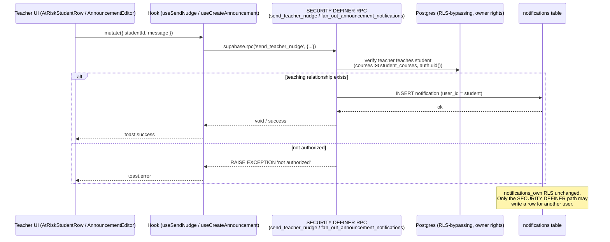
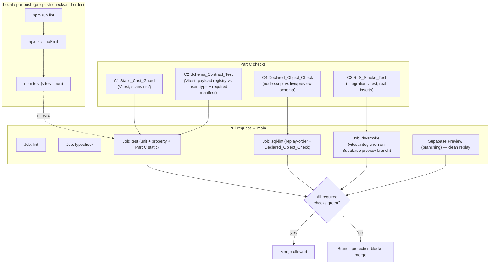

# Design Document — QA Partner Review Remediation

## Overview

This design turns the verified findings in `docs/QA-Partner-Review-Verification-Report.md` into a concrete, implementation-ready plan. It is organized into four parts that mirror the requirements:

- **Part A (P0 fixes, Req 1–4):** Four defects confirmed at the database level — the teacher→student Nudge RLS violation, the Challenge insert sending a non-existent column, the Team insert omitting `NOT NULL` columns, and the missing `mv_historical_evidence` materialized view plus its developer-text placeholder.
- **Part B (P1/P2 improvements, Req 5–16):** Twelve UI/data gaps — UUID→name resolution, surfacing GA mappings/attainment, a real admin PLO heatmap, AI no-data states, CQI fields, real section comparison, the Sankey decision, fee dropdowns, gradebook polish, CLO/rubric drill-downs, announcement fan-out, and the end-to-end outcome-chain view.
- **Part C (regression-prevention test harness, Req 17–21):** A static cast guard, a schema-contract test, RLS insert smoke tests, a declared-object existence check, and the CI wiring that gates them.
- **Part D (Do Not Regress, Req 22):** A design note constraining every change to preserve the verified-working features.

The unifying root-cause insight from the verification report §4 is that three classes of defect slip past the existing gates: (a) a falsely-completed task whose migration was never applied, (b) client→DB payload mismatches that schema linting cannot see, and (c) mocked-Supabase tests that hide RLS failures. The two recurring code smells behind (b) are **`.insert(payload as never)` casts that defeat the generated `Insert` types** and **payloads that omit `NOT NULL` columns**. Part A fixes the four live instances; Part C makes the whole class non-recurring product-wide.

### Key design decisions (summary)

| Decision                            | Choice                                                                                                     | Rationale                                                                                                                                                                                                                                                                   |
| ----------------------------------- | ---------------------------------------------------------------------------------------------------------- | --------------------------------------------------------------------------------------------------------------------------------------------------------------------------------------------------------------------------------------------------------------------------- |
| Nudge transport (Req 1)             | **`SECURITY DEFINER` Postgres RPC**, not an Edge Function                                                  | The check is a single SQL join (`courses` ⋈ `student_courses`) + one insert; an in-DB RPC keeps it atomic, avoids a network hop and a separate deploy artifact, and reuses the established `auth_*()` SECURITY DEFINER convention. No service-role key leaves the database. |
| Announcement fan-out (Req 15)       | **`SECURITY DEFINER` RPC** consistent with Req 1                                                           | Same cross-user-insert problem; the same authorized-server-side pattern resolves it.                                                                                                                                                                                        |
| Whitelist approach (Req 2)          | **Shared `pickColumns` helper + per-table allowed-column constants**                                       | Fixes the whole product, not just challenges; removing `as never` lets the generated `Insert` type catch the next occurrence at compile time.                                                                                                                               |
| Sankey (Req 11)                     | **Build a real `recharts` Sankey**, with rename to "Outcome Mapping" as the documented empty-data fallback | `recharts@3.8.1` is already a dependency and ships a `Sankey` chart; higher demo impact, zero new dependency. The relabel branch covers the empty-`links` case.                                                                                                             |
| Required-column derivation (Req 18) | **Checked-in manifest generated from `information_schema`**                                                | A pure TypeScript reflection of the generated types cannot tell "has a default" from "nullable"; the live `information_schema` is the only authority. The manifest is regenerated alongside `database.ts`.                                                                  |
| RLS smoke tests (Req 19)            | **Separate `vitest.integration.config.ts` project against a Supabase preview branch**                      | Keeps the fast unit/property suite hermetic while running real, non-mocked inserts in a dedicated CI job with secrets.                                                                                                                                                      |

### Live-schema facts this design is built on (verified)

These were confirmed against the generated `src/types/database.ts` and live RLS; the design does **not** introduce columns that contradict them:

- `social_challenges` Insert type has **no** `xp_race_acknowledged` column (16 columns). Required (no default): `challenge_type`, `course_id`, `created_by`, `end_date`, `goal_target`, `institution_id`, `start_date`, `title`.
- `teams` Insert type requires `captain_id`, `course_id`, `created_by`, `institution_id`, `name` (all `NOT NULL`, no default).
- `notifications` has a single policy `notifications_own` = `FOR ALL USING (user_id = auth.uid())`; INSERT `WITH CHECK` therefore forbids a teacher writing a student's row.
- `announcements` has no attachment/read columns and there is no `announcement_reads` table.
- `cqi_action_plans` already has `responsible_person`, `status`, `result_attainment`; it lacks `root_cause`, a due date, and `evidence_of_improvement`.
- `outcome_mappings(source_outcome_id, target_outcome_id, weight)` carries the CLO→PLO→ILO graph; `graduate_attribute_mappings(graduate_attribute_id, outcome_id, weight)` carries GA→ILO.

## Architecture

### Layering (unchanged, reaffirmed)

The platform's clean-architecture layering is preserved: components → TanStack Query hooks → `supabase` client; business logic in `src/lib/`; RLS on every table. All new data access lands in hooks; no component gains a direct `supabase.*` call. Cross-user writes that RLS forbids are routed through `SECURITY DEFINER` RPCs invoked via `supabase.rpc(...)` inside hooks.

### Authorized cross-user insert flow (Nudge — Req 1; Announcement fan-out — Req 15)



The RPC is the only sanctioned way to create a notification for another user. The `notifications_own` policy stays exactly as-is, so an ordinary authenticated client still cannot insert cross-user rows (Req 1.7, Req 15.6).

### Regression-prevention harness & CI pipeline (Part C — Req 17–21)



C1 and C2 run inside the existing `test` job (they are plain Vitest files needing no secrets). C4 runs in the `sql-lint` job next to the existing replay-order checker. C3 runs as a dedicated `rls-smoke` job with Supabase secrets against a preview branch (Req 21.1, 21.2).

## Components and Interfaces

### Part A — P0 fixes

#### Req 1 — Nudge via `send_teacher_nudge` RPC

**Why an RPC over an Edge Function.** The operation is one authorization join plus one insert, fully expressible in SQL. An RPC keeps it atomic and transactional, avoids managing a separate Deno deploy + service-role secret, and matches the repo's existing convention (`get_leaderboard_page`, `parent_has_verified_link`, the portfolio access RPCs are all `SECURITY DEFINER` SQL). An Edge Function would add a network hop and a second deploy artifact for no benefit here. (The CORS/Edge pattern in `supabase-patterns.md` remains the right tool for multi-step or external-service logic; this is neither.)

**Hook change (`src/hooks/useTeacherDashboard.ts` → `useSendNudge`):** replace the direct `supabase.from("notifications").insert({ user_id: studentId, ... })` with an RPC call.

```typescript
// Feature: qa-partner-review-remediation — Req 1
export const useSendNudge = () => {
  const queryClient = useQueryClient();
  return useMutation({
    mutationFn: async ({
      studentId,
      message,
    }: {
      studentId: string;
      message: string;
    }) => {
      const { error } = await supabase.rpc("send_teacher_nudge", {
        p_student_id: studentId,
        p_message: message,
      });
      if (error) throw error; // RLS/authorization errors surface here
    },
    onSuccess: () => {
      queryClient.invalidateQueries({
        queryKey: queryKeys.teacherDashboard.lists(),
      });
    },
    onError: (err: Error) => toast.error(err.message || "Failed to send nudge"),
  });
};
```

The calling component (`AtRiskStudentRow`) already shows a success toast on resolve; `onError` adds the failure toast (Req 1.5, 1.6). After the migration is applied, `database.ts` is regenerated so the `rpc("send_teacher_nudge", ...)` call is fully typed — no `as never`.

#### Req 2 — Challenge insert column whitelist (shared helper)

**Shared helper (new `src/lib/db/pickColumns.ts`):** a single, generic, type-safe utility that selects only an explicit set of allowed keys from a payload. This is the SOLID, no-duplication fix that generalizes beyond challenges.

```typescript
// src/lib/db/pickColumns.ts
/** Returns a new object containing only the allowed keys that are present and not undefined. */
export const pickColumns = <T extends object, K extends keyof T>(
  payload: T,
  allowed: readonly K[]
): Pick<T, K> => {
  const out = {} as Pick<T, K>;
  for (const key of allowed) {
    if (
      key in payload &&
      (payload as Record<PropertyKey, unknown>)[key as PropertyKey] !==
        undefined
    ) {
      out[key] = payload[key];
    }
  }
  return out;
};
```

**Per-table allowed-column constants (new `src/lib/db/insertColumns.ts`):** derived from the generated `Insert` types so they stay in lockstep with the schema. Using `satisfies` ties each list to the real column union; a renamed/removed column fails `tsc`.

```typescript
// src/lib/db/insertColumns.ts
import type { Database } from "@/types/database";

type InsertKeys<T extends keyof Database["public"]["Tables"]> =
  keyof Database["public"]["Tables"][T]["Insert"];

export const SOCIAL_CHALLENGES_INSERT_COLUMNS = [
  "course_id",
  "institution_id",
  "created_by",
  "title",
  "description",
  "challenge_type",
  "participation_mode",
  "goal_target",
  "start_date",
  "end_date",
  "reward_xp",
  "reward_badge_id",
  "status",
] as const satisfies readonly InsertKeys<"social_challenges">[];

export const TEAMS_INSERT_COLUMNS = [
  "name",
  "course_id",
  "institution_id",
  "captain_id",
  "created_by",
  "avatar_letter",
] as const satisfies readonly InsertKeys<"teams">[];
```

**`useCreateChallenge` before/after.** Before: `.from("social_challenges" as never).insert(input as never)`. After: drop both casts and whitelist.

```typescript
// Feature: qa-partner-review-remediation — Req 2
import { pickColumns } from "@/lib/db/pickColumns";
import { SOCIAL_CHALLENGES_INSERT_COLUMNS } from "@/lib/db/insertColumns";

mutationFn: async (input: CreateChallengeInput) => {
  // ... xp_race concurrency check unchanged ...
  const row = pickColumns(input, SOCIAL_CHALLENGES_INSERT_COLUMNS); // xp_race_acknowledged excluded
  const { data, error } = await supabase
    .from("social_challenges")          // no `as never`
    .insert(row)                         // typed against Insert<"social_challenges">
    .select()
    .single();
  if (error) throw error;
  return data;
},
```

Because the `as never` is removed, if anyone re-adds `xp_race_acknowledged` (or any non-column) to `row`, `tsc` fails — the generated type now does its job (Req 2.1, 2.2, 2.6). `CreateChallengePayload` is narrowed to a typed `CreateChallengeInput` (no `[key: string]: unknown` index signature, which currently hides the error).

**`ChallengeFormPage` submit (Req 2.4, 2.5).** The `xp_race_acknowledged` gate stays entirely client-side. The submit handler keeps the existing guard but is hardened so acknowledgment is enforced on **every** submission of an `xp_race` challenge regardless of prior prompting:

```typescript
if (data.challenge_type === "xp_race" && !data.xp_race_acknowledged) {
  toast.error("XP Race challenges require explicit acknowledgment");
  return; // no insert attempted
}
```

`xp_race_acknowledged` remains a field in `src/lib/schemas/challenge.ts` (Req 2.7) but is never part of the insert row.

#### Req 3 — Team insert populates required `NOT NULL` columns

**`CreateTeamInput` becomes required, not optional** (`src/hooks/useTeams.ts`):

```typescript
// Feature: qa-partner-review-remediation — Req 3
export interface CreateTeamInput {
  name: string;
  course_id: string;
  institution_id: string; // was optional → now required (NOT NULL)
  captain_id: string; // was optional → now required (NOT NULL)
  created_by: string;
  avatar_letter?: string; // nullable in schema → stays optional
}
```

`useCreateTeam` drops `as never` and whitelists via `TEAMS_INSERT_COLUMNS`:

```typescript
mutationFn: async (input: CreateTeamInput) => {
  const row = pickColumns(input, TEAMS_INSERT_COLUMNS);
  const { data, error } = await supabase.from("teams").insert(row).select().single();
  if (error) throw error;
  return data;
},
```

**Call sites.**

- `TeamFormPage`: it already collects `selectedMembers` and enforces 2–6 members. Pass `institution_id` from `useAuth().institutionId` and `captain_id = selectedMembers[0]`. Block submission when `selectedMembers.length === 0` (Req 3.4) — the existing `sizeValid` guard already covers this; the toast message is retained.
- `TeamManager`: same two fields added to its create payload.
- `useAutoGenerateTeams`: each generated team sets `institution_id` (from the passed-in profile institution) and `captain_id = teamBuckets[i][0]` (first member of the bucket). The function signature gains `institution_id: string`.

Because the type is now required and the cast removed, omitting either field fails `tsc` (Req 3.5). The produced payload satisfies the `teams_insert` RLS `WITH CHECK` (teacher role + institution scope) (Req 3.6).

#### Req 4 — Historical Evidence MV + hook + empty state

**Hook (new `src/hooks/useHistoricalEvidence.ts`):** standard TanStack query reading the materialized view, institution-scoped, with a shared Zod filter schema.

```typescript
// Feature: qa-partner-review-remediation — Req 4
export interface HistoricalEvidenceRow {
  semester_id: string;
  semester_name: string;
  start_date: string;
  outcome_type: "PLO" | "CLO";
  blooms_level: string | null;
  evidence_count: number;
  avg_score: number;
  excellent_count: number;
  satisfactory_count: number;
  developing_count: number;
  not_yet_count: number;
}

export const useHistoricalEvidence = (filters: HistoricalEvidenceFilter) =>
  useQuery({
    queryKey: queryKeys.historicalEvidence.list(filters),
    queryFn: async (): Promise<HistoricalEvidenceRow[]> => {
      let q = supabase
        .from("mv_historical_evidence")
        .select("*")
        .order("start_date", { ascending: true });
      if (filters.outcomeType) q = q.eq("outcome_type", filters.outcomeType);
      if (filters.bloomsLevel) q = q.eq("blooms_level", filters.bloomsLevel);
      const { data, error } = await q;
      if (error) throw error;
      return (data ?? []) as HistoricalEvidenceRow[];
    },
  });
```

`historicalEvidenceFilterSchema` (in `src/lib/schemas/`) validates the optional `outcomeType` / `bloomsLevel` / `semesterId` filters used by the dashboard (drives the nuqs URL state).

**`HistoricalEvidenceDashboard.tsx` rewrite (Req 4.3–4.5, 4.7).** Remove the literal `"Requires mv_historical_evidence view"` badge entirely. Render: a loading shimmer while `isLoading`; the existing `NoEvidence` empty-state component when the query returns zero rows; and the trend/level breakdown charts when data exists. No internal object names, migration ids, or developer instructions appear in any rendered string.

### Part B — P1/P2 improvements

#### Req 5 — Resolve UUIDs to names via joins in list queries

The fix lives in the **list queries** (no N+1), using PostgREST embedded resources, then the columns render the embedded name. For each table:

- **Admin Courses** (`useCourses` / its list query): extend `.select()` to embed program and teacher:
  `*, programs!courses_program_id_fkey(name), teacher:profiles!courses_teacher_id_fkey(full_name)`.
  `columns.tsx` renders `row.original.programs?.name ?? "—"` and `row.original.teacher?.full_name ?? "—"` (Req 5.1, 5.6).
- **Teacher CLOs** (`useLearningOutcomes` for CLOs): embed `courses!learning_outcomes_course_id_fkey(name)`; render course name instead of `course_id.slice(0,8)` (Req 5.2).
- **Teacher Rubrics** (`useRubrics`): embed `learning_outcomes!rubrics_clo_id_fkey(title)`; render CLO title instead of raw `clo_id` (Req 5.3).
- **Teacher Assignments** (`useAssignments`): embed `courses!assignments_course_id_fkey(name)`; render course name instead of raw `course_id` (Req 5.4). The existing `rubrics.title` and CLO count are preserved.

A small shared `resolveName(value, fallback = "—")` helper in `src/lib/db/` standardizes the fallback label (Req 5.6) and is what the no-raw-UUID guard test keys on. All resolution happens in one round trip per list (Req 5.5).

#### Req 6 — Surface GA mappings & attainment

`GraduateAttributeManager.tsx` gains, per attribute row: the mapped outcomes (from `useGraduateAttributeMappings`) and the computed attainment (from the existing `useGraduateAttributeAttainment` — **reused, not reimplemented**, Req 6.5). Attainment is rendered with the platform attainment-level color coding helper (`getAttainmentColor`, Req 6.6). When an attribute has zero mappings, an inline empty state is shown instead of a bare `0` (Req 6.3), wrapped so a render failure shows a fallback (`ErrorBoundary` / conditional, Req 6.4).

#### Req 7 — Real Admin PLO heatmap with derivation + drill-down

New hook `useAdminPLOHeatmap(programId?)` in `src/hooks/` derives PLO attainment from `outcome_attainment` joined to `learning_outcomes` filtered to `type = 'PLO'` within the admin's institution, aggregating `attainment_percent` per PLO (mean of `scope = 'program'` rows, or rolled up from CLO scope where program scope is absent — the **documented derivation**, Req 7.7). `AdminDashboard.tsx` replaces the static `<p>` with a color-coded cell grid (`getAttainmentColor` thresholds, Req 7.2). Selecting a cell opens a `PLODrillDownDialog` listing contributing CLOs/courses (Req 7.3). Legitimate no-data → `NoData` empty state; query error → error message (distinct paths, Req 7.4, 7.6). TanStack Query's cache update re-renders without a manual refresh (Req 7.5).

#### Req 8 — AI Co-Pilot no-data empty state

In `AdminDashboard.tsx`, each AI metric tile checks the corresponding total. When `suggestionTotal === 0` (and likewise prediction/draft), render a small inline empty state ("No AI feedback recorded yet") instead of `0%` (Req 8.1, 8.3). When the total > 0, render the computed percentage — including a legitimate `0%` (Req 8.2). `useAIPerformance` is unchanged (Req 8.4).

#### Req 9 — CQI new fields

`useCQIPlans.ts` types (`CQIActionPlan`, `CreateCQIPlanInput`, `UpdateCQIPlanInput`) gain `root_cause?: string | null`, `due_date?: string | null`, `evidence_of_improvement?: string | null`. After the migration + type regen, the create/update mutations pass these through (still typed against the generated `Insert`/`Update`, no `as never`). `CQIManager.tsx` form gains three fields: Root Cause (textarea), Deadline (date), Evidence of Improvement (textarea), rendered on display when present (Req 9.2–9.4). Existing owner/status/re-eval behavior is untouched (Req 9.5).

#### Req 10 — Coordinator Section Comparison real data + drill-down

New hook `useSectionAttainment(courseId?)` computes, per section: real attainment (mean of `outcome_attainment` for students enrolled in that section, `scope = 'student_course'`) and the **actual enrolled student count** (count of `student_courses` rows for the section), replacing the hardcoded `attainmentPercent: 0` and `studentCount: capacity` in `CoordinatorDashboard.tsx` (Req 10.1, 10.2). `SectionComparisonChart` is extended: bars become clickable, opening a `SectionDrillDownDialog` (teacher / CLO / evidence) (Req 10.3); a section with no evidence shows an inline empty state rather than a bar at 0 (Req 10.4); bar color uses `getAttainmentColor` (Req 10.5).

#### Req 11 — Sankey: build a real recharts flow (rename as fallback)

**Decision: build a real flow** using `recharts`'s `Sankey` component (recharts 3.8.1 is already a dependency). `useSankeyData` already returns `nodes` and `links`; map them to recharts' `{ nodes: [{name}], links: [{source, target, value}] }` shape (index-based source/target). The page renders `<Sankey>` with node tooltips. **Fallback branch (Req 11.3):** when `links.length === 0`, render the existing column layout but titled "Outcome Mapping" (no "Sankey" wording in that branch). The header title is updated; the outcome/mapping counts caption is preserved (Req 11.5). When the relabel branch is active, the term "Sankey" must not appear in any user-facing string for that view (Req 11.4).

#### Req 12 — Fee Program/Semester dropdowns

`FeeManager.tsx` replaces the two `<Input placeholder="UUID">` controls with Shadcn `Select`s populated from `usePrograms()` and `useSemesters()` (Req 12.1, 12.2). The selected ids feed the existing `useCreateFeeStructure` mutation (Req 12.3). Submission is disabled and a hint shown until both are selected (Req 12.4). Scope stays minimal — no new fee capabilities (Req 12.5).

#### Req 13 — Gradebook auto-load, CSV export, class average

`GradebookView` auto-selects the course from route/context when available so it loads without a manual pick (Req 13.1). A "Export CSV" button reuses the existing `downloadCsv` utility from `src/lib/exportCurriculumMatrixCsv.ts` (the established pattern, Req 13.6, 13.2). A computed class-average row is appended from the displayed matrix (Req 13.3). With no grades, the matrix structure (headers + student names, empty cells) still renders (Req 13.4); while loading, a shimmer shows instead of the no-data view (Req 13.5).

#### Req 14 — CLO detail page + rubric preview dialog

A new `CLODetailPage` (route `/teacher/clos/:id`) opens from a "View" action on the CLO list, showing the CLO with its mapped PLOs, linked assignments, and attainment (Req 14.1); existing Edit/Delete are preserved (Req 14.5). A `RubricPreviewDialog` (read-only) opens from a "Preview" action on the rubric list, rendering criteria/levels without edit controls (Req 14.2, 14.3); existing Edit/Copy/Delete are preserved (Req 14.4).

#### Req 15 — Announcement fan-out + attachments + read receipts

**Fan-out (Req 15.1, 15.2, 15.5, 15.6):** the current bug inserts a notification for `author_id`. Fix routes fan-out through a `SECURITY DEFINER` RPC `fan_out_announcement_notifications(p_announcement_id uuid)` that, after verifying the caller authored the announcement (and teaches the course), inserts one notification per enrolled student (excluding the author). `useCreateAnnouncement` calls this RPC after the announcement insert instead of the buggy direct `notifications` insert. This is the same authorized-server-side pattern as Req 1.

**Attachments (optional, Req 15.3):** announcement attachments stored in Supabase Storage under an `announcement-attachments/{announcement_id}/` prefix, with references in a new `announcement_attachments` table (or a `metadata` jsonb on the notification + a dedicated table — see Data Models). **Read receipts (optional, Req 15.4):** new `announcement_reads(announcement_id, student_id, read_at)` table; a student marking-read upserts their row.

#### Req 16 — End-to-end outcome chain view

New `OutcomeChainView` component + `useOutcomeChain(startOutcomeId)` hook. The hook walks the graph using `outcome_mappings` (CLO↔PLO↔ILO via `source/target_outcome_id`) and `graduate_attribute_mappings` (GA↔ILO), then assignments (`assignment.clo_weights`/`clo_ids`), rubrics (`rubric.clo_id`), and `outcome_attainment` for student-level evidence. It assembles the chain **ILO → GA → PLO → CLO → Assessment → Rubric → Student → Attainment** (Req 16.1–16.3). GA is rendered as a level between ILO and PLO (Req 16.3). When no level has linked records for the chosen start, a single unified empty state is shown (Req 16.4). Attainment at any node uses the platform color coding (Req 16.5).

### Part C — Regression-prevention test harness

#### Req 17 — `Static_Cast_Guard` (Vitest)

New `src/__tests__/unit/supabaseCastGuard.test.ts`, modeled on the existing `architectureGuards.test.ts` / `studentArchitectureGuards.test.ts` (reusing the `blankCommentsAndStrings` tokenizer so matches inside comments/strings/imports are ignored — Req 17.6). It scans the whole `src/` tree for the dangerous patterns and compares against an allowlist.

- **Patterns detected (Req 17.1):** `.from(<expr> as never)`, `.insert(<expr> as never)`, `.update(<expr> as never)`, `.upsert(<expr> as never)`. Implemented as a small set of regexes applied to the comment/string-blanked source, each capturing file + 1-indexed line.
- **Allowlist (Req 17.3, 17.5):** `src/__tests__/fixtures/supabaseCastAllowlist.json` — an array of `{ "file": "src/hooks/useChallenges.ts", "pattern": "insert-as-never", "line"?: number }`. The guard treats it as the **maximum** permitted set: any violation not in the allowlist fails (Req 17.2, 17.4); and any allowlist entry that no longer matches a real violation also fails, forcing manual removal (shrinking-only, Req 17.5).
- **Non-increasing invariant (Req 17.7):** the allowlist also records a `maxCount` (the count recorded at feature start). The guard asserts `currentViolations.length <= maxCount` and that `maxCount` is never edited upward in the same change without explicit reduction — encoded as a test that the live count never exceeds the recorded baseline.

```typescript
// Feature: qa-partner-review-remediation, Property 5 (non-increasing allowlist)
interface AllowEntry {
  file: string;
  pattern:
    | "from-as-never"
    | "insert-as-never"
    | "update-as-never"
    | "upsert-as-never";
}
// scan src/** → violations[]; allow = load(allowlist.json)
// FAIL if any v ∈ violations and v ∉ allow      (new violation)
// FAIL if any a ∈ allow and a ∉ violations       (stale entry — must be removed)
// FAIL if violations.length > allow.maxCount     (count grew)
```

Because Part A removes the `as never` casts in `useTeams.ts` and `useChallenges.ts`, those drop out of the allowlist; the remaining legacy casts (e.g. tables absent from `database.ts`) are seeded into the allowlist at its baseline count.

#### Req 18 — `Schema_Contract_Test` (Vitest)

New `src/__tests__/unit/schemaContract.test.ts` plus a **mutation descriptor registry** `src/__tests__/fixtures/mutationDescriptors.ts`:

```typescript
// Each descriptor names the table and the keys a hook sends in its insert/upsert payload.
export interface MutationDescriptor {
  hook: string; // for error messages, e.g. "useCreateTeam"
  table: keyof Database["public"]["Tables"];
  payloadKeys: readonly string[];
  op: "insert" | "upsert";
}
export const MUTATION_DESCRIPTORS: readonly MutationDescriptor[] = [
  {
    hook: "useCreateChallenge",
    table: "social_challenges",
    payloadKeys: [...SOCIAL_CHALLENGES_INSERT_COLUMNS],
    op: "insert",
  },
  {
    hook: "useCreateTeam",
    table: "teams",
    payloadKeys: [...TEAMS_INSERT_COLUMNS],
    op: "insert",
  },
  {
    hook: "sendTeacherNudge",
    table: "notifications",
    payloadKeys: ["user_id", "type", "title", "body", "is_read"],
    op: "insert",
  },
  // extensible: add a line per RLS-protected mutation (Req 18.6)
];
```

The test (Req 18.1–18.4, 18.7):

1. For each descriptor, assert every `payloadKey ∈ keyof Insert<table>` (derived at the type level **and** validated at runtime against the keys listed in the generated-types-derived `insertColumns` constants). A non-column key fails and **names the key + table** (Req 18.2).
2. Assert every `Required_Column` of the table ∈ `payloadKeys`. Required columns come from a **checked-in manifest** `src/__tests__/fixtures/requiredColumns.json` generated from `information_schema` (column is `NOT NULL`, has no default, is not generated) — see Data Models / tooling. A missing required column fails and **names the column + table** (Req 18.3).
3. Accumulate all violations and report them together (Req 18.4); a bare failure without identification is itself treated as invalid (the test always attaches the offending key/column/table).

Coverage includes at minimum the nudge path, team, and challenge handlers (Req 18.5) and is table-driven for easy extension (Req 18.6).

#### Req 19 — `RLS_Smoke_Test` (integration Vitest)

New `vitest.integration.config.ts` (separate project; `test.include = ["src/__tests__/integration-rls/**/*.test.ts"]`, longer timeout, no jsdom) and `src/__tests__/integration-rls/` suite. A new npm script `test:rls` runs `vitest --run --config vitest.integration.config.ts`.

- **Seeding (Req 19.1):** a setup module uses the Supabase **Admin API** (service-role key, preview branch only) to create one user per role (admin, coordinator, teacher, student, parent) with matching `profiles`, plus a course taught by the seeded teacher, an enrollment for the seeded student, and a parent-student link. Seed data is namespaced (e.g. `rls-smoke+{role}@…`) and torn down after.
- **Per-role sign-in (Req 19.2):** each test creates a fresh **anon** client (`createClient(url, anonKey)`) and calls `signInWithPassword` as the role under test, then performs a **real** insert/update — never a mock.
- **Table-driven cases (Req 19.3, 19.4, 19.6, 19.8):**

```typescript
interface RLSCase {
  table: string;
  description: string;
  asRole: "admin" | "coordinator" | "teacher" | "student" | "parent";
  action: (
    ctx: SeededCtx,
    client: SupabaseClient
  ) => Promise<{ error: unknown }>;
  expect: "success" | "rejected";
}
const RLS_CASES: RLSCase[] = [
  {
    table: "notifications",
    description: "teacher nudges own student (rpc)",
    asRole: "teacher",
    action: (c, cl) =>
      cl.rpc("send_teacher_nudge", {
        p_student_id: c.studentId,
        p_message: "hi",
      }),
    expect: "success",
  },
  {
    table: "notifications",
    description: "teacher nudges non-taught student (rpc)",
    asRole: "teacher",
    action: (c, cl) =>
      cl.rpc("send_teacher_nudge", {
        p_student_id: c.otherStudentId,
        p_message: "hi",
      }),
    expect: "rejected",
  },
  {
    table: "teams",
    description: "teacher creates team with required cols",
    asRole: "teacher",
    action: (c, cl) =>
      cl.from("teams").insert({
        name: "T",
        course_id: c.courseId,
        institution_id: c.institutionId,
        captain_id: c.studentId,
        created_by: c.teacherId,
      }),
    expect: "success",
  },
  {
    table: "social_challenges",
    description: "teacher creates challenge (whitelisted payload)",
    asRole: "teacher",
    action: (c, cl) =>
      cl.from("social_challenges").insert({
        /* real columns only */
      }),
    expect: "success",
  },
  {
    table: "social_challenges",
    description: "student cannot create challenge",
    asRole: "student",
    action: (c, cl) =>
      cl.from("social_challenges").insert({
        /* ... */
      }),
    expect: "rejected",
  },
];
```

The harness covers at minimum `notifications` (nudge), `teams`, `social_challenges` (Req 19.5) and is structured so new tables are one array entry (Req 19.6). It runs as a dedicated CI job with secrets, separate from the unit/property suite (Req 19.7), and **never targets production** — the config refuses to run unless `SUPABASE_DB_ENV === "preview"` and the URL is not the production project ref.

#### Req 20 — `Declared_Object_Check` (node script)

New `scripts/check-declared-objects.mjs`, modeled on `check-migration-replay-order.mjs` (same CLI/exit-code style). It reads a checked-in manifest `scripts/declared-objects.json` of expected DB objects and verifies each exists in the live/preview schema.

```jsonc
// scripts/declared-objects.json
{
  "objects": [
    {
      "type": "materialized_view",
      "name": "mv_historical_evidence",
      "declaringTask": "qa-partner-review-remediation 4.1"
    },
    {
      "type": "function",
      "name": "send_teacher_nudge",
      "declaringTask": "qa-partner-review-remediation 1.x"
    }
  ]
}
```

The script connects using `SUPABASE_DB_URL`/service key (preview/CI) and queries `pg_matviews` for materialized views and `pg_proc`/`information_schema.routines` for functions (Req 20.1, 20.3). Missing object → exit 1, printing the object **and its declaring task** (Req 20.2). The `type` switch makes new object kinds (tables, views, indexes) easy to add (Req 20.4). It is wired into the `sql-lint` CI job (Req 21) next to the replay checker.

#### Req 21 — CI wiring

- The `test` job already runs `npm run test:coverage` (Vitest) — C1 and C2 ride along automatically (Req 21.1).
- The `sql-lint` job gains a step `node scripts/check-declared-objects.mjs` after the replay-order step (Req 21.1).
- A new `rls-smoke` job runs `npm run test:rls` against the Supabase **preview branch**, gated on the same PR trigger, with `SUPABASE_URL`, `SUPABASE_ANON_KEY`, `SUPABASE_SERVICE_ROLE_KEY`, and `SUPABASE_DB_ENV=preview` secrets (Req 21.2).
- Branch protection requires `lint`, `typecheck`, `test`, `sql-lint`, `rls-smoke`, and `Supabase Preview` to be green before merge to `main` (Req 21.3–21.6), consistent with `pre-push-checks.md`.

## Data Models

### New materialized view — `mv_historical_evidence` (Req 4)

Replay-clean DDL (functions/tables it references — `outcome_attainment`, `learning_outcomes`, `semesters`, `evidence` — are all created by earlier migrations, satisfying `migration-replay-integrity.md`). Migration filename follows the convention, e.g. `supabase/migrations/20260821000001_create_mv_historical_evidence.sql`.

```sql
-- Historical evidence rollup per semester × outcome type × Bloom's level.
-- Institution scoping is enforced at SELECT time by the calling RLS-backed
-- query joining through semesters → programs → institution; the MV itself is
-- institution-agnostic aggregate evidence keyed by semester.
CREATE MATERIALIZED VIEW IF NOT EXISTS public.mv_historical_evidence AS
SELECT
  s.id                                   AS semester_id,
  s.name                                 AS semester_name,
  s.start_date                           AS start_date,
  lo.type                                AS outcome_type,        -- 'PLO' | 'CLO'
  lo.blooms_level                        AS blooms_level,
  COUNT(oa.id)                           AS evidence_count,
  COALESCE(AVG(oa.attainment_percent), 0)::numeric(5,2) AS avg_score,
  COUNT(*) FILTER (WHERE oa.attainment_percent >= 85)                                AS excellent_count,
  COUNT(*) FILTER (WHERE oa.attainment_percent >= 70 AND oa.attainment_percent < 85) AS satisfactory_count,
  COUNT(*) FILTER (WHERE oa.attainment_percent >= 50 AND oa.attainment_percent < 70) AS developing_count,
  COUNT(*) FILTER (WHERE oa.attainment_percent < 50)                                 AS not_yet_count
FROM public.outcome_attainment oa
JOIN public.learning_outcomes lo ON lo.id = oa.outcome_id
JOIN public.semesters s          ON s.id = oa.semester_id
WHERE oa.scope = 'student_course'
GROUP BY s.id, s.name, s.start_date, lo.type, lo.blooms_level;

-- Unique index is REQUIRED for REFRESH MATERIALIZED VIEW CONCURRENTLY.
CREATE UNIQUE INDEX IF NOT EXISTS mv_historical_evidence_uidx
  ON public.mv_historical_evidence (semester_id, outcome_type, blooms_level);
```

> Note: the exact source columns (`oa.semester_id`, `lo.blooms_level`) are validated against the live schema before the migration is authored; if `outcome_attainment` lacks `semester_id`, the join derives it via `course_offerings`/`semesters` (resolved in implementation). The column list above matches the platform spec the dashboard expects.

**Refresh strategy.** On-demand refresh via a `SECURITY DEFINER` function `refresh_mv_historical_evidence()` (search_path-pinned, public-qualified), scheduled by `pg_cron` nightly (the repo already uses `pg_cron` and guards it with `is_pgcron_available()`), and callable after bulk grade imports. `CONCURRENTLY` is used (the unique index enables it) so reads are not blocked.

```sql
CREATE OR REPLACE FUNCTION public.refresh_mv_historical_evidence()
RETURNS void
LANGUAGE plpgsql
SECURITY DEFINER
SET search_path = ''
AS $$
BEGIN
  REFRESH MATERIALIZED VIEW CONCURRENTLY public.mv_historical_evidence;
END;
$$;

REVOKE EXECUTE ON FUNCTION public.refresh_mv_historical_evidence() FROM PUBLIC, anon;
GRANT EXECUTE ON FUNCTION public.refresh_mv_historical_evidence() TO service_role, postgres;
```

### New RPC — `send_teacher_nudge` (Req 1)

Created in its own migration; it references only `courses`, `student_courses`, `notifications` (all pre-existing), so it is replay-clean. Hardened at the CREATE site per `migration-replay-integrity.md` (no later bare `ALTER`/`GRANT` on a not-yet-created function).

```sql
CREATE OR REPLACE FUNCTION public.send_teacher_nudge(
  p_student_id uuid,
  p_message text
)
RETURNS void
LANGUAGE plpgsql
SECURITY DEFINER
SET search_path = ''
AS $$
DECLARE
  v_teacher uuid := (SELECT auth.uid());
BEGIN
  -- Authorization: caller must teach the target student in an active course.
  IF NOT EXISTS (
    SELECT 1
    FROM public.courses c
    JOIN public.student_courses sc ON sc.course_id = c.id
    WHERE c.teacher_id = v_teacher
      AND sc.student_id = p_student_id
      AND c.is_active = true
  ) THEN
    RAISE EXCEPTION 'Not authorized: you do not teach this student'
      USING ERRCODE = '42501';
  END IF;

  INSERT INTO public.notifications (user_id, type, title, body, is_read)
  VALUES (p_student_id, 'nudge', 'Your teacher sent you a nudge', p_message, false);
END;
$$;

REVOKE EXECUTE ON FUNCTION public.send_teacher_nudge(uuid, text) FROM PUBLIC, anon;
GRANT EXECUTE ON FUNCTION public.send_teacher_nudge(uuid, text) TO authenticated;
```

The `notifications_own` policy is left untouched (Req 1.7): the only path that can write a cross-user notification is this owner-rights function.

### New RPC — `fan_out_announcement_notifications` (Req 15)

```sql
CREATE OR REPLACE FUNCTION public.fan_out_announcement_notifications(
  p_announcement_id uuid
)
RETURNS integer
LANGUAGE plpgsql
SECURITY DEFINER
SET search_path = ''
AS $$
DECLARE
  v_author uuid := (SELECT auth.uid());
  v_course uuid;
  v_title  text;
  v_body   text;
  v_count  integer;
BEGIN
  SELECT a.course_id, a.title, left(a.content, 200)
    INTO v_course, v_title, v_body
  FROM public.announcements a
  WHERE a.id = p_announcement_id AND a.author_id = v_author;

  IF v_course IS NULL THEN
    RAISE EXCEPTION 'Not authorized or announcement not found' USING ERRCODE = '42501';
  END IF;

  INSERT INTO public.notifications (user_id, type, title, body, metadata, is_read)
  SELECT sc.student_id, 'announcement', 'New Announcement: ' || v_title, v_body,
         jsonb_build_object('course_id', v_course, 'announcement_id', p_announcement_id), false
  FROM public.student_courses sc
  WHERE sc.course_id = v_course
    AND sc.status = 'active'
    AND sc.student_id <> v_author;             -- never notify the author

  GET DIAGNOSTICS v_count = ROW_COUNT;
  RETURN v_count;
END;
$$;

REVOKE EXECUTE ON FUNCTION public.fan_out_announcement_notifications(uuid) FROM PUBLIC, anon;
GRANT EXECUTE ON FUNCTION public.fan_out_announcement_notifications(uuid) TO authenticated;
```

### `cqi_action_plans` new columns (Req 9)

```sql
ALTER TABLE public.cqi_action_plans
  ADD COLUMN IF NOT EXISTS root_cause text,
  ADD COLUMN IF NOT EXISTS due_date date,
  ADD COLUMN IF NOT EXISTS evidence_of_improvement text;
```

All three are nullable (no backfill needed, preserving existing rows and the status lifecycle / `responsible_person` / `result_attainment` behavior, Req 9.5). Replay-clean (additive, `IF NOT EXISTS`).

### `announcement_reads` table + attachments (Req 15.3, 15.4)

```sql
CREATE TABLE IF NOT EXISTS public.announcement_reads (
  id uuid PRIMARY KEY DEFAULT gen_random_uuid(),
  announcement_id uuid NOT NULL REFERENCES public.announcements(id) ON DELETE CASCADE,
  student_id uuid NOT NULL REFERENCES public.profiles(id) ON DELETE CASCADE,
  read_at timestamptz NOT NULL DEFAULT now(),
  UNIQUE (announcement_id, student_id)
);
ALTER TABLE public.announcement_reads ENABLE ROW LEVEL SECURITY;

-- Student records/reads their own receipts.
CREATE POLICY "announcement_reads_student_own" ON public.announcement_reads
  FOR ALL TO authenticated
  USING (student_id = (select auth.uid()))
  WITH CHECK (student_id = (select auth.uid()));

-- Teacher reads receipts for announcements they authored.
CREATE POLICY "announcement_reads_teacher_read" ON public.announcement_reads
  FOR SELECT TO authenticated
  USING (EXISTS (
    SELECT 1 FROM public.announcements a
    WHERE a.id = announcement_reads.announcement_id
      AND a.author_id = (select auth.uid())
  ));

CREATE TABLE IF NOT EXISTS public.announcement_attachments (
  id uuid PRIMARY KEY DEFAULT gen_random_uuid(),
  announcement_id uuid NOT NULL REFERENCES public.announcements(id) ON DELETE CASCADE,
  storage_path text NOT NULL,
  file_name text NOT NULL,
  content_type text,
  size_bytes integer,
  created_at timestamptz NOT NULL DEFAULT now()
);
ALTER TABLE public.announcement_attachments ENABLE ROW LEVEL SECURITY;
-- Author manages; enrolled students read (policies mirror announcements' course scope).
```

Attachments are stored in a Storage bucket `announcement-attachments` (private; access via signed URLs), with type/size validation client-side per `engineering-guardrails.md`. These features are optional per the requirement's "WHERE supported" framing; if descoped for the pilot, the migration and table can be deferred without affecting Req 15.1/15.2 fan-out.

### Required-column manifest (tooling for Req 18)

`src/__tests__/fixtures/requiredColumns.json` is generated (not hand-edited) from `information_schema.columns` for `table_schema = 'public'`, selecting columns where `is_nullable = 'NO' AND column_default IS NULL AND is_generated = 'NEVER'`. A small generator script `scripts/gen-required-columns.mjs` (run alongside `scripts/regen-types.ps1`) writes the manifest. Shape:

```jsonc
{
  "social_challenges": [
    "challenge_type",
    "course_id",
    "created_by",
    "end_date",
    "goal_target",
    "institution_id",
    "start_date",
    "title"
  ],
  "teams": ["captain_id", "course_id", "created_by", "institution_id", "name"],
  "notifications": ["title", "type", "user_id"]
}
```

After regeneration the manifest is committed; the Schema_Contract_Test reads it as the authority for required columns (Req 18.3).

### Type regeneration note

Every migration in this design (`mv_historical_evidence`, `send_teacher_nudge`, `fan_out_announcement_notifications`, `cqi_action_plans` columns, `announcement_reads`/`announcement_attachments`) is followed by **`pwsh scripts/regen-types.ps1`** to refresh `src/types/database.ts` and the required-column manifest. `database.ts` is never hand-edited (per `types-regeneration.md`). Only after regen do the hooks drop their `as never` casts, because the regenerated types then describe the new tables/RPCs.

## Correctness Properties

_A property is a characteristic or behavior that should hold true across all valid executions of a system — essentially, a formal statement about what the system should do. Properties serve as the bridge between human-readable specifications and machine-verifiable correctness guarantees._

This feature is well-suited to property-based testing because its core risks are universal, input-varying logic: payload shaping (whitelist), required-column construction, authorization predicates, set-based fan-out, and the harness's own invariants. These are pure functions or model-checkable rules over large input spaces — exactly what `fast-check` excels at. UI rendering, drill-downs, empty states, migrations, and CI wiring are **not** expressed as properties (they are example/component/integration/smoke tests in the Testing Strategy). Each property below is implemented by a **single** property-based test (min 100 iterations) tagged with the project format `// Feature: qa-partner-review-remediation, Property N`.

### Property 1: Nudge authorization

_For any_ set of courses, enrollments, and any (teacher, student) pair, a nudge SHALL result in a notification for that student **if and only if** the teacher teaches the student in an active course; when the teaching relationship is absent, no notification row SHALL be created.

**Validates: Requirements 1.4, 1.8**

### Property 2: Challenge payload whitelist

_For any_ challenge form object — including arbitrary extra UI-only keys such as `xp_race_acknowledged` — every key in the insert payload produced by the Challenge_Create_Handler (`pickColumns(input, SOCIAL_CHALLENGES_INSERT_COLUMNS)`) SHALL be a Real_Column of `social_challenges`, and no excluded UI-only field SHALL appear.

**Validates: Requirements 2.1, 2.2, 2.6**

### Property 3: Team required-column presence

_For any_ valid Team_Create_Handler input (a profile institution, a non-empty ordered member list, a team name, and a course id), the produced insert payload SHALL contain every Required_Column of `teams` (including `institution_id` and `captain_id`) with a non-null value, where `captain_id` equals the first member.

**Validates: Requirements 3.1, 3.2, 3.5**

### Property 4: No raw UUID in resolved name cells

_For any_ row in the Admin Courses, Teacher CLOs, Teacher Rubrics, or Teacher Assignments tables — including rows whose embedded relation name is missing or null — the value rendered in a cell intended to show a name or title SHALL never be a Raw_UUID; it SHALL be either a resolved human-readable name or the defined fallback label.

**Validates: Requirements 5.1, 5.2, 5.3, 5.4, 5.6, 5.7**

### Property 5: Announcement fan-out targets enrolled students, never the author

_For any_ course roster (including rosters where the author is also enrolled, with duplicates, or empty), the set of announcement notification recipients SHALL equal the set of distinct actively-enrolled students minus the author, and SHALL never include the author.

**Validates: Requirements 15.1, 15.2, 15.5**

### Property 6: Schema-contract payload validation soundness

_For any_ mutation descriptor `{ table, payloadKeys }` checked against a schema model `{ insertColumns, requiredColumns }`, the Schema_Contract_Test validator SHALL flag exactly the payload keys that are not Real_Columns and exactly the Required_Columns absent from `payloadKeys` — flagging no compliant payload and passing no payload that has an unknown key or a missing required column.

**Validates: Requirements 18.1, 18.2, 18.3, 18.7**

### Property 7: Non-increasing allowlist

_For any_ pair of (baseline allowlist count, current set of detected `as never` violations), the Static_Cast_Guard SHALL pass **if and only if** every current violation is present in the allowlist **and** the current violation count does not exceed the recorded baseline; introducing any violation outside the allowlist, or exceeding the baseline count, SHALL fail.

**Validates: Requirements 17.2, 17.4, 17.5, 17.7**

### Property 8: RLS conformance across mutation paths and roles

_For any_ covered (mutation path, role) pair in the RLS smoke matrix, the real insert/update outcome (success or rejection) against the seeded preview database SHALL exactly match the outcome predicted by that table's RLS policy.

**Validates: Requirements 19.3, 19.4, 19.8**

> Realized as an exhaustive table-driven matrix rather than random generation: the (path, role) universe is small and each case is a real database round-trip, so enumeration is both complete and cost-appropriate. The "for any" guarantee holds over the enumerated matrix.

### Property 9: Declared-object existence

_For any_ DB object declared as created by a completed task in the declared-objects manifest, that object SHALL exist in the target schema; the Declared_Object_Check SHALL pass if and only if every declared object is present, and on failure SHALL name the missing object and its declaring task.

**Validates: Requirements 20.1, 20.2, 20.5**

## Error Handling

### Client / hook layer

- **RPC and mutation errors** (nudge, fan-out, challenge, team, CQI): the hook throws on `error`; the `onError` handler surfaces a Sonner `toast.error(message)` (Req 1.6, and the established pattern in `useChallenges`/`useTeams`). Authorization failures from `send_teacher_nudge` (Postgres `42501`) propagate as a PostgREST error and become a user-facing toast — never a silent failure (per `engineering-guardrails.md`: never swallow errors).
- **Query errors vs no-data** (heatmap Req 7.6, AI metrics Req 8, historical evidence Req 4): the three states are kept distinct — `isLoading` → shimmer; `isError` → error message; resolved-but-empty → `EmptyState`. A query error must never render as the no-data empty state.
- **Empty-state render failure** (Req 6.4): GA mappings/attainment sections render inside an `ErrorBoundary` (or a defensive conditional) so that a rendering exception shows a fallback message rather than a blank region.
- **Input validation**: all forms keep React Hook Form + Zod validation (challenge, team, CQI, fee). The `xp_race_acknowledged` gate (Req 2.4/2.5) blocks submission before any insert is attempted.

### Database / RPC layer

- `send_teacher_nudge` and `fan_out_announcement_notifications` `RAISE EXCEPTION ... ERRCODE '42501'` on authorization failure, performing **no** insert (Req 1.4, 1.2/1.3 ordering: check precedes insert).
- `notifications_own` RLS is preserved as the backstop: even if a future caller bypasses the RPC, an ordinary client still cannot write cross-user rows (Req 1.7).
- The materialized-view refresh uses `CONCURRENTLY` (guarded by the unique index) so a refresh error cannot leave readers blocked; the cron wrapper is `SECURITY DEFINER` with pinned `search_path`.

### Test-harness layer

- **Static_Cast_Guard / Schema_Contract_Test / Declared_Object_Check** fail loudly with the offending file/line, key/column/table, or object/task (Req 17.4, 18.2/18.3, 20.2). A failure that cannot identify the offender is treated as an invalid test result (Req 18.2).
- **RLS_Smoke_Test** refuses to run against production: the config asserts `SUPABASE_DB_ENV === "preview"` and that the project ref is not the production ref; otherwise it aborts before any write (Req 19, safety).
- Seeding failures in the smoke harness abort the suite (no partial-state assertions) and tear down created users/fixtures in `afterAll`.

## Testing Strategy

### Dual approach

- **Property tests** (`fast-check`, ≥100 iterations, in `src/__tests__/properties/`): the nine correctness properties above. Each property → exactly one property test, tagged `// Feature: qa-partner-review-remediation, Property N: ...`. Pure functions are extracted to `src/lib/` so they are directly testable: `pickColumns` + `insertColumns` (Properties 2, 6), the team payload builder (Property 3), the nudge authorization predicate model (Property 1), the fan-out recipient computation (Property 5), the cast-guard verdict function (Property 7), the schema-contract validator (Property 6), the declared-object checker verdict (Property 9), and the name-cell renderer (Property 4).
- **Unit / component tests** (`src/__tests__/unit/`, Testing Library): hook wiring (nudge calls `rpc`; fan-out calls the fan-out RPC), toasts, the three-state rendering (loading/error/empty/data) for heatmap, AI metrics, historical evidence, GA manager; Sankey both branches; fee dropdowns; gradebook auto-load/export/average; CLO detail + rubric preview; CQI form fields; the no-developer-text assertion (Req 4.7).
- **Static guard tests** (`src/__tests__/unit/supabaseCastGuard.test.ts`): reuse the `blankCommentsAndStrings` tokenizer from the existing guards so comment/string/import occurrences are ignored (Req 17.6); fixture sources prove a violation in code is caught and the same text in a comment/string is not.
- **Integration / RLS smoke tests** (`src/__tests__/integration-rls/`, separate `vitest.integration.config.ts`): real per-role inserts/updates against a Supabase preview branch (Property 8, Req 19). Table-driven matrix; covers `notifications` (nudge RPC, both authorized and unauthorized), `teams`, `social_challenges`; extensible by one array entry.
- **Smoke / pipeline**: `db:check-replay` + Supabase Preview for migration replay (Req 4.6, 9.6); `check-declared-objects.mjs` live run for Req 20; CI job presence for Req 21.

### Property-test configuration

- Library: `fast-check` (already a devDependency, v4.7.0).
- Minimum 100 iterations per property (`fc.assert(fc.property(...), { numRuns: 100 })` or higher).
- Each property test references its design property via the tag comment in the required format.
- Properties are implemented against extracted pure functions — never against mocked Supabase — so they test real logic, addressing the root-cause (verification report §4) that mocks hid the original bugs. The RLS-layer truth is covered separately by the non-mocked smoke harness.

### Coverage mapping (property → requirement)

| Property                    | Requirements           | Pure function under test                           |
| --------------------------- | ---------------------- | -------------------------------------------------- |
| 1 Nudge authorization       | 1.4, 1.8               | authorization predicate model (teaches?)           |
| 2 Challenge whitelist       | 2.1, 2.2, 2.6          | `pickColumns` + `SOCIAL_CHALLENGES_INSERT_COLUMNS` |
| 3 Team required columns     | 3.1, 3.2, 3.5          | team payload builder                               |
| 4 No raw UUID               | 5.1–5.4, 5.6, 5.7      | name-cell renderer / `resolveName`                 |
| 5 Announcement fan-out      | 15.1, 15.2, 15.5       | recipient set computation                          |
| 6 Schema-contract validator | 18.1–18.3, 18.7        | contract validator                                 |
| 7 Non-increasing allowlist  | 17.2, 17.4, 17.5, 17.7 | cast-guard verdict                                 |
| 8 RLS conformance           | 19.3, 19.4, 19.8       | real DB matrix (integration)                       |
| 9 Declared-object existence | 20.1, 20.2, 20.5       | declared-object checker verdict                    |

## Do Not Regress (Req 22)

Every change in this design is scoped to avoid touching the features the verification report confirmed as already working. The constraints below are binding on implementation (Req 22.10: where a new requirement modifies a surface adjacent to a preserved feature, the new implementation must guarantee no behavior change to the preserved feature).

| Preserved feature (Req)                                                                                                                                                                                                        | How this design avoids regressing it                                                                                                                                                                                                                                                |
| ------------------------------------------------------------------------------------------------------------------------------------------------------------------------------------------------------------------------------ | ----------------------------------------------------------------------------------------------------------------------------------------------------------------------------------------------------------------------------------------------------------------------------------- |
| Attendance (`AttendanceMarker`, `AttendanceReport`, `ParentAttendancePage`, `useAttendance`) + RLS (22.1)                                                                                                                      | No attendance file, hook, or policy is modified. The nudge RPC touches only `notifications`.                                                                                                                                                                                        |
| Competency framework hierarchy + `CompetencyTree` + CSV import (22.2)                                                                                                                                                          | Untouched; GA work (Req 6) is a separate table/manager.                                                                                                                                                                                                                             |
| `departments` ↔ `programs` separation + `ProgramForm` department selector (22.3)                                                                                                                                               | Fee dropdowns (Req 12) read programs read-only; no schema or form change to programs/departments.                                                                                                                                                                                   |
| Gap-analysis `generateRecommendation()` + `GapAnalysisView` (22.4)                                                                                                                                                             | Not referenced by any change.                                                                                                                                                                                                                                                       |
| Coordinator Coverage Heatmap color coding + toggle (22.5)                                                                                                                                                                      | The new Admin PLO heatmap (Req 7) is a distinct component; the Coordinator heatmap is not edited.                                                                                                                                                                                   |
| Marketplace Analytics + XP Economist (22.6)                                                                                                                                                                                    | Gradebook CSV export (Req 13) **reuses** the existing `downloadCsv` utility rather than altering marketplace export.                                                                                                                                                                |
| Bulk import (`BulkImportPage`, `DataImportPage`) (22.7)                                                                                                                                                                        | Not referenced.                                                                                                                                                                                                                                                                     |
| Grading queue (`GradingQueuePage`) (22.8)                                                                                                                                                                                      | Not referenced; gradebook changes (Req 13) are confined to `GradebookView`.                                                                                                                                                                                                         |
| Student-profile behaviors (password toggle, progressive onboarding, fallback panel, primary CTA, leaderboard cohort gate, empty states, habit summaries, AI tutor, calendar, timetable, private portfolio, grouped nav) (22.9) | No student-surface file is modified. The existing `architectureGuards`/`studentArchitectureGuards` tests remain green; the new cast guard is additive and does not relax them.                                                                                                      |
| Constraint on adjacent surfaces (22.10)                                                                                                                                                                                        | Shared helpers (`pickColumns`, `insertColumns`, `resolveName`) are additive; existing `as never` casts outside Part A's two hooks are recorded in the cast-guard allowlist at baseline (not removed in this feature), so no unrelated hook is forced to change and risk regression. |

### Out of scope (product-scope decisions, recorded for context)

- Fees beyond the program/semester dropdowns (no payroll/admissions/transport).
- Full removal of Surveys / My Content from student nav (already mitigated).
- The Sankey decision is resolved in favor of building the real flow (with the relabel fallback for empty data); no broader visualization rework is in scope.
