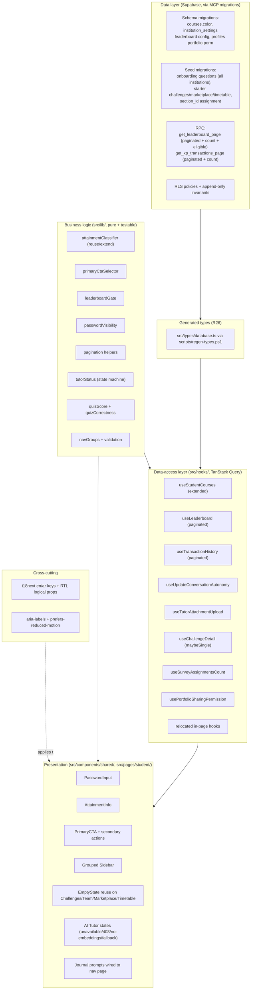
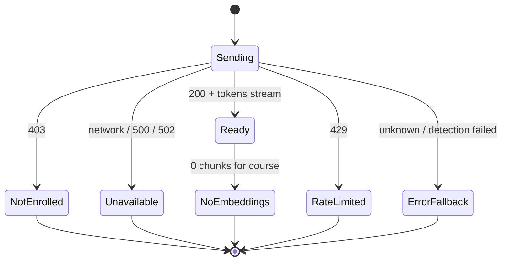

# Design Document — Student Experience Remediation

## Overview

This design implements the 35 requirements from `requirements.md`, which remediate a pre-pilot student-experience audit of the Edeviser platform. The audit produced symptoms; a code-level root-cause investigation produced the verified causes this design is built on. The work is deliberately heterogeneous — some fixes are genuine code bugs (dead routes, hardcoded correctness, stale closures), some are missing capability (password toggles, leaderboard gating), several are unseeded/stubbed code paths (AI Tutor upload, onboarding seed, starter content), and the rest are architecture, i18n, RTL, a11y, and performance guardrail compliance.

The design honors the spec's **Build-Over-Defer Principle**: where a finding's root cause is incomplete implementation, missing seed/starter content, or a stubbed code path, this design builds the working capability and delivers seed migrations and starter content. The shared `EmptyState` library is used only as the genuine zero-data fallback that appears **after** the underlying capability functions, never as the primary deliverable.

### Guiding constraints (from steering)

- Components never call `supabase` directly — all data access flows through TanStack Query hooks in `src/hooks/`.
- Business logic lives in `src/lib/` (pure, unit/property-testable), not in components or hooks.
- Shadcn/ui only; logical CSS properties (`ms-/me-/ps-/pe-`); Sonner toasts; `@/` import alias.
- RLS on every table; `auth_user_role()` / `auth_institution_id()` helpers; append-only invariants on `evidence`, `audit_logs`, `xp_transactions`.
- `src/types/database.ts` is regenerated only via `scripts/regen-types.ps1` — never hand-edited, never via stdout redirect.
- Migrations are authored and applied via the Supabase MCP.
- Property-based tests use `fast-check` (min 100 iterations) and reference design properties.

### Classification of the 35 requirements

| Class                                      | Requirements                                                                                        | Nature                                                  |
| ------------------------------------------ | --------------------------------------------------------------------------------------------------- | ------------------------------------------------------- |
| **Pure code bug fix**                      | 1, 2, 3, 27, 28, 30, 31                                                                             | Repair incorrect behavior in existing code              |
| **New build (UI/logic/hook/component)**    | 4 (upload), 5, 6, 7, 8, 9, 10, 16, 17, 18, 19, 20, 21, 22, 23, 24, 32, 33, 34                       | New components, hooks, selectors, gates                 |
| **Seed migration (+ zero-data fallback)**  | 11, 12, 13                                                                                          | Author and deliver SQL seed/starter content             |
| **Schema migration (new columns/RPC)**     | 6/32 (leaderboard config + RPC), 9 (course color), 13 (section_id usage), 24 (portfolio permission) | DDL change preceding hook/type work                     |
| **Architecture / type-safety refactor**    | 25, 26, 29                                                                                          | Route data access through hooks; regenerate types; i18n |
| **Operational prerequisite (out of band)** | 4 (deploy + secret + embeddings)                                                                    | Not code; the UI states around it are in scope          |
| **Optional enhancement**                   | 35                                                                                                  | Mascot guidance (lower priority)                        |

A dependency note governs sequencing (see **Architecture → Sequence & Risk**): schema migrations (course color, leaderboard config, portfolio permission) and the corrected seed migrations must land **before** the database types are regenerated (R26), which in turn must land **before** the hook refactors (R25) that depend on accurate types to remove `(supabase as any)` / `as never` casts.

---

## Architecture

The remediation is organized by layer rather than by requirement number, so related work batches cleanly into tasks. Each layer below lists the concrete artifacts it introduces or changes and the requirements it satisfies.



### Layer 1 — Shared components (`src/components/shared/`)

New, reusable presentational components (no direct Supabase access):

- **`PasswordInput.tsx`** — Shadcn `Input` + eye toggle, accessible name reflecting action, 44px touch target, mutual-exclusion coordination. Satisfies **R5**.
- **`AttainmentInfo.tsx`** — accessible tooltip/legend (Popover/Tooltip) explaining mastery and the four threshold bands with their colors, bilingual. Satisfies **R8**.
- **`PrimaryCTA.tsx`** — renders the single dominant dashboard CTA chosen by the `primaryCtaSelector` and a subordinate secondary-actions row. Satisfies **R16**.
- Reuse of existing `EmptyState` variants (`NoChallenges`, `NoTeams`, `NoMarketplaceItems`, `NoTimetable`) to replace ad-hoc inline empty states. Satisfies **R12**.
- **`PasswordField` mutual-exclusion context** — a tiny `PasswordVisibilityGroup` provider (logic in `src/lib/passwordVisibility.ts`) used where multiple password fields coexist (SignUp, AcceptInvite, UpdatePassword). Satisfies **R5.5**.

### Layer 2 — Business logic (`src/lib/`)

Pure functions, each with unit + property tests, decoupled from React and Supabase:

- **`attainmentClassifier.ts`** (exists) — already implements the exact banding with `>=` boundaries (50% → Developing). Reused by `AttainmentInfo` and course cards. Satisfies **R8**.
- **`primaryCtaSelector.ts`** (new) — given a set of candidate actions with `applicable` flags and priorities, returns the single highest-priority applicable action plus ordered secondaries. Satisfies **R16**.
- **`leaderboardGate.ts`** (new) — given eligible-student count and configured minimum, returns `locked | unlocked`; enforces "zero eligible ⇒ locked regardless of minimum". Satisfies **R6**.
- **`passwordVisibility.ts`** (new) — pure reducer for mutual-exclusion of N password fields. Satisfies **R5.5**.
- **`pagination.ts`** (new) — `toRange(page, pageSize)`, `hasMore(page, pageSize, total)`, page-count helpers shared by leaderboard, transactions, marketplace, discussions. Satisfies **R32/R33/R34**.
- **`tutorStatus.ts`** (new) — maps a backend signal (HTTP status / SSE error code / embeddings flag) to a discriminated-union UI state (`ready | unavailable | not_enrolled | no_embeddings | error`). Satisfies **R4**.
- **`quizScore.ts` + `quizCorrectness.ts`** (new) — pure score computation from the latest answers map, and correctness derivation from the selectNext response (or against `correct_answer`). Satisfies **R2/R3**.
- **`navGroups.ts`** (new) — group metadata + a validation function asserting each `NavItem` belongs to its correct group. Satisfies **R20**.

### Layer 3 — Data-access hooks (`src/hooks/`)

All Supabase access lives here. New/changed hooks:

- `useStudentCourses` (extend the local `useStudentEnrolledCourses` and relocate to `src/hooks/`) — one query returning progress, next assignment + due date, color, attainment, assignment count. **R9, R25.**
- `useLeaderboard` (rewrite) — calls a paginated RPC; no whole-institution fetch, no client slice; eligible-count drives the gate. **R6, R32.**
- `useTransactionHistory` (rewrite) — true source-level pagination via paginated RPC (count + page); refuses to render on failure. **R33.**
- `useUpdateConversationAutonomy` (new mutation) — replaces the raw `(supabase as any)` update in `TutorPage`; `onError` toast. **R28, R25.**
- `useTutorAttachmentUpload` (new) — uploads image/document to a Storage bucket and returns public/signed URL. **R4.5.**
- `useChallengeDetail` (relocate + `.maybeSingle()`) — graceful not-found, error state. **R27, R28, R25.**
- `useSurveyAssignmentsCount` (new) — drives conditional Surveys nav item. **R23.**
- `usePortfolioSharingPermission` (new) + `useTogglePortfolioPublic` (extend) — gate public sharing on school permission. **R24.**
- `useMarketplace`, `useDiscussions` (bound + paginate). **R34.**
- Relocations of in-page hooks from `TutorPage`, `StudentDashboard`, `StudentProgressPage`, `StudentCoursesPage`, `PostQuizReview`, `AdaptiveQuizSession`, `FocusModePage`, `BaselineSelectStep`, `StudentJournalPage`, `CreateTeamPage`, `StudentTeamPage`, leaderboard. **R25.**

### Layer 4 — Pages (`src/pages/student/`)

Page-level wiring changes, consuming hooks + shared components:

- Route-link fixes (`/student/ai-tutor` → `/student/tutor`) in `PostQuizReview`, `FlowCheckInDialog`, `MasteryRecoveryPanel`; CLO id preserved as `?cloIds=`. **R1.**
- `AdaptiveQuizSession` correctness + timer fixes. **R2, R3.**
- `TutorPage` / `ChatPanel` state machine + real upload + autonomy mutation. **R4, R28.**
- `StudentDashboard` single PrimaryCTA. **R16.**
- `StudentJournalPage` wired to the prompt generator. **R10.**
- Onboarding default short path + progressive schedule. **R14, R17.**
- Planner consolidation + derived content. **R18, R19, R21.**
- Portfolio sharing gate + younger-student wording. **R22, R24.**

### Layer 5 — Edge function & storage

- New Storage bucket `tutor-attachments` (private; RLS by `student_id` path prefix). Client uploads via `useTutorAttachmentUpload`, passes the resulting URL to `chat-with-tutor` (which already accepts `image_urls` / `document_url`). The edge function deploy, `OPENAI_API_KEY`, and `embed-course-material` runs remain out-of-band ops (R4.6); the upload path, bucket, and UI states are in scope. **R4.**

### Layer 6 — Seed migrations (via Supabase MCP)

- Corrected onboarding-questions seed for **every** institution (loop, not `LIMIT 1`). **R11.**
- Starter `social_challenges`, `marketplace_items`, and timetable (`section_id` assignment + `timetable_slots`). **R12, R13.**
- All seed content paired with en/ar i18n keys; empty states remain the zero-data fallback.

### Cross-cutting — i18n / RTL / a11y

- i18next keys (en + ar) for every new/internationalized string; the i18n hard-fail vs fallback rules reconciled in **Error Handling**. **R29.**
- Logical CSS properties replace physical ones in `SurveyResponsePage`, `XPHistory`, `ProfileSummaryStep` (all-or-nothing). **R30.**
- aria-labels on icon-only controls; `useReducedMotion` gating for Framer Motion. **R31.**

### Sequence & Risk (dependency between R26, R25, and new columns)

The single most important sequencing rule:

1. **Schema migrations first** — `courses.color`, `institution_settings` leaderboard config columns, `profiles`/portfolio permission column, and any starter-content columns. (DDL via MCP.)
2. **Seed migrations** — onboarding questions, starter content, section assignment. (Data via MCP.)
3. **Regenerate types (R26)** — run `scripts/regen-types.ps1` so `database.ts` reflects the new columns/RPCs. This must happen **after** step 1/2 or the new columns won't exist in the generated types and the casts can't be safely removed.
4. **Hook refactors (R25) + cast removal** — only now can `(supabase as any)` / `as never` be deleted, because the regenerated types make the calls type-check. Doing R25 before R26 would force re-introducing casts.

**Risk:** regenerating types can surface pre-existing type errors elsewhere; R26.3 requires no _new_ errors from regeneration, so the regeneration task budgets for fixing fallout. **Mitigation:** run `npx tsc --noEmit` immediately after regen and before the hook refactor, isolating regeneration fallout from refactor changes.

---

## Components and Interfaces

This section gives concrete file paths, signatures, and data flow per area. Function bodies are sketches; the task list will drive implementation.

### Area A — Dead AI Tutor route (R1)

**Files:** `src/pages/student/quiz/PostQuizReview.tsx` (~409), `src/components/shared/FlowCheckInDialog.tsx` (~165), `src/components/shared/MasteryRecoveryPanel.tsx` (~286); tests `postQuizReviewPage.test.tsx` (238–239), `flowCheckInDialog.test.tsx` (159–167).

Replace the unregistered `/student/ai-tutor` target with the registered route, preserving the CLO id as a query param (consistent with `TutorPage`'s `searchParams.get("cloIds")`):

```ts
// PostQuizReview "Get Help with this topic"
const tutorHref = `/student/tutor?courseId=${courseId}&cloIds=${cloId}`;
// MasteryRecoveryPanel
const tutorHref = `/student/tutor?courseId=${courseId}&cloIds=${cloId}`;
// FlowCheckInDialog "Stuck" → navigate("/student/tutor")
```

Tests updated to assert `/student/tutor`. A lightweight guard test enumerates student-facing links and asserts each resolves to a registered route (R1.4) — implemented as a unit test over a route-target allowlist derived from `AppRouter`.

### Area B — Adaptive quiz correctness & timer (R2, R3)

**File:** `src/pages/student/quiz/AdaptiveQuizSession.tsx`; new logic `src/lib/quizCorrectness.ts`, `src/lib/quizScore.ts`.

Root cause 1: `const wasCorrect = true` hardcodes correctness. The adaptive flow determines correctness server-side via `select-adaptive-question` (the `previous_answer_correct` param feeds difficulty selection). Two correct options:

- **Preferred:** extend the `select-adaptive-question` response (`SelectQuestionResponse`) with `previous_answer_correct: boolean` so the client uses the server's authoritative evaluation, OR
- **Client-side derivation** when the current question carries the `correct_answer` (compare `selectedAnswer === question.correct_answer`).

The design selects the **server-authoritative** value when present, falling back to client derivation, encapsulated in a pure function:

```ts
// src/lib/quizCorrectness.ts
export interface CorrectnessInput {
  selectedAnswer: string;
  correctAnswer?: string | null; // when question exposes it
  serverEvaluated?: boolean | null; // from selectNext response
}
export function deriveCorrectness(i: CorrectnessInput): boolean {
  if (typeof i.serverEvaluated === "boolean") return i.serverEvaluated;
  if (i.correctAnswer != null) return i.selectedAnswer === i.correctAnswer;
  return false; // never silently report "correct" without evidence
}
```

The session then sets `practiceFeedback.wasCorrect = deriveCorrectness(...)`, sends the same value as `previous_answer_correct`, and increments `totalCorrect` from it — so the value driving the UI equals the value recorded (R2.4, R2.6). Feedback is only rendered after submission (R2.5) — already gated by `practiceFeedback != null`.

Root cause 2 (R3): the timer `useEffect` keyed on `session?.attemptId` with `eslint-disable` captures a stale `finalizeQuiz`/`handleTimeExpired`. Fix with a **latest-ref pattern** (a `useEvent`-style stable callback), removing the disable:

```ts
const finalizeRef = useRef<() => Promise<void>>();
useEffect(() => {
  finalizeRef.current = finalizeQuiz;
}); // every render
const finalizedRef = useRef(false); // double-finalize guard

useEffect(() => {
  if (!session) return;
  const id = setInterval(() => {
    setTimeRemaining((prev) => {
      if (prev <= 1) {
        clearInterval(id);
        if (!finalizedRef.current) {
          finalizedRef.current = true;
          void finalizeRef.current?.();
        }
        return 0;
      }
      return prev - 1;
    });
  }, 1000);
  return () => clearInterval(id);
}, [session?.attemptId]); // no eslint-disable; refs are stable
```

`finalizeQuiz` computes score from the **current** answers map (pure `computeScore(totalCorrect, totalQuestions)` in `quizScore.ts`), so timer expiry uses live state (R3.1, R3.3). `finalizedRef` plus `clearInterval` on unmount prevents duplicate finalization (R3.4).

### Area C — AI Tutor operational end-to-end (R4, R28)

**Files:** `src/pages/student/tutor/TutorPage.tsx`, `src/pages/student/tutor/ChatPanel.tsx`; new `src/hooks/useTutorAttachmentUpload.ts`, `src/hooks/useUpdateConversationAutonomy.ts`, `src/lib/tutorStatus.ts`; Storage bucket `tutor-attachments`.

**Upload (R4.5):** `ChatPanel.handleSend` currently passes `imageUrls: []`, `documentUrl: undefined`. New flow: on send with attachments, await uploads, then call `onSendMessage` with real URLs.

```ts
// src/hooks/useTutorAttachmentUpload.ts
export const useTutorAttachmentUpload = () =>
  useMutation({
    mutationFn: async (file: File): Promise<{ url: string }> => {
      const {
        data: { user },
      } = await supabase.auth.getUser();
      if (!user) throw new Error("Not authenticated");
      const path = `${user.id}/${crypto.randomUUID()}-${file.name}`;
      const { error } = await supabase.storage
        .from("tutor-attachments")
        .upload(path, file, { upsert: false });
      if (error) throw error;
      const { data } = await supabase.storage
        .from("tutor-attachments")
        .createSignedUrl(path, 60 * 60);
      if (!data?.signedUrl) throw new Error("Failed to sign attachment URL");
      return { url: data.signedUrl };
    },
  });
```

Validation (type/size) already exists in `ChatPanel`; the hook is the I/O boundary. The edge function already accepts `image_urls` / `document_url`.

**State machine (R4.2–R4.4, R4.2a):** `chat-with-tutor` returns 401 (no auth), 403 (not enrolled), 500 (no `OPENAI_API_KEY` / create failure), 502 (embedding error), 429 (rate/budget), and streams SSE `error` events. The pure mapper:

```ts
// src/lib/tutorStatus.ts
export type TutorUiState =
  | { kind: "ready" }
  | { kind: "unavailable" } // unreachable/undeployed/unconfigured (network, 500, 502)
  | { kind: "not_enrolled" } // 403
  | { kind: "no_embeddings" } // 200 but zero chunks retrieved for course
  | { kind: "rate_limited"; resetHint?: string } // 429
  | { kind: "error"; message: string }; // guaranteed fallback (R4.2a)

export function mapTutorError(signal: {
  httpStatus?: number;
  code?: string;
  networkError?: boolean;
}): TutorUiState {
  /* discriminated mapping; defaults to {kind:"error"} */
}
```

`no_embeddings` is surfaced when the backend indicates zero retrieved chunks (the function can emit a structured `no_embeddings` SSE/marker, or the UI infers it from an explicit field). The UI renders a distinct panel per state; an outer error boundary around the chat area guarantees the fallback error display even if state detection itself fails (R4.2a).



**Autonomy mutation (R28.1, R25):** replace the raw `(supabase as any).from("tutor_conversations").update(...)` with a typed mutation hook:

```ts
// src/hooks/useUpdateConversationAutonomy.ts
export const useUpdateConversationAutonomy = () => {
  const qc = useQueryClient();
  return useMutation({
    mutationFn: async (v: {
      conversationId: string;
      level: "L1" | "L3" | null;
    }) => {
      const { error } = await supabase
        .from("tutor_conversations")
        .update({ autonomy_override: v.level })
        .eq("id", v.conversationId);
      if (error) throw error;
    },
    onSuccess: () =>
      qc.invalidateQueries({ queryKey: queryKeys.tutorConversations.lists() }),
    onError: (e) => toast.error(translateError(e)),
  });
};
```

### Area D — Password show/hide (R5)

**Files:** new `src/components/shared/PasswordInput.tsx`, new `src/lib/passwordVisibility.ts`; consumers `LoginPage`, `auth/SignUpPage`, `auth/AcceptInvitePage`, `UpdatePasswordPage`.

```tsx
interface PasswordInputProps
  extends Omit<React.ComponentProps<typeof Input>, "type"> {
  /** group id for mutual-exclusion when multiple password fields share a form */
  groupId?: string;
}
```

Internals: Shadcn `Input` + a trailing `Button` (icon `Eye`/`EyeOff`), `aria-label` switching between `t("auth.showPassword")` / `t("auth.hidePassword")`, `min-h-11 min-w-11` (44px). When `groupId` is set, the toggle dispatches into a `PasswordVisibilityGroup` context whose reducer (`passwordVisibility.ts`) guarantees at most one field is revealed (R5.5):

```ts
// src/lib/passwordVisibility.ts
export interface VisibilityState {
  revealed: string | null;
} // id of the single revealed field
export function reduce(
  state: VisibilityState,
  action: { type: "reveal" | "hide"; id: string }
): VisibilityState {
  if (action.type === "hide")
    return state.revealed === action.id ? { revealed: null } : state;
  return { revealed: action.id }; // revealing one hides all others
}
```

### Area E — Leaderboard min-cohort gate + pagination (R6, R32)

**Files:** `src/hooks/useLeaderboard.ts` (rewrite), new `src/lib/leaderboardGate.ts`, new RPC `get_leaderboard_page`, `institution_settings` columns.

The current hook fetches the whole institution via `get_leaderboard`, slices top-50 client-side, and `getOptOutStudentIds` scans the entire `student_gamification` table. Replace with a paginated, opt-out-aware RPC that also returns the eligible count:

```sql
-- returns one page of eligible (non-opted-out) ranked rows + total eligible count
CREATE OR REPLACE FUNCTION get_leaderboard_page(
  p_institution_id uuid, p_limit int, p_offset int
) RETURNS TABLE (
  student_id uuid, full_name text, xp_total bigint, level int,
  streak_current int, global_rank bigint, eligible_count bigint
) LANGUAGE plpgsql SECURITY DEFINER SET search_path = public AS $$
BEGIN
  IF (select auth_institution_id()) <> p_institution_id THEN
    RAISE EXCEPTION 'Access denied: institution mismatch';
  END IF;
  RETURN QUERY
  WITH eligible AS (
    SELECT lw.* FROM leaderboard_weekly lw
    WHERE lw.institution_id = p_institution_id
      AND lw.student_id NOT IN (
        SELECT sg.student_id FROM student_gamification sg WHERE sg.leaderboard_anonymous = true
      )
  ), counted AS (SELECT count(*) AS n FROM eligible)
  SELECT e.student_id, e.full_name, e.xp_total, e.level, e.streak_current,
         e.global_rank, c.n
  FROM eligible e CROSS JOIN counted c
  ORDER BY e.global_rank ASC
  LIMIT p_limit OFFSET p_offset;
END; $$;
```

The gate is a pure function consuming the eligible count and configured minimum:

```ts
// src/lib/leaderboardGate.ts
export function leaderboardState(
  eligibleCount: number,
  minCohort: number
): "locked" | "unlocked" {
  if (eligibleCount <= 0) return "locked"; // R6.2a: zero eligible ⇒ always locked
  return eligibleCount >= minCohort ? "unlocked" : "locked";
}
```

`useLeaderboard` reads `min_cohort_size` from `institution_settings` (new column, configurable — R6.3), calls `get_leaderboard_page`, and:

- when `locked`, renders the "unlocks when more students join" state and **never** assigns rank/medals (R6.1, R6.4);
- when `unlocked`, renders the page; opt-out is enforced inside the RPC so opted-out names never appear (R6.5, R32.4);
- pagination uses `pagination.ts` helpers and supports paging beyond 50 (R32.2).

The all-time path (direct `student_gamification` query) is likewise scoped/paginated, and `getOptOutStudentIds` full-table scan is removed in favor of the RPC's set-based exclusion (R32.3).

### Area F — Transaction history pagination (R33)

**Files:** `src/hooks/useTransactionHistory.ts` (rewrite); optional unified RPC `get_xp_transactions_page`.

Current code fetches `.range(0, 200)` for each source then paginates client-side — silently truncating beyond 200. Replace with source-level pagination. Because the view merges two tables (`xp_transactions`, `xp_purchases`) ordered by date, the robust approach is a unified RPC/SQL view that UNIONs both with a stable `occurred_at`, returning a page plus an exact count:

```sql
CREATE OR REPLACE FUNCTION get_xp_transactions_page(
  p_student_id uuid, p_filter text, p_limit int, p_offset int
) RETURNS TABLE (
  id text, kind text, amount int, label text, category text,
  occurred_at timestamptz, total_count bigint
) LANGUAGE sql STABLE SET search_path = public AS $$
  WITH unioned AS (
    SELECT 'earn-'||t.id AS id, 'earning' AS kind, t.xp_amount AS amount,
           t.source AS label, t.source AS category, t.created_at AS occurred_at
    FROM xp_transactions t WHERE t.student_id = p_student_id
      AND p_filter IN ('all','earnings')
    UNION ALL
    SELECT 'spend-'||p.id, 'spending', p.xp_cost, mi.name, mi.category, p.purchased_at
    FROM xp_purchases p LEFT JOIN marketplace_items mi ON mi.id = p.item_id
    WHERE p.student_id = p_student_id AND p.status <> 'refunded'
      AND p_filter IN ('all','spending')
  ), counted AS (SELECT count(*) n FROM unioned)
  SELECT u.*, c.n FROM unioned u CROSS JOIN counted c
  ORDER BY u.occurred_at DESC LIMIT p_limit OFFSET p_offset;
$$;
```

The hook returns `{ entries, totalCount, hasMore }` derived from the RPC's page + count (no client-side truncation). **If the paginated query fails or is unsupported, the hook surfaces an error and the view refuses to show transactions** (R33.1a) rather than falling back to a fixed cap. Label localization moves to the UI via i18n keys keyed by `category`.

### Area G — Course card identity (R9)

**Files:** `src/pages/student/courses/StudentCoursesPage.tsx`; relocate hook to `src/hooks/useStudentCourses.ts`; `courses.color` column.

Extend the single enrollment query to also return: progress (derived from completed vs total assignments or attainment), next assignment + due date, and `courses.color`. Keep it a **single** batched query (no per-card N+1):

```ts
export interface EnrolledCourseCard {
  id: string;
  name: string;
  code: string;
  teacher_name: string | null;
  attainment_percent: number | null;
  progress_percent: number; // R9.1
  next_assignment: { title: string; due_at: string | null } | null; // R9.2/2a
  color: string | null; // R9.3
  assignments_count: number;
}
```

Next-assignment is computed with one batched query over `assignments` for all enrolled course ids (`due_date >= now()` ordered ascending, first per course), merged in memory — preserving the existing aggregate-in-memory pattern (R9.4). When no upcoming assignment exists, the card shows a neutral "no upcoming work" indicator (R9.5). When `color` is null, fall back to a deterministic palette derived from course id.

### Area H — Journal prompts wired to nav page (R10)

**Files:** `src/pages/student/journal/StudentJournalPage.tsx`; reuse `src/lib/journalPromptGenerator.ts` and `JournalEditor`'s `generateJournalPrompt`.

The nav points to `StudentJournalPage` (bare textbox) while the rich Kolb prompt system lives in `JournalEditor`. Wire the generator (and the simple template list "What did I learn today?", "What confused me?", "What am I proud of?") into the nav-reached page. Selecting a prompt seeds the entry (R10.2). If the generator is unavailable (e.g., missing CLO context), fall back to a basic unguided journal so journaling still works (R10.3a). Prompts bilingual (R10.4).

### Area I — Onboarding (R11 seed, R14 progressive, R17 framing)

**Files:** `src/pages/student/onboarding/OnboardingWizard.tsx`, `src/lib/onboardingConstants.ts` (exists: `DAY1_STEPS`, `ONBOARDING_STEPS`, `MICRO_ASSESSMENT_SCHEDULE`), `SelfEfficacyStep.tsx`, `useTodayMicroAssessment` (exists); new seed migration.

- **R14:** make the Day-1 short path the default (`DAY1_STEPS`) and schedule days 2–14 via `MICRO_ASSESSMENT_SCHEDULE`, prompting due assessments on later days without blocking platform use.
- **R17:** benefit-oriented framing ("Discover How You Learn Best", "Academic Confidence Check") and benefit + estimated-time shown before requesting responses, gating the assessment body until both display (R17.2a).
- **R11:** the corrected seed migration loops over **all** institutions; `SelfEfficacyStep` replaces the admin-contact message with a non-alarming fallback that does not block onboarding, distinguishing genuine-zero from system-error (see Error Handling).

### Area J — Starter content + EmptyState standardization (R12, R13)

**Files:** `ChallengeListPage`, `StudentTeamPage`, `MarketplacePage`, `TimetableView`; seed migrations.

- Seed starter `social_challenges` (e.g., 3-day study streak), `marketplace_items` (starter rewards; clearly-labeled coming-soon only if no catalog can be seeded), and timetable (`section_id` assignment + `timetable_slots`).
- Replace ad-hoc inline empty states with shared `NoChallenges`, `NoTeams`, `NoMarketplaceItems`, `NoTimetable`. These render only as the genuine zero-data fallback (R12.6) and still load even if seeds fail (R12.8, R13.3).

### Area K — Dashboard single PrimaryCTA (R16)

**Files:** `src/pages/student/StudentDashboard.tsx`, new `src/components/shared/PrimaryCTA.tsx`, `src/lib/primaryCtaSelector.ts`.

Replace ~13 stacked banners with one dominant CTA chosen among **applicable** candidates only, plus subordinate secondaries:

```ts
// src/lib/primaryCtaSelector.ts
export interface CtaCandidate {
  id: string;
  priority: number;
  applicable: boolean;
}
export function selectPrimary(cands: CtaCandidate[]): CtaCandidate | null {
  const applicable = cands.filter((c) => c.applicable);
  if (applicable.length === 0) return null;
  return applicable.reduce((best, c) =>
    c.priority < best.priority ? c : best
  );
}
export function orderSecondary(
  cands: CtaCandidate[],
  primaryId: string
): CtaCandidate[] {
  return cands
    .filter((c) => c.applicable && c.id !== primaryId)
    .sort((a, b) => a.priority - b.priority);
}
```

Candidates: Complete Profile, Submit Assignment, Continue Course, Review Feedback (lower `priority` number = higher precedence). Non-applicable candidates are excluded from comparison (R16.2); when the top one completes/becomes inapplicable, the next is promoted (R16.3).

### Area L — Navigation grouping + context-sensitivity (R20, R23)

**Files:** `src/lib/navItems.ts`, `src/components/shared/Sidebar.tsx`, new `src/lib/navGroups.ts`; `useSurveyAssignmentsCount`.

Add a `group` field to `NavItem` and a validation function:

```ts
export type NavGroup = "learn" | "growth" | "community" | "tools";
export interface NavItem {
  to: string;
  labelKey: string;
  icon: LucideIcon;
  group?: NavGroup;
}
```

`Sidebar` renders items grouped under section labels (Learn/Growth/Community/Tools) with bilingual labels; active state shown within group (R20.3/5). `navGroups.ts` exposes `assertNavGroup(item)` enforcing required placements (e.g., AI Tutor ∈ Learn — R20.6). Surveys nav item is shown only when `useSurveyAssignmentsCount() > 0` (R23.1/2/2a); "My Content" is de-emphasized rather than removed where it has student value (R23.3); hidden items leave no gap (R23.4).

### Area M — Planner & time-management (R18, R19, R21)

**Files:** `TodayViewPage`, `WeeklyPlannerPage`, `WeeklyGoalPanel`, `shared/CalendarView`, `TimetableView`.

- One consistent "Add task" and one "Start session" label across planner surfaces (R18); same creation behavior via a shared mutation.
- Weekly planner surfaces derived assignments/deadlines per day and suggested sessions instead of "No items"; weekly goals panel made prominent with example goals when empty (R19).
- Calendar is read-only/deadline-focused; task creation concentrated in fewer surfaces; timetable shows current/next class + time remaining (R21).

### Area N — Portfolio protection (R24) + younger-student wording (R22)

**Files:** `src/pages/student/portfolio/StudentPortfolio.tsx`, `src/pages/public/PublicPortfolio.tsx`, `src/hooks/usePortfolio.ts`; new `usePortfolioSharingPermission`; RLS + permission column.

- Enabling public sharing requires prior school/admin permission (`profiles.portfolio_sharing_permitted` or institution-level setting); without it the toggle stays private with an explanatory message (R24.1/2).
- The public route's access control is enforced at the **data layer** (RLS / signed token), not only client-side; unauthorized access returns **403** (not 404) (R24.3/3a/4).
- Sharing controls adapt to the school/user language preference (single language, not both at once — R24.6).
- Younger-student wording ("Strengths", "Skills mastered", "Areas improving") on portfolio + heatmap summary + approachable journal templates (R22), bilingual with build-time presence validation (R22.5) and runtime fallback to the available language (R22.6).

### Area O — Architecture/type/i18n/RTL/a11y (R25–R31)

- **R25:** relocate all listed in-page Supabase calls into `src/hooks/` query hooks using standard query keys + typed responses; components contain no `supabase.from(...)`.
- **R26:** regenerate `database.ts` via `scripts/regen-types.ps1`; remove `(supabase as any)` / `as never`; no new `any`.
- **R27:** `useChallengeDetail` uses `.maybeSingle()`; not-found state instead of throw.
- **R28:** autonomy update + challenge query failures surface via toast and error state; both toast + error state on user-facing failures.
- **R29:** route student-page strings through i18next; en + ar keys; Arabic missing-key behavior surfaces rather than silently showing the key/English.
- **R30:** migrate `ml-auto`→`ms-auto` in SurveyResponsePage, XPHistory, ProfileSummaryStep together (all-or-nothing).
- **R31:** aria-labels on icon-only controls (e.g., CreateTeamPage back button); `useReducedMotion` gating for Framer Motion.

### Area P — Marketplace/discussion bounding (R34)

**Files:** `src/hooks/useMarketplace.ts`, `src/hooks/useDiscussions.ts` — bounded, paginated queries (`pagination.ts` helpers); "load more" when any content type has more.

---

## Data Models

All DDL is applied via the Supabase MCP. RLS remains enabled on every table; new columns inherit existing table policies unless noted. Append-only invariants on `xp_transactions` are preserved (read-only RPCs only).

### New/changed columns

**1. `courses.color` (R9) — new column**

```sql
ALTER TABLE courses ADD COLUMN IF NOT EXISTS color text
  CHECK (color IS NULL OR color ~ '^#[0-9A-Fa-f]{6}$');
```

Nullable; when null the UI derives a deterministic palette color from course id. Covered by existing `courses` RLS.

**2. `institution_settings` leaderboard config (R6, R32) — new columns**

```sql
ALTER TABLE institution_settings
  ADD COLUMN IF NOT EXISTS leaderboard_min_cohort_size integer NOT NULL DEFAULT 5
    CHECK (leaderboard_min_cohort_size >= 0);
ALTER TABLE institution_settings
  ADD COLUMN IF NOT EXISTS leaderboard_page_size integer NOT NULL DEFAULT 50
    CHECK (leaderboard_page_size BETWEEN 1 AND 200);
```

Configurable per institution; read via existing `institution_settings_read` policy (`institution_id = auth_institution_id()`).

**3. `profiles.portfolio_sharing_permitted` (R24) — new column**

```sql
ALTER TABLE profiles ADD COLUMN IF NOT EXISTS portfolio_sharing_permitted boolean NOT NULL DEFAULT false;
```

Set by school/admin (the existing `critical_pre_production_fixes` trigger that preserves privileged columns from non-admin updates must be extended to treat `portfolio_sharing_permitted` as privileged so students cannot self-grant). `portfolio_public` may only be effective when `portfolio_sharing_permitted = true`.

**Public portfolio RLS (R24.3/3a/4):** the public read path is gated so that only portfolios with both `portfolio_public = true` AND `portfolio_sharing_permitted = true` are readable unauthenticated; otherwise the data layer denies. Because RLS returning zero rows reads as 404, the `PublicPortfolio` route distinguishes "exists but not authorized" → **403** from "does not exist" → 404 by calling a `SECURITY DEFINER` function that returns an authorization discriminator without leaking content:

```sql
CREATE OR REPLACE FUNCTION portfolio_public_access(p_student_id uuid)
RETURNS text LANGUAGE sql STABLE SET search_path = public AS $$
  SELECT CASE
    WHEN NOT EXISTS (SELECT 1 FROM profiles WHERE id = p_student_id) THEN 'not_found'
    WHEN EXISTS (SELECT 1 FROM profiles WHERE id = p_student_id
                 AND portfolio_public = true AND portfolio_sharing_permitted = true) THEN 'authorized'
    ELSE 'forbidden'
  END;
$$;
```

The route maps `forbidden` → 403, `not_found` → 404, `authorized` → render. Content queries still run under RLS so unauthorized content is never returned even if the client misbehaves.

### Section assignment & timetable (R12, R13)

`student_courses.section_id` already exists (FK → `course_sections`); `timetable_slots` and `course_sections` already exist with RLS. No schema change is required — only **seed migrations** that (a) ensure each enrolled student has a `section_id`, and (b) seed `timetable_slots(section_id, day_of_week, start_time, end_time, room, slot_type)` for those sections. RLS for `timetable_slots` already scopes reads by institution via the section→course→program join.

### Starter content seed schemas (R11, R12)

No new tables. Seeds target existing schemas:

- **`onboarding_questions`** (R11): re-run the four INSERT blocks (personality 25, learning_style/VARK 16, self_efficacy 6, study_strategy 8) for **every** institution via `INSERT ... SELECT i.id, ... FROM institutions i CROSS JOIN (VALUES ...)`, replacing the `LIMIT 1` CTE. `ON CONFLICT DO NOTHING` keeps it idempotent.
- **`social_challenges`** (R12): starter rows per course (`challenge_type` ∈ `team|course_wide`, `goal_metric`, `goal_target>0`, `reward_type`, `status='active'`, `created_by` = an institution admin/teacher), with date windows.
- **`marketplace_items`** (R12): starter rows per institution honoring the enum categories/sub-categories and `xp_price>0`.

All seed content has companion en/ar i18n keys (titles/descriptions rendered via `t()` keyed by a stable slug, or stored with `*_ar` columns where the table already supports bilingual columns).

### New RPCs (read-only, SECURITY DEFINER where institution-scoped)

| RPC                                                        | Purpose                                      | Requirement |
| ---------------------------------------------------------- | -------------------------------------------- | ----------- |
| `get_leaderboard_page(institution, limit, offset)`         | paginated eligible rankings + eligible_count | R6, R32     |
| `get_xp_transactions_page(student, filter, limit, offset)` | unified paginated XP history + total_count   | R33         |
| `portfolio_public_access(student)`                         | authorization discriminator for 403 vs 404   | R24         |

### Types regeneration (R26)

After the above DDL + RPCs land, run `scripts/regen-types.ps1` to refresh `src/types/database.ts`, then remove casts in `useMarketplace`, `useInventory`, `useTransactionHistory`, tutor/league hooks, `useStreakFreeze`, `TutorPage`. (See Architecture → Sequence & Risk.)

---

## Correctness Properties

_A property is a characteristic or behavior that should hold true across all valid executions of a system — essentially, a formal statement about what the system should do. Properties serve as the bridge between human-readable specifications and machine-verifiable correctness guarantees._

These properties target the **logic-heavy, pure** parts of the remediation (extracted into `src/lib/`), which is where property-based testing with `fast-check` adds the most value. UI rendering, seed migrations, edge-function I/O, i18n key presence, and architecture/static checks are validated with example, integration, smoke, and static-analysis tests in the Testing Strategy instead — they are not amenable to "for all inputs" formulation. The prework analysis was consolidated to eliminate redundancy (e.g., the quiz correctness criteria collapse into one property; the leaderboard gate criteria into one; all pagination criteria into one completeness property).

Each property is implemented by a single `fast-check` property test (min 100 iterations), tagged:
`// Feature: student-experience-remediation, Property N: <text>`

### Property 1: Attainment classification banding and color agree, with the 50% boundary as Developing

_For any_ percent value in the range 0–100 and any valid threshold configuration where `excellent > satisfactory > developing`, `classifyAttainment(percent)` returns exactly one band, the band uses inclusive lower bounds (`>=`) so that a value of exactly 50 (the default `developing` threshold) classifies as **Developing** and any value strictly below 50 classifies as **Not_Yet**, exactly 70 classifies as **Satisfactory**, and exactly 85 classifies as **Excellent**; and the color/text/badge helpers (`getAttainmentColor`, `getAttainmentTextClass`, `getAttainmentBadgeStyle`) return the style belonging to the same band that `classifyAttainment` returns for that percent.

**Validates: Requirements 8.2, 8.3**

### Property 2: Leaderboard locked exactly when ineligible cohort

_For any_ non-negative eligible-student count and any non-negative configured minimum cohort size, `leaderboardState(eligibleCount, minCohort)` returns `"locked"` if and only if `eligibleCount === 0` OR `eligibleCount < minCohort`, and returns `"unlocked"` otherwise; consequently whenever the result is `"locked"` no ranking or medal is produced.

**Validates: Requirements 6.1, 6.2, 6.4**

### Property 3: Leaderboard never reveals opted-out students

_For any_ set of students with arbitrary opt-out flags and any page window (limit/offset), the ranked rows produced by the leaderboard query path contain no student whose `leaderboard_anonymous` flag is true — across both the locked and unlocked states and across every page.

**Validates: Requirements 6.5, 32.4**

### Property 4: Pagination is complete and never truncates

_For any_ ordered source collection, any page size ≥ 1, and the full sequence of pages produced by the pagination helpers (`toRange`/`hasMore`), the concatenation of all pages in order reproduces the entire source collection exactly once — with no missing entries, no duplicates, and no silent truncation — and `hasMore` is true on a page if and only if at least one further item exists beyond that page.

**Validates: Requirements 32.2, 33.2, 33.3, 34.3**

### Property 5: At most one password field is revealed at a time

_For any_ finite sequence of reveal/hide actions over any number of password fields sharing a visibility group, after applying each action via the `passwordVisibility` reducer the group has at most one revealed field, and revealing a field hides every other field in the group.

**Validates: Requirements 5.5**

### Property 6: Primary CTA is the highest-priority applicable candidate

_For any_ set of candidate actions each marked applicable or not and carrying a priority, `selectPrimary` returns the single applicable candidate with the highest precedence (lowest priority value) when any applicable candidate exists and `null` otherwise; it never returns a non-applicable candidate; and after removing the selected candidate (or marking it non-applicable), re-selecting returns the next-highest-precedence applicable candidate.

**Validates: Requirements 16.1, 16.2, 16.3**

### Property 7: Quiz score is computed from the latest submitted answers

_For any_ sequence of submitted answers (each evaluated correct or incorrect) and total question count ≥ 1, the finalized score equals `computeScore(totalCorrect, totalQuestions)` derived from the most recently submitted answers — independent of when finalization is triggered (manual finish or timer expiry) — where `computeScore` rounds `(totalCorrect / totalQuestions) * 100`.

**Validates: Requirements 3.1, 3.3**

### Property 8: Finalization is idempotent (no double-submit)

_For any_ number and ordering of finalization triggers (timer expiry, manual finish, unmount) guarded by the finalized flag, the quiz attempt submission is invoked at most once.

**Validates: Requirements 3.4**

### Property 9: Practice feedback correctness matches the evaluation and the recorded value

_For any_ submitted practice answer, the correctness value produced by `deriveCorrectness` (the server-evaluated value when present, otherwise equality against the question's correct answer, and never a constant `true`) is the same single value used to render the Correct/Incorrect feedback, sent as `previous_answer_correct`, and used to increment the correct count; therefore the feedback shown for a submitted answer always matches its evaluated correctness and correct-answer feedback is never shown for an answer evaluated as incorrect.

**Validates: Requirements 2.1, 2.4, 2.6**

### Property 10: Tutor status mapping is total and correct

_For any_ backend signal (any combination of HTTP status, SSE error code, or network-error flag, including unknown/unrecognized values), `mapTutorError` returns a defined `TutorUiState`; a 403 maps to `not_enrolled`, a network failure / 500 / 502 maps to `unavailable`, a 429 maps to `rate_limited`, and any unrecognized or detection-failure signal maps to the guaranteed `error` fallback state — so the student is never left without a defined state.

**Validates: Requirements 4.2, 4.3**

### Property 11: Navigation group assignment is valid

_For any_ student navigation item, `assertNavGroup` holds — every item is assigned to one of the defined groups (Learn, Growth, Community, Tools) and required placements are enforced (in particular the AI Tutor item belongs to the Learn group); an item assigned to an incorrect group is rejected by validation.

**Validates: Requirements 20.6**

### Property 12: Public portfolio access discriminator distinguishes forbidden from not-found

_For any_ combination of profile existence, `portfolio_public`, and `portfolio_sharing_permitted` states, the `portfolio_public_access` discriminator returns `authorized` only when the profile exists AND is public AND sharing is permitted, returns `not_found` only when no such profile exists, and returns `forbidden` in every other case; and the route status mapping is `authorized → render`, `forbidden → 403`, `not_found → 404` — so an unauthorized but existing portfolio yields 403, never 404 and never rendered content.

**Validates: Requirements 24.3**

### Property 13: No student-facing link targets an unregistered route

_For any_ student-facing link target enumerated from the student navigation and the remediated "get help"/CLO links, the target's path resolves to a route registered in `AppRouter` (in particular every AI Tutor link resolves to `/student/tutor`, never the unregistered `/student/ai-tutor`).

**Validates: Requirements 1.4**

---

## Error Handling

### AI Tutor state machine (R4, R28)

The tutor surface treats backend conditions as a closed set of UI states produced by the pure `mapTutorError` mapper, guaranteeing the student always sees actionable feedback:

| Condition                               | Source signal                                       | UI state        | Student-facing behavior                                                              |
| --------------------------------------- | --------------------------------------------------- | --------------- | ------------------------------------------------------------------------------------ |
| Success                                 | 200 + token stream                                  | `ready`         | Render streamed reply (R4.1)                                                         |
| Unreachable / undeployed / unconfigured | network error, 500, 502                             | `unavailable`   | Actionable "tutor unavailable" panel, not a spinner or silent fail (R4.2)            |
| Not enrolled                            | 403                                                 | `not_enrolled`  | Enrollment-specific message (R4.3)                                                   |
| No course embeddings                    | 200, zero retrieved chunks / `no_embeddings` marker | `no_embeddings` | "Tutor is still learning this course" (R4.4)                                         |
| Rate / token budget                     | 429                                                 | `rate_limited`  | Existing limit banners                                                               |
| Unknown / detection failed              | anything else                                       | `error`         | Guaranteed fallback error display via an error boundary around the chat area (R4.2a) |

An `ErrorBoundary` wraps the chat area so that even a failure in state detection itself renders the fallback. The autonomy mutation (`useUpdateConversationAutonomy`) and rating mutations surface failures via Sonner toast and never silently discard (R28.1, R28.3, R28.3a). Attachment upload failures toast and abort the send rather than sending empty references.

### i18n hard-fail vs fallback reconciliation (R22, R28.5, R29.3a, R13.5, R19.6/7)

The requirements contain two superficially competing rules; they are reconciled by **scope**:

- **Runtime missing key / translation-service failure on an internationalized page (R29.3a):** surface the failure (e.g., a visible error indicator / Sentry breadcrumb) rather than silently rendering the raw key or English. The app must not pretend a translation exists.
- **Runtime single-language resolution (R22.6):** when the user selects one language but only the other resolves, fall back to the available language rather than failing to display — applies to the younger-student wording.
- **Error-message translation absent in both languages (R28.5):** show a fallback message in the system default language or a generic error indicator.
- **Build-time presence validation (R22.5):** a build/test step asserts both en and ar keys exist for the gated wording and **fails the build** if either is missing — this is the strong guarantee that makes the runtime fallback an edge case rather than the norm.
- **Surface-level localization gate (R13.5, R19.6/7):** for the timetable and planner, if neither en nor ar is available, hide/block that surface's content entirely rather than render unlocalized; if only one of the two required packs loads for planner actions, withhold the actions until both are available.

A small shared helper `resolveLocalizedOrFail(key, { fallbackToOtherLang, gate })` centralizes this decision so each surface declares its policy explicitly.

### Transaction pagination refusal (R33.1a)

If `get_xp_transactions_page` is unsupported or errors, `useTransactionHistory` returns an error state and the `TransactionHistoryPage` renders an error (with toast) and **refuses to display any transactions** — it never falls back to a fixed `.range(0, 200)` cap that would silently truncate.

### Challenge not-found vs error (R27, R28.2/3a)

`useChallengeDetail` uses `.maybeSingle()`: a `null` result is a graceful not-found state (no throw, R27.2/2a); a query _error_ triggers both an error UI state and a toast (R28.2, R28.3a). The two paths are distinct so a missing challenge never looks like a crash and a real failure is never swallowed.

### Leaderboard zero-eligible

The gate forces the locked state whenever zero eligible students exist, even if a misconfigured minimum would otherwise pass — preventing a hollow "#1 of 1" ranking and preserving the opt-out invariant in the locked state.

---

## Testing Strategy

### Dual approach

- **Property-based tests** (`src/__tests__/properties/*.property.test.ts`, `fast-check`, min 100 iterations) cover the 13 universal properties above — all over pure functions in `src/lib/`.
- **Unit / component tests** (`src/__tests__/unit/*.test.tsx`, Testing Library) cover specific examples, edge cases, and rendering: route-link fixes, password toggle reveal/mask, tutor state panels, course-card rendering with/without due date, journal prompt seeding, EmptyState fallbacks, grouped sidebar, conditional Surveys item, planner labels, dashboard PrimaryCTA rendering, RTL logical-property usage, aria-labels, reduced-motion gating.
- **Integration tests** cover Supabase/Storage/RPC boundaries with mocks or a seeded test DB: attachment upload + URL forwarding (R4.5), leaderboard/transaction RPC invocation with limit/offset (R32.1, R33.1), seed-migration outcomes (every institution has onboarding questions — R11.1; starter content present — R12.5, R13.1), and the public-portfolio RLS denial path (R24.3/4).
- **Smoke / static checks** cover configuration and guardrails: `npm run lint` (zero warnings, confirms no `eslint-disable` on the quiz timer effect — R3.2), `npx tsc --noEmit` (R26.3), grep-based assertions that no `supabase.from` appears in student components (R25.3) and no `(supabase as any)`/`as never` casts remain (R26.2), and i18n key-presence checks across en/ar (R8.4, R10.4, R12.7, R20.4, R22.4/5, R24.5, R29.2).

### Why PBT is scoped to `src/lib/`

The remediation's verified value for property testing is concentrated in pure logic: attainment banding, the leaderboard gate and opt-out invariant, pagination completeness, password mutual-exclusion, CTA priority selection, quiz score/correctness, tutor status mapping, nav-group validation, and the portfolio access discriminator. The seed migrations (declarative SQL), edge-function I/O, RLS policies, UI layout, and i18n coverage are **not** suitable for "for all inputs" testing and are deliberately covered by integration/example/smoke tests instead — consistent with the steering guidance on when PBT does and does not apply.

### Property-test configuration

- Library: `fast-check` (already a project dependency).
- Iterations: minimum 100 per property (`{ numRuns: 100 }` or higher for cheap pure functions).
- Each test references its design property via the tag comment `// Feature: student-experience-remediation, Property N: <text>`.
- Generators: bounded numeric ranges for percentages (0–100, including float boundaries around 50/70/85), arbitrary arrays for pagination/CTA/opt-out, action-sequence arbitraries for the password reducer and finalization idempotence, and record arbitraries for tutor signals and portfolio state combinations.

### Regression guardrail (R25.4)

Because the hook relocations (R25) must not change behavior, existing page/component tests are kept and must pass after extraction; where a page had no test, a thin render+behavior test is added before relocating so the "behavior unchanged" criterion is verifiable.

### Traceability summary

| Design area                                | Requirements               |
| ------------------------------------------ | -------------------------- |
| A — Dead route                             | 1                          |
| B — Quiz correctness/timer                 | 2, 3                       |
| C — AI Tutor states/upload/autonomy        | 4, 28                      |
| D — PasswordInput                          | 5                          |
| E — Leaderboard gate/pagination            | 6, 32                      |
| F — Transaction pagination                 | 33                         |
| G — Course cards                           | 9                          |
| H — Journal prompts                        | 10                         |
| I — Onboarding seed/progressive/framing    | 11, 14, 17                 |
| J — Starter content + EmptyState           | 12, 13                     |
| K — Dashboard PrimaryCTA                   | 16                         |
| L — Nav grouping + context                 | 20, 23                     |
| M — Planner/time-management                | 18, 19, 21                 |
| N — Portfolio protection + younger wording | 22, 24                     |
| O — Arch/type/i18n/RTL/a11y                | 25, 26, 27, 28, 29, 30, 31 |
| P — Marketplace/discussion bounding        | 34                         |
| (Optional) Mascot                          | 35                         |

**Build-class summary:** pure refactors → R1, R2, R3, R27, R28, R30, R31; new build → R4 (upload/states), R5, R6, R7, R8, R9, R10, R16, R17, R18, R19, R20, R21, R22, R23, R24, R32, R33, R34; seed migrations → R11, R12, R13; schema migration (precedes type regen) → course color (R9), leaderboard config (R6/R32), portfolio permission (R24); architecture/type → R25, R26, R29; out-of-band ops → R4 deploy/secret/embeddings; optional → R35.
