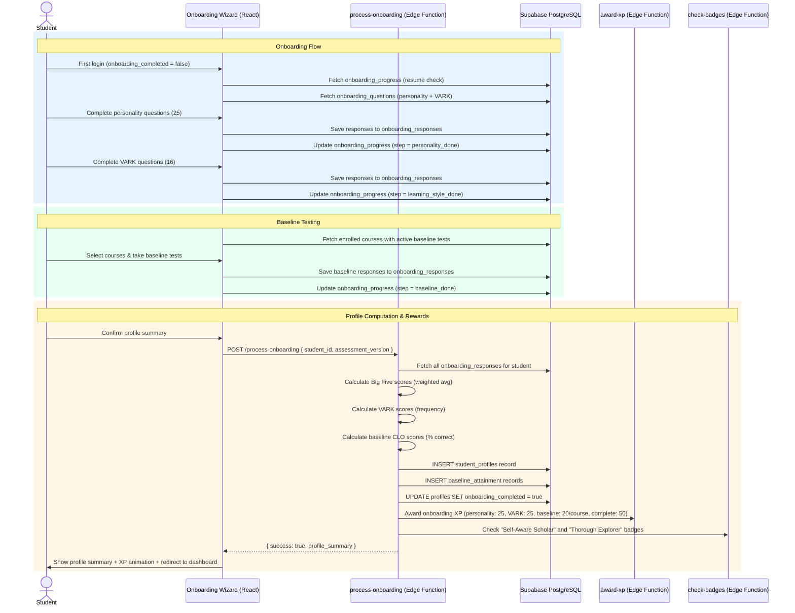

# Design Document — Student Onboarding & Profiling

## Overview

This design covers the Student Onboarding & Profiling feature for the Edeviser platform — a multi-step wizard that captures personality traits (Big Five), learning style preferences (VARK), and baseline competency levels (CLO-mapped diagnostic tests) for new students. The feature adds:

1. A full-screen onboarding wizard triggered when `onboarding_completed = false`, with step-by-step navigation, progress tracking, and resume-on-return capability
2. A personality assessment engine (25 questions, 5 Big Five dimensions, Likert scale scoring)
3. A learning style detector (16 questions, 4 VARK modalities, frequency-based scoring) — repositioned as an optional self-awareness exercise, not used for content adaptation
4. A baseline testing system with CLO-mapped multiple-choice questions, configurable time limits, and auto-submission
5. A Profile Engine (Edge Function) that validates responses, calculates scores, persists profiles, and triggers XP/badge awards
6. Dashboard integration with a Profile Summary Card (radar chart for Big Five, dominant VARK display)
7. Teacher views for baseline results and Admin views for onboarding analytics
8. Re-assessment flow with 90-day cooldown and version history
9. Evidence-based profiling instruments: Self-Efficacy Scale (6 items, Bandura 1997) and Study Strategy Inventory (8 items, 4 dimensions) as primary adaptive engine inputs
10. Progressive profiling: Day 1 minimal onboarding (7 questions, under 3 minutes) with remaining profiling delivered as daily micro-assessments over 14 days
11. AI-generated Starter Week Plan: 3–5 study sessions pre-populated into the weekly planner based on enrolled courses, deadlines, cohort patterns, and self-efficacy score
12. Goal-setting scaffolding: AI-suggested weekly goals with difficulty indicators, SMART templates, and cohort-based calibration

The system integrates with the existing auth flow (`onboarding_completed` flag on `profiles`), gamification engine (XP awards, badge checks), OBE outcome hierarchy (CLO-based baseline testing), weekly planner, and Supabase Auth/RLS.

### Key Design Decisions

| Decision | Choice | Rationale |
|----------|--------|-----------|
| Assessment storage | Database-driven Question_Bank | Allows institutional customization without code changes |
| Personality model | Big Five (OCEAN) | Well-validated, widely used in educational psychology |
| Learning style model | VARK (self-awareness only) | Repositioned as optional self-reflection; not used for content adaptation per Pashler et al. (2008) |
| Primary adaptive inputs | Self-Efficacy Scale + Study Strategy Inventory | Evidence-based instruments with validated predictive power for academic outcomes |
| Score calculation | Edge Function (Profile_Engine) | Server-side ensures consistency; client cannot tamper with scores |
| Progress persistence | `onboarding_progress` table | Survives browser close, logout, device switch |
| Baseline test format | Multiple-choice only | Simple to auto-grade, sufficient for diagnostic purposes |
| Profile versioning | assessment_version column | Preserves history for re-assessment comparison |
| Profile privacy | Student-only RLS + aggregate views for staff | Balances personalization with privacy |
| Wizard UI | Full-screen overlay with step navigation | Prevents dashboard access until onboarding is complete |
| Re-assessment cooldown | 90 days, enforced server-side | Prevents gaming while allowing genuine profile updates |
| Onboarding length | Day 1: 7 questions (under 3 min) | Reduces drop-off risk; industry data shows 40-60% abandon long onboarding flows |
| Progressive profiling | Micro-assessments over 14 days | Distributes cognitive load; XP rewards maintain engagement |
| Starter Week Plan | AI-generated via Edge Function | Scaffolds self-regulated learning for novice planners (Zimmerman, 1989) |
| Goal suggestions | Cohort-based difficulty indicators | Calibrates student expectations using historical completion rates |
| SMART templates | Structured form with pre-filled fields | Reduces blank-page anxiety; teaches goal-setting by example |

## Architecture

### High-Level Data Flow



### Component Architecture

```
src/
├── pages/student/onboarding/
│   ├── OnboardingWizard.tsx          # Full-screen wizard container with step navigation
│   ├── WelcomeStep.tsx               # Welcome message, time estimate, XP preview
│   ├── PersonalityStep.tsx           # Big Five questionnaire (25 questions, Likert scale)
│   ├── LearningStyleStep.tsx         # VARK questionnaire (16 questions, 4 options each)
│   ├── SelfEfficacyStep.tsx          # Self-efficacy scale (6 items, Likert scale)
│   ├── StudyStrategyStep.tsx         # Study strategy inventory (8 items, 4 dimensions)
│   ├── BaselineSelectStep.tsx        # Course selection for baseline tests
│   ├── BaselineTestStep.tsx          # Timed baseline test per course
│   ├── ProfileSummaryStep.tsx        # Results display + confirmation
│   └── CompleteProfilePage.tsx       # "Complete My Profile" page for remaining micro-assessments
├── components/shared/
│   ├── ProfileSummaryCard.tsx        # Dashboard card with radar chart + VARK display
│   ├── LikertScale.tsx              # Reusable 5-point Likert scale input
│   ├── QuestionCard.tsx             # Single question display with options
│   ├── AssessmentTimer.tsx          # Countdown timer for baseline tests
│   ├── MicroAssessmentCard.tsx      # Dashboard prompt card for daily micro-assessments
│   ├── ProfileCompletenessBar.tsx   # Progress bar showing profiling completion %
│   ├── StarterWeekHeroCard.tsx      # Dashboard hero card for AI-generated starter week plan
│   ├── GoalSuggestionPanel.tsx      # Panel showing AI-suggested goals with difficulty indicators
│   ├── SmartGoalForm.tsx            # SMART goal template form with pre-filled fields
│   └── GoalDifficultyBadge.tsx      # Visual badge for goal difficulty (Easy/Moderate/Ambitious)
├── hooks/
│   ├── useOnboardingProgress.ts     # Progress tracking CRUD
│   ├── useOnboardingQuestions.ts    # Question bank queries
│   ├── useOnboardingResponses.ts   # Response persistence
│   ├── useStudentProfile.ts        # Profile data queries
│   ├── useBaselineTests.ts         # Baseline test config + results
│   ├── useMicroAssessments.ts      # Micro-assessment schedule, delivery, and completion
│   ├── useProfileCompleteness.ts   # Profile completeness calculation and tracking
│   ├── useStarterWeekPlan.ts       # Starter week plan queries and session management
│   └── useGoalSuggestions.ts       # AI goal suggestions, SMART templates, difficulty indicators
├── lib/
│   ├── onboardingSchemas.ts        # Zod schemas for all onboarding payloads
│   ├── scoreCalculator.ts          # Big Five + VARK + baseline + self-efficacy + study strategy score computation
│   ├── onboardingConstants.ts      # Step definitions, XP amounts, cooldown config, micro-assessment schedule
│   ├── profileCompleteness.ts      # Profile completeness calculation logic
│   └── goalTemplates.ts            # SMART goal template composition and difficulty classification
├── pages/teacher/baseline/
│   └── BaselineResultsPage.tsx     # Teacher view of baseline results per course
├── pages/student/settings/
│   └── ReassessmentPage.tsx        # Re-assessment flow with cooldown check
supabase/functions/
├── process-onboarding/index.ts     # Score calculation, profile persistence, XP/badge triggers
├── generate-starter-week/index.ts  # AI-generated starter week plan based on profile + courses + deadlines
└── suggest-goals/index.ts          # AI goal suggestions with cohort-based difficulty indicators
```

## Components and Interfaces

### Edge Function: `process-onboarding`

The primary Edge Function that processes all onboarding assessment data, calculates scores, and persists the student profile.

```typescript
// Request payload
interface ProcessOnboardingRequest {
  student_id: string;
  assessment_version: number;
  skipped_sections: ('personality' | 'learning_style' | 'baseline' | 'self_efficacy' | 'study_strategy')[];
  baseline_course_ids: string[];  // courses the student took baseline tests for
  is_day1: boolean;               // true for Day 1 minimal onboarding, false for full/re-assessment
}

// Response payload
interface ProcessOnboardingResponse {
  success: boolean;
  profile: {
    personality_traits: BigFiveTraits | null;
    learning_style: VARKProfile | null;
    self_efficacy: SelfEfficacyProfile | null;
    study_strategies: StudyStrategyProfile | null;
    baseline_scores: BaselineResult[];
    profile_completeness: number;
  };
  xp_awarded: number;
  badges_earned: string[];
}

interface BigFiveTraits {
  openness: number;        // 0-100
  conscientiousness: number;
  extraversion: number;
  agreeableness: number;
  neuroticism: number;
}

interface VARKProfile {
  visual: number;          // 0-100
  auditory: number;
  read_write: number;
  kinesthetic: number;
  dominant_style: 'visual' | 'auditory' | 'read_write' | 'kinesthetic' | 'multimodal';
}

interface SelfEfficacyProfile {
  overall: number;                  // 0-100
  general_academic: number;         // 0-100
  course_specific: number;          // 0-100
  self_regulated_learning: number;  // 0-100
}

interface StudyStrategyProfile {
  time_management: number;   // 0-100
  elaboration: number;       // 0-100
  self_testing: number;      // 0-100
  help_seeking: number;      // 0-100
}

interface BaselineResult {
  course_id: string;
  clo_scores: Array<{ clo_id: string; score: number }>;
}
```

Processing pipeline:
1. Validate JWT → extract `student_id` from token
2. Verify `student_id` matches the request (prevent profile creation for other students)
3. Fetch all `onboarding_responses` for this student and assessment_version
4. Fetch `onboarding_questions` to validate responses against active questions
5. Calculate Big Five Trait_Scores (weighted average per dimension, normalized to 0–100) — partial scores if Day 1 (3 items only)
6. Calculate Self-Efficacy scores (mean per domain, normalized to 0–100) — partial scores if Day 1 (2 items only)
7. Calculate Study Strategy dimension scores (mean per dimension, normalized to 0–100) — null if not yet completed
8. Calculate VARK_Scores (frequency per modality, normalized to 0–100) — null if not yet completed
9. Determine dominant learning style (highest score, or 'multimodal' if within 10 points)
10. Calculate Baseline_Scores per CLO (% correct per CLO) — null if not yet completed
11. Calculate `profile_completeness` percentage based on completed dimensions
12. INSERT/UPSERT into `student_profiles` (personality_traits, learning_style, self_efficacy, study_strategies JSONB, profile_completeness)
13. INSERT into `baseline_attainment` (one row per student × course × CLO) if baseline completed
14. UPDATE `profiles` SET `onboarding_completed = true`
15. If Day 1: generate micro-assessment schedule (INSERT into `micro_assessment_schedule`)
16. If Day 1: invoke `generate-starter-week` Edge Function
17. Invoke `award-xp` for each completed section + completion bonus
18. Invoke `check-badges` for "Self-Aware Scholar" and "Thorough Explorer"

### React Components

**OnboardingWizard** — Full-screen overlay container:
- Renders when `onboarding_completed = false` (checked via AuthProvider)
- Step navigation with back/next buttons and progress bar
- Persists progress to `onboarding_progress` on each step completion
- Resumes from last completed step on mount (fetches `onboarding_progress`)
- "Skip for Now" button on each assessment section
- Blocks dashboard access (renders above StudentLayout)

**PersonalityStep** — Big Five questionnaire:
- Fetches 25 personality questions from `onboarding_questions`
- Displays one question at a time with LikertScale component
- Smooth Framer Motion transitions between questions
- Saves responses to `onboarding_responses` in batches of 5 (per dimension)
- Shows dimension progress (e.g., "Question 3 of 5 — Openness")

**LearningStyleStep** — VARK questionnaire:
- Fetches 16 learning style questions from `onboarding_questions`
- Displays one question at a time with 4 radio options
- Each option maps to a VARK modality (mapping stored in question metadata)
- Saves responses on completion of all 16 questions

**BaselineSelectStep** — Course selection:
- Fetches enrolled courses with `baseline_test_active = true`
- Displays course cards with test info (question count, time limit)
- Checkbox selection for multiple courses
- "Skip Baseline Tests" button

**BaselineTestStep** — Timed test per course:
- Fetches baseline questions for selected course from `onboarding_questions`
- Groups questions by CLO with CLO title headers
- AssessmentTimer countdown (configurable per course)
- Auto-submits on timer expiry
- Saves responses immediately on submission

**ProfileSummaryStep** — Results display:
- Radar chart (Recharts) for Big Five traits
- VARK dominant style with icon and description
- Baseline scores per course/CLO as progress bars
- "Confirm & Continue" button triggers `process-onboarding` Edge Function
- XP award animation (XPAwardToast) and badge pop on success

**ProfileSummaryCard** — Dashboard widget:
- Compact radar chart for Big Five
- Dominant VARK style badge with description
- "Retake Assessment" link
- "Complete Assessment" prompt for skipped sections

**LikertScale** — Reusable input:
- 5 radio buttons with labels (Strongly Disagree → Strongly Agree)
- Accessible with keyboard navigation and ARIA labels
- Visual highlight on selected option

**AssessmentTimer** — Countdown component:
- Displays remaining time in MM:SS format
- Warning state (red) when < 2 minutes remaining
- Calls `onExpire` callback when timer reaches 0
- Pauses when browser tab is hidden (visibility API), resumes on focus

### TanStack Query Hooks

```typescript
// useOnboardingProgress.ts
export const useOnboardingProgress = (studentId: string) => useQuery({...});
export const useUpdateProgress = () => useMutation({...});

// useOnboardingQuestions.ts
export const usePersonalityQuestions = () => useQuery({...});
export const useLearningStyleQuestions = () => useQuery({...});
export const useBaselineQuestions = (courseId: string) => useQuery({...});

// useOnboardingResponses.ts
export const useSaveResponses = () => useMutation({...});

// useStudentProfile.ts
export const useStudentProfile = (studentId: string) => useQuery({...});
export const useProcessOnboarding = () => useMutation({...}); // calls Edge Function

// useBaselineTests.ts
export const useBaselineTestConfig = (courseId: string) => useQuery({...});
export const useBaselineResults = (courseId: string) => useQuery({...}); // teacher view
export const useCourseBaselineStats = (courseId: string) => useQuery({...}); // aggregate
```

### Zod Schemas

```typescript
// onboardingSchemas.ts
export const likertResponseSchema = z.object({
  question_id: z.string().uuid(),
  selected_option: z.number().int().min(1).max(5), // 1=Strongly Disagree, 5=Strongly Agree
});

export const varkResponseSchema = z.object({
  question_id: z.string().uuid(),
  selected_option: z.number().int().min(0).max(3), // index of the 4 VARK options
});

export const baselineResponseSchema = z.object({
  question_id: z.string().uuid(),
  selected_option: z.number().int().min(0).max(3), // index of 4 answer options
});

export const saveResponsesSchema = z.object({
  student_id: z.string().uuid(),
  assessment_type: z.enum(['personality', 'learning_style', 'baseline', 'self_efficacy', 'study_strategy']),
  assessment_version: z.number().int().min(1),
  course_id: z.string().uuid().optional(), // required for baseline
  responses: z.array(z.union([likertResponseSchema, varkResponseSchema, baselineResponseSchema])).min(1),
});

export const processOnboardingSchema = z.object({
  student_id: z.string().uuid(),
  assessment_version: z.number().int().min(1),
  skipped_sections: z.array(z.enum(['personality', 'learning_style', 'baseline', 'self_efficacy', 'study_strategy'])),
  baseline_course_ids: z.array(z.string().uuid()),
  is_day1: z.boolean().default(false),
});

export const baselineQuestionSchema = z.object({
  question_text: z.string().min(10).max(1000),
  options: z.array(z.string().min(1).max(500)).length(4),
  correct_option: z.number().int().min(0).max(3),
  clo_id: z.string().uuid(),
  difficulty_level: z.enum(['easy', 'medium', 'hard']),
});

export const baselineTestConfigSchema = z.object({
  course_id: z.string().uuid(),
  time_limit_minutes: z.number().int().min(5).max(60).default(15),
  is_active: z.boolean(),
});

export const selfEfficacyResponseSchema = z.object({
  question_id: z.string().uuid(),
  selected_option: z.number().int().min(1).max(5), // 1=Not at all confident, 5=Extremely confident
});

export const studyStrategyResponseSchema = z.object({
  question_id: z.string().uuid(),
  selected_option: z.number().int().min(1).max(5), // 1=Never, 5=Always
});

export const starterWeekSessionSchema = z.object({
  course_id: z.string().uuid().nullable(),
  session_type: z.enum(['reading', 'practice', 'review', 'exploration']),
  suggested_date: z.string().date(),
  suggested_time_slot: z.enum(['morning', 'afternoon', 'evening']),
  duration_minutes: z.number().int().min(25).max(50),
  description: z.string().min(10).max(500),
});

export const goalSuggestionSchema = z.object({
  goal_text: z.string().min(10).max(500),
  smart_specific: z.string().optional(),
  smart_measurable: z.string().optional(),
  smart_achievable: z.string().optional(),
  smart_relevant: z.string().optional(),
  smart_timebound: z.string().date().optional(),
  difficulty: z.enum(['easy', 'moderate', 'ambitious']),
});

export const smartGoalTemplateSchema = z.object({
  specific: z.string().min(5).max(200),
  measurable: z.string().min(5).max(200),
  achievable: z.string().min(5).max(200),
  relevant: z.string().min(1).max(200),  // course name or CLO reference
  timebound: z.string().date(),
});
```

## Data Models

### New Database Tables

```sql
-- ============================================================
-- onboarding_questions — Question bank for all assessments
-- ============================================================
CREATE TABLE onboarding_questions (
  id UUID PRIMARY KEY DEFAULT gen_random_uuid(),
  institution_id UUID NOT NULL REFERENCES institutions(id),
  assessment_type VARCHAR(20) NOT NULL CHECK (assessment_type IN (
    'personality', 'learning_style', 'baseline', 'self_efficacy', 'study_strategy'
  )),
  question_text TEXT NOT NULL,
  -- Personality fields
  dimension VARCHAR(30) CHECK (dimension IN (
    'openness', 'conscientiousness', 'extraversion', 'agreeableness', 'neuroticism'
  )),
  weight SMALLINT CHECK (weight IN (-1, 1)),  -- scoring direction for personality
  -- Learning style fields
  options JSONB,  -- array of { option_text, modality } for VARK; array of { option_text } for baseline
  -- Baseline fields
  correct_option SMALLINT CHECK (correct_option >= 0 AND correct_option <= 3),
  clo_id UUID REFERENCES learning_outcomes(id),
  course_id UUID REFERENCES courses(id),
  difficulty_level VARCHAR(10) CHECK (difficulty_level IN ('easy', 'medium', 'hard')),
  -- Common fields
  sort_order INTEGER NOT NULL DEFAULT 0,
  is_active BOOLEAN NOT NULL DEFAULT true,
  created_at TIMESTAMPTZ NOT NULL DEFAULT now(),
  updated_at TIMESTAMPTZ NOT NULL DEFAULT now()
);

CREATE INDEX idx_questions_type ON onboarding_questions (institution_id, assessment_type, is_active);
CREATE INDEX idx_questions_course ON onboarding_questions (course_id) WHERE assessment_type = 'baseline';

-- ============================================================
-- onboarding_responses — Individual student answers
-- ============================================================
CREATE TABLE onboarding_responses (
  id UUID PRIMARY KEY DEFAULT gen_random_uuid(),
  student_id UUID NOT NULL REFERENCES profiles(id),
  question_id UUID NOT NULL REFERENCES onboarding_questions(id),
  assessment_version INTEGER NOT NULL DEFAULT 1,
  selected_option SMALLINT NOT NULL,
  score_contribution NUMERIC(5,2),  -- computed score value for this response
  created_at TIMESTAMPTZ NOT NULL DEFAULT now(),
  UNIQUE (student_id, question_id, assessment_version)
);

CREATE INDEX idx_responses_student ON onboarding_responses (student_id, assessment_version);

-- ============================================================
-- onboarding_progress — Step tracking for resume capability
-- ============================================================
CREATE TABLE onboarding_progress (
  id UUID PRIMARY KEY DEFAULT gen_random_uuid(),
  student_id UUID NOT NULL REFERENCES profiles(id),
  current_step VARCHAR(30) NOT NULL DEFAULT 'welcome' CHECK (current_step IN (
    'welcome', 'personality', 'self_efficacy', 'learning_style', 'study_strategy',
    'baseline_select', 'baseline_test', 'summary'
  )),
  personality_completed BOOLEAN NOT NULL DEFAULT false,
  learning_style_completed BOOLEAN NOT NULL DEFAULT false,
  self_efficacy_completed BOOLEAN NOT NULL DEFAULT false,
  study_strategy_completed BOOLEAN NOT NULL DEFAULT false,
  baseline_completed BOOLEAN NOT NULL DEFAULT false,
  baseline_course_ids UUID[] DEFAULT '{}',
  skipped_sections TEXT[] DEFAULT '{}',
  assessment_version INTEGER NOT NULL DEFAULT 1,
  -- Progressive profiling fields
  day1_completed BOOLEAN NOT NULL DEFAULT false,
  micro_assessment_day INTEGER NOT NULL DEFAULT 0,  -- current day in the 14-day schedule
  micro_assessment_dismissals INTEGER NOT NULL DEFAULT 0,  -- consecutive dismissals for current micro
  profile_completeness INTEGER NOT NULL DEFAULT 0,
  created_at TIMESTAMPTZ NOT NULL DEFAULT now(),
  updated_at TIMESTAMPTZ NOT NULL DEFAULT now(),
  UNIQUE (student_id)
);

-- ============================================================
-- student_profiles — Computed assessment results
-- ============================================================
CREATE TABLE student_profiles (
  id UUID PRIMARY KEY DEFAULT gen_random_uuid(),
  student_id UUID NOT NULL REFERENCES profiles(id),
  institution_id UUID NOT NULL REFERENCES institutions(id),
  personality_traits JSONB,  -- { openness, conscientiousness, extraversion, agreeableness, neuroticism }
  learning_style JSONB,      -- { visual, auditory, read_write, kinesthetic, dominant_style }
  self_efficacy JSONB,       -- { overall, general_academic, course_specific, self_regulated_learning }
  study_strategies JSONB,    -- { time_management, elaboration, self_testing, help_seeking }
  profile_completeness INTEGER NOT NULL DEFAULT 0 CHECK (profile_completeness >= 0 AND profile_completeness <= 100),
  assessment_version INTEGER NOT NULL DEFAULT 1,
  completed_at TIMESTAMPTZ NOT NULL DEFAULT now(),
  created_at TIMESTAMPTZ NOT NULL DEFAULT now(),
  UNIQUE (student_id, assessment_version)
);

CREATE INDEX idx_profiles_student ON student_profiles (student_id, assessment_version DESC);
CREATE INDEX idx_profiles_institution ON student_profiles (institution_id);

-- ============================================================
-- baseline_attainment — Per-CLO baseline scores
-- ============================================================
CREATE TABLE baseline_attainment (
  id UUID PRIMARY KEY DEFAULT gen_random_uuid(),
  student_id UUID NOT NULL REFERENCES profiles(id),
  course_id UUID NOT NULL REFERENCES courses(id),
  clo_id UUID NOT NULL REFERENCES learning_outcomes(id),
  score NUMERIC(5,2) NOT NULL CHECK (score >= 0 AND score <= 100),
  question_count INTEGER NOT NULL,
  correct_count INTEGER NOT NULL,
  assessment_version INTEGER NOT NULL DEFAULT 1,
  created_at TIMESTAMPTZ NOT NULL DEFAULT now(),
  UNIQUE (student_id, course_id, clo_id)
);

CREATE INDEX idx_baseline_student ON baseline_attainment (student_id, course_id);
CREATE INDEX idx_baseline_course ON baseline_attainment (course_id, clo_id);

-- ============================================================
-- baseline_test_config — Per-course baseline test settings
-- ============================================================
CREATE TABLE baseline_test_config (
  id UUID PRIMARY KEY DEFAULT gen_random_uuid(),
  course_id UUID NOT NULL REFERENCES courses(id) UNIQUE,
  time_limit_minutes INTEGER NOT NULL DEFAULT 15 CHECK (time_limit_minutes >= 5 AND time_limit_minutes <= 60),
  is_active BOOLEAN NOT NULL DEFAULT false,
  min_questions_per_clo INTEGER NOT NULL DEFAULT 2,
  created_at TIMESTAMPTZ NOT NULL DEFAULT now(),
  updated_at TIMESTAMPTZ NOT NULL DEFAULT now()
);

-- ============================================================
-- micro_assessment_schedule — Tracks daily micro-assessment delivery
-- ============================================================
CREATE TABLE micro_assessment_schedule (
  id UUID PRIMARY KEY DEFAULT gen_random_uuid(),
  student_id UUID NOT NULL REFERENCES profiles(id),
  scheduled_day INTEGER NOT NULL CHECK (scheduled_day >= 1 AND scheduled_day <= 14),
  assessment_type VARCHAR(20) NOT NULL CHECK (assessment_type IN (
    'personality', 'self_efficacy', 'study_strategy', 'learning_style', 'baseline_prompt'
  )),
  question_ids UUID[] NOT NULL DEFAULT '{}',
  status VARCHAR(20) NOT NULL DEFAULT 'pending' CHECK (status IN ('pending', 'completed', 'skipped', 'dismissed')),
  dismissal_count INTEGER NOT NULL DEFAULT 0,
  scheduled_at DATE NOT NULL,
  completed_at TIMESTAMPTZ,
  created_at TIMESTAMPTZ NOT NULL DEFAULT now(),
  UNIQUE (student_id, scheduled_day)
);

CREATE INDEX idx_micro_schedule_student ON micro_assessment_schedule (student_id, status, scheduled_at);

-- ============================================================
-- starter_week_sessions — AI-generated study sessions for first week
-- ============================================================
CREATE TABLE starter_week_sessions (
  id UUID PRIMARY KEY DEFAULT gen_random_uuid(),
  student_id UUID NOT NULL REFERENCES profiles(id),
  course_id UUID REFERENCES courses(id),  -- null for generic sessions
  session_type VARCHAR(20) NOT NULL CHECK (session_type IN ('reading', 'practice', 'review', 'exploration')),
  suggested_date DATE NOT NULL,
  suggested_time_slot VARCHAR(10) NOT NULL CHECK (suggested_time_slot IN ('morning', 'afternoon', 'evening')),
  duration_minutes INTEGER NOT NULL CHECK (duration_minutes >= 25 AND duration_minutes <= 50),
  description TEXT NOT NULL,
  status VARCHAR(20) NOT NULL DEFAULT 'suggested' CHECK (status IN ('suggested', 'accepted', 'modified', 'dismissed', 'completed')),
  planner_entry_id UUID,  -- FK to weekly planner entry once accepted
  created_at TIMESTAMPTZ NOT NULL DEFAULT now(),
  updated_at TIMESTAMPTZ NOT NULL DEFAULT now()
);

CREATE INDEX idx_starter_sessions_student ON starter_week_sessions (student_id, status);

-- ============================================================
-- goal_suggestions — AI-suggested weekly goals with difficulty indicators
-- ============================================================
CREATE TABLE goal_suggestions (
  id UUID PRIMARY KEY DEFAULT gen_random_uuid(),
  student_id UUID NOT NULL REFERENCES profiles(id),
  week_start DATE NOT NULL,
  goal_text TEXT NOT NULL,
  smart_specific TEXT,
  smart_measurable TEXT,
  smart_achievable TEXT,
  smart_relevant TEXT,  -- course_id or CLO reference
  smart_timebound DATE,
  difficulty VARCHAR(10) NOT NULL CHECK (difficulty IN ('easy', 'moderate', 'ambitious')),
  cohort_completion_rate NUMERIC(5,2),  -- historical % of similar students who completed this goal type
  status VARCHAR(20) NOT NULL DEFAULT 'suggested' CHECK (status IN ('suggested', 'accepted', 'modified', 'dismissed')),
  created_at TIMESTAMPTZ NOT NULL DEFAULT now()
);

CREATE INDEX idx_goal_suggestions_student ON goal_suggestions (student_id, week_start, status);
```

### RLS Policies

```sql
-- ============================================================
-- onboarding_questions — RLS
-- ============================================================
ALTER TABLE onboarding_questions ENABLE ROW LEVEL SECURITY;

-- Students can read active questions for their institution
CREATE POLICY "questions_student_read" ON onboarding_questions
  FOR SELECT USING (
    auth_user_role() = 'student'
    AND institution_id = auth_institution_id()
    AND is_active = true
  );

-- Teachers can manage baseline questions for their courses
CREATE POLICY "questions_teacher_manage" ON onboarding_questions
  FOR ALL USING (
    auth_user_role() = 'teacher'
    AND assessment_type = 'baseline'
    AND course_id IN (SELECT id FROM courses WHERE teacher_id = auth.uid())
  );

-- Admins can manage all questions in their institution
CREATE POLICY "questions_admin_all" ON onboarding_questions
  FOR ALL USING (
    auth_user_role() = 'admin'
    AND institution_id = auth_institution_id()
  );

-- ============================================================
-- onboarding_responses — RLS (student-private)
-- ============================================================
ALTER TABLE onboarding_responses ENABLE ROW LEVEL SECURITY;

CREATE POLICY "responses_student_own" ON onboarding_responses
  FOR ALL USING (student_id = auth.uid());

-- ============================================================
-- onboarding_progress — RLS (student-private)
-- ============================================================
ALTER TABLE onboarding_progress ENABLE ROW LEVEL SECURITY;

CREATE POLICY "progress_student_own" ON onboarding_progress
  FOR ALL USING (student_id = auth.uid());

-- ============================================================
-- student_profiles — RLS (student-private, aggregate for staff)
-- ============================================================
ALTER TABLE student_profiles ENABLE ROW LEVEL SECURITY;

CREATE POLICY "profiles_student_own" ON student_profiles
  FOR ALL USING (student_id = auth.uid());

-- Admins can read profiles in their institution (for aggregate analytics only — enforced at app level)
CREATE POLICY "profiles_admin_read" ON student_profiles
  FOR SELECT USING (
    auth_user_role() = 'admin'
    AND institution_id = auth_institution_id()
  );

-- ============================================================
-- baseline_attainment — RLS
-- ============================================================
ALTER TABLE baseline_attainment ENABLE ROW LEVEL SECURITY;

-- Students can read their own baseline scores
CREATE POLICY "baseline_student_own" ON baseline_attainment
  FOR SELECT USING (student_id = auth.uid());

-- Teachers can read baseline scores for their courses
CREATE POLICY "baseline_teacher_read" ON baseline_attainment
  FOR SELECT USING (
    auth_user_role() = 'teacher'
    AND course_id IN (SELECT id FROM courses WHERE teacher_id = auth.uid())
  );

-- Admins can read all baseline scores in their institution
CREATE POLICY "baseline_admin_read" ON baseline_attainment
  FOR SELECT USING (
    auth_user_role() = 'admin'
    AND course_id IN (SELECT id FROM courses WHERE institution_id = auth_institution_id())
  );

-- ============================================================
-- baseline_test_config — RLS
-- ============================================================
ALTER TABLE baseline_test_config ENABLE ROW LEVEL SECURITY;

-- Students can read config for enrolled courses
CREATE POLICY "config_student_read" ON baseline_test_config
  FOR SELECT USING (
    auth_user_role() = 'student'
    AND course_id IN (SELECT course_id FROM student_courses WHERE student_id = auth.uid())
  );

-- Teachers can manage config for their courses
CREATE POLICY "config_teacher_manage" ON baseline_test_config
  FOR ALL USING (
    auth_user_role() = 'teacher'
    AND course_id IN (SELECT id FROM courses WHERE teacher_id = auth.uid())
  );

-- Admins can manage all config in their institution
CREATE POLICY "config_admin_all" ON baseline_test_config
  FOR ALL USING (
    auth_user_role() = 'admin'
    AND course_id IN (SELECT id FROM courses WHERE institution_id = auth_institution_id())
  );

-- ============================================================
-- micro_assessment_schedule — RLS (student-private)
-- ============================================================
ALTER TABLE micro_assessment_schedule ENABLE ROW LEVEL SECURITY;

CREATE POLICY "micro_schedule_student_own" ON micro_assessment_schedule
  FOR ALL USING (student_id = auth.uid());

-- ============================================================
-- starter_week_sessions — RLS (student-private)
-- ============================================================
ALTER TABLE starter_week_sessions ENABLE ROW LEVEL SECURITY;

CREATE POLICY "starter_sessions_student_own" ON starter_week_sessions
  FOR ALL USING (student_id = auth.uid());

-- ============================================================
-- goal_suggestions — RLS (student-private)
-- ============================================================
ALTER TABLE goal_suggestions ENABLE ROW LEVEL SECURITY;

CREATE POLICY "goal_suggestions_student_own" ON goal_suggestions
  FOR ALL USING (student_id = auth.uid());
```

### Score Calculation Logic

```typescript
// scoreCalculator.ts

/**
 * Big Five Trait Score Calculation
 * 
 * Each dimension has 5 questions. Each question has a weight of +1 or -1.
 * Likert scale: 1 (Strongly Disagree) to 5 (Strongly Agree).
 * For weight=+1: score_contribution = selected_option (1-5)
 * For weight=-1: score_contribution = 6 - selected_option (reverse-scored)
 * 
 * Trait_Score = (sum of score_contributions for dimension / (5 * 5)) * 100
 * where 5 questions * max 5 per question = 25 max per dimension
 */
export function calculateBigFiveScores(
  responses: Array<{ dimension: string; selected_option: number; weight: number }>
): BigFiveTraits {
  const dimensions = ['openness', 'conscientiousness', 'extraversion', 'agreeableness', 'neuroticism'];
  const scores: Record<string, number> = {};

  for (const dim of dimensions) {
    const dimResponses = responses.filter(r => r.dimension === dim);
    const sum = dimResponses.reduce((acc, r) => {
      const contribution = r.weight === 1 ? r.selected_option : 6 - r.selected_option;
      return acc + contribution;
    }, 0);
    const maxPossible = dimResponses.length * 5;
    scores[dim] = maxPossible > 0 ? Math.round((sum / maxPossible) * 100) : 0;
  }

  return scores as unknown as BigFiveTraits;
}

/**
 * VARK Score Calculation
 * 
 * Each of 16 questions has 4 options, each mapped to a VARK modality.
 * Student selects one option per question.
 * VARK_Score = (count of selections for modality / 16) * 100
 * 
 * Dominant style = modality with highest score.
 * Multimodal = two or more modalities within 10 points of each other at the top.
 */
export function calculateVARKScores(
  responses: Array<{ selected_modality: string }>,
  totalQuestions: number
): VARKProfile {
  const modalities = ['visual', 'auditory', 'read_write', 'kinesthetic'];
  const counts: Record<string, number> = { visual: 0, auditory: 0, read_write: 0, kinesthetic: 0 };

  for (const r of responses) {
    if (r.selected_modality in counts) {
      counts[r.selected_modality]++;
    }
  }

  const scores: Record<string, number> = {};
  for (const mod of modalities) {
    scores[mod] = Math.round((counts[mod] / totalQuestions) * 100);
  }

  // Determine dominant style
  const maxScore = Math.max(...Object.values(scores));
  const topModalities = modalities.filter(m => maxScore - scores[m] <= 10);
  const dominant_style = topModalities.length >= 2 ? 'multimodal' : modalities.reduce((a, b) => scores[a] > scores[b] ? a : b);

  return { ...scores, dominant_style } as unknown as VARKProfile;
}

/**
 * Baseline Score Calculation
 * 
 * Per CLO: score = (correct_count / total_questions_for_clo) * 100
 */
export function calculateBaselineScores(
  responses: Array<{ clo_id: string; selected_option: number; correct_option: number }>
): Array<{ clo_id: string; score: number; question_count: number; correct_count: number }> {
  const cloMap = new Map<string, { total: number; correct: number }>();

  for (const r of responses) {
    const entry = cloMap.get(r.clo_id) ?? { total: 0, correct: 0 };
    entry.total++;
    if (r.selected_option === r.correct_option) entry.correct++;
    cloMap.set(r.clo_id, entry);
  }

  return Array.from(cloMap.entries()).map(([clo_id, { total, correct }]) => ({
    clo_id,
    score: Math.round((correct / total) * 100),
    question_count: total,
    correct_count: correct,
  }));
}
```

### Onboarding Constants

```typescript
// onboardingConstants.ts

export const ONBOARDING_STEPS = [
  'welcome',
  'personality',
  'learning_style',
  'baseline_select',
  'baseline_test',
  'summary',
] as const;

export type OnboardingStepId = typeof ONBOARDING_STEPS[number];

export const ONBOARDING_XP = {
  personality: 25,
  learning_style: 25,
  baseline_per_course: 20,
  completion_bonus: 50,
} as const;

export const REASSESSMENT_COOLDOWN_DAYS = 90;

export const PERSONALITY_QUESTIONS_PER_DIMENSION = 5;
export const TOTAL_PERSONALITY_QUESTIONS = 25;
export const TOTAL_VARK_QUESTIONS = 16;
export const VARK_OPTIONS_PER_QUESTION = 4;

export const VARK_DESCRIPTIONS: Record<string, { icon: string; label: string; description: string }> = {
  visual: {
    icon: '👁️',
    label: 'Visual Learner',
    description: 'You learn best through diagrams, charts, and spatial understanding.',
  },
  auditory: {
    icon: '👂',
    label: 'Auditory Learner',
    description: 'You learn best through listening, discussion, and verbal explanation.',
  },
  read_write: {
    icon: '📖',
    label: 'Read/Write Learner',
    description: 'You learn best through reading text and writing notes.',
  },
  kinesthetic: {
    icon: '🤲',
    label: 'Kinesthetic Learner',
    description: 'You learn best through hands-on practice and real-world application.',
  },
  multimodal: {
    icon: '🎯',
    label: 'Multimodal Learner',
    description: 'You learn effectively through multiple modalities — a versatile learner.',
  },
};

export const BIG_FIVE_LABELS: Record<string, string> = {
  openness: 'Openness',
  conscientiousness: 'Conscientiousness',
  extraversion: 'Extraversion',
  agreeableness: 'Agreeableness',
  neuroticism: 'Neuroticism',
};
```

### New Score Calculation Functions

```typescript
// scoreCalculator.ts — additions

/**
 * Self-Efficacy Score Calculation
 * 
 * 6 items across 3 domains (2 per domain). Likert 1–5.
 * Domain score = (sum of items in domain / (count * 5)) * 100
 * Overall = mean of all 6 items normalized to 0–100
 */
export function calculateSelfEfficacyScores(
  responses: Array<{ domain: string; selected_option: number }>
): SelfEfficacyProfile {
  const domains = ['general_academic', 'course_specific', 'self_regulated_learning'];
  const scores: Record<string, number> = {};

  for (const domain of domains) {
    const domainResponses = responses.filter(r => r.domain === domain);
    const sum = domainResponses.reduce((acc, r) => acc + r.selected_option, 0);
    const maxPossible = domainResponses.length * 5;
    scores[domain] = maxPossible > 0 ? Math.round((sum / maxPossible) * 100) : 0;
  }

  const allSum = responses.reduce((acc, r) => acc + r.selected_option, 0);
  const allMax = responses.length * 5;
  scores.overall = allMax > 0 ? Math.round((allSum / allMax) * 100) : 0;

  return scores as unknown as SelfEfficacyProfile;
}

/**
 * Study Strategy Score Calculation
 * 
 * 8 items across 4 dimensions (2 per dimension). Likert 1–5.
 * Dimension score = (sum of items in dimension / (count * 5)) * 100
 */
export function calculateStudyStrategyScores(
  responses: Array<{ dimension: string; selected_option: number }>
): StudyStrategyProfile {
  const dimensions = ['time_management', 'elaboration', 'self_testing', 'help_seeking'];
  const scores: Record<string, number> = {};

  for (const dim of dimensions) {
    const dimResponses = responses.filter(r => r.dimension === dim);
    const sum = dimResponses.reduce((acc, r) => acc + r.selected_option, 0);
    const maxPossible = dimResponses.length * 5;
    scores[dim] = maxPossible > 0 ? Math.round((sum / maxPossible) * 100) : 0;
  }

  return scores as unknown as StudyStrategyProfile;
}

/**
 * Profile Completeness Calculation
 * 
 * 5 dimensions, each weighted equally (20% each):
 * - personality (complete = all 25 items answered)
 * - self_efficacy (complete = all 6 items answered)
 * - study_strategies (complete = all 8 items answered)
 * - learning_style (complete = all 16 items answered)
 * - baseline (complete = at least 1 course baseline completed)
 * 
 * Partial credit for personality: 3/25 items on Day 1 = 12% of the 20% dimension weight
 */
export function calculateProfileCompleteness(
  completedDimensions: {
    personality_items: number;  // out of 25
    self_efficacy_items: number;  // out of 6
    study_strategy_items: number;  // out of 8
    learning_style_items: number;  // out of 16
    baseline_courses: number;  // 0 or 1+
  }
): number {
  const weights = {
    personality: completedDimensions.personality_items / 25,
    self_efficacy: completedDimensions.self_efficacy_items / 6,
    study_strategies: completedDimensions.study_strategy_items / 8,
    learning_style: completedDimensions.learning_style_items / 16,
    baseline: completedDimensions.baseline_courses > 0 ? 1 : 0,
  };

  const total = Object.values(weights).reduce((sum, w) => sum + w, 0);
  return Math.round((total / 5) * 100);
}
```

### Edge Function: `generate-starter-week`

Generates an AI-powered study plan for the student's first week after Day 1 onboarding.

```typescript
// Request payload
interface GenerateStarterWeekRequest {
  student_id: string;
  self_efficacy_score: number;  // 0-100, from preliminary profile
  enrolled_course_ids: string[];
}

// Response payload
interface GenerateStarterWeekResponse {
  success: boolean;
  sessions: StarterWeekSession[];
}

interface StarterWeekSession {
  course_id: string | null;
  session_type: 'reading' | 'practice' | 'review' | 'exploration';
  suggested_date: string;  // ISO date
  suggested_time_slot: 'morning' | 'afternoon' | 'evening';
  duration_minutes: number;  // 25-50
  description: string;
}
```

Processing pipeline:
1. Validate JWT → extract `student_id`
2. Fetch enrolled courses with schedules from `courses` + `student_courses`
3. Fetch upcoming assignment deadlines (next 14 days) from `assignments`
4. Fetch historical cohort study patterns from `starter_week_sessions` (completed sessions for similar courses)
5. Determine session frequency: lower self-efficacy (< 50) → 5 sessions (shorter, 25 min); moderate (50–74) → 4 sessions (35 min); high (≥ 75) → 3 sessions (45–50 min)
6. Distribute sessions across the 7-day window, avoiding weekends if possible, prioritizing courses with nearest deadlines
7. Assign session types: courses with upcoming deadlines → 'practice' or 'review'; new courses → 'reading' or 'exploration'
8. INSERT sessions into `starter_week_sessions`
9. Return generated sessions

### Edge Function: `suggest-goals`

Generates AI-suggested weekly goals with difficulty indicators based on cohort data.

```typescript
// Request payload
interface SuggestGoalsRequest {
  student_id: string;
  week_start: string;  // ISO date (Monday)
}

// Response payload
interface SuggestGoalsResponse {
  success: boolean;
  suggestions: GoalSuggestion[];
}

interface GoalSuggestion {
  goal_text: string;
  smart_specific: string;
  smart_measurable: string;
  smart_achievable: string;
  smart_relevant: string;
  smart_timebound: string;
  difficulty: 'easy' | 'moderate' | 'ambitious';
  cohort_completion_rate: number;  // 0-100
}
```

Processing pipeline:
1. Validate JWT → extract `student_id`
2. Fetch student's enrolled courses, current attainment levels, self-efficacy score
3. Fetch upcoming deadlines for the week from `assignments`
4. Fetch historical cohort goal completion rates from `goal_suggestions` (completed goals for similar students/courses)
5. Generate 3 goal suggestions:
   - Goal 1 (Easy): based on routine tasks (e.g., "Complete all readings for [Course]") — cohort completion ≥ 80%
   - Goal 2 (Moderate): based on practice/review (e.g., "Score ≥ 70% on [Assignment] practice quiz") — cohort completion 50–79%
   - Goal 3 (Ambitious): stretch goal (e.g., "Achieve 85% attainment on [CLO]") — cohort completion < 50%
6. Format each goal using SMART structure
7. INSERT suggestions into `goal_suggestions`
8. Return suggestions

### New React Components

**SelfEfficacyStep** — Self-efficacy questionnaire:
- Fetches 6 self-efficacy items from `onboarding_questions` (assessment_type = 'self_efficacy')
- Displays one item at a time with LikertScale (Not at all confident → Extremely confident)
- Used in both Day 1 flow (2 items) and micro-assessment flow (remaining 4 items)

**StudyStrategyStep** — Study strategy inventory:
- Fetches 8 study strategy items from `onboarding_questions` (assessment_type = 'study_strategy')
- Displays one item at a time with LikertScale (Never → Always)
- Delivered entirely via micro-assessments (Days 7–8)

**CompleteProfilePage** — Bulk micro-assessment completion:
- Lists all remaining profiling dimensions with item counts and estimated time
- Allows completing all remaining items in one session
- Shows Profile_Completeness progress bar at the top

**MicroAssessmentCard** — Dashboard prompt:
- Dismissible card with question text, "1 min" time estimate, and XP reward badge
- "Complete Now" button opens inline question flow (2–3 questions)
- "Remind Me Later" dismisses for the day
- Tracks dismissal count; after 3 consecutive dismissals, marks as skipped

**ProfileCompletenessBar** — Progress indicator:
- Horizontal progress bar with percentage label
- Tappable → navigates to CompleteProfilePage
- Replaced by "Profile Complete" badge at 100%

**StarterWeekHeroCard** — Dashboard hero card:
- Shows after Day 1 onboarding completion
- Displays session count, total study time, and "View Plan" CTA
- After first week: shows completion summary with encouragement

**GoalSuggestionPanel** — Goal suggestion UI:
- Renders 3 suggested goals with GoalDifficultyBadge
- "Accept", "Edit", "Dismiss" actions per goal
- Appears in weekly planner goal-setting interface

**SmartGoalForm** — SMART template form:
- 5 fields: Specific, Measurable, Achievable, Relevant (dropdown of courses), Time-bound (date picker)
- Pre-fills Relevant and Time-bound
- Composes goal text on submit

**GoalDifficultyBadge** — Visual badge:
- Easy: green badge with "Easy" label
- Moderate: amber badge with "Moderate" label
- Ambitious: red badge with "Ambitious" label

### New TanStack Query Hooks

```typescript
// useMicroAssessments.ts
export const useMicroAssessmentSchedule = (studentId: string) => useQuery({...});
export const useTodayMicroAssessment = (studentId: string) => useQuery({...});
export const useCompleteMicroAssessment = () => useMutation({...});
export const useDismissMicroAssessment = () => useMutation({...});

// useProfileCompleteness.ts
export const useProfileCompleteness = (studentId: string) => useQuery({...});

// useStarterWeekPlan.ts
export const useStarterWeekSessions = (studentId: string) => useQuery({...});
export const useUpdateSessionStatus = () => useMutation({...});  // accept, dismiss, complete
export const useGenerateStarterWeek = () => useMutation({...});  // calls Edge Function

// useGoalSuggestions.ts
export const useGoalSuggestions = (studentId: string, weekStart: string) => useQuery({...});
export const useAcceptGoal = () => useMutation({...});
export const useGenerateGoalSuggestions = () => useMutation({...});  // calls Edge Function
```

### Updated Onboarding Constants

```typescript
// onboardingConstants.ts — additions

export const DAY1_QUESTION_COUNT = 7;  // name, program, 3 personality, 2 self-efficacy
export const DAY1_ESTIMATED_MINUTES = 3;

export const MICRO_ASSESSMENT_XP = 10;
export const PROFILE_COMPLETE_BONUS_XP = 30;
export const STARTER_SESSION_COMPLETE_XP = 15;
export const MAX_MICRO_DISMISSALS = 3;

export const MICRO_ASSESSMENT_SCHEDULE = [
  { days: [2, 3, 4, 5], type: 'personality', questionsPerDay: 5 },
  { days: [6], type: 'self_efficacy', questionsPerDay: 4 },
  { days: [7, 8], type: 'study_strategy', questionsPerDay: 4 },
  { days: [9, 10, 11, 12], type: 'learning_style', questionsPerDay: 4 },
  { days: [13, 14], type: 'baseline_prompt', questionsPerDay: 0 },
] as const;

export const GOAL_DIFFICULTY_THRESHOLDS = {
  easy: 80,      // ≥ 80% cohort completion rate
  moderate: 50,  // 50–79% cohort completion rate
  ambitious: 0,  // < 50% cohort completion rate
} as const;

export const STARTER_SESSION_DURATION = {
  low_efficacy: { count: 5, minutes: 25 },     // self-efficacy < 50
  moderate_efficacy: { count: 4, minutes: 35 }, // self-efficacy 50–74
  high_efficacy: { count: 3, minutes: 45 },     // self-efficacy ≥ 75
} as const;

export const PROFILING_DIMENSIONS = [
  'personality',
  'self_efficacy',
  'study_strategies',
  'learning_style',
  'baseline',
] as const;

export type ProfilingDimension = typeof PROFILING_DIMENSIONS[number];
```

## Correctness Properties

*A property is a characteristic or behavior that should hold true across all valid executions of a system — essentially, a formal statement about what the system should do. Properties serve as the bridge between human-readable specifications and machine-verifiable correctness guarantees.*

### Property 1: Big Five trait scores are bounded [0, 100]

*For any* valid set of 25 personality responses (5 per dimension, Likert 1–5, weight ±1), each computed Trait_Score must be an integer in the range [0, 100].

**Validates: Requirements 11.4**

### Property 2: VARK scores are bounded [0, 100]

*For any* valid set of 16 learning style responses (each selecting one of 4 VARK modalities), each computed VARK_Score must be an integer in the range [0, 100].

**Validates: Requirements 11.5**

### Property 3: VARK scores sum to 100

*For any* valid set of 16 learning style responses where every question is answered, the sum of all 4 VARK_Scores must equal 100 (since each question contributes to exactly one modality: `(count/16)*100` summed across 4 modalities = `(16/16)*100 = 100`).

**Validates: Requirements 11.3**

### Property 4: Big Five score calculation is deterministic

*For any* identical set of personality responses, calling `calculateBigFiveScores` multiple times must produce identical Trait_Scores (idempotence).

**Validates: Requirements 11.1**

### Property 5: VARK dominant style reflects highest score

*For any* VARK profile where one modality scores strictly more than 10 points above all others, the `dominant_style` must be that modality. *For any* VARK profile where two or more modalities are within 10 points of the maximum, the `dominant_style` must be `'multimodal'`.

**Validates: Requirements 5.4**

### Property 6: Baseline score is percentage of correct answers

*For any* set of baseline responses for a CLO, the Baseline_Score must equal `Math.round((correct_count / question_count) * 100)` where `correct_count` is the number of responses where `selected_option === correct_option`.

**Validates: Requirements 8.3**

### Property 7: Score round-trip consistency

*For any* valid set of assessment responses, computing scores from raw responses, serializing to the Student_Profile JSONB format, then deserializing and comparing must produce equivalent scores.

**Validates: Requirements 10.4**

### Property 8: Reverse-scored personality items invert correctly

*For any* personality question with `weight = -1` and a Likert response of value `v` (1–5), the score contribution must equal `6 - v`. *For any* question with `weight = 1`, the score contribution must equal `v`.

**Validates: Requirements 11.1**

### Property 9: Likert response validation rejects out-of-range values

*For any* integer outside the range [1, 5], the `likertResponseSchema` must reject it. *For any* integer in [1, 5], the schema must accept it.

**Validates: Requirements 3.2**

### Property 10: VARK option validation rejects out-of-range values

*For any* integer outside the range [0, 3], the `varkResponseSchema` must reject it. *For any* integer in [0, 3], the schema must accept it.

**Validates: Requirements 5.2**

### Property 11: Baseline response validation rejects out-of-range values

*For any* integer outside the range [0, 3], the `baselineResponseSchema` must reject it. *For any* integer in [0, 3], the schema must accept it.

**Validates: Requirements 8.2**

### Property 12: Unanswered baseline questions score as zero

*For any* baseline test where some questions are unanswered (due to time expiry), the unanswered questions must contribute 0 to the correct_count, reducing the CLO score proportionally.

**Validates: Requirements 8.6**

### Property 13: Onboarding XP is awarded exactly once

*For any* student who completes onboarding, the total onboarding XP in `xp_transactions` must equal the sum of completed section XP plus the completion bonus, and no duplicate `source = 'onboarding_*'` transactions exist for the same student.

**Validates: Requirements 12.5**

### Property 14: Re-assessment does not award onboarding XP

*For any* student with `assessment_version > 1`, zero `xp_transactions` with `source` starting with `'onboarding_'` should exist for that assessment_version.

**Validates: Requirements 12.5, 18.4**

### Property 15: Re-assessment cooldown is enforced

*For any* student whose most recent `student_profiles.completed_at` is less than 90 days ago, the re-assessment endpoint must reject the request.

**Validates: Requirements 18.3**

### Property 16: Unique constraint prevents duplicate profiles

*For any* (student_id, assessment_version) pair, at most one `student_profiles` record must exist.

**Validates: Requirements 20.4**

### Property 17: Unique constraint prevents duplicate responses

*For any* (student_id, question_id, assessment_version) triple, at most one `onboarding_responses` record must exist.

**Validates: Requirements 20.3**

### Property 18: Baseline test config validation enforces minimum questions per CLO

*For any* baseline test activation request, if any CLO in the course has fewer than 2 active baseline questions, the activation must be rejected.

**Validates: Requirements 9.4**

### Property 19: Time limit validation is bounded

*For any* baseline test config, the `time_limit_minutes` must be in the range [5, 60].

**Validates: Requirements 9.2**

### Property 20: Skipped sections produce null scores

*For any* student who skips the personality assessment, the `student_profiles.personality_traits` must be null. *For any* student who skips the learning style detector, the `student_profiles.learning_style` must be null.

**Validates: Requirements 3.5, 5.5**

### Property 21: Self-efficacy scores are bounded [0, 100]

*For any* valid set of self-efficacy responses (1–6 items, Likert 1–5), each computed domain score and the overall score must be an integer in the range [0, 100].

**Validates: Requirements 21.3**

### Property 22: Study strategy dimension scores are bounded [0, 100]

*For any* valid set of study strategy responses (1–8 items, Likert 1–5), each computed dimension score must be an integer in the range [0, 100].

**Validates: Requirements 22.3**

### Property 23: Self-efficacy score calculation is deterministic

*For any* identical set of self-efficacy responses, calling `calculateSelfEfficacyScores` multiple times must produce identical scores (idempotence).

**Validates: Requirements 21.3**

### Property 24: Study strategy score calculation is deterministic

*For any* identical set of study strategy responses, calling `calculateStudyStrategyScores` multiple times must produce identical scores (idempotence).

**Validates: Requirements 22.3**

### Property 25: Profile completeness is bounded [0, 100]

*For any* combination of completed profiling dimensions (including partial completion), the `profile_completeness` value must be an integer in the range [0, 100].

**Validates: Requirements 26.2**

### Property 26: Profile completeness is monotonically non-decreasing

*For any* student, completing additional profiling items must result in a `profile_completeness` value greater than or equal to the previous value. Completing all items in all dimensions must produce exactly 100.

**Validates: Requirements 26.2, 26.3**

### Property 27: Day 1 onboarding produces a valid preliminary profile

*For any* student completing the Day 1 flow (3 personality items + 2 self-efficacy items), the resulting `student_profiles` record must have: partial `personality_traits` (3 dimensions scored, 2 null), partial `self_efficacy` (2 domains scored), null `learning_style`, null `study_strategies`, and `profile_completeness` > 0 but < 100.

**Validates: Requirements 24.4**

### Property 28: Micro-assessment dismissal limit is enforced

*For any* micro-assessment that has been dismissed 3 consecutive times, the status must be set to 'skipped' and the micro-assessment must not be re-presented.

**Validates: Requirements 25.5**

### Property 29: Micro-assessment XP is awarded per completion

*For any* completed micro-assessment, exactly 10 XP with `source = 'micro_assessment'` must be awarded. Dismissed or skipped micro-assessments must not award XP.

**Validates: Requirements 25.3**

### Property 30: Starter week session count matches self-efficacy tier

*For any* student with self-efficacy < 50, the starter week plan must contain exactly 5 sessions of 25 minutes. *For any* student with self-efficacy 50–74, exactly 4 sessions of 35 minutes. *For any* student with self-efficacy ≥ 75, exactly 3 sessions of 45–50 minutes.

**Validates: Requirements 27.2**

### Property 31: Starter week sessions are within the 7-day window

*For any* generated starter week plan, all session `suggested_date` values must fall within the 7 calendar days starting from the student's onboarding completion date.

**Validates: Requirements 27.1**

### Property 32: Goal difficulty classification matches cohort thresholds

*For any* suggested goal, the `difficulty` must be 'easy' if `cohort_completion_rate` ≥ 80, 'moderate' if 50 ≤ rate < 80, and 'ambitious' if rate < 50.

**Validates: Requirements 29.2, 31.2**

### Property 33: SMART goal template produces valid goal text

*For any* completed SMART template with all 5 fields filled, the composed goal text must contain all 5 field values and must not be empty.

**Validates: Requirements 30.3**

### Property 34: VARK is not used as adaptive engine input

*For any* content adaptation or learning path ordering decision, the VARK scores must not be referenced as an input. Only self-efficacy and study strategy scores may drive adaptive behavior.

**Validates: Requirements 23.3**

### Property 35: Profile complete bonus is awarded exactly once

*For any* student whose `profile_completeness` reaches 100, exactly one `xp_transactions` record with `source = 'profile_complete'` and amount 30 must exist.

**Validates: Requirements 26.3**
