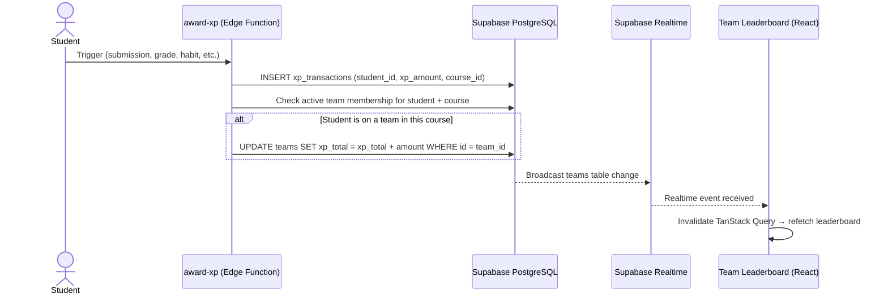
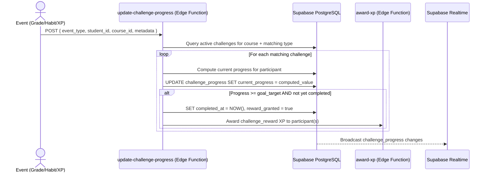
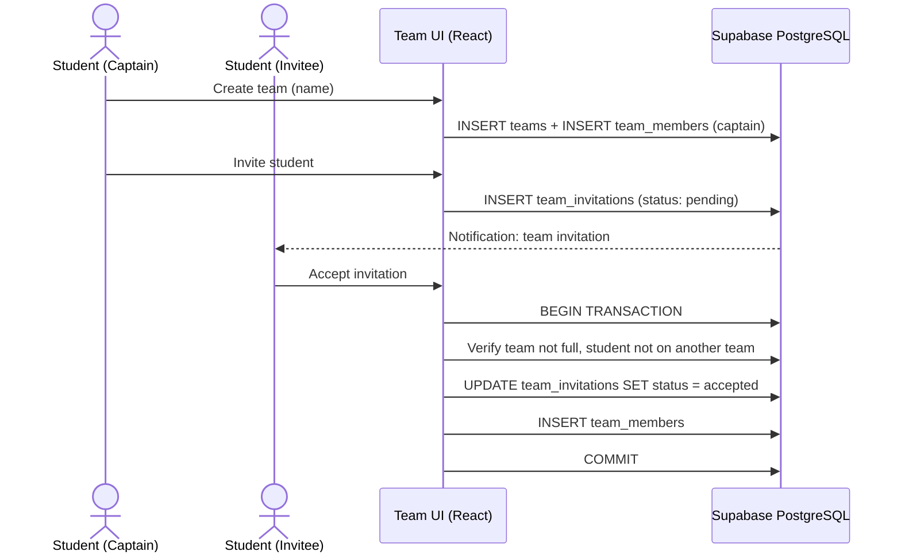
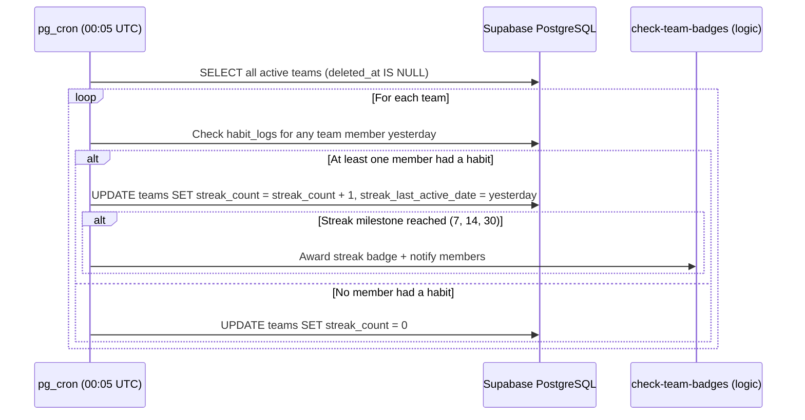

# Design Document — Team Challenges & Social Quests

## Overview

This design covers the Team Challenges & Social Quests feature for the Edeviser platform — extending the individual gamification engine with collaborative team mechanics and competitive social challenges. The feature adds:

1. A Team Management system where teachers create teams (teacher-assigned mode) or students form their own teams (student-formed mode), with 2–6 members per team, captain roles, and invitation workflows
2. Team XP — a collective XP pool computed as the SUM of member XP within the team's course during active membership, with atomic increments on the `teams.xp_total` column
3. Team Streaks — consecutive days where at least one team member completed an academic habit, maintained by a pg_cron job at 00:05 UTC
4. Team Badges — collective achievements (Team Spirit, Streak Squad/Champions/Legends, Full House, Quest Conquerors) stored in `team_badges` with idempotent award logic
5. Social Challenges (Quests) — teacher-created time-bounded competitive events with 4 types (Academic, Habit, XP_Race, Blooms_Climb), team or individual participation, real-time progress tracking, and XP + badge rewards
6. Challenge Leaderboard — per-challenge ranking of participants by progress, with real-time updates
7. Team Leaderboard — a "Teams" tab on the existing LeaderboardPage, ranking teams by Team_XP with course/program scoping and real-time updates
8. Themed Quest Worlds (Phase 2, design only) — narrative-arc quest collections organized by academic theme

The system integrates with the existing Supabase backend (PostgreSQL + RLS, Edge Functions, Realtime), TanStack Query hooks, and the existing XP/level/streak/badge/leaderboard subsystems. All new tables enforce RLS scoped by institution and role. Team XP updates use atomic increments to prevent race conditions.

### Key Design Decisions

| Decision | Choice | Rationale |
|----------|--------|-----------|
| Team XP storage | Denormalized `xp_total` on `teams` table, atomically incremented | Avoids expensive SUM queries on every leaderboard load; atomic increment prevents lost updates |
| Team XP update trigger | Inside `award-xp` Edge Function | Single source of truth for all XP awards; team XP stays consistent with individual XP |
| Team streak maintenance | pg_cron job at 00:05 UTC | Consistent with existing individual streak cron pattern; avoids real-time complexity |
| Challenge progress tracking | Dedicated `update-challenge-progress` Edge Function | Decoupled from award-xp; invoked after grade, habit, or XP events; idempotent |
| Team formation mode | Column on `courses` table | Simple per-course toggle; no separate settings table needed |
| Invitation workflow | `team_invitations` table with status enum | Clean state machine (pending → accepted/declined/expired); RLS-friendly |
| Challenge participant polymorphism | `participant_type` enum + `participant_id` UUID | Avoids separate tables for team vs individual progress; single query for leaderboard |
| Team soft delete | `deleted_at` timestamp on `teams` | Preserves historical data for XP transactions and challenge records |
| Reward distribution | Full XP to each team member (not split) | Per requirement 12.6; incentivizes team participation without penalizing larger teams |
| Real-time updates | Supabase Realtime with polling fallback | Consistent with existing leaderboard pattern; 30s polling on connection failure |

## Architecture

### Team XP Flow



### Challenge Progress Flow



### Team Formation Flow (Student-Formed Mode)



### Team Streak Cron Flow



## Components and Interfaces

### New Pages

| Page | Route | Role | Description |
|------|-------|------|-------------|
| TeamProfilePage | `/student/teams/:teamId` | Student | Team profile with stats, members, badges, active challenges |
| TeamManagementPage | `/teacher/teams` | Teacher | List/create/edit teams for teacher's courses |
| TeamFormPage | `/teacher/teams/new`, `/teacher/teams/:id/edit` | Teacher | Create/edit team form |
| ChallengeListPage | `/student/challenges` | Student | List active, upcoming, and completed challenges |
| ChallengeDetailPage | `/student/challenges/:id` | Student | Challenge details, progress bar, challenge leaderboard |
| ChallengeFormPage | `/teacher/challenges/new`, `/teacher/challenges/:id/edit` | Teacher | Create/edit social challenge form |
| TeacherChallengeListPage | `/teacher/challenges` | Teacher | Teacher's challenge management list |

### New Shared Components

| Component | Location | Description |
|-----------|----------|-------------|
| TeamCard | `src/components/shared/TeamCard.tsx` | Compact team display (name, XP, streak, member count) |
| TeamMemberList | `src/components/shared/TeamMemberList.tsx` | Member list with roles and XP contributions |
| TeamBadgeCollection | `src/components/shared/TeamBadgeCollection.tsx` | Grid of earned team badges |
| ChallengeProgressBar | `src/components/shared/ChallengeProgressBar.tsx` | Accessible progress bar with ARIA attributes |
| ChallengeLeaderboard | `src/components/shared/ChallengeLeaderboard.tsx` | Per-challenge participant ranking |
| TeamLeaderboardView | `src/components/shared/TeamLeaderboardView.tsx` | Team leaderboard tab content for LeaderboardPage |
| TeamInvitationCard | `src/components/shared/TeamInvitationCard.tsx` | Invitation accept/decline card |

### Modified Existing Components

| Component | Change |
|-----------|--------|
| `LeaderboardPage.tsx` | Add "Teams" tab to filter tabs; render TeamLeaderboardView when selected |
| `StudentLayout.tsx` | Add "My Team" and "Challenges" nav items |
| `TeacherLayout.tsx` | Add "Teams" and "Challenges" nav items |

### New Hooks

| Hook | File | Description |
|------|------|-------------|
| `useTeams` | `src/hooks/useTeams.ts` | CRUD operations for teams (list, create, update, delete) |
| `useTeamMembers` | `src/hooks/useTeamMembers.ts` | Team member management (add, remove, list) |
| `useTeamInvitations` | `src/hooks/useTeamInvitations.ts` | Invitation CRUD (send, accept, decline, list) |
| `useTeamProfile` | `src/hooks/useTeamProfile.ts` | Fetch team profile data (stats, members, badges, challenges) |
| `useChallenges` | `src/hooks/useChallenges.ts` | Challenge CRUD and listing |
| `useChallengeProgress` | `src/hooks/useChallengeProgress.ts` | Fetch challenge progress for current participant |
| `useChallengeLeaderboard` | `src/hooks/useChallengeLeaderboard.ts` | Fetch challenge leaderboard data |
| `useTeamLeaderboard` | `src/hooks/useTeamLeaderboard.ts` | Fetch team leaderboard with real-time subscription |
| `useTeamRealtime` | `src/hooks/useTeamRealtime.ts` | Realtime subscription for team XP/streak changes |
| `useChallengeRealtime` | `src/hooks/useChallengeRealtime.ts` | Realtime subscription for challenge progress changes |

### New Edge Functions

| Function | Trigger | Description |
|----------|---------|-------------|
| `update-challenge-progress` | Called after grade submission, habit log, XP award | Computes and updates challenge progress for affected participants; triggers reward on completion |

### Modified Edge Functions

| Function | Change |
|----------|--------|
| `award-xp` | Accept `challenge_reward` source; after XP insert, check active team membership and atomically increment `teams.xp_total` for course-scoped XP |

### New Configuration Files

| File | Description |
|------|-------------|
| `src/lib/teamBadgeDefinitions.ts` | Team badge definitions following the `badgeDefinitions.ts` pattern |
| `src/lib/challengeTypes.ts` | Challenge type configuration (goal descriptions, validation rules, progress computation logic) |

### Query Keys (additions to `src/lib/queryKeys.ts`)

```typescript
// ─── Team Challenges ─────────────────────────────────────────────────────────
const teams = createKeys('teams')
const teamMembers = createKeys('teamMembers')
const teamInvitations = createKeys('teamInvitations')
const teamBadges = createKeys('teamBadges')
const teamLeaderboard = createKeys('teamLeaderboard')
const socialChallenges = createKeys('socialChallenges')
const challengeProgress = createKeys('challengeProgress')
const challengeLeaderboard = createKeys('challengeLeaderboard')
```

### Zod Schemas (additions to `src/lib/schemas/`)

```typescript
// src/lib/schemas/team.ts
export const createTeamSchema = z.object({
  name: z.string().min(2).max(50),
  course_id: z.string().uuid(),
  member_ids: z.array(z.string().uuid()).min(2).max(6),
});

export const updateTeamSchema = z.object({
  name: z.string().min(2).max(50).optional(),
  add_member_ids: z.array(z.string().uuid()).optional(),
  remove_member_ids: z.array(z.string().uuid()).optional(),
});

// src/lib/schemas/challenge.ts
export const createChallengeSchema = z.object({
  title: z.string().min(3).max(100),
  description: z.string().max(500),
  challenge_type: z.enum(['academic', 'habit', 'xp_race', 'blooms_climb']),
  participation_mode: z.enum(['team', 'individual']),
  goal_target: z.number().int().positive(),
  start_date: z.string().datetime(),
  end_date: z.string().datetime(),
  reward_xp: z.number().int().min(50).max(500),
  reward_badge_id: z.string().nullable().optional(),
}).refine(
  (data) => new Date(data.end_date) > new Date(data.start_date),
  { message: 'End date must be after start date', path: ['end_date'] }
).refine(
  (data) => {
    const durationMs = new Date(data.end_date).getTime() - new Date(data.start_date).getTime();
    return durationMs >= 24 * 60 * 60 * 1000; // min 24 hours
  },
  { message: 'Challenge must be at least 24 hours long', path: ['end_date'] }
).refine(
  (data) => {
    const durationMs = new Date(data.end_date).getTime() - new Date(data.start_date).getTime();
    return durationMs <= 90 * 24 * 60 * 60 * 1000; // max 90 days
  },
  { message: 'Challenge cannot exceed 90 days', path: ['end_date'] }
);
```

## Data Models

### New Tables

#### `teams`

| Column | Type | Constraints | Description |
|--------|------|-------------|-------------|
| `id` | uuid | PK, default gen_random_uuid() | Team identifier |
| `course_id` | uuid | FK → courses(id), NOT NULL | Course this team belongs to |
| `institution_id` | uuid | FK → institutions(id), NOT NULL | Institution scope for RLS |
| `name` | text | NOT NULL | Team name |
| `captain_id` | uuid | FK → profiles(id), NOT NULL | Current team captain |
| `xp_total` | integer | NOT NULL, default 0 | Denormalized team XP total |
| `streak_count` | integer | NOT NULL, default 0 | Current consecutive streak days |
| `streak_last_active_date` | date | nullable | Last date a member completed a habit |
| `created_by` | uuid | FK → profiles(id), NOT NULL | Creator (teacher or student) |
| `created_at` | timestamptz | NOT NULL, default now() | Creation timestamp |
| `updated_at` | timestamptz | NOT NULL, default now() | Last update timestamp |
| `deleted_at` | timestamptz | nullable | Soft delete timestamp |

Indexes:
- UNIQUE(course_id, name) WHERE deleted_at IS NULL
- INDEX(course_id) WHERE deleted_at IS NULL
- INDEX(institution_id)

#### `team_members`

| Column | Type | Constraints | Description |
|--------|------|-------------|-------------|
| `id` | uuid | PK, default gen_random_uuid() | Record identifier |
| `team_id` | uuid | FK → teams(id), NOT NULL | Team reference |
| `student_id` | uuid | FK → profiles(id), NOT NULL | Student reference |
| `role` | text | NOT NULL, CHECK(role IN ('captain', 'member')) | Member role |
| `joined_at` | timestamptz | NOT NULL, default now() | Join timestamp |
| `left_at` | timestamptz | nullable | Leave timestamp (null = active) |

Indexes:
- UNIQUE(team_id, student_id) WHERE left_at IS NULL — one active membership per team
- INDEX on (student_id) WHERE left_at IS NULL — fast lookup for "is student on a team?"

Constraint: A student can only be on one active team per course. Enforced via a unique partial index on (student_id, course_id_from_team) or checked in application logic during insert.

#### `team_invitations`

| Column | Type | Constraints | Description |
|--------|------|-------------|-------------|
| `id` | uuid | PK, default gen_random_uuid() | Invitation identifier |
| `team_id` | uuid | FK → teams(id), NOT NULL | Team reference |
| `invited_student_id` | uuid | FK → profiles(id), NOT NULL | Invited student |
| `invited_by` | uuid | FK → profiles(id), NOT NULL | Captain who sent invite |
| `status` | text | NOT NULL, CHECK(status IN ('pending', 'accepted', 'declined', 'expired')), default 'pending' | Invitation status |
| `created_at` | timestamptz | NOT NULL, default now() | Sent timestamp |
| `responded_at` | timestamptz | nullable | Response timestamp |

Indexes:
- INDEX(invited_student_id, status) — fast lookup for pending invitations
- INDEX(team_id, status) — fast lookup for team's pending invitations

#### `social_challenges`

| Column | Type | Constraints | Description |
|--------|------|-------------|-------------|
| `id` | uuid | PK, default gen_random_uuid() | Challenge identifier |
| `course_id` | uuid | FK → courses(id), NOT NULL | Course scope |
| `institution_id` | uuid | FK → institutions(id), NOT NULL | Institution scope for RLS |
| `title` | text | NOT NULL | Challenge title |
| `description` | text | NOT NULL | Challenge description |
| `challenge_type` | text | NOT NULL, CHECK(challenge_type IN ('academic', 'habit', 'xp_race', 'blooms_climb')) | Challenge category |
| `participation_mode` | text | NOT NULL, CHECK(participation_mode IN ('team', 'individual')) | Team or individual |
| `goal_target` | integer | NOT NULL, CHECK(goal_target > 0) | Numeric goal |
| `start_date` | timestamptz | NOT NULL | Challenge start |
| `end_date` | timestamptz | NOT NULL | Challenge end |
| `reward_xp` | integer | NOT NULL, CHECK(reward_xp BETWEEN 50 AND 500) | XP reward amount |
| `reward_badge_id` | text | nullable | Optional badge reward key |
| `status` | text | NOT NULL, CHECK(status IN ('draft', 'active', 'ended', 'cancelled')), default 'draft' | Challenge lifecycle status |
| `created_by` | uuid | FK → profiles(id), NOT NULL | Teacher who created |
| `created_at` | timestamptz | NOT NULL, default now() | Creation timestamp |
| `updated_at` | timestamptz | NOT NULL, default now() | Last update timestamp |

Indexes:
- INDEX(course_id, status) — fast lookup for active challenges per course
- INDEX(institution_id)

#### `challenge_progress`

| Column | Type | Constraints | Description |
|--------|------|-------------|-------------|
| `id` | uuid | PK, default gen_random_uuid() | Record identifier |
| `challenge_id` | uuid | FK → social_challenges(id), NOT NULL | Challenge reference |
| `participant_type` | text | NOT NULL, CHECK(participant_type IN ('team', 'individual')) | Participant kind |
| `participant_id` | uuid | NOT NULL | References teams.id or profiles.id |
| `current_progress` | integer | NOT NULL, default 0 | Current progress toward goal |
| `completed_at` | timestamptz | nullable | Completion timestamp |
| `reward_granted` | boolean | NOT NULL, default false | Whether reward has been distributed |
| `updated_at` | timestamptz | NOT NULL, default now() | Last update timestamp |

Indexes:
- UNIQUE(challenge_id, participant_id) — one progress record per participant per challenge
- INDEX(challenge_id, current_progress DESC) — fast leaderboard query

#### `team_badges`

| Column | Type | Constraints | Description |
|--------|------|-------------|-------------|
| `id` | uuid | PK, default gen_random_uuid() | Record identifier |
| `team_id` | uuid | FK → teams(id), NOT NULL | Team reference |
| `badge_key` | text | NOT NULL | Badge definition key |
| `earned_at` | timestamptz | NOT NULL, default now() | Award timestamp |

Indexes:
- UNIQUE(team_id, badge_key) — idempotent badge awards

#### `courses` table modification

Add column:
- `team_formation_mode` text NOT NULL DEFAULT 'teacher_assigned' CHECK(team_formation_mode IN ('teacher_assigned', 'student_formed'))

### RLS Policies

#### `teams` table

```sql
-- Teachers: full CRUD on teams in their courses
CREATE POLICY "teacher_all_teams" ON teams
  FOR ALL TO authenticated
  USING (
    auth_user_role() = 'teacher'
    AND course_id IN (SELECT id FROM courses WHERE teacher_id = auth.uid())
    AND institution_id = auth_institution_id()
  );

-- Students: SELECT teams in enrolled courses
CREATE POLICY "student_select_teams" ON teams
  FOR SELECT TO authenticated
  USING (
    auth_user_role() = 'student'
    AND course_id IN (SELECT course_id FROM student_courses WHERE student_id = auth.uid())
    AND institution_id = auth_institution_id()
  );

-- Students: INSERT teams (student-formed mode only)
CREATE POLICY "student_create_team" ON teams
  FOR INSERT TO authenticated
  WITH CHECK (
    auth_user_role() = 'student'
    AND institution_id = auth_institution_id()
    AND course_id IN (
      SELECT c.id FROM courses c
      JOIN student_courses sc ON sc.course_id = c.id
      WHERE sc.student_id = auth.uid() AND c.team_formation_mode = 'student_formed'
    )
  );

-- Admins: full access within institution
CREATE POLICY "admin_all_teams" ON teams
  FOR ALL TO authenticated
  USING (auth_user_role() = 'admin' AND institution_id = auth_institution_id());

-- Coordinators: SELECT teams in their program's courses
CREATE POLICY "coordinator_select_teams" ON teams
  FOR SELECT TO authenticated
  USING (
    auth_user_role() = 'coordinator'
    AND institution_id = auth_institution_id()
    AND course_id IN (
      SELECT c.id FROM courses c
      JOIN programs p ON c.program_id = p.id
      WHERE p.coordinator_id = auth.uid()
    )
  );
```

#### `team_members` table

```sql
-- Students: SELECT members for teams in enrolled courses
CREATE POLICY "student_select_members" ON team_members
  FOR SELECT TO authenticated
  USING (
    auth_user_role() IN ('student', 'teacher', 'coordinator', 'admin')
    AND team_id IN (
      SELECT id FROM teams
      WHERE institution_id = auth_institution_id() AND deleted_at IS NULL
    )
  );

-- Captain: INSERT/DELETE members (student-formed mode)
CREATE POLICY "captain_manage_members" ON team_members
  FOR ALL TO authenticated
  USING (
    auth_user_role() = 'student'
    AND team_id IN (
      SELECT t.id FROM teams t
      JOIN courses c ON t.course_id = c.id
      WHERE t.captain_id = auth.uid()
        AND c.team_formation_mode = 'student_formed'
        AND t.deleted_at IS NULL
    )
  );

-- Teachers: INSERT/DELETE members
CREATE POLICY "teacher_manage_members" ON team_members
  FOR ALL TO authenticated
  USING (
    auth_user_role() = 'teacher'
    AND team_id IN (
      SELECT t.id FROM teams t
      JOIN courses c ON t.course_id = c.id
      WHERE c.teacher_id = auth.uid() AND t.deleted_at IS NULL
    )
  );

-- Parents: SELECT for linked students
CREATE POLICY "parent_select_members" ON team_members
  FOR SELECT TO authenticated
  USING (
    auth_user_role() = 'parent'
    AND student_id IN (
      SELECT student_id FROM parent_student_links
      WHERE parent_id = auth.uid() AND verified = true
    )
  );
```

#### `team_invitations` table

```sql
-- Invited student: SELECT own invitations
CREATE POLICY "student_select_own_invitations" ON team_invitations
  FOR SELECT TO authenticated
  USING (
    auth_user_role() = 'student'
    AND invited_student_id = auth.uid()
  );

-- Captain: INSERT invitations
CREATE POLICY "captain_insert_invitations" ON team_invitations
  FOR INSERT TO authenticated
  WITH CHECK (
    auth_user_role() = 'student'
    AND invited_by = auth.uid()
    AND team_id IN (
      SELECT id FROM teams WHERE captain_id = auth.uid() AND deleted_at IS NULL
    )
  );

-- Invited student: UPDATE status (accept/decline)
CREATE POLICY "student_respond_invitation" ON team_invitations
  FOR UPDATE TO authenticated
  USING (
    auth_user_role() = 'student'
    AND invited_student_id = auth.uid()
    AND status = 'pending'
  );

-- Teachers: SELECT all invitations in their courses
CREATE POLICY "teacher_select_invitations" ON team_invitations
  FOR SELECT TO authenticated
  USING (
    auth_user_role() = 'teacher'
    AND team_id IN (
      SELECT t.id FROM teams t
      JOIN courses c ON t.course_id = c.id
      WHERE c.teacher_id = auth.uid()
    )
  );
```

#### `social_challenges` table

```sql
-- Students: SELECT active/ended challenges in enrolled courses
CREATE POLICY "student_select_challenges" ON social_challenges
  FOR SELECT TO authenticated
  USING (
    auth_user_role() = 'student'
    AND status IN ('active', 'ended')
    AND course_id IN (SELECT course_id FROM student_courses WHERE student_id = auth.uid())
    AND institution_id = auth_institution_id()
  );

-- Teachers: full CRUD on challenges in their courses
CREATE POLICY "teacher_all_challenges" ON social_challenges
  FOR ALL TO authenticated
  USING (
    auth_user_role() = 'teacher'
    AND course_id IN (SELECT id FROM courses WHERE teacher_id = auth.uid())
    AND institution_id = auth_institution_id()
  );

-- Admins: SELECT all challenges within institution
CREATE POLICY "admin_select_challenges" ON social_challenges
  FOR SELECT TO authenticated
  USING (auth_user_role() = 'admin' AND institution_id = auth_institution_id());
```

#### `challenge_progress` table

```sql
-- Students: SELECT own progress and challenge leaderboard
CREATE POLICY "student_select_progress" ON challenge_progress
  FOR SELECT TO authenticated
  USING (
    challenge_id IN (
      SELECT id FROM social_challenges
      WHERE course_id IN (SELECT course_id FROM student_courses WHERE student_id = auth.uid())
        AND institution_id = auth_institution_id()
    )
  );

-- Teachers: SELECT all progress for their course challenges
CREATE POLICY "teacher_select_progress" ON challenge_progress
  FOR SELECT TO authenticated
  USING (
    auth_user_role() = 'teacher'
    AND challenge_id IN (
      SELECT sc.id FROM social_challenges sc
      JOIN courses c ON sc.course_id = c.id
      WHERE c.teacher_id = auth.uid()
    )
  );

-- Parents: SELECT progress for linked students
CREATE POLICY "parent_select_progress" ON challenge_progress
  FOR SELECT TO authenticated
  USING (
    auth_user_role() = 'parent'
    AND participant_type = 'individual'
    AND participant_id IN (
      SELECT student_id FROM parent_student_links
      WHERE parent_id = auth.uid() AND verified = true
    )
  );
```

#### `team_badges` table

```sql
-- All authenticated users in institution: SELECT
CREATE POLICY "select_team_badges" ON team_badges
  FOR SELECT TO authenticated
  USING (
    team_id IN (
      SELECT id FROM teams WHERE institution_id = auth_institution_id()
    )
  );
-- INSERT/UPDATE via service role key only (Edge Functions)
```

### pg_cron Job: Team Streak Update

```sql
-- Runs daily at 00:05 UTC
SELECT cron.schedule(
  'update-team-streaks',
  '5 0 * * *',
  $$
  DO $$
  DECLARE
    team_rec RECORD;
    yesterday DATE := (CURRENT_DATE - INTERVAL '1 day')::DATE;
    has_habit BOOLEAN;
  BEGIN
    FOR team_rec IN
      SELECT t.id, t.streak_count
      FROM teams t
      WHERE t.deleted_at IS NULL
    LOOP
      SELECT EXISTS(
        SELECT 1 FROM habit_logs hl
        JOIN team_members tm ON tm.student_id = hl.student_id
        WHERE tm.team_id = team_rec.id
          AND tm.left_at IS NULL
          AND hl.log_date = yesterday
      ) INTO has_habit;

      IF has_habit THEN
        UPDATE teams
        SET streak_count = streak_count + 1,
            streak_last_active_date = yesterday,
            updated_at = NOW()
        WHERE id = team_rec.id;

        -- Check streak milestones (7, 14, 30)
        IF (team_rec.streak_count + 1) IN (7, 14, 30) THEN
          -- Award streak badge via team_badges insert (idempotent)
          INSERT INTO team_badges (team_id, badge_key, earned_at)
          VALUES (
            team_rec.id,
            CASE team_rec.streak_count + 1
              WHEN 7 THEN 'streak_squad'
              WHEN 14 THEN 'streak_champions'
              WHEN 30 THEN 'streak_legends'
            END,
            NOW()
          )
          ON CONFLICT (team_id, badge_key) DO NOTHING;

          -- Notify team members (via pg_net HTTP call to notification endpoint)
        END IF;
      ELSE
        UPDATE teams
        SET streak_count = 0, updated_at = NOW()
        WHERE id = team_rec.id;
      END IF;
    END LOOP;
  END $$;
  $$
);
```


## Correctness Properties

*A property is a characteristic or behavior that should hold true across all valid executions of a system — essentially, a formal statement about what the system should do. Properties serve as the bridge between human-readable specifications and machine-verifiable correctness guarantees.*

### Property 1: Team creation assigns captain

*For any* team creation (teacher-assigned or student-formed), the creator or first-listed student shall have role `captain` in the resulting `team_members` records, and the `teams.captain_id` shall match that student's ID.

**Validates: Requirements 1.2, 2.2**

### Property 2: One active team per student per course

*For any* student and any course, the student shall be an active member (left_at IS NULL) of at most one team. Attempting to add a student who is already on an active team in the same course shall be rejected.

**Validates: Requirements 1.5, 2.3**

### Property 3: Team size bounds

*For any* team, the count of active members (left_at IS NULL) shall be between 2 and 6 inclusive. Accepting an invitation that would push the count above 6 shall be rejected.

**Validates: Requirements 1.1, 2.6**

### Property 4: Team XP computation respects membership and course scope

*For any* team and any set of XP transactions for its members, the team's `xp_total` shall equal the sum of XP amounts from transactions that are (a) earned by currently active members during their active membership period (between joined_at and left_at or now), and (b) scoped to the team's course. XP earned before joining, after leaving, or in a different course shall be excluded.

**Validates: Requirements 5.1, 5.4, 1.4, 18.1, 18.3**

### Property 5: Team streak computation

*For any* team and any sequence of daily habit logs for its members, the team's `streak_count` shall equal the count of consecutive calendar days (ending at the most recent active day) on which at least one active member completed at least one habit. A day with no member habits resets the streak to 0.

**Validates: Requirements 6.1, 6.2**

### Property 6: Team streak milestone triggers badge award

*For any* team whose streak_count reaches a milestone value (7, 14, or 30), the corresponding team badge (streak_squad, streak_champions, streak_legends) shall exist in `team_badges` for that team.

**Validates: Requirements 6.4**

### Property 7: Team badge idempotence

*For any* team and any badge_key, awarding the same badge twice shall result in exactly one `team_badges` record (enforced by the unique constraint on team_id, badge_key).

**Validates: Requirements 7.3**

### Property 8: Challenge schema validation — date constraints

*For any* challenge creation input, the schema shall reject inputs where: (a) start_date is not in the future, (b) end_date is not after start_date, (c) duration is less than 24 hours, or (d) duration exceeds 90 days. Valid date ranges shall be accepted.

**Validates: Requirements 8.7, 8.8**

### Property 9: Challenge auto-enrollment creates progress records

*For any* active challenge, when the challenge starts: if participation_mode is "team", every active team in the course shall have a `challenge_progress` record with current_progress = 0; if participation_mode is "individual", every enrolled student shall have a `challenge_progress` record with current_progress = 0.

**Validates: Requirements 9.1, 9.2, 9.3**

### Property 10: Challenge progress computation by type

*For any* active challenge and participant, the `current_progress` value shall be computed correctly according to the challenge type: for "academic", it equals the count of graded assignments within the challenge period; for "habit", it equals the current consecutive streak days during the challenge period; for "xp_race", it equals total XP earned in the course during the challenge period; for "blooms_climb", it equals the count of distinct Bloom's levels with at least one graded assignment.

**Validates: Requirements 10.1, 10.2, 10.3, 10.4**

### Property 11: Challenge completion triggers reward

*For any* participant whose `current_progress` reaches or exceeds the challenge's `goal_target`, the participant shall be marked as completed (completed_at is set) and the reward shall be granted (reward_granted = true).

**Validates: Requirements 10.7, 19.3**

### Property 12: Challenge progress idempotence

*For any* triggering event processed by the update-challenge-progress Edge Function, processing the same event twice shall not double-count progress — the `current_progress` value shall be the same after the second processing.

**Validates: Requirements 19.5**

### Property 13: Challenge reward distribution — full XP to each team member

*For any* completed team challenge, every active member of the completing team shall receive the full `reward_xp` amount (not split). The total XP distributed equals `reward_xp × team_member_count`.

**Validates: Requirements 12.1, 12.6, 17.4**

### Property 14: Challenge reward uniqueness

*For any* participant and challenge, the reward shall be granted at most once, enforced by the unique constraint on (challenge_id, participant_id) and the `reward_granted` flag.

**Validates: Requirements 12.5**

### Property 15: Challenge leaderboard sort order

*For any* challenge leaderboard, participants shall be sorted by `current_progress` descending, with ties broken by earlier `completed_at` timestamp (completed participants rank above in-progress participants with the same progress).

**Validates: Requirements 11.1**

### Property 16: Anonymous leaderboard entries

*For any* individual challenge leaderboard entry where the participant has opted into anonymous mode, the displayed name shall be "Anonymous" and shall not reveal the student's identity.

**Validates: Requirements 11.3**

### Property 17: Team leaderboard sort and scope

*For any* team leaderboard query scoped to a course, the results shall contain only teams belonging to that course, sorted by `xp_total` descending. When scoped to a program, results shall contain teams from all courses in that program.

**Validates: Requirements 13.2, 13.3**

### Property 18: Team formation mode controls student team creation

*For any* course in "teacher_assigned" mode, students shall not be able to create teams or send invitations. For any course in "student_formed" mode, teamless enrolled students shall be able to create teams. Changing mode shall preserve existing teams.

**Validates: Requirements 2.1, 2.8, 3.3, 3.4**

### Property 19: Ended challenges reject progress updates

*For any* challenge with status "ended", attempts to update `challenge_progress` records shall be rejected — no progress changes after the end date.

**Validates: Requirements 12.3**

### Property 20: Challenge list filtering by enrollment

*For any* student, the challenge list shall return only challenges belonging to courses the student is enrolled in, with statuses active, upcoming (draft with future start_date), or recently ended.

**Validates: Requirements 9.5**

## Error Handling

### Team Operations

| Error Scenario | Handling | User Feedback |
|----------------|----------|---------------|
| Team name already exists in course | Reject with 409 Conflict | Sonner toast: "A team with this name already exists in this course" |
| Student already on a team in course | Reject with 409 Conflict | Sonner toast: "Student is already a member of team [team_name]" |
| Team at max capacity (6 members) | Reject with 422 Unprocessable | Sonner toast: "This team is full (maximum 6 members)" |
| Team has fewer than 2 members after removal | Reject with 422 Unprocessable | Sonner toast: "A team must have at least 2 members" |
| Delete team with active challenge participation | Reject with 409 Conflict | Sonner toast: "Cannot delete a team with active challenge participation" |
| Student-formed team creation in teacher-assigned mode | Reject with 403 Forbidden | UI hides creation controls; API returns 403 |
| Invitation to student not enrolled in course | Reject with 422 Unprocessable | Sonner toast: "Student is not enrolled in this course" |
| Accept expired invitation | Reject with 410 Gone | Sonner toast: "This invitation has expired" |

### Challenge Operations

| Error Scenario | Handling | User Feedback |
|----------------|----------|---------------|
| Start date not in future | Reject with 422 Unprocessable | Form validation error on start_date field |
| Duration < 24 hours or > 90 days | Reject with 422 Unprocessable | Form validation error on end_date field |
| Reward XP outside 50–500 range | Reject with 422 Unprocessable | Form validation error on reward_xp field |
| Progress update on ended challenge | Silently skip (idempotent) | No user feedback needed (background process) |
| Reward distribution partial failure | Roll back entire transaction, log error | Admin audit log entry; retry via admin action |
| Challenge progress Edge Function timeout | Log error, retry with exponential backoff | Progress updates may be delayed; UI shows stale data |

### Real-Time Subscription Failures

| Error Scenario | Handling | User Feedback |
|----------------|----------|---------------|
| Realtime connection lost | Fall back to 30-second polling | Banner: "Live updates paused" |
| Realtime reconnection successful | Resume subscription, cancel polling | Banner removed |
| Excessive reconnection failures | Stop retrying after 5 attempts, polling only | Banner persists |

## Testing Strategy

### Property-Based Tests (fast-check, minimum 100 iterations each)

Each property test references its design document property and uses the tag format:
`// Feature: team-challenges, Property N: [property text]`

| Test File | Properties Covered | Description |
|-----------|-------------------|-------------|
| `src/__tests__/properties/teamCreation.property.test.ts` | P1, P2, P3 | Team creation assigns captain, one team per student per course, team size bounds |
| `src/__tests__/properties/teamXp.property.test.ts` | P4 | Team XP computation respects membership period and course scope |
| `src/__tests__/properties/teamStreak.property.test.ts` | P5, P6, P7 | Team streak computation, milestone badge awards, badge idempotence |
| `src/__tests__/properties/challengeSchema.property.test.ts` | P8 | Challenge creation schema date validation |
| `src/__tests__/properties/challengeProgress.property.test.ts` | P10, P11, P12 | Progress computation by type, completion triggers reward, idempotence |
| `src/__tests__/properties/challengeRewards.property.test.ts` | P13, P14 | Full XP to each team member, reward uniqueness |
| `src/__tests__/properties/challengeLeaderboard.property.test.ts` | P15, P16, P17 | Challenge leaderboard sort, anonymous entries, team leaderboard sort and scope |
| `src/__tests__/properties/teamFormationMode.property.test.ts` | P18 | Formation mode controls student team creation |
| `src/__tests__/properties/challengeLifecycle.property.test.ts` | P9, P19, P20 | Auto-enrollment, ended challenges reject updates, challenge list filtering |

### Unit Tests

| Test File | Description |
|-----------|-------------|
| `src/__tests__/unit/teamBadgeDefinitions.test.ts` | All 6 team badges defined, correct keys and structure |
| `src/__tests__/unit/challengeTypes.test.ts` | Challenge type configuration, Blooms_Climb goal fixed at 6 |
| `src/__tests__/unit/teamProfilePage.test.tsx` | Team profile renders all required data fields |
| `src/__tests__/unit/challengeProgressBar.test.tsx` | ARIA progressbar attributes present |
| `src/__tests__/unit/teamLeaderboardView.test.tsx` | Teams tab renders, medal icons for top 3 |
| `src/__tests__/unit/challengeForm.test.tsx` | Form validation, date constraints, reward range |
| `src/__tests__/unit/teamInvitationCard.test.tsx` | Accept/decline keyboard operability |
| `src/__tests__/unit/leaderboardTeamsTab.test.tsx` | Teams tab integration with existing LeaderboardPage |

### Testing Library

- Property-based testing: `fast-check` (already in project dependencies)
- Unit/component testing: `vitest` + `@testing-library/react`
- Minimum 100 iterations per property test
- Each property test tagged with: `// Feature: team-challenges, Property N: [title]`
