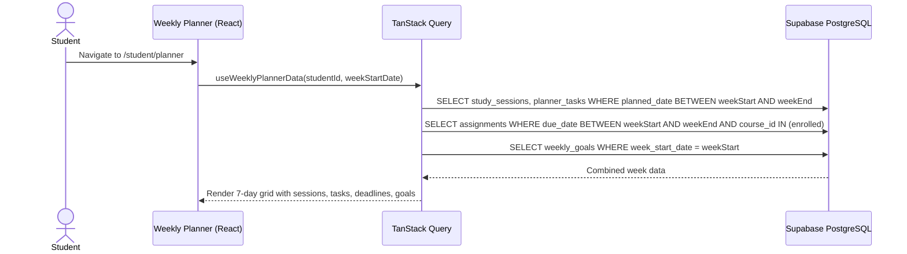
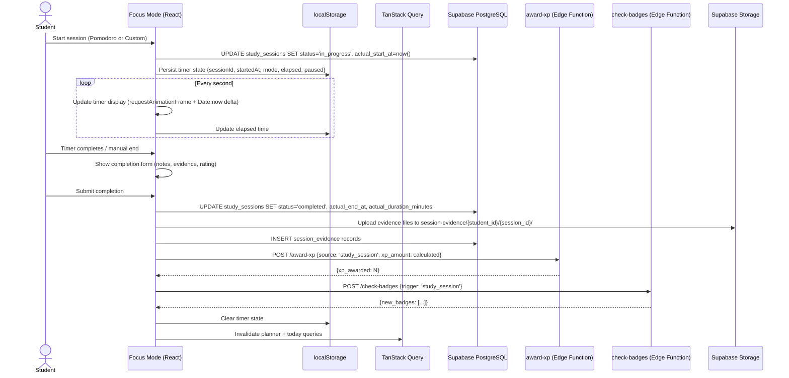
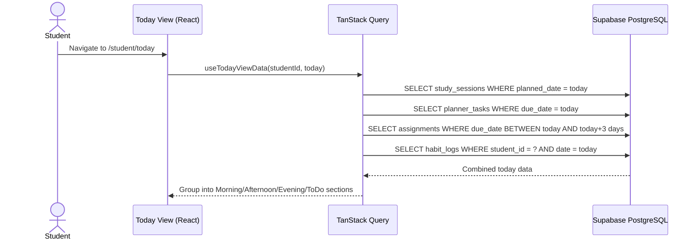

# Design Document — Weekly Planner & Today View

## Overview

This design covers the Weekly Planner & Today View feature for the Edeviser platform — a structured self-regulated learning system built around the PDCR cycle (Plan, Do, Check, Reflect). The feature adds:

1. A weekly calendar planner where students schedule study sessions and manage tasks across a 7-day grid, with assignment deadlines pulled from enrolled courses
2. A Today View providing a single-screen daily agenda with chronological timeline, quick actions, and daily progress summary
3. Focus Mode — a distraction-free timer supporting Pomodoro (25/5/15) and custom duration modes, with pause/resume, localStorage persistence, and offline resilience
4. Session evidence capture — file uploads (screenshots, docs) and notes linked to study sessions and CLOs, stored in Supabase Storage
5. Weekly goal setting (up to 3 goals per week) with progress tracking and XP rewards
6. Session and weekly reflections integrated with the existing journal system
7. Study time analytics with weekly trends and per-course/CLO breakdowns
8. Gamification integration — XP for sessions, tasks, reflections, and goals; 4 new badges (Study Starter, Deep Focus, Weekly Warrior, Evidence Pro)
9. Parent read-only visibility of the student's planner and study logs
10. Habit tracking integration — completed study sessions auto-mark the "Read" daily habit

The system integrates with the existing Supabase backend (PostgreSQL + RLS, Storage, Edge Functions), TanStack Query hooks, gamification engine (XP, streaks, badges), assignment system, habit tracking, and parent dashboard.

### Key Design Decisions

| Decision | Choice | Rationale |
|----------|--------|-----------|
| Timer implementation | `requestAnimationFrame` + `Date.now()` delta | Immune to tab throttling; accurate even when browser deprioritizes setInterval |
| Timer state persistence | localStorage with JSON serialization | Survives tab close/refresh; no server round-trip needed for timer recovery |
| Pomodoro state machine | Finite state machine with explicit transitions | Clean separation of work/break/long-break states; easy to test |
| Study session XP formula | Base 20 + 5 per 15-min block, cap 50 | Rewards longer sessions without runaway XP; evidence bonus (10) incentivizes documentation |
| Weekly planner data | Single query per week joining sessions + tasks + deadlines | Avoids N+1; returns all data for the 7-day grid in one fetch |
| Today View grouping | Client-side grouping by time-of-day buckets | Data already fetched; simple pure function; no server logic needed |
| Evidence storage | Supabase Storage bucket `session-evidence` with RLS | Native integration; CDN delivery; per-student folder isolation |
| Reflection storage | Separate `session_reflections` table (not reusing `journal_entries`) | Session reflections are shorter (30 words min vs 100), linked to sessions, and private; weekly reflections flow into journal_entries |
| Mobile planner | Single-day view with tab navigation | 7-column grid unusable on mobile; single-day is the standard mobile calendar pattern |
| Offline timer | Queue API calls in memory + localStorage; retry on reconnect | Timer must not stop on network loss; queued calls sync automatically |
| Parent visibility | RLS-enforced via `parent_student_links` join | No application-level access control to bypass; consistent with existing parent patterns |
| Task priority sorting | Client-side sort: high → medium → low | Small dataset per day; no need for server-side ordering |

## Architecture

### Weekly Planner Data Flow



### Focus Mode Flow



### Today View Data Flow



## Components and Interfaces

### New Pages

| Page | Route | Description |
|------|-------|-------------|
| `WeeklyPlannerPage` | `/student/planner` | 7-day calendar grid with sessions, tasks, deadlines, goals, and Check/Reflect tabs |
| `TodayViewPage` | `/student/today` | Daily agenda timeline with quick actions and progress summary |
| `FocusModePage` | `/student/focus/:sessionId` | Distraction-free timer with evidence capture on completion |
| `ParentPlannerView` | `/parent/planner/:studentId` | Read-only view of linked student's weekly planner |

### New Components

| Component | Location | Props |
|-----------|----------|-------|
| `WeeklyCalendarGrid` | `src/components/shared/WeeklyCalendarGrid.tsx` | `weekData: WeekDay[]`, `onDayClick: (date) => void`, `today: string` |
| `DayColumn` | Internal to WeeklyCalendarGrid | `date: string`, `sessions: StudySession[]`, `tasks: PlannerTask[]`, `deadlines: Assignment[]`, `isToday: boolean` |
| `StudySessionCard` | `src/components/shared/StudySessionCard.tsx` | `session: StudySession`, `onStart: () => void`, `onEdit: () => void` |
| `PlannerTaskItem` | `src/components/shared/PlannerTaskItem.tsx` | `task: PlannerTask`, `onToggle: () => void`, `onEdit: () => void`, `onDelete: () => void` |
| `DeadlineItem` | `src/components/shared/DeadlineItem.tsx` | `assignment: UpcomingDeadline`, `urgency: 'red' \| 'yellow' \| 'green'` |
| `WeeklyGoalPanel` | `src/components/shared/WeeklyGoalPanel.tsx` | `goals: WeeklyGoal[]`, `progress: GoalProgress[]`, `onSave: (goals) => void`, `isEditable: boolean` |
| `GoalProgressBar` | `src/components/shared/GoalProgressBar.tsx` | `goal: WeeklyGoal`, `current: number`, `isMet: boolean` |
| `CreateSessionDialog` | `src/components/shared/CreateSessionDialog.tsx` | `date: string`, `courses: Course[]`, `onSubmit: (data) => void` |
| `CreateTaskDialog` | `src/components/shared/CreateTaskDialog.tsx` | `date: string`, `courses: Course[]`, `onSubmit: (data) => void` |
| `TodayTimeline` | `src/components/shared/TodayTimeline.tsx` | `items: TimelineItem[]`, `habits: HabitStatus` |
| `TimelineSection` | Internal to TodayTimeline | `title: string`, `items: TimelineItem[]` |
| `DailyProgressSummary` | `src/components/shared/DailyProgressSummary.tsx` | `studyMinutes: number`, `tasksCompleted: number`, `sessionsCompleted: number` |
| `FocusTimer` | `src/components/shared/FocusTimer.tsx` | `mode: TimerMode`, `duration: number`, `onComplete: () => void`, `onPause: () => void` |
| `PomodoroIndicator` | `src/components/shared/PomodoroIndicator.tsx` | `currentInterval: number`, `totalIntervals: number`, `intervalType: 'work' \| 'break' \| 'long_break'` |
| `SessionCompletionForm` | `src/components/shared/SessionCompletionForm.tsx` | `session: StudySession`, `onSubmit: (data) => void`, `onSkip: () => void` |
| `EvidenceUploader` | `src/components/shared/EvidenceUploader.tsx` | `sessionId: string`, `maxFiles: number`, `onUpload: (files) => void` |
| `SessionReflectionInput` | `src/components/shared/SessionReflectionInput.tsx` | `minWords: number`, `onSave: (content) => void` |
| `WeeklyReflectionPanel` | `src/components/shared/WeeklyReflectionPanel.tsx` | `weekStartDate: string`, `onSave: (content) => void` |
| `ProgressSummaryPanel` | `src/components/shared/ProgressSummaryPanel.tsx` | `summary: WeeklyProgressData`, `goals: GoalProgress[]` |
| `StudyTimeChart` | `src/components/shared/StudyTimeChart.tsx` | `data: WeeklyStudyData[]`, `courseFilter: string \| null` |
| `CourseStudyBreakdown` | `src/components/shared/CourseStudyBreakdown.tsx` | `data: CourseStudyTime[]` |

### New Hooks

| Hook | File | Purpose |
|------|------|---------|
| `useWeeklyPlannerData` | `src/hooks/useWeeklyPlanner.ts` | Fetch sessions, tasks, deadlines, goals for a given week |
| `useTodayViewData` | `src/hooks/useTodayView.ts` | Fetch today's sessions, tasks, deadlines, habits |
| `useStudySessions` | `src/hooks/useStudySessions.ts` | CRUD mutations for study sessions |
| `usePlannerTasks` | `src/hooks/usePlannerTasks.ts` | CRUD mutations for planner tasks with XP award on completion |
| `useWeeklyGoals` | `src/hooks/useWeeklyGoals.ts` | CRUD for weekly goals + progress computation |
| `useFocusTimer` | `src/hooks/useFocusTimer.ts` | Timer state machine with localStorage persistence, pause/resume, Pomodoro transitions |
| `useSessionCompletion` | `src/hooks/useSessionCompletion.ts` | Complete session → upload evidence → award XP → check badges |
| `useSessionEvidence` | `src/hooks/useSessionEvidence.ts` | Upload files to Supabase Storage + insert evidence records |
| `useSessionReflections` | `src/hooks/useSessionReflections.ts` | Save session reflections with word count validation |
| `useWeeklyProgress` | `src/hooks/useWeeklyProgress.ts` | Compute weekly progress summary, per-course/CLO breakdowns |
| `useStudyTimeAnalytics` | `src/hooks/useStudyTimeAnalytics.ts` | Fetch 8-week study time trend data |
| `useOfflineQueue` | `src/hooks/useOfflineQueue.ts` | Queue and retry API calls during network loss |

### Modified Existing Files

| File | Change |
|------|--------|
| `supabase/functions/award-xp/index.ts` | Add `study_session`, `planner_task`, `session_reflection`, `weekly_goal` to `XPSource` type and `VALID_SOURCES` |
| `supabase/functions/check-badges/index.ts` | Add `study_session` trigger; add `checkStudyBadges()` for Study Starter, Deep Focus, Weekly Warrior, Evidence Pro |
| `src/router/AppRouter.tsx` | Add `/student/planner`, `/student/today`, `/student/focus/:sessionId`, `/parent/planner/:studentId` routes |
| `src/pages/student/StudentLayout.tsx` | Add "Planner" and "Today" nav items |
| `src/pages/parent/ParentLayout.tsx` | Add "Study Plan" nav item |
| `src/lib/badgeDefinitions.ts` | Add study_starter, deep_focus, weekly_warrior, evidence_pro badge definitions |

## Data Models

### New Tables

#### `study_sessions`

| Column | Type | Constraints | Description |
|--------|------|-------------|-------------|
| `id` | `uuid` | PK, default `gen_random_uuid()` | Primary key |
| `student_id` | `uuid` | FK → `profiles.id`, NOT NULL | Owning student |
| `course_id` | `uuid` | FK → `courses.id`, NOT NULL | Linked course |
| `title` | `varchar(255)` | NOT NULL | Session title |
| `description` | `text` | NULLABLE | Optional description |
| `planned_date` | `date` | NOT NULL | Scheduled date |
| `planned_start_time` | `time` | NOT NULL | Scheduled start time |
| `planned_duration_minutes` | `integer` | NOT NULL, CHECK (15–240) | Planned duration |
| `actual_start_at` | `timestamptz` | NULLABLE | When session actually started |
| `actual_end_at` | `timestamptz` | NULLABLE | When session actually ended |
| `actual_duration_minutes` | `integer` | NULLABLE | Actual study time (excluding pauses) |
| `timer_mode` | `timer_mode_type` (enum) | NOT NULL | pomodoro or custom |
| `status` | `session_status_type` (enum) | NOT NULL, default `planned` | planned, in_progress, completed, cancelled |
| `satisfaction_rating` | `integer` | NULLABLE, CHECK (1–5) | Post-session rating |
| `clo_ids` | `uuid[]` | NULLABLE | Linked CLO IDs |
| `created_at` | `timestamptz` | NOT NULL, default `now()` | Record creation |
| `updated_at` | `timestamptz` | NOT NULL, default `now()` | Last update |

Indexes:
- `idx_study_sessions_student_date` on `(student_id, planned_date)` — weekly/daily queries
- `idx_study_sessions_student_status` on `(student_id, status)` — active session lookup

#### `planner_tasks`

| Column | Type | Constraints | Description |
|--------|------|-------------|-------------|
| `id` | `uuid` | PK, default `gen_random_uuid()` | Primary key |
| `student_id` | `uuid` | FK → `profiles.id`, NOT NULL | Owning student |
| `title` | `varchar(255)` | NOT NULL | Task title |
| `description` | `text` | NULLABLE | Optional description |
| `due_date` | `date` | NOT NULL | Task due date |
| `priority` | `task_priority_type` (enum) | NOT NULL, default `medium` | low, medium, high |
| `status` | `task_status_type` (enum) | NOT NULL, default `pending` | pending, completed |
| `course_id` | `uuid` | FK → `courses.id`, NULLABLE | Optional course linkage |
| `completed_at` | `timestamptz` | NULLABLE | When task was completed |
| `created_at` | `timestamptz` | NOT NULL, default `now()` | Record creation |
| `updated_at` | `timestamptz` | NOT NULL, default `now()` | Last update |

Indexes:
- `idx_planner_tasks_student_date` on `(student_id, due_date)` — daily/weekly queries
- `idx_planner_tasks_student_status` on `(student_id, status)` — pending task count

#### `weekly_goals`

| Column | Type | Constraints | Description |
|--------|------|-------------|-------------|
| `id` | `uuid` | PK, default `gen_random_uuid()` | Primary key |
| `student_id` | `uuid` | FK → `profiles.id`, NOT NULL | Owning student |
| `week_start_date` | `date` | NOT NULL | Monday of the goal week |
| `goal_type` | `goal_type_enum` (enum) | NOT NULL | study_hours, sessions_completed, tasks_completed |
| `target_value` | `numeric` | NOT NULL, CHECK (> 0) | Target number |
| `created_at` | `timestamptz` | NOT NULL, default `now()` | Record creation |
| `updated_at` | `timestamptz` | NOT NULL, default `now()` | Last update |

Constraints:
- UNIQUE on `(student_id, week_start_date, goal_type)` — one goal per type per week

#### `session_evidence`

| Column | Type | Constraints | Description |
|--------|------|-------------|-------------|
| `id` | `uuid` | PK, default `gen_random_uuid()` | Primary key |
| `session_id` | `uuid` | FK → `study_sessions.id`, NOT NULL | Parent session |
| `student_id` | `uuid` | FK → `profiles.id`, NOT NULL | Owning student |
| `file_url` | `text` | NOT NULL | Supabase Storage URL |
| `file_name` | `varchar(255)` | NOT NULL | Original file name |
| `file_size_bytes` | `integer` | NOT NULL | File size |
| `mime_type` | `varchar(100)` | NOT NULL | MIME type |
| `notes` | `text` | NULLABLE | Text notes |
| `created_at` | `timestamptz` | NOT NULL, default `now()` | Record creation |

Constraints:
- Append-only: no UPDATE or DELETE policies

#### `session_reflections`

| Column | Type | Constraints | Description |
|--------|------|-------------|-------------|
| `id` | `uuid` | PK, default `gen_random_uuid()` | Primary key |
| `session_id` | `uuid` | FK → `study_sessions.id`, NOT NULL | Parent session |
| `student_id` | `uuid` | FK → `profiles.id`, NOT NULL | Owning student |
| `content` | `text` | NOT NULL | Reflection text |
| `word_count` | `integer` | NOT NULL | Word count |
| `created_at` | `timestamptz` | NOT NULL, default `now()` | Record creation |

Constraints:
- Append-only: no UPDATE or DELETE policies

### New Enums

```sql
CREATE TYPE timer_mode_type AS ENUM ('pomodoro', 'custom');
CREATE TYPE session_status_type AS ENUM ('planned', 'in_progress', 'completed', 'cancelled');
CREATE TYPE task_priority_type AS ENUM ('low', 'medium', 'high');
CREATE TYPE task_status_type AS ENUM ('pending', 'completed');
CREATE TYPE goal_type_enum AS ENUM ('study_hours', 'sessions_completed', 'tasks_completed');
```

### XP Source Extensions

The `award-xp` Edge Function's `VALID_SOURCES` array gains: `'study_session'`, `'planner_task'`, `'session_reflection'`, `'weekly_goal'`.

| Source | XP Amount | Condition |
|--------|-----------|-----------|
| `study_session` | 20 + 5 per 15-min block (cap 50) + 10 evidence bonus | actual_duration ≥ 15 min |
| `planner_task` | 10 | Task marked completed |
| `session_reflection` | 10 | Reflection ≥ 30 words |
| `weekly_goal` | 25 | Goal target met |

### Badge Definitions Extension

Four new badge definitions added to `src/lib/badgeDefinitions.ts`:

| Badge ID | Name | Condition | XP Reward |
|----------|------|-----------|-----------|
| `study_starter` | Study Starter | Complete first Study_Session | 25 |
| `deep_focus` | Deep Focus | Complete a single session ≥ 60 minutes | 50 |
| `weekly_warrior` | Weekly Warrior | Meet all 3 Weekly_Goals in one week | 100 |
| `evidence_pro` | Evidence Pro | Attach evidence to 10 sessions | 75 |

### RLS Policies

#### `study_sessions`

```sql
ALTER TABLE study_sessions ENABLE ROW LEVEL SECURITY;

-- Students: full CRUD on own sessions (except DELETE completed)
CREATE POLICY "student_manage_own_sessions" ON study_sessions
  FOR ALL TO authenticated
  USING (student_id = auth.uid() AND auth_user_role() = 'student')
  WITH CHECK (student_id = auth.uid() AND auth_user_role() = 'student');

-- Prevent DELETE of completed sessions (handled via application + trigger)
-- Teachers: SELECT CLO-linked sessions for their course students
CREATE POLICY "teacher_read_clo_sessions" ON study_sessions
  FOR SELECT TO authenticated
  USING (
    auth_user_role() = 'teacher'
    AND clo_ids IS NOT NULL
    AND course_id IN (SELECT id FROM courses WHERE teacher_id = auth.uid())
  );

-- Parents: SELECT sessions for linked students
CREATE POLICY "parent_read_linked_sessions" ON study_sessions
  FOR SELECT TO authenticated
  USING (
    auth_user_role() = 'parent'
    AND student_id IN (
      SELECT student_id FROM parent_student_links
      WHERE parent_id = auth.uid() AND verified = true
    )
  );
```

#### `planner_tasks`

```sql
ALTER TABLE planner_tasks ENABLE ROW LEVEL SECURITY;

-- Students: full CRUD on own tasks
CREATE POLICY "student_manage_own_tasks" ON planner_tasks
  FOR ALL TO authenticated
  USING (student_id = auth.uid() AND auth_user_role() = 'student')
  WITH CHECK (student_id = auth.uid() AND auth_user_role() = 'student');

-- Parents: SELECT tasks for linked students
CREATE POLICY "parent_read_linked_tasks" ON planner_tasks
  FOR SELECT TO authenticated
  USING (
    auth_user_role() = 'parent'
    AND student_id IN (
      SELECT student_id FROM parent_student_links
      WHERE parent_id = auth.uid() AND verified = true
    )
  );
```

#### `weekly_goals`

```sql
ALTER TABLE weekly_goals ENABLE ROW LEVEL SECURITY;

-- Students: full CRUD on own goals
CREATE POLICY "student_manage_own_goals" ON weekly_goals
  FOR ALL TO authenticated
  USING (student_id = auth.uid() AND auth_user_role() = 'student')
  WITH CHECK (student_id = auth.uid() AND auth_user_role() = 'student');

-- Parents: SELECT goals for linked students
CREATE POLICY "parent_read_linked_goals" ON weekly_goals
  FOR SELECT TO authenticated
  USING (
    auth_user_role() = 'parent'
    AND student_id IN (
      SELECT student_id FROM parent_student_links
      WHERE parent_id = auth.uid() AND verified = true
    )
  );
```

#### `session_evidence`

```sql
ALTER TABLE session_evidence ENABLE ROW LEVEL SECURITY;

-- Students: SELECT + INSERT own evidence
CREATE POLICY "student_read_own_evidence" ON session_evidence
  FOR SELECT TO authenticated
  USING (student_id = auth.uid());

CREATE POLICY "student_insert_own_evidence" ON session_evidence
  FOR INSERT TO authenticated
  WITH CHECK (student_id = auth.uid() AND auth_user_role() = 'student');

-- Teachers: SELECT evidence for their course students (CLO-linked sessions)
CREATE POLICY "teacher_read_course_evidence" ON session_evidence
  FOR SELECT TO authenticated
  USING (
    auth_user_role() = 'teacher'
    AND session_id IN (
      SELECT id FROM study_sessions
      WHERE clo_ids IS NOT NULL
      AND course_id IN (SELECT id FROM courses WHERE teacher_id = auth.uid())
    )
  );

-- No UPDATE or DELETE policies — append-only
```

#### `session_reflections`

```sql
ALTER TABLE session_reflections ENABLE ROW LEVEL SECURITY;

-- Students: SELECT + INSERT own reflections
CREATE POLICY "student_read_own_reflections" ON session_reflections
  FOR SELECT TO authenticated
  USING (student_id = auth.uid());

CREATE POLICY "student_insert_own_reflections" ON session_reflections
  FOR INSERT TO authenticated
  WITH CHECK (student_id = auth.uid() AND auth_user_role() = 'student');

-- No UPDATE or DELETE policies — append-only
-- No teacher/parent access — reflections are private
```

### Supabase Storage Bucket

```sql
-- Create bucket for session evidence files
INSERT INTO storage.buckets (id, name, public) VALUES ('session-evidence', 'session-evidence', false);

-- Students: upload to own folder
CREATE POLICY "student_upload_evidence" ON storage.objects
  FOR INSERT TO authenticated
  WITH CHECK (
    bucket_id = 'session-evidence'
    AND (storage.foldername(name))[1] = auth.uid()::text
  );

-- Students: read own files
CREATE POLICY "student_read_own_evidence_files" ON storage.objects
  FOR SELECT TO authenticated
  USING (
    bucket_id = 'session-evidence'
    AND (storage.foldername(name))[1] = auth.uid()::text
  );

-- Teachers: read evidence files for their course students
CREATE POLICY "teacher_read_evidence_files" ON storage.objects
  FOR SELECT TO authenticated
  USING (
    bucket_id = 'session-evidence'
    AND auth_user_role() = 'teacher'
  );
```

### TypeScript Types

```typescript
// src/types/planner.ts

export type TimerMode = 'pomodoro' | 'custom';
export type SessionStatus = 'planned' | 'in_progress' | 'completed' | 'cancelled';
export type TaskPriority = 'low' | 'medium' | 'high';
export type TaskStatus = 'pending' | 'completed';
export type GoalType = 'study_hours' | 'sessions_completed' | 'tasks_completed';
export type TimerState = 'idle' | 'running' | 'paused' | 'break' | 'long_break' | 'completed';
export type PomodoroIntervalType = 'work' | 'break' | 'long_break';
export type TimeOfDay = 'morning' | 'afternoon' | 'evening';

export interface StudySession {
  id: string;
  studentId: string;
  courseId: string;
  courseName?: string;
  title: string;
  description: string | null;
  plannedDate: string; // YYYY-MM-DD
  plannedStartTime: string; // HH:MM
  plannedDurationMinutes: number;
  actualStartAt: string | null;
  actualEndAt: string | null;
  actualDurationMinutes: number | null;
  timerMode: TimerMode;
  status: SessionStatus;
  satisfactionRating: number | null;
  cloIds: string[] | null;
  createdAt: string;
}

export interface PlannerTask {
  id: string;
  studentId: string;
  title: string;
  description: string | null;
  dueDate: string;
  priority: TaskPriority;
  status: TaskStatus;
  courseId: string | null;
  courseName?: string;
  completedAt: string | null;
  createdAt: string;
}

export interface WeeklyGoal {
  id: string;
  studentId: string;
  weekStartDate: string;
  goalType: GoalType;
  targetValue: number;
}

export interface GoalProgress {
  goal: WeeklyGoal;
  currentValue: number;
  percentage: number;
  isMet: boolean;
}

export interface SessionEvidence {
  id: string;
  sessionId: string;
  studentId: string;
  fileUrl: string;
  fileName: string;
  fileSizeBytes: number;
  mimeType: string;
  notes: string | null;
  createdAt: string;
}

export interface SessionReflection {
  id: string;
  sessionId: string;
  studentId: string;
  content: string;
  wordCount: number;
  createdAt: string;
}

export interface WeekDay {
  date: string;
  sessions: StudySession[];
  tasks: PlannerTask[];
  deadlines: UpcomingDeadline[];
  isToday: boolean;
}

export interface TimelineItem {
  id: string;
  type: 'session' | 'task' | 'deadline' | 'habit';
  time: string | null; // HH:MM or null for unscheduled
  timeOfDay: TimeOfDay | null;
  data: StudySession | PlannerTask | UpcomingDeadline | HabitStatus;
}

export interface DailyProgress {
  studyMinutes: number;
  tasksCompleted: number;
  sessionsCompleted: number;
}

export interface WeeklyProgressData {
  totalStudyMinutes: number;
  sessionsCompleted: number;
  tasksCompleted: number;
  courseBreakdown: CourseStudyTime[];
  cloBreakdown: CLOStudyTime[];
}

export interface CourseStudyTime {
  courseId: string;
  courseName: string;
  totalMinutes: number;
}

export interface CLOStudyTime {
  cloId: string;
  cloTitle: string;
  courseName: string;
  totalMinutes: number;
}

export interface WeeklyStudyData {
  weekStartDate: string;
  totalMinutes: number;
}

export interface TimerPersistState {
  sessionId: string;
  mode: TimerMode;
  startedAt: number; // Date.now() timestamp
  totalElapsedMs: number;
  pausedAt: number | null;
  totalPausedMs: number;
  pomodoroInterval: number;
  pomodoroIntervalType: PomodoroIntervalType;
  targetDurationMs: number;
}

export interface UpcomingDeadline {
  id: string;
  title: string;
  courseName: string;
  dueDate: string;
  urgency: 'red' | 'yellow' | 'green';
}

export interface HabitStatus {
  login: boolean;
  submit: boolean;
  journal: boolean;
  read: boolean;
}
```

### Pure Utility Functions

```typescript
// src/lib/plannerUtils.ts

/** Calculate XP for a completed study session */
export function calculateSessionXP(actualDurationMinutes: number, hasEvidence: boolean): number {
  if (actualDurationMinutes < 15) return 0;
  const blocks = Math.floor(actualDurationMinutes / 15);
  const baseXP = 20 + (blocks - 1) * 5;
  const cappedXP = Math.min(baseXP, 50);
  const evidenceBonus = hasEvidence ? 10 : 0;
  return cappedXP + evidenceBonus;
}

/** Group timeline items by time of day */
export function groupByTimeOfDay(items: TimelineItem[]): Record<TimeOfDay | 'todo', TimelineItem[]> {
  const groups: Record<TimeOfDay | 'todo', TimelineItem[]> = {
    morning: [],
    afternoon: [],
    evening: [],
    todo: [],
  };
  for (const item of items) {
    if (!item.time) {
      groups.todo.push(item);
      continue;
    }
    const hour = parseInt(item.time.split(':')[0], 10);
    if (hour < 12) groups.morning.push(item);
    else if (hour < 17) groups.afternoon.push(item);
    else groups.evening.push(item);
  }
  return groups;
}

/** Sort tasks by priority: high → medium → low */
export function sortTasksByPriority(tasks: PlannerTask[]): PlannerTask[] {
  const order: Record<TaskPriority, number> = { high: 0, medium: 1, low: 2 };
  return [...tasks].sort((a, b) => order[a.priority] - order[b.priority]);
}

/** Determine deadline urgency based on hours until due */
export function getDeadlineUrgency(dueDate: string, now: Date): 'red' | 'yellow' | 'green' {
  const due = new Date(dueDate);
  const hoursUntilDue = (due.getTime() - now.getTime()) / (1000 * 60 * 60);
  if (hoursUntilDue <= 24) return 'red';
  if (hoursUntilDue <= 72) return 'yellow';
  return 'green';
}

/** Check if a session is missed (past scheduled time, not started) */
export function isSessionMissed(session: StudySession, now: Date): boolean {
  if (session.status !== 'planned') return false;
  const sessionDateTime = new Date(`${session.plannedDate}T${session.plannedStartTime}`);
  const endTime = new Date(sessionDateTime.getTime() + session.plannedDurationMinutes * 60 * 1000);
  return now > endTime;
}

/** Calculate goal progress */
export function calculateGoalProgress(
  goal: WeeklyGoal,
  sessions: StudySession[],
  tasks: PlannerTask[],
): GoalProgress {
  let currentValue = 0;
  switch (goal.goalType) {
    case 'study_hours':
      currentValue = sessions
        .filter(s => s.status === 'completed')
        .reduce((sum, s) => sum + (s.actualDurationMinutes ?? 0), 0) / 60;
      break;
    case 'sessions_completed':
      currentValue = sessions.filter(s => s.status === 'completed').length;
      break;
    case 'tasks_completed':
      currentValue = tasks.filter(t => t.status === 'completed').length;
      break;
  }
  const percentage = goal.targetValue > 0
    ? Math.min(Math.round((currentValue / goal.targetValue) * 100), 100)
    : 0;
  return { goal, currentValue, percentage, isMet: currentValue >= goal.targetValue };
}

/** Format timer display as MM:SS */
export function formatTimerDisplay(remainingMs: number): string {
  const totalSeconds = Math.max(0, Math.ceil(remainingMs / 1000));
  const minutes = Math.floor(totalSeconds / 60);
  const seconds = totalSeconds % 60;
  return `${String(minutes).padStart(2, '0')}:${String(seconds).padStart(2, '0')}`;
}

/** Calculate actual duration excluding paused time */
export function calculateActualDuration(
  startedAt: number,
  endedAt: number,
  totalPausedMs: number,
): number {
  const totalMs = endedAt - startedAt - totalPausedMs;
  return Math.max(0, Math.round(totalMs / 60000));
}

/** Get the Monday of the week containing the given date */
export function getWeekStartDate(date: Date): string {
  const d = new Date(date);
  const day = d.getDay();
  const diff = d.getDate() - day + (day === 0 ? -6 : 1);
  d.setDate(diff);
  return d.toISOString().split('T')[0];
}

/** Check if a week is in the past (for preventing goal edits) */
export function isWeekInPast(weekStartDate: string, today: Date): boolean {
  const weekEnd = new Date(weekStartDate);
  weekEnd.setDate(weekEnd.getDate() + 6);
  weekEnd.setHours(23, 59, 59, 999);
  return today > weekEnd;
}

/** Count words in a text string */
export function countWords(text: string): number {
  return text.trim().split(/\s+/).filter(w => w.length > 0).length;
}

/** Compute weekly study time aggregation for chart data */
export function aggregateWeeklyStudyTime(
  sessions: StudySession[],
  weekCount: number,
  today: Date,
): WeeklyStudyData[] {
  const result: WeeklyStudyData[] = [];
  for (let i = weekCount - 1; i >= 0; i--) {
    const weekStart = new Date(today);
    weekStart.setDate(weekStart.getDate() - weekStart.getDay() + 1 - i * 7);
    const weekEnd = new Date(weekStart);
    weekEnd.setDate(weekEnd.getDate() + 6);
    const weekStartStr = weekStart.toISOString().split('T')[0];
    const totalMinutes = sessions
      .filter(s => {
        if (s.status !== 'completed') return false;
        const d = new Date(s.plannedDate);
        return d >= weekStart && d <= weekEnd;
      })
      .reduce((sum, s) => sum + (s.actualDurationMinutes ?? 0), 0);
    result.push({ weekStartDate: weekStartStr, totalMinutes });
  }
  return result;
}

/** Determine Pomodoro interval type based on completed intervals */
export function getPomodoroIntervalType(completedIntervals: number): PomodoroIntervalType {
  if (completedIntervals > 0 && completedIntervals % 4 === 0) return 'long_break';
  return completedIntervals % 2 === 0 ? 'work' : 'break';
}

/** Get Pomodoro interval duration in milliseconds */
export function getPomodoroIntervalDuration(intervalType: PomodoroIntervalType): number {
  switch (intervalType) {
    case 'work': return 25 * 60 * 1000;
    case 'break': return 5 * 60 * 1000;
    case 'long_break': return 15 * 60 * 1000;
  }
}
```

### Timer State Persistence (Round-Trip)

```typescript
// src/lib/timerPersistence.ts

const TIMER_STATE_KEY = 'edeviser_focus_timer';

export function persistTimerState(state: TimerPersistState): void {
  localStorage.setItem(TIMER_STATE_KEY, JSON.stringify(state));
}

export function restoreTimerState(): TimerPersistState | null {
  const raw = localStorage.getItem(TIMER_STATE_KEY);
  if (!raw) return null;
  try {
    return JSON.parse(raw) as TimerPersistState;
  } catch {
    return null;
  }
}

export function clearTimerState(): void {
  localStorage.removeItem(TIMER_STATE_KEY);
}
```

## Correctness Properties

*A property is a characteristic or behavior that should hold true across all valid executions of a system — essentially, a formal statement about what the system should do.*

### Property 1: Session XP calculation formula

*For any* actual duration in minutes (integer ≥ 0) and evidence flag (boolean), the `calculateSessionXP` function SHALL return: 0 when duration < 15; otherwise `min(20 + (floor(duration/15) - 1) * 5, 50) + (hasEvidence ? 10 : 0)`. The result SHALL always be in [0, 60].

**Validates: Requirements 10.1, 10.2, 10.3, 10.5**

### Property 2: Timer display format

*For any* non-negative integer of remaining milliseconds, `formatTimerDisplay` SHALL return a string matching the pattern `MM:SS` where MM is zero-padded minutes and SS is zero-padded seconds. The result SHALL never contain negative values.

**Validates: Requirements 7.1**

### Property 3: Actual duration excludes paused time

*For any* startedAt timestamp, endedAt timestamp (endedAt ≥ startedAt), and totalPausedMs (0 ≤ totalPausedMs ≤ endedAt - startedAt), `calculateActualDuration` SHALL return `round((endedAt - startedAt - totalPausedMs) / 60000)`. The result SHALL be ≥ 0 and ≤ `round((endedAt - startedAt) / 60000)`.

**Validates: Requirements 7.4**

### Property 4: Timer state round-trip persistence

*For any* valid `TimerPersistState` object, `restoreTimerState(JSON.parse(JSON.stringify(state)))` SHALL produce an object deeply equal to the original state. Serializing then deserializing SHALL be lossless.

**Validates: Requirements 7.7**

### Property 5: Pomodoro interval sequence

*For any* sequence of completed interval counts (0, 1, 2, ..., N), `getPomodoroIntervalType` SHALL produce the pattern: work, break, work, break, work, break, work, long_break, work, break, ... (long break after every 4th work interval). Work intervals SHALL have duration 25 min, break 5 min, long break 15 min.

**Validates: Requirements 8.1, 8.2**

### Property 6: Task priority sorting

*For any* array of PlannerTasks with arbitrary priorities, `sortTasksByPriority` SHALL return a new array where all `high` tasks come before all `medium` tasks, and all `medium` tasks come before all `low` tasks. The output array SHALL have the same length as the input.

**Validates: Requirements 3.6**

### Property 7: Deadline urgency classification

*For any* due date and current time, `getDeadlineUrgency` SHALL return: `red` when ≤ 24 hours until due, `yellow` when > 24 and ≤ 72 hours, `green` when > 72 hours. Past deadlines (negative hours) SHALL return `red`.

**Validates: Requirements 5.4, 5.5**

### Property 8: Session missed detection

*For any* StudySession with status `planned` and a current time after the session's planned end time (planned_start_time + planned_duration_minutes), `isSessionMissed` SHALL return true. For sessions with status other than `planned`, it SHALL always return false regardless of time.

**Validates: Requirements 5.3**

### Property 9: Time-of-day grouping

*For any* array of TimelineItems with time values, `groupByTimeOfDay` SHALL place items with hour < 12 in `morning`, 12 ≤ hour < 17 in `afternoon`, hour ≥ 17 in `evening`, and items with null time in `todo`. The total count across all groups SHALL equal the input array length.

**Validates: Requirements 5.2**

### Property 10: Goal progress calculation

*For any* WeeklyGoal with target > 0 and sets of completed sessions/tasks, `calculateGoalProgress` SHALL return: `currentValue` matching the actual count/sum, `percentage` = `min(round(currentValue/target * 100), 100)`, and `isMet` = `currentValue >= target`. Percentage SHALL be in [0, 100].

**Validates: Requirements 4.3, 11.1, 11.3**

### Property 11: Week start date is always Monday

*For any* valid Date, `getWeekStartDate` SHALL return a date string (YYYY-MM-DD) that falls on a Monday. The returned Monday SHALL be ≤ the input date and within 6 days before it.

**Validates: Requirements 1.1**

### Property 12: Past week detection

*For any* week start date (Monday) and today's date, `isWeekInPast` SHALL return true if and only if today is after the Sunday (23:59:59) of that week. For the current week and future weeks, it SHALL return false.

**Validates: Requirements 4.5**

### Property 13: Word count accuracy

*For any* non-empty string, `countWords` SHALL return the number of whitespace-separated tokens. For empty or whitespace-only strings, it SHALL return 0. The count SHALL be ≥ 0.

**Validates: Requirements 13.1, 13.3**

### Property 14: Study session duration validation

*For any* integer, the study session Zod schema SHALL accept values in [15, 240] and reject values outside this range. The accepted values SHALL be in 15-minute increments (15, 30, 45, ..., 240).

**Validates: Requirements 2.3**

### Property 15: Weekly goals maximum of 3 per week

*For any* student and week, the weekly goals unique constraint on (student_id, week_start_date, goal_type) combined with the 3 goal types (study_hours, sessions_completed, tasks_completed) SHALL enforce a maximum of 3 goals per student per week.

**Validates: Requirements 4.1**

### Property 16: Task deletion rules

*For any* PlannerTask, deletion SHALL be allowed when status is `pending` and SHALL be rejected when status is `completed`. The task status after completion SHALL remain `completed` and the `completed_at` timestamp SHALL be non-null.

**Validates: Requirements 3.5**

### Property 17: Weekly study time aggregation

*For any* set of completed study sessions over N weeks, `aggregateWeeklyStudyTime` SHALL return exactly N entries, one per week, where each entry's `totalMinutes` equals the sum of `actualDurationMinutes` for completed sessions in that week. Entries SHALL be ordered chronologically.

**Validates: Requirements 12.1**

### Property 18: Pomodoro interval duration values

*For any* PomodoroIntervalType, `getPomodoroIntervalDuration` SHALL return exactly: 1,500,000 ms for `work`, 300,000 ms for `break`, 900,000 ms for `long_break`. No other values are valid.

**Validates: Requirements 8.1, 8.2**

### Property 19: Daily progress summary aggregation

*For any* set of today's sessions and tasks, the daily progress SHALL compute: `studyMinutes` = sum of `actualDurationMinutes` for completed sessions today, `sessionsCompleted` = count of completed sessions today, `tasksCompleted` = count of completed tasks today. All values SHALL be ≥ 0.

**Validates: Requirements 5.6**

### Property 20: Session XP zero for short sessions

*For any* actual duration < 15 minutes (including 0), `calculateSessionXP` SHALL return exactly 0 regardless of the evidence flag.

**Validates: Requirements 10.5**

## Error Handling

| Scenario | Handling | User Feedback |
|----------|----------|---------------|
| Weekly planner data fetch fails | TanStack Query retry (3 attempts, exponential backoff) | Shimmer placeholder → error state with retry button |
| Study session create/update fails | Catch error, show toast | Sonner error toast: "Failed to save session" |
| Task completion fails | Catch error, revert optimistic update | Sonner error toast: "Failed to complete task" |
| Focus mode timer state corrupted in localStorage | Catch JSON parse error, clear state, show fresh timer | Silent recovery — no user-facing error |
| Evidence file upload fails | Catch error per file, allow retry | Sonner error toast per file: "Failed to upload {filename}" |
| Evidence file exceeds 5MB | Client-side validation before upload | Sonner warning: "File must be under 5MB" |
| Evidence file wrong type | Client-side MIME type check | Sonner warning: "Only JPG, PNG, PDF, DOC files accepted" |
| award-xp Edge Function fails | Log error, don't block session completion | Session saved, XP toast skipped; background retry |
| check-badges Edge Function fails | Log error, don't block flow | Silent failure; badges checked on next trigger |
| Network loss during Focus Mode | Queue API calls, continue timer locally | Subtle "Offline" indicator; auto-sync on reconnect |
| Weekly goal save fails | Catch error, show toast | Sonner error toast: "Failed to save goals" |
| Session reflection save fails | Catch error, preserve text in form | Sonner error toast: "Failed to save reflection. Your text is preserved." |
| Duplicate task completion (race condition) | Idempotent server-side check | No duplicate XP; UI shows completed state |
