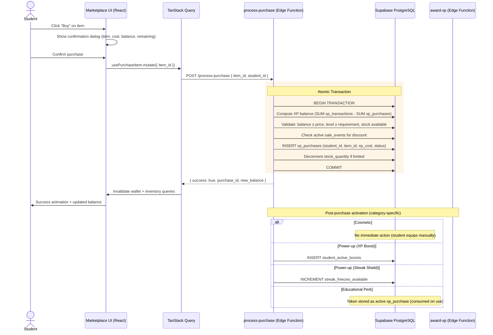
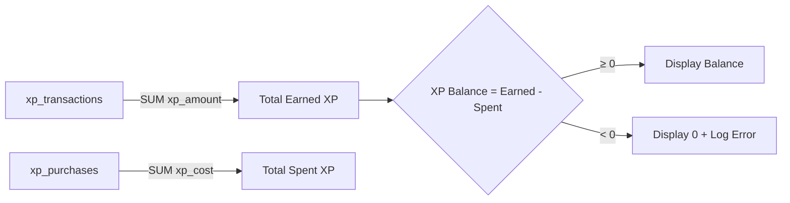

# Design Document — XP Marketplace & Virtual Economy

## Overview

This design covers the XP Marketplace & Virtual Economy feature for the Edeviser platform — transforming the existing earn-and-display gamification engine into a full virtual economy where students spend earned XP on meaningful rewards. The feature adds:

1. A Virtual Wallet that computes spendable XP balance (earned minus spent) and displays it across the student UI
2. An XP Marketplace where students browse, filter, and purchase items across three categories: Cosmetic, Educational Perks, and Power-ups
3. A Purchase Processor Edge Function that atomically validates and executes purchases with race-condition protection
4. A cosmetic equipment system (profile themes, avatar frames, display titles) rendered on profiles and leaderboard
5. Educational perks (extra quiz attempt, deadline extension, AI Tutor hint tokens) that integrate with existing assignment/quiz/tutor pipelines
6. Power-ups (2x XP boost, streak shield upgrade) that integrate with the existing `award-xp` Edge Function and streak system
7. Admin Marketplace Management panel for item configuration, sale events, and analytics
8. Migration of the existing streak freeze (200 XP) into the unified marketplace system

The system integrates with the existing Supabase backend (PostgreSQL + RLS, Edge Functions, Realtime), TanStack Query hooks, and the existing XP/level/streak/badge subsystems. All new tables follow the append-only pattern for purchase records and enforce RLS scoped by institution and role.

### Key Design Decisions

| Decision | Choice | Rationale |
|----------|--------|-----------|
| XP Balance computation | Derived at query time: `SUM(xp_transactions.xp_amount) - SUM(xp_purchases.xp_cost)` | No denormalized balance column to drift; consistent with append-only ledger pattern |
| Purchase atomicity | Edge Function with Supabase RPC wrapping a PL/pgSQL function | Single DB transaction for balance check + insert prevents double-spending race conditions |
| Cosmetic slot system | `student_equipped_items` with unique constraint on `(student_id, slot)` | DB-enforced one-item-per-slot; simple equip = upsert, unequip = delete |
| Sale price resolution | Computed at query time via join to active `sale_events` | No stale cached prices; Purchase Processor re-validates at transaction time |
| XP Boost stacking | Student boost × Admin event multiplier (multiplicative) | Matches requirement 11.2; `award-xp` already handles admin multiplier, just adds student boost layer |
| Streak shield | Reuses existing `streak_freezes_available` field | No new streak logic needed; marketplace just increments the counter |
| Profile themes | Predefined CSS custom property overrides per theme | Stays within design system; no arbitrary colors; themes are JSON metadata on `marketplace_items` |
| Stock management | `stock_quantity` decremented in purchase transaction | Atomic decrement in same transaction as purchase insert prevents overselling |
| Hint token expiry | Midnight UTC on day of purchase | Simple date comparison; no background job needed for cleanup |

## Architecture

### High-Level Purchase Flow



### XP Balance Computation Flow



### Component Architecture

```
src/
├── pages/student/marketplace/
│   ├── MarketplacePage.tsx          # Main marketplace with category tabs
│   ├── ItemCard.tsx                 # Individual item display card
│   ├── PurchaseConfirmDialog.tsx    # Purchase confirmation modal
│   ├── MyItemsPage.tsx             # Student inventory page
│   └── TransactionHistoryPage.tsx  # Unified earning/spending history
├── pages/admin/marketplace/
│   ├── MarketplaceManagementPage.tsx  # Item list + CRUD
│   ├── ItemForm.tsx                   # Create/edit marketplace item
│   ├── SaleEventManager.tsx           # Sale events CRUD
│   ├── SaleEventForm.tsx              # Create/edit sale event
│   └── MarketplaceAnalyticsPage.tsx   # Analytics dashboard
├── components/shared/
│   ├── XPBalanceBadge.tsx           # Persistent XP balance indicator
│   ├── CosmeticPreview.tsx          # Theme/frame/title preview
│   ├── ActiveBoostIndicator.tsx     # Boost countdown timer
│   └── SaleBadge.tsx                # Sale discount badge
├── hooks/
│   ├── useMarketplace.ts           # Browse items, filtered by category
│   ├── usePurchase.ts              # Purchase mutation + confirmation
│   ├── useInventory.ts             # Student owned items
│   ├── useEquippedItems.ts         # Equip/unequip cosmetics
│   ├── useXPBalance.ts             # XP balance computation
│   ├── useTransactionHistory.ts    # Unified transaction history
│   ├── useActiveBoosts.ts          # Active boost status + countdown
│   ├── useDeadlineExtensions.ts    # Deadline extension management
│   ├── useMarketplaceAdmin.ts      # Admin CRUD for items
│   ├── useSaleEvents.ts            # Admin sale event management
│   └── useMarketplaceAnalytics.ts  # Admin analytics queries
├── lib/
│   ├── marketplaceSchemas.ts       # Zod schemas for all marketplace payloads
│   ├── xpBalanceCalculator.ts      # Pure function: compute balance from transactions
│   ├── salePriceCalculator.ts      # Pure function: apply discount to item price
│   ├── purchaseValidator.ts        # Pure function: validate purchase eligibility
│   └── themeResolver.ts            # Pure function: resolve CSS vars from theme metadata
supabase/functions/
├── process-purchase/index.ts       # Atomic purchase processor Edge Function
└── (existing) award-xp/index.ts    # Modified to check student_active_boosts
```


## Components and Interfaces

### Edge Function: `process-purchase`

The core Edge Function handling all marketplace purchases. Wraps validation and insertion in a single database transaction via an RPC call to a PL/pgSQL function.

```typescript
// Request payload
interface PurchaseRequest {
  item_id: string;       // marketplace_items.id
  student_id: string;    // from JWT (validated server-side)
}

// Response
interface PurchaseResponse {
  success: boolean;
  purchase_id: string;
  xp_cost: number;           // actual cost charged (may be discounted)
  new_balance: number;        // updated XP balance after purchase
  item_category: string;      // for client-side post-purchase routing
  item_sub_category: string;
  error?: string;
  error_code?: 'INSUFFICIENT_BALANCE' | 'LEVEL_REQUIREMENT' | 'OUT_OF_STOCK' 
    | 'ALREADY_OWNED' | 'ITEM_INACTIVE' | 'SALE_EXPIRED' | 'MAX_INVENTORY';
}
```

Processing pipeline:
1. Validate JWT → extract `student_id` and `institution_id`
2. Call `process_marketplace_purchase` RPC (PL/pgSQL function) which:
   a. Locks the student's purchase rows with `SELECT ... FOR UPDATE` to prevent concurrent purchases
   b. Computes XP balance: `SUM(xp_transactions.xp_amount) - SUM(xp_purchases.xp_cost)`
   c. Fetches item details from `marketplace_items` (must be active, same institution)
   d. Checks level requirement against student's current level from `student_gamification`
   e. Checks stock: if `limited`, verifies `stock_quantity > 0`; if `one_per_student`, checks no existing purchase
   f. Resolves sale price: joins `sale_event_items` + `sale_events` for active discounts, takes highest discount
   g. Validates balance ≥ effective price
   h. Inserts `xp_purchases` record with effective cost
   i. Decrements `stock_quantity` if limited stock
   j. Returns purchase_id, cost, new_balance
3. Post-purchase activation (outside transaction, in Edge Function):
   - `power_up` + `xp_boost`: INSERT into `student_active_boosts` (1 hour expiry)
   - `power_up` + `streak_shield`: INCREMENT `student_gamification.streak_freezes_available` (max 3 check in transaction)
   - Other categories: no immediate activation (tokens consumed on use)
4. Log to `audit_logs` via service role

### Edge Function: `award-xp` (Modified)

The existing `award-xp` Edge Function is modified to check for active student-level XP boosts before calculating the final XP amount.

```typescript
// New step inserted between Step 1 (bonus events) and Step 2 (insert transaction):

// ── Step 1b: Check for active student XP boosts ──────────────────────
const { data: activeBoosts, error: boostErr } = await supabase
  .from('student_active_boosts')
  .select('multiplier')
  .eq('student_id', student_id)
  .gt('expires_at', new Date().toISOString());

let studentBoostMultiplier = 1;
if (!boostErr && activeBoosts && activeBoosts.length > 0) {
  studentBoostMultiplier = Math.max(
    ...activeBoosts.map((b: { multiplier: number }) => b.multiplier)
  );
}

// Final XP = floor(base_xp × student_boost × admin_event_multiplier)
finalXP = Math.floor(xp_amount * studentBoostMultiplier * adminEventMultiplier);
```

The `xp_transactions` record metadata is extended with a `boost_applied` field:
```typescript
{
  student_id,
  xp_amount: finalXP,
  source,
  reference_id,
  note,
  metadata: {
    boost_applied: studentBoostMultiplier > 1,
    student_boost_multiplier: studentBoostMultiplier,
    admin_event_multiplier: adminEventMultiplier,
  }
}
```

### PL/pgSQL Function: `process_marketplace_purchase`

```sql
CREATE OR REPLACE FUNCTION process_marketplace_purchase(
  p_student_id UUID,
  p_item_id UUID,
  p_institution_id UUID
)
RETURNS JSONB
LANGUAGE plpgsql
SECURITY DEFINER
AS $$
DECLARE
  v_balance INTEGER;
  v_item RECORD;
  v_student_level INTEGER;
  v_effective_price INTEGER;
  v_discount INTEGER;
  v_purchase_id UUID;
  v_existing_purchase_count INTEGER;
BEGIN
  -- Lock student purchases to prevent concurrent double-spend
  PERFORM 1 FROM xp_purchases WHERE student_id = p_student_id FOR UPDATE;

  -- Compute XP balance
  SELECT COALESCE(
    (SELECT SUM(xp_amount) FROM xp_transactions WHERE student_id = p_student_id), 0
  ) - COALESCE(
    (SELECT SUM(xp_cost) FROM xp_purchases WHERE student_id = p_student_id AND status != 'refunded'), 0
  ) INTO v_balance;

  -- Fetch item
  SELECT * INTO v_item FROM marketplace_items
    WHERE id = p_item_id AND institution_id = p_institution_id AND is_active = true;
  IF NOT FOUND THEN
    RETURN jsonb_build_object('success', false, 'error_code', 'ITEM_INACTIVE');
  END IF;

  -- Check level requirement
  SELECT COALESCE(level, 1) INTO v_student_level
    FROM student_gamification WHERE student_id = p_student_id;
  IF v_student_level < v_item.level_requirement THEN
    RETURN jsonb_build_object('success', false, 'error_code', 'LEVEL_REQUIREMENT');
  END IF;

  -- Check stock
  IF v_item.stock_type = 'limited' AND v_item.stock_quantity <= 0 THEN
    RETURN jsonb_build_object('success', false, 'error_code', 'OUT_OF_STOCK');
  END IF;

  IF v_item.stock_type = 'one_per_student' THEN
    SELECT COUNT(*) INTO v_existing_purchase_count
      FROM xp_purchases WHERE student_id = p_student_id AND item_id = p_item_id AND status != 'refunded';
    IF v_existing_purchase_count > 0 THEN
      RETURN jsonb_build_object('success', false, 'error_code', 'ALREADY_OWNED');
    END IF;
  END IF;

  -- Streak shield max check
  IF v_item.sub_category = 'streak_shield' THEN
    DECLARE v_current_freezes INTEGER;
    BEGIN
      SELECT COALESCE(streak_freezes_available, 0) INTO v_current_freezes
        FROM student_gamification WHERE student_id = p_student_id;
      IF v_current_freezes >= 3 THEN
        RETURN jsonb_build_object('success', false, 'error_code', 'MAX_INVENTORY');
      END IF;
    END;
  END IF;

  -- Resolve sale price (highest active discount wins)
  SELECT COALESCE(MAX(se.discount_percentage), 0) INTO v_discount
    FROM sale_event_items sei
    JOIN sale_events se ON se.id = sei.sale_event_id
    WHERE sei.item_id = p_item_id
      AND se.institution_id = p_institution_id
      AND se.start_date <= NOW()
      AND se.end_date > NOW();

  v_effective_price := GREATEST(1, v_item.xp_price - FLOOR(v_item.xp_price * v_discount / 100));

  -- Check balance
  IF v_balance < v_effective_price THEN
    RETURN jsonb_build_object('success', false, 'error_code', 'INSUFFICIENT_BALANCE',
      'detail', jsonb_build_object('balance', v_balance, 'price', v_effective_price));
  END IF;

  -- Insert purchase
  INSERT INTO xp_purchases (student_id, item_id, xp_cost, status, purchased_at)
    VALUES (p_student_id, p_item_id, v_effective_price, 'active', NOW())
    RETURNING id INTO v_purchase_id;

  -- Decrement stock if limited
  IF v_item.stock_type = 'limited' THEN
    UPDATE marketplace_items SET stock_quantity = stock_quantity - 1
      WHERE id = p_item_id AND stock_quantity > 0;
  END IF;

  RETURN jsonb_build_object(
    'success', true,
    'purchase_id', v_purchase_id,
    'xp_cost', v_effective_price,
    'new_balance', v_balance - v_effective_price,
    'item_category', v_item.category,
    'item_sub_category', v_item.sub_category
  );
END;
$$;
```

### React Components

**MarketplacePage** — Main student marketplace:
- Three category tabs (Cosmetic, Educational Perks, Power-ups) using pill-style Shadcn Tabs
- XP balance displayed prominently at top via `XPBalanceBadge`
- Grid of `ItemCard` components per category
- Active sale events highlighted with `SaleBadge`

**ItemCard** — Individual marketplace item:
- Card with icon, name, description, XP price
- Locked overlay with level requirement if student level is insufficient
- "Owned" badge for `one_per_student` items already purchased
- Sale strikethrough price + discounted price when sale active
- "Buy" button triggers `PurchaseConfirmDialog`
- Remaining stock count for limited items

**PurchaseConfirmDialog** — Shadcn Dialog for purchase confirmation:
- Shows item name, XP cost (sale price if applicable), current balance, remaining balance
- "Confirm" button calls `usePurchaseItem` mutation
- Loading state with Loader2 spinner
- Error display for insufficient balance, level gate, etc.

**MyItemsPage** — Student inventory:
- Grouped by category tabs
- Cosmetics: "Equip" / "Unequip" toggle buttons
- Educational Perks: remaining uses display, "Use" action buttons
- Power-ups: active status with countdown timer, streak freeze count

**TransactionHistoryPage** — Unified transaction history:
- Combines earnings (xp_transactions) and spending (xp_purchases) in reverse chronological order
- Filter tabs: All, Earnings, Spending
- Paginated with 20 entries per page
- Each entry shows date, amount (+/−), source/item name, category

**XPBalanceBadge** — Persistent balance indicator:
- Displayed in student sidebar navigation and marketplace header
- Shows coin icon + formatted XP balance
- Realtime updates via TanStack Query invalidation on purchase/XP award

**ActiveBoostIndicator** — Boost countdown:
- Shown on student dashboard when an XP boost is active
- Countdown timer (mm:ss) until expiry
- Pulsing animation using `animate-xp-pulse`

**CosmeticPreview** — Theme/frame/title preview:
- Renders a mini preview of how the cosmetic looks
- Used in ItemCard and MyItemsPage

### TanStack Query Hooks

```typescript
// useXPBalance.ts
export const useXPBalance = (studentId: string) => useQuery({
  queryKey: queryKeys.marketplace.balance(studentId),
  queryFn: async () => { /* SUM xp_transactions - SUM xp_purchases */ },
});

// useMarketplace.ts
export const useMarketplaceItems = (category?: string) => useQuery({
  queryKey: queryKeys.marketplace.items(category),
  queryFn: async () => { /* SELECT marketplace_items with sale joins */ },
});

// usePurchase.ts
export const usePurchaseItem = () => useMutation({
  mutationFn: async (itemId: string) => { /* POST /process-purchase */ },
  onSuccess: () => {
    queryClient.invalidateQueries({ queryKey: queryKeys.marketplace.balance() });
    queryClient.invalidateQueries({ queryKey: queryKeys.marketplace.inventory() });
  },
});

// useInventory.ts
export const useInventory = (studentId: string) => useQuery({
  queryKey: queryKeys.marketplace.inventory(studentId),
  queryFn: async () => { /* SELECT xp_purchases with item joins */ },
});

// useEquippedItems.ts
export const useEquippedItems = (studentId: string) => useQuery({...});
export const useEquipItem = () => useMutation({...});   // UPSERT student_equipped_items
export const useUnequipItem = () => useMutation({...}); // DELETE from student_equipped_items

// useTransactionHistory.ts
export const useTransactionHistory = (filter: 'all' | 'earnings' | 'spending', page: number) => useQuery({...});

// useActiveBoosts.ts
export const useActiveBoosts = (studentId: string) => useQuery({...});

// useDeadlineExtensions.ts
export const useActivateDeadlineExtension = () => useMutation({...});
export const useRevokeDeadlineExtension = () => useMutation({...}); // teacher action

// useMarketplaceAdmin.ts
export const useAdminMarketplaceItems = () => useQuery({...});
export const useCreateMarketplaceItem = () => useMutation({...});
export const useUpdateMarketplaceItem = () => useMutation({...});
export const useToggleMarketplaceItem = () => useMutation({...}); // activate/deactivate

// useSaleEvents.ts
export const useSaleEvents = () => useQuery({...});
export const useCreateSaleEvent = () => useMutation({...});
export const useUpdateSaleEvent = () => useMutation({...});
export const useCancelSaleEvent = () => useMutation({...});

// useMarketplaceAnalytics.ts
export const useMarketplaceAnalytics = () => useQuery({...});
```

### Zod Schemas

```typescript
// marketplaceSchemas.ts
import { z } from 'zod';

export const marketplaceItemCategorySchema = z.enum(['cosmetic', 'educational_perk', 'power_up']);

export const marketplaceItemSubCategorySchema = z.enum([
  'profile_theme', 'avatar_frame', 'display_title',
  'extra_quiz_attempt', 'deadline_extension', 'hint_token',
  'xp_boost', 'streak_shield',
]);

export const stockTypeSchema = z.enum(['unlimited', 'limited', 'one_per_student']);

export const createMarketplaceItemSchema = z.object({
  name: z.string().min(1).max(100),
  description: z.string().min(1).max(500),
  category: marketplaceItemCategorySchema,
  sub_category: marketplaceItemSubCategorySchema,
  xp_price: z.number().int().positive(),
  level_requirement: z.number().int().min(0).default(0),
  stock_type: stockTypeSchema,
  stock_quantity: z.number().int().positive().nullable().default(null),
  icon_identifier: z.string().min(1),
  metadata: z.record(z.unknown()).optional(),
});

export const updateMarketplaceItemSchema = createMarketplaceItemSchema.partial();

export const createSaleEventSchema = z.object({
  name: z.string().min(1).max(100),
  discount_percentage: z.number().int().min(5).max(90),
  start_date: z.string().datetime(),
  end_date: z.string().datetime(),
  item_ids: z.array(z.string().uuid()).min(1),
}).refine(
  (data) => new Date(data.end_date) > new Date(data.start_date),
  { message: 'End date must be after start date' }
);

export const purchaseRequestSchema = z.object({
  item_id: z.string().uuid(),
});

export const deadlineExtensionSchema = z.object({
  purchase_id: z.string().uuid(),
  assignment_id: z.string().uuid(),
});

export type CreateMarketplaceItemInput = z.infer<typeof createMarketplaceItemSchema>;
export type UpdateMarketplaceItemInput = z.infer<typeof updateMarketplaceItemSchema>;
export type CreateSaleEventInput = z.infer<typeof createSaleEventSchema>;
export type PurchaseRequestInput = z.infer<typeof purchaseRequestSchema>;
export type DeadlineExtensionInput = z.infer<typeof deadlineExtensionSchema>;
```


## Data Models

### New Database Tables

```sql
-- ============================================================
-- marketplace_items — Purchasable items catalog
-- ============================================================
CREATE TABLE marketplace_items (
  id UUID PRIMARY KEY DEFAULT gen_random_uuid(),
  institution_id UUID NOT NULL REFERENCES institutions(id),
  name VARCHAR(100) NOT NULL,
  description VARCHAR(500) NOT NULL,
  category VARCHAR(20) NOT NULL CHECK (category IN ('cosmetic', 'educational_perk', 'power_up')),
  sub_category VARCHAR(30) NOT NULL CHECK (sub_category IN (
    'profile_theme', 'avatar_frame', 'display_title',
    'extra_quiz_attempt', 'deadline_extension', 'hint_token',
    'xp_boost', 'streak_shield'
  )),
  xp_price INTEGER NOT NULL CHECK (xp_price > 0),
  level_requirement INTEGER NOT NULL DEFAULT 0 CHECK (level_requirement >= 0),
  stock_type VARCHAR(20) NOT NULL CHECK (stock_type IN ('unlimited', 'limited', 'one_per_student')),
  stock_quantity INTEGER CHECK (
    (stock_type = 'limited' AND stock_quantity IS NOT NULL AND stock_quantity >= 0)
    OR (stock_type != 'limited' AND stock_quantity IS NULL)
  ),
  icon_identifier VARCHAR(100) NOT NULL,
  metadata JSONB DEFAULT '{}',
  is_active BOOLEAN NOT NULL DEFAULT true,
  created_at TIMESTAMPTZ NOT NULL DEFAULT now(),
  updated_at TIMESTAMPTZ NOT NULL DEFAULT now()
);

CREATE INDEX idx_marketplace_items_institution ON marketplace_items (institution_id, is_active);
CREATE INDEX idx_marketplace_items_category ON marketplace_items (institution_id, category, is_active);

-- ============================================================
-- xp_purchases — Append-only purchase ledger
-- ============================================================
CREATE TABLE xp_purchases (
  id UUID PRIMARY KEY DEFAULT gen_random_uuid(),
  student_id UUID NOT NULL REFERENCES profiles(id),
  item_id UUID NOT NULL REFERENCES marketplace_items(id),
  xp_cost INTEGER NOT NULL CHECK (xp_cost > 0),
  status VARCHAR(20) NOT NULL DEFAULT 'active' CHECK (status IN ('active', 'consumed', 'expired', 'refunded')),
  purchased_at TIMESTAMPTZ NOT NULL DEFAULT now(),
  consumed_at TIMESTAMPTZ,
  metadata JSONB DEFAULT '{}',
  CONSTRAINT no_delete_purchases CHECK (true) -- symbolic; enforced via RLS (no DELETE policies)
);

CREATE INDEX idx_xp_purchases_student ON xp_purchases (student_id, purchased_at DESC);
CREATE INDEX idx_xp_purchases_item ON xp_purchases (item_id);
CREATE INDEX idx_xp_purchases_student_item ON xp_purchases (student_id, item_id, status);

-- ============================================================
-- student_equipped_items — Currently equipped cosmetics
-- ============================================================
CREATE TABLE student_equipped_items (
  id UUID PRIMARY KEY DEFAULT gen_random_uuid(),
  student_id UUID NOT NULL REFERENCES profiles(id),
  purchase_id UUID NOT NULL REFERENCES xp_purchases(id),
  slot VARCHAR(20) NOT NULL CHECK (slot IN ('profile_theme', 'avatar_frame', 'display_title')),
  equipped_at TIMESTAMPTZ NOT NULL DEFAULT now(),
  UNIQUE (student_id, slot)
);

CREATE INDEX idx_equipped_student ON student_equipped_items (student_id);

-- ============================================================
-- sale_events — Time-bounded discount events
-- ============================================================
CREATE TABLE sale_events (
  id UUID PRIMARY KEY DEFAULT gen_random_uuid(),
  institution_id UUID NOT NULL REFERENCES institutions(id),
  name VARCHAR(100) NOT NULL,
  discount_percentage INTEGER NOT NULL CHECK (discount_percentage BETWEEN 5 AND 90),
  start_date TIMESTAMPTZ NOT NULL,
  end_date TIMESTAMPTZ NOT NULL,
  created_by UUID NOT NULL REFERENCES profiles(id),
  created_at TIMESTAMPTZ NOT NULL DEFAULT now(),
  CONSTRAINT valid_date_range CHECK (end_date > start_date)
);

CREATE INDEX idx_sale_events_institution ON sale_events (institution_id, start_date, end_date);

-- ============================================================
-- sale_event_items — Junction: which items are in which sale
-- ============================================================
CREATE TABLE sale_event_items (
  sale_event_id UUID NOT NULL REFERENCES sale_events(id) ON DELETE CASCADE,
  item_id UUID NOT NULL REFERENCES marketplace_items(id),
  PRIMARY KEY (sale_event_id, item_id)
);

CREATE INDEX idx_sale_event_items_item ON sale_event_items (item_id);

-- ============================================================
-- student_active_boosts — Time-limited XP multiplier boosts
-- ============================================================
CREATE TABLE student_active_boosts (
  id UUID PRIMARY KEY DEFAULT gen_random_uuid(),
  student_id UUID NOT NULL REFERENCES profiles(id),
  boost_type VARCHAR(20) NOT NULL DEFAULT 'xp_boost',
  multiplier NUMERIC(3,1) NOT NULL DEFAULT 2.0 CHECK (multiplier > 1),
  purchase_id UUID NOT NULL REFERENCES xp_purchases(id),
  activated_at TIMESTAMPTZ NOT NULL DEFAULT now(),
  expires_at TIMESTAMPTZ NOT NULL,
  CONSTRAINT valid_boost_duration CHECK (expires_at > activated_at)
);

CREATE INDEX idx_active_boosts_student ON student_active_boosts (student_id, expires_at);

-- ============================================================
-- deadline_extensions — Student deadline extension records
-- ============================================================
CREATE TABLE deadline_extensions (
  id UUID PRIMARY KEY DEFAULT gen_random_uuid(),
  student_id UUID NOT NULL REFERENCES profiles(id),
  assignment_id UUID NOT NULL REFERENCES assignments(id),
  purchase_id UUID NOT NULL REFERENCES xp_purchases(id),
  original_deadline TIMESTAMPTZ NOT NULL,
  extended_deadline TIMESTAMPTZ NOT NULL,
  revoked BOOLEAN NOT NULL DEFAULT false,
  revoked_by UUID REFERENCES profiles(id),
  created_at TIMESTAMPTZ NOT NULL DEFAULT now(),
  UNIQUE (student_id, assignment_id) -- one extension per student per assignment
);

CREATE INDEX idx_deadline_ext_student ON deadline_extensions (student_id);
CREATE INDEX idx_deadline_ext_assignment ON deadline_extensions (assignment_id);
```

### RLS Policies

```sql
-- ============================================================
-- marketplace_items — RLS
-- ============================================================
ALTER TABLE marketplace_items ENABLE ROW LEVEL SECURITY;

-- Students: read active items in their institution
CREATE POLICY "marketplace_items_student_read" ON marketplace_items
  FOR SELECT USING (
    auth_user_role() IN ('student', 'teacher')
    AND institution_id = auth_institution_id()
    AND is_active = true
  );

-- Admins: full CRUD within institution
CREATE POLICY "marketplace_items_admin_all" ON marketplace_items
  FOR ALL USING (
    auth_user_role() = 'admin'
    AND institution_id = auth_institution_id()
  );

-- ============================================================
-- xp_purchases — RLS
-- ============================================================
ALTER TABLE xp_purchases ENABLE ROW LEVEL SECURITY;

-- Students: read own purchases
CREATE POLICY "xp_purchases_student_read" ON xp_purchases
  FOR SELECT USING (student_id = auth.uid());

-- Students: insert own purchases (validated by Edge Function)
CREATE POLICY "xp_purchases_student_insert" ON xp_purchases
  FOR INSERT WITH CHECK (student_id = auth.uid());

-- Admins: read all purchases in institution
CREATE POLICY "xp_purchases_admin_read" ON xp_purchases
  FOR SELECT USING (
    auth_user_role() = 'admin'
    AND item_id IN (
      SELECT id FROM marketplace_items WHERE institution_id = auth_institution_id()
    )
  );

-- Parents: read linked students' purchases
CREATE POLICY "xp_purchases_parent_read" ON xp_purchases
  FOR SELECT USING (
    auth_user_role() = 'parent'
    AND student_id IN (
      SELECT student_id FROM parent_student_links
      WHERE parent_id = auth.uid() AND verified = true
    )
  );

-- No DELETE policy — purchases are immutable (status updates via service role)

-- ============================================================
-- student_equipped_items — RLS
-- ============================================================
ALTER TABLE student_equipped_items ENABLE ROW LEVEL SECURITY;

-- Students: full control over own equipped items
CREATE POLICY "equipped_items_student_own" ON student_equipped_items
  FOR ALL USING (student_id = auth.uid());

-- ============================================================
-- sale_events — RLS
-- ============================================================
ALTER TABLE sale_events ENABLE ROW LEVEL SECURITY;

-- Students/Teachers: read active and scheduled sales in institution
CREATE POLICY "sale_events_read" ON sale_events
  FOR SELECT USING (
    auth_user_role() IN ('student', 'teacher')
    AND institution_id = auth_institution_id()
  );

-- Admins: full CRUD within institution
CREATE POLICY "sale_events_admin_all" ON sale_events
  FOR ALL USING (
    auth_user_role() = 'admin'
    AND institution_id = auth_institution_id()
  );

-- ============================================================
-- sale_event_items — RLS
-- ============================================================
ALTER TABLE sale_event_items ENABLE ROW LEVEL SECURITY;

-- Students/Teachers: read sale items for visible sales
CREATE POLICY "sale_event_items_read" ON sale_event_items
  FOR SELECT USING (
    sale_event_id IN (
      SELECT id FROM sale_events
      WHERE institution_id = auth_institution_id()
    )
  );

-- Admins: full CRUD
CREATE POLICY "sale_event_items_admin_all" ON sale_event_items
  FOR ALL USING (
    sale_event_id IN (
      SELECT id FROM sale_events
      WHERE auth_user_role() = 'admin'
        AND institution_id = auth_institution_id()
    )
  );

-- ============================================================
-- student_active_boosts — RLS
-- ============================================================
ALTER TABLE student_active_boosts ENABLE ROW LEVEL SECURITY;

-- Students: read own boosts
CREATE POLICY "active_boosts_student_read" ON student_active_boosts
  FOR SELECT USING (student_id = auth.uid());

-- award-xp Edge Function uses service role key (bypasses RLS)

-- ============================================================
-- deadline_extensions — RLS
-- ============================================================
ALTER TABLE deadline_extensions ENABLE ROW LEVEL SECURITY;

-- Students: read own extensions
CREATE POLICY "deadline_ext_student_read" ON deadline_extensions
  FOR SELECT USING (student_id = auth.uid());

-- Teachers: read extensions for their course assignments
CREATE POLICY "deadline_ext_teacher_read" ON deadline_extensions
  FOR SELECT USING (
    auth_user_role() = 'teacher'
    AND assignment_id IN (
      SELECT a.id FROM assignments a
      JOIN courses c ON c.id = a.course_id
      WHERE c.teacher_id = auth.uid()
    )
  );

-- Admins: read all extensions in institution
CREATE POLICY "deadline_ext_admin_read" ON deadline_extensions
  FOR SELECT USING (
    auth_user_role() = 'admin'
    AND student_id IN (
      SELECT id FROM profiles WHERE institution_id = auth_institution_id()
    )
  );
```

### Helper Functions

```sql
-- Compute XP balance for a student (used in UI queries)
CREATE OR REPLACE FUNCTION get_xp_balance(p_student_id UUID)
RETURNS INTEGER
LANGUAGE sql
STABLE
SECURITY DEFINER
AS $$
  SELECT GREATEST(0,
    COALESCE((SELECT SUM(xp_amount) FROM xp_transactions WHERE student_id = p_student_id), 0)
    - COALESCE((SELECT SUM(xp_cost) FROM xp_purchases WHERE student_id = p_student_id AND status != 'refunded'), 0)
  )::INTEGER;
$$;

-- Get effective price for an item (applies best active sale discount)
CREATE OR REPLACE FUNCTION get_effective_price(p_item_id UUID, p_institution_id UUID)
RETURNS TABLE (original_price INTEGER, effective_price INTEGER, discount_percentage INTEGER)
LANGUAGE sql
STABLE
SECURITY DEFINER
AS $$
  SELECT
    mi.xp_price AS original_price,
    GREATEST(1, mi.xp_price - FLOOR(mi.xp_price * COALESCE(MAX(se.discount_percentage), 0) / 100))::INTEGER AS effective_price,
    COALESCE(MAX(se.discount_percentage), 0)::INTEGER AS discount_percentage
  FROM marketplace_items mi
  LEFT JOIN sale_event_items sei ON sei.item_id = mi.id
  LEFT JOIN sale_events se ON se.id = sei.sale_event_id
    AND se.institution_id = p_institution_id
    AND se.start_date <= NOW()
    AND se.end_date > NOW()
  WHERE mi.id = p_item_id
  GROUP BY mi.id, mi.xp_price;
$$;
```

### Profile Theme Metadata Schema

Profile themes are stored as JSON metadata on `marketplace_items`:

```json
{
  "theme_id": "ocean_blue",
  "display_name": "Ocean Blue",
  "accent_primary": "#0ea5e9",
  "accent_secondary": "#0284c7",
  "accent_bg": "#f0f9ff",
  "gradient_start": "#0ea5e9",
  "gradient_end": "#0369a1",
  "preview_url": "/themes/ocean-blue-preview.png"
}
```

Available predefined themes:
- Ocean Blue (`sky-500` → `sky-700`)
- Forest Green (`emerald-500` → `emerald-700`)
- Sunset Orange (`orange-500` → `amber-600`)
- Midnight Purple (`violet-500` → `purple-700`)
- Rose Gold (`rose-400` → `pink-600`)
- Arctic Silver (`slate-400` → `slate-600`)

### Avatar Frame Metadata Schema

```json
{
  "frame_id": "golden_laurel",
  "display_name": "Golden Laurel",
  "border_style": "solid",
  "border_width": "3px",
  "border_color": "#EAB308",
  "border_radius": "9999px",
  "box_shadow": "0 0 0 3px #EAB308, 0 0 12px rgba(234, 179, 8, 0.3)",
  "preview_url": "/frames/golden-laurel-preview.png"
}
```

### Display Title Metadata Schema

```json
{
  "title_id": "the_scholar",
  "display_text": "The Scholar",
  "text_color": "#2563eb",
  "font_style": "italic"
}
```


## Correctness Properties

*A property is a characteristic or behavior that should hold true across all valid executions of a system — essentially, a formal statement about what the system should do. Properties serve as the bridge between human-readable specifications and machine-verifiable correctness guarantees.*

### Property 1: XP Balance computation correctness

*For any* student with a set of XP transactions (earnings) and a set of XP purchases (spending), the computed XP balance must equal `SUM(xp_transactions.xp_amount) - SUM(xp_purchases.xp_cost where status != 'refunded')`. After any successful purchase of cost C, the new balance must equal the previous balance minus C.

**Validates: Requirements 1.1, 4.3, 22.1**

### Property 2: XP Balance non-negativity

*For any* student, the displayed XP balance must be greater than or equal to 0. If the raw computation yields a negative value, the displayed balance must be exactly 0.

**Validates: Requirements 1.6, 22.3**

### Property 3: Transaction history ordering

*For any* set of mixed earning and spending transaction entries, the unified transaction history must be sorted by date in descending order (most recent first).

**Validates: Requirements 2.1**

### Property 4: Transaction entry contains required fields

*For any* earning transaction entry, the rendered output must contain: date, XP amount, and source label. *For any* spending transaction entry, the rendered output must contain: date, XP cost, item name, and item category.

**Validates: Requirements 2.2, 2.3**

### Property 5: Transaction history filtering

*For any* set of mixed earning and spending entries and a filter selection of "earnings", "spending", or "all", the returned entries must contain only entries matching the selected type (or all entries if "all" is selected).

**Validates: Requirements 2.5**

### Property 6: Purchase validation correctness

*For any* student, marketplace item, and purchase attempt, the purchase validator must: (a) reject if XP balance < effective price, (b) reject if student level < item level requirement, (c) reject if item stock_type is "limited" and stock_quantity ≤ 0, (d) reject if stock_type is "one_per_student" and student already owns the item, (e) reject if item is inactive, (f) accept only when all conditions are satisfied.

**Validates: Requirements 4.2, 4.5, 4.6, 3.3, 3.7**

### Property 7: Sale price resolution — highest discount wins

*For any* marketplace item with one or more active sale events, the effective price must equal `max(1, original_price - floor(original_price × max_discount / 100))` where `max_discount` is the highest `discount_percentage` among all active sale events for that item. Discounts must never stack (no additive combination).

**Validates: Requirements 3.4, 14.5**

### Property 8: Cosmetic metadata resolves to valid CSS properties

*For any* profile theme metadata object, the theme resolver must produce a non-empty set of CSS custom property overrides containing at minimum `accent_primary` and `accent_bg`. *For any* avatar frame metadata object, the frame resolver must produce valid CSS border properties (border-style, border-width, border-color).

**Validates: Requirements 6.2, 7.1**

### Property 9: Equip/unequip round-trip restores default state

*For any* cosmetic item and student, equipping and then unequipping the item must result in the student having no equipped item in that slot, and the dashboard must render with the default color palette.

**Validates: Requirements 6.4**

### Property 10: One equipped item per cosmetic slot

*For any* student and cosmetic slot (profile_theme, avatar_frame, display_title), at most one item can be equipped at a time. Equipping a new item in a slot that already has an equipped item must replace the previous item (not add alongside it).

**Validates: Requirements 6.5, 7.3**

### Property 11: Anonymous mode hides cosmetics on leaderboard

*For any* student with `leaderboard_anonymous = true`, the leaderboard query must not include any equipped cosmetic data (avatar frame, display title) for that student. The leaderboard entry must render with default styling.

**Validates: Requirements 7.4, 19.4**

### Property 12: Extra quiz attempt extends limit by one

*For any* quiz with a teacher-configured attempt limit of N, and a student who has used N attempts and owns an active extra quiz attempt token, the student must be allowed exactly one additional attempt (attempt N+1). Without the token, the student must be blocked.

**Validates: Requirements 8.1**

### Property 13: Deadline extension adds exactly 24 hours

*For any* assignment with an original deadline D, activating a deadline extension token must produce an extended deadline of exactly D + 24 hours. The `deadline_extensions` record must store both the original and extended deadlines.

**Validates: Requirements 9.1**

### Property 14: Deadline revocation restores original deadline and refunds token

*For any* active deadline extension, when a teacher revokes it, the extension record must be marked as `revoked = true`, the associated `xp_purchases` record must have status changed to `refunded`, and the student's effective deadline for that assignment must revert to the original deadline.

**Validates: Requirements 9.4, 23.3**

### Property 15: One deadline extension per student per assignment

*For any* student and assignment, at most one non-revoked deadline extension can exist. Attempting to activate a second extension on the same assignment must be rejected.

**Validates: Requirements 9.5**

### Property 16: Hint token allowance computation

*For any* student who purchases a hint token pack, their extra message allowance for the current calendar day (UTC) must increase by 5. When the student's base daily messages are exhausted and hint tokens are available, the next message must succeed and decrement the hint token count by 1.

**Validates: Requirements 10.1, 10.3**

### Property 17: Hint token expiry at midnight UTC

*For any* hint token pack purchased at time T, the tokens must be considered expired after midnight UTC of the calendar day containing T. After expiry, the tokens must not contribute to the student's message allowance.

**Validates: Requirements 10.4**

### Property 18: XP multiplier stacking formula

*For any* base XP amount, student boost multiplier (from `student_active_boosts`), and admin event multiplier (from `bonus_xp_events`), the final XP awarded must equal `floor(base_xp × student_boost_multiplier × admin_event_multiplier)`. When no student boost is active, the student boost multiplier defaults to 1.

**Validates: Requirements 11.2, 18.2, 18.3**

### Property 19: One active XP boost at a time

*For any* student, at most one non-expired XP boost can be active at any time. Attempting to activate a second boost while one is active must be rejected.

**Validates: Requirements 11.7**

### Property 20: Streak shield increment with cap

*For any* student with N streak freezes available (where N < 3), purchasing a streak shield must result in exactly N + 1 streak freezes. *For any* student with 3 streak freezes, the purchase must be rejected.

**Validates: Requirements 12.1, 12.3**

### Property 21: Price changes do not affect existing purchases

*For any* marketplace item whose XP price is changed by an admin, all existing `xp_purchases` records for that item must retain their original `xp_cost` value (the cost at time of purchase).

**Validates: Requirements 13.3**

### Property 22: Sale event discount percentage validation

*For any* sale event creation request, the discount percentage must be between 5 and 90 inclusive. Values outside this range must be rejected by the schema validator.

**Validates: Requirements 14.1**

### Property 23: Analytics aggregation correctness

*For any* set of XP purchases within an institution, the analytics must correctly compute: (a) total XP spent = SUM of all xp_cost, (b) total purchases = COUNT of all purchases, (c) unique buyers = COUNT DISTINCT student_id, (d) per-category totals must sum to the overall total. The "Most Popular Items" ranking must be sorted by purchase count descending.

**Validates: Requirements 15.1, 15.2, 15.4**

### Property 24: Inventory item status resolution

*For any* educational perk purchase, the remaining uses must equal the total purchased quantity minus the number with status "consumed". *For any* power-up purchase, the active status must be true if and only if the associated boost's `expires_at` is in the future.

**Validates: Requirements 5.4, 5.5**

### Property 25: Marketplace item display contains required fields

*For any* marketplace item, the rendered item card must contain: name, description, XP price, and availability status. If the item has a level requirement > 0, the level requirement must be displayed.

**Validates: Requirements 3.2, 5.2**


## Error Handling

### Purchase Processor Errors

| Error Code | Condition | User Message | Recovery |
|------------|-----------|-------------|----------|
| `INSUFFICIENT_BALANCE` | XP balance < effective price | "Not enough XP. You need {shortfall} more XP." | Show current balance and price difference |
| `LEVEL_REQUIREMENT` | Student level < item level gate | "You need to reach Level {required} to purchase this item." | Show current level and required level |
| `OUT_OF_STOCK` | Limited item with stock_quantity = 0 | "This item is sold out." | Disable buy button, show "Sold Out" badge |
| `ALREADY_OWNED` | One-per-student item already purchased | "You already own this item." | Show "Owned" badge, hide buy button |
| `ITEM_INACTIVE` | Item deactivated between page load and purchase | "This item is no longer available." | Remove item from display on next refresh |
| `SALE_EXPIRED` | Sale ended between page load and purchase | "The sale has ended. The current price is {new_price} XP." | Show updated price, let student re-confirm |
| `MAX_INVENTORY` | Streak shield at max (3 freezes) | "You already have the maximum number of streak shields (3)." | Disable buy button |

### Edge Function Error Handling

- All Edge Functions return structured JSON errors with appropriate HTTP status codes
- 400 for validation errors (bad input, insufficient balance, level gate)
- 404 for not found (item doesn't exist)
- 409 for conflict (race condition, already owned)
- 500 for internal errors (database failure)
- All errors are logged server-side; user-facing messages use Sonner toasts
- Purchase failures trigger full transaction rollback (PL/pgSQL function handles this)

### Client-Side Error Handling

- TanStack Query `onError` callbacks display Sonner toast notifications
- Optimistic updates are NOT used for purchases (too risky for financial transactions)
- Stale data detection: if a purchase fails due to stale price/stock, the UI refetches marketplace data
- Network errors show a retry prompt
- Error boundaries wrap marketplace pages to prevent full-app crashes

### Deadline Extension Errors

| Condition | Behavior |
|-----------|----------|
| Deadline already passed | Reject with "The deadline for this assignment has already passed." |
| Extension already active | Reject with "You already have an extension on this assignment." |
| Quiz closed by teacher | Reject with "This quiz has been closed and cannot accept new attempts." |
| Token already consumed | Reject with "This token has already been used." |

### Data Consistency

- `xp_purchases` is append-only: no DELETE operations allowed (enforced by RLS — no DELETE policies)
- Status transitions are one-way: `active → consumed`, `active → expired`, `active → refunded`
- The `process_marketplace_purchase` PL/pgSQL function uses `SELECT ... FOR UPDATE` to prevent concurrent double-spending
- Negative balance is prevented at the database level via the `get_xp_balance` function returning `GREATEST(0, ...)`

## Testing Strategy

### Dual Testing Approach

This feature uses both unit tests and property-based tests for comprehensive coverage:

- **Unit tests**: Verify specific examples, edge cases, error conditions, and UI component rendering
- **Property-based tests**: Verify universal properties across randomly generated inputs using fast-check (minimum 100 iterations per property)

### Property-Based Testing Configuration

- Library: **fast-check** (already in project dependencies)
- Minimum iterations: **100 per property test**
- Each property test references its design document property with a tag comment
- Tag format: `// Feature: xp-marketplace, Property {number}: {property_text}`
- Each correctness property is implemented by a single property-based test

### Property Test Files

| File | Properties Covered |
|------|-------------------|
| `src/__tests__/properties/xpBalance.property.test.ts` | P1 (balance computation), P2 (non-negativity) |
| `src/__tests__/properties/transactionHistory.property.test.ts` | P3 (ordering), P4 (required fields), P5 (filtering) |
| `src/__tests__/properties/purchaseValidator.property.test.ts` | P6 (purchase validation) |
| `src/__tests__/properties/salePriceCalculator.property.test.ts` | P7 (sale price resolution) |
| `src/__tests__/properties/cosmeticResolver.property.test.ts` | P8 (CSS resolution), P9 (equip/unequip round-trip), P10 (one per slot) |
| `src/__tests__/properties/deadlineExtension.property.test.ts` | P13 (24h extension), P14 (revocation), P15 (one per assignment) |
| `src/__tests__/properties/hintTokens.property.test.ts` | P16 (allowance computation), P17 (expiry) |
| `src/__tests__/properties/xpMultiplier.property.test.ts` | P18 (stacking formula) |
| `src/__tests__/properties/marketplaceAdmin.property.test.ts` | P21 (price change immutability), P22 (discount validation), P23 (analytics aggregation) |
| `src/__tests__/properties/inventoryStatus.property.test.ts` | P24 (status resolution), P25 (display fields) |
| `src/__tests__/properties/boostAndStreak.property.test.ts` | P19 (one boost), P20 (streak shield cap) |
| `src/__tests__/properties/leaderboardCosmetics.property.test.ts` | P11 (anonymous mode), P12 (extra quiz attempt) |

### Unit Test Files

| File | Coverage |
|------|----------|
| `src/__tests__/unit/marketplaceSchemas.test.ts` | Zod schema validation (valid/invalid payloads for all schemas) |
| `src/__tests__/unit/purchaseConfirmDialog.test.tsx` | Confirmation dialog rendering, error states |
| `src/__tests__/unit/itemCard.test.tsx` | Item card rendering: locked, owned, sale, out-of-stock states |
| `src/__tests__/unit/xpBalanceBadge.test.tsx` | Balance badge rendering, zero balance, loading state |
| `src/__tests__/unit/activeBoostIndicator.test.tsx` | Countdown timer, expired state |
| `src/__tests__/unit/marketplaceAdmin.test.tsx` | Admin CRUD form validation, item list rendering |
| `src/__tests__/unit/saleEventForm.test.tsx` | Sale event form validation, date range checks |
| `src/__tests__/unit/processPurchase.test.ts` | Edge Function: success path, each error code, edge cases |
| `src/__tests__/unit/awardXpBoost.test.ts` | Modified award-xp: boost lookup, multiplier application, metadata recording |
