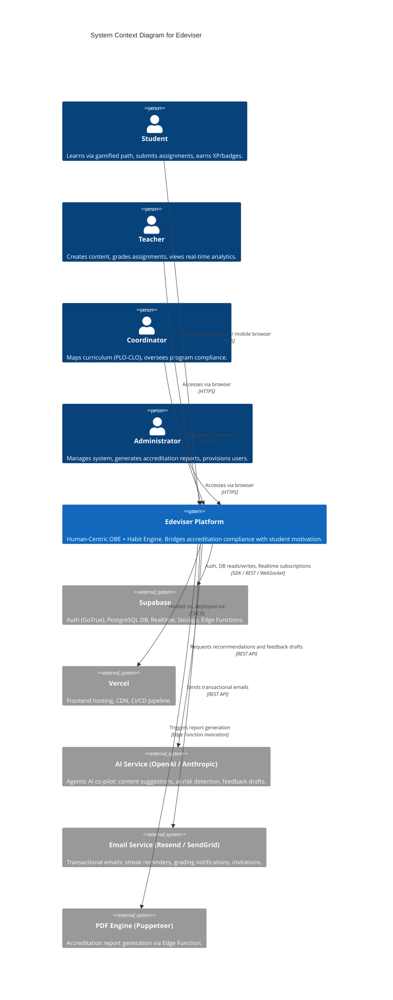
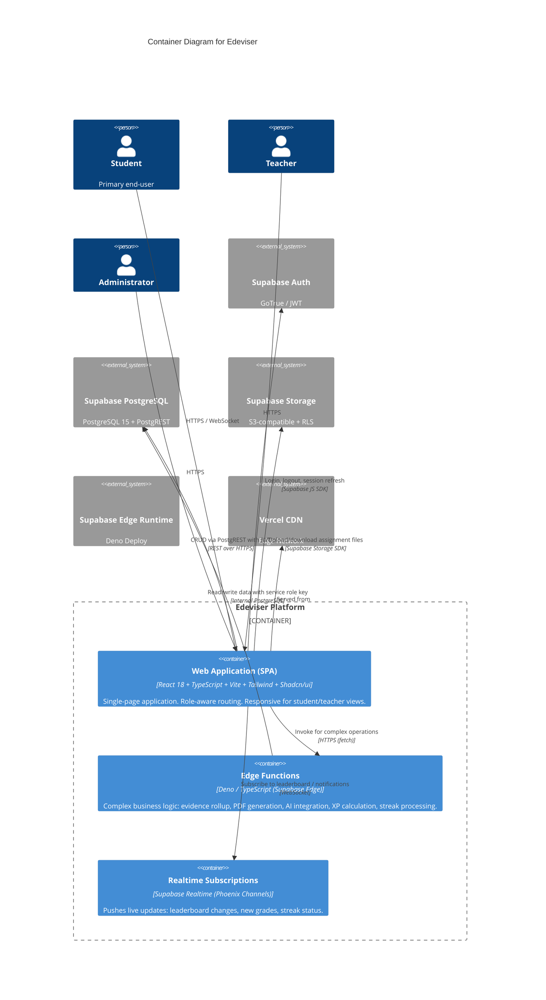
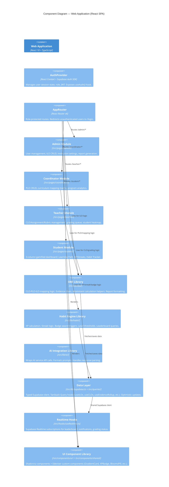
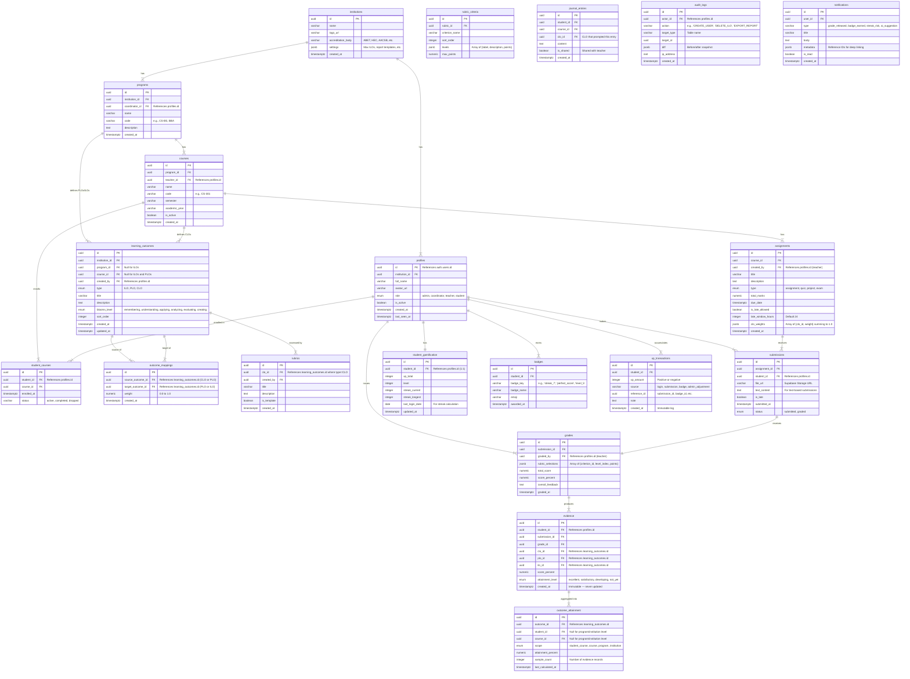
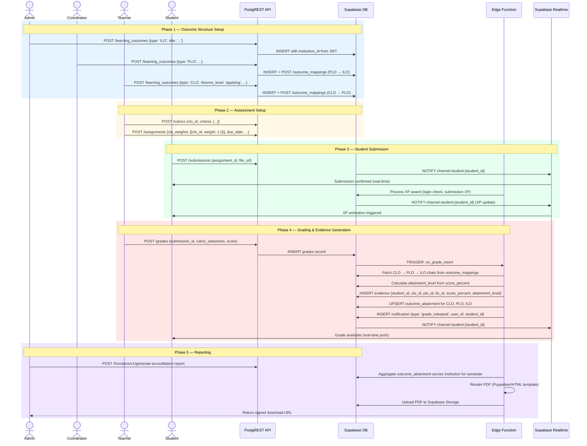
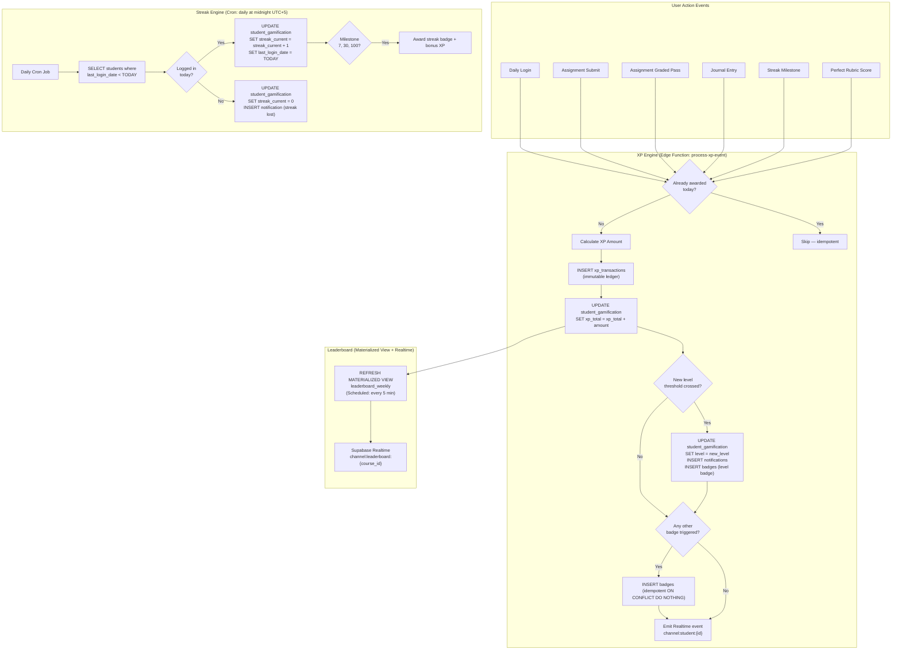
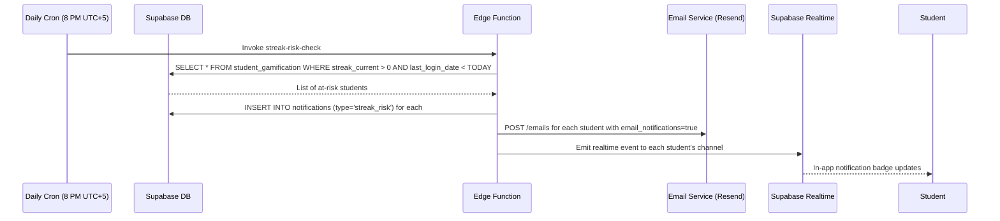
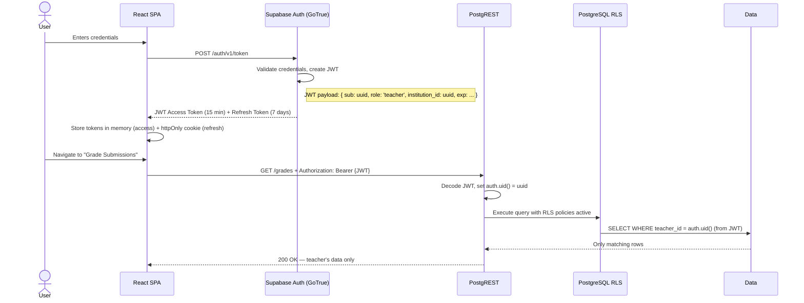

# Edeviser — System Architecture Document
**Version:** 2.0 | **Status:** Active | **Last Updated:** 2026-02-22
**Owners:** Engineering Lead | **Reviewers:** CTO, Security, DevOps

---

## Table of Contents
1. [Architecture Overview](#1-architecture-overview)
2. [C4 Context Diagram (Level 1)](#2-c4-context-diagram-level-1)
3. [C4 Container Diagram (Level 2)](#3-c4-container-diagram-level-2)
4. [C4 Component Diagram (Level 3)](#4-c4-component-diagram-level-3)
5. [Database Schema (ERD)](#5-database-schema-erd)
6. [Row Level Security Policies](#6-row-level-security-policies)
7. [The OBE Data Flow — Golden Path](#7-the-obe-data-flow--golden-path)
8. [Evidence Rollup Architecture](#8-evidence-rollup-architecture)
9. [Gamification Engine Architecture](#9-gamification-engine-architecture)
10. [API Design](#10-api-design)
11. [Security Architecture](#11-security-architecture)
12. [Observability & Monitoring](#12-observability--monitoring)
13. [Deployment & Infrastructure](#13-deployment--infrastructure)
14. [Technology Stack](#14-technology-stack)
15. [Scalability Roadmap](#15-scalability-roadmap)
16. [Disaster Recovery](#16-disaster-recovery)

---

## 1. Architecture Overview

### Philosophy: Simplicity at the Core, Sophistication at the Edge

Edeviser follows a **Backend-as-a-Service (BaaS) + Edge Function** pattern to maximize development velocity while maintaining enterprise-grade security. The architecture is designed around three non-negotiable constraints:

1. **Every student action must feel instant** — client-side optimistic updates + Supabase Realtime subscriptions eliminate perceived latency.
2. **Every compliance record must be auditable** — evidence records are append-only, immutable, and linked through a chain of custody from ILO to submission.
3. **Security is enforced at the database layer** — Row Level Security policies on every table ensure data isolation without application-layer trust.

### Architectural Decisions Log

| Decision | Choice | Rationale | Date |
|----------|--------|-----------|------|
| **Multi-tenancy** | Single Supabase project + RLS | Fastest to build; RLS isolates institution data; revisit at 50+ institutions | 2026-01 |
| **Evidence storage** | Append-only `evidence` table | Immutability required for accreditation audit trail | 2026-01 |
| **Realtime stack** | Supabase Realtime (Phoenix channels) | Already in stack; sufficient for v1; upgrade to dedicated pub/sub at scale | 2026-01 |
| **Deployment** | Vercel (Frontend) + Supabase (BaaS) | Zero-config CI/CD; optimal for small team | 2026-01 |
| **State management** | TanStack Query (server state) | Caching, deduplication, background refetch out of the box | 2026-01 |
| **PDF generation** | Supabase Edge Function + Puppeteer | Server-side ensures consistent rendering; avoids client-side PDF libraries | 2026-01 |
| **File uploads** | Supabase Storage | Native integration; handles CDN, RLS on files, presigned URLs | 2026-01 |

---

## 2. C4 Context Diagram (Level 1)



---

## 3. C4 Container Diagram (Level 2)



---

## 4. C4 Component Diagram (Level 3)



---

## 5. Database Schema (ERD)

### Full Entity Relationship Diagram



### Key Schema Design Decisions

**1. `learning_outcomes` — Unified Outcome Table**
ILOs, PLOs, and CLOs share one table discriminated by `type`. This simplifies the `outcome_mappings` join table and enables a single attainment rollup query across all levels.

**2. `evidence` — Immutable Audit Trail**
Evidence records are never updated or deleted. If a grade is revised, a new evidence record is inserted. The rollup uses the `MAX(created_at)` evidence record per `(student_id, clo_id, submission_id)` tuple.

**3. `xp_transactions` — Financial Ledger Pattern**
XP is never stored as a single mutable balance. Every change is a transaction record. `student_gamification.xp_total` is a materialized sum, recalculated on each transaction insert. This ensures XP is fully auditable.

**4. `assignments.clo_weights` — JSONB for Flexibility**
An assignment can target 1–3 CLOs with weighted contribution. Storing as JSONB avoids a full normalized join table for a small, bounded dataset.

---

## 6. Row Level Security Policies

RLS is enabled on ALL tables. The following core policies define the access model:

```sql
-- ==============================
-- HELPER FUNCTION
-- ==============================
CREATE OR REPLACE FUNCTION auth_user_role()
RETURNS TEXT AS $$
  SELECT role FROM profiles WHERE id = auth.uid();
$$ LANGUAGE SQL SECURITY DEFINER STABLE;

CREATE OR REPLACE FUNCTION auth_institution_id()
RETURNS UUID AS $$
  SELECT institution_id FROM profiles WHERE id = auth.uid();
$$ LANGUAGE SQL SECURITY DEFINER STABLE;

-- ==============================
-- PROFILES
-- ==============================
ALTER TABLE profiles ENABLE ROW LEVEL SECURITY;

-- Users can read their own profile
CREATE POLICY "profiles_read_own" ON profiles
  FOR SELECT USING (id = auth.uid());

-- Admins can read all profiles in their institution
CREATE POLICY "profiles_admin_read_institution" ON profiles
  FOR SELECT USING (
    auth_user_role() = 'admin'
    AND institution_id = auth_institution_id()
  );

-- Admins can insert/update profiles in their institution
CREATE POLICY "profiles_admin_write" ON profiles
  FOR ALL USING (
    auth_user_role() = 'admin'
    AND institution_id = auth_institution_id()
  );

-- ==============================
-- LEARNING OUTCOMES
-- ==============================
ALTER TABLE learning_outcomes ENABLE ROW LEVEL SECURITY;

-- Everyone in the institution can read outcomes
CREATE POLICY "outcomes_institution_read" ON learning_outcomes
  FOR SELECT USING (institution_id = auth_institution_id());

-- Admins can CRUD ILOs
CREATE POLICY "outcomes_admin_crud_ilo" ON learning_outcomes
  FOR ALL USING (
    auth_user_role() = 'admin'
    AND type = 'ILO'
    AND institution_id = auth_institution_id()
  );

-- Coordinators can CRUD PLOs in their programs
CREATE POLICY "outcomes_coord_crud_plo" ON learning_outcomes
  FOR ALL USING (
    auth_user_role() = 'coordinator'
    AND type = 'PLO'
    AND program_id IN (
      SELECT id FROM programs WHERE coordinator_id = auth.uid()
    )
  );

-- Teachers can CRUD CLOs in their courses
CREATE POLICY "outcomes_teacher_crud_clo" ON learning_outcomes
  FOR ALL USING (
    auth_user_role() = 'teacher'
    AND type = 'CLO'
    AND course_id IN (
      SELECT id FROM courses WHERE teacher_id = auth.uid()
    )
  );

-- ==============================
-- SUBMISSIONS
-- ==============================
ALTER TABLE submissions ENABLE ROW LEVEL SECURITY;

-- Students can only see and create their own submissions
CREATE POLICY "submissions_student_own" ON submissions
  FOR ALL USING (student_id = auth.uid());

-- Teachers can read submissions for their courses
CREATE POLICY "submissions_teacher_read" ON submissions
  FOR SELECT USING (
    auth_user_role() = 'teacher'
    AND assignment_id IN (
      SELECT id FROM assignments WHERE course_id IN (
        SELECT id FROM courses WHERE teacher_id = auth.uid()
      )
    )
  );

-- ==============================
-- EVIDENCE (Read-only for non-admins — inserts via service role only)
-- ==============================
ALTER TABLE evidence ENABLE ROW LEVEL SECURITY;

-- Students can read their own evidence
CREATE POLICY "evidence_student_read_own" ON evidence
  FOR SELECT USING (student_id = auth.uid());

-- Teachers can read evidence from their courses
CREATE POLICY "evidence_teacher_read" ON evidence
  FOR SELECT USING (
    auth_user_role() = 'teacher'
    AND clo_id IN (
      SELECT id FROM learning_outcomes
      WHERE course_id IN (
        SELECT id FROM courses WHERE teacher_id = auth.uid()
      )
    )
  );

-- Admins and Coordinators can read all institution evidence
CREATE POLICY "evidence_admin_coord_read" ON evidence
  FOR SELECT USING (
    auth_user_role() IN ('admin', 'coordinator')
    AND student_id IN (
      SELECT id FROM profiles WHERE institution_id = auth_institution_id()
    )
  );

-- ==============================
-- GAMIFICATION (Student profile — private)
-- ==============================
ALTER TABLE student_gamification ENABLE ROW LEVEL SECURITY;

CREATE POLICY "gamification_student_own" ON student_gamification
  FOR SELECT USING (student_id = auth.uid());

-- Teachers and admins can read gamification data (for at-risk monitoring)
CREATE POLICY "gamification_teacher_read" ON student_gamification
  FOR SELECT USING (
    auth_user_role() IN ('teacher', 'coordinator', 'admin')
  );

-- ==============================
-- AUDIT LOGS (Admin read-only)
-- ==============================
ALTER TABLE audit_logs ENABLE ROW LEVEL SECURITY;

CREATE POLICY "audit_admin_read" ON audit_logs
  FOR SELECT USING (auth_user_role() = 'admin');
```

---

## 7. The OBE Data Flow — Golden Path



---

## 8. Evidence Rollup Architecture

The evidence rollup is the most critical piece of performance-sensitive logic in the system.

### Rollup Trigger Design

```mermaid
flowchart TD
    subgraph DB_Trigger ["PostgreSQL Trigger (on grades INSERT)"]
        G[Grade Inserted] --> TF[TRIGGER FUNCTION: fn_trigger_evidence_rollup]
        TF --> EF_Call["PERFORM net.http_post(edge_function_url, payload)"]
    end

    subgraph EF_Logic ["Edge Function: calculate-attainment-rollup"]
        EF_Call --> Fetch["Fetch CLO-PLO-ILO chain\nSELECT source/target from outcome_mappings\nWHERE source = grade.clo_id"]
        Fetch --> CalcScore["Calculate score_percent from rubric_selections\nand assignment.total_marks"]
        CalcScore --> CalcLevel["Map score to attainment_level\n>=85% → excellent\n70-84% → satisfactory\n50-69% → developing\n<50% → not_yet"]
        CalcLevel --> InsertEv["INSERT INTO evidence\n(immutable — no UPDATE)"]
        InsertEv --> RollupCLO["UPSERT outcome_attainment (scope=student_course)\nAVG(score_percent) for student × CLO"]
        RollupCLO --> FetchPLO["Fetch all CLOs mapping to same PLO"]
        FetchPLO --> RollupPLO["UPSERT outcome_attainment (scope=course)\nWeighted average of CLO attainments"]
        RollupPLO --> FetchILO["Fetch all PLOs mapping to same ILO"]
        FetchILO --> RollupILO["UPSERT outcome_attainment (scope=program)\nWeighted average of PLO attainments"]
        RollupILO --> Notify["INSERT notification (grade released)"]
        Notify --> RT_Emit["Emit Supabase Realtime event\n(student + teacher channels)"]
    end

    RT_Emit --> Reports["outcome_attainment table ready\nfor analytics queries"]

    style DB_Trigger fill:#e1f5fe,stroke:#01579b
    style EF_Logic fill:#fff3e0,stroke:#ff6f00
```



### Rollup SQL Queries

```sql
-- =============================================
-- UPSERT CLO-level attainment for a student
-- =============================================
INSERT INTO outcome_attainment (outcome_id, student_id, course_id, scope, attainment_percent, sample_count, last_calculated_at)
SELECT
    e.clo_id,
    e.student_id,
    a.course_id,
    'student_course',
    AVG(e.score_percent),
    COUNT(*),
    NOW()
FROM evidence e
JOIN submissions s ON s.id = e.submission_id
JOIN assignments a ON a.id = s.assignment_id
WHERE e.clo_id = $clo_id AND e.student_id = $student_id
GROUP BY e.clo_id, e.student_id, a.course_id
ON CONFLICT (outcome_id, student_id, course_id, scope)
DO UPDATE SET
    attainment_percent = EXCLUDED.attainment_percent,
    sample_count = EXCLUDED.sample_count,
    last_calculated_at = EXCLUDED.last_calculated_at;

-- =============================================
-- UPSERT PLO-level attainment for a course
-- =============================================
INSERT INTO outcome_attainment (outcome_id, student_id, course_id, scope, attainment_percent, sample_count, last_calculated_at)
SELECT
    om.target_outcome_id AS plo_id,
    oa.student_id,
    oa.course_id,
    'course',
    SUM(oa.attainment_percent * om.weight) / NULLIF(SUM(om.weight), 0),
    SUM(oa.sample_count),
    NOW()
FROM outcome_attainment oa
JOIN outcome_mappings om ON om.source_outcome_id = oa.outcome_id
WHERE om.target_outcome_id = $plo_id AND oa.scope = 'student_course'
GROUP BY om.target_outcome_id, oa.student_id, oa.course_id
ON CONFLICT (outcome_id, student_id, course_id, scope)
DO UPDATE SET
    attainment_percent = EXCLUDED.attainment_percent,
    last_calculated_at = EXCLUDED.last_calculated_at;
```

### Critical Indexes

```sql
-- Evidence table — primary query patterns
CREATE INDEX idx_evidence_student_clo ON evidence(student_id, clo_id);
CREATE INDEX idx_evidence_clo ON evidence(clo_id);
CREATE INDEX idx_evidence_plo ON evidence(plo_id);
CREATE INDEX idx_evidence_ilo ON evidence(ilo_id);
CREATE INDEX idx_evidence_created_at ON evidence(created_at DESC);

-- Outcome attainment — dashboard queries
CREATE INDEX idx_attainment_outcome_scope ON outcome_attainment(outcome_id, scope);
CREATE INDEX idx_attainment_student ON outcome_attainment(student_id, scope);
CREATE UNIQUE INDEX idx_attainment_unique ON outcome_attainment(outcome_id, COALESCE(student_id, '00000000-0000-0000-0000-000000000000'), COALESCE(course_id, '00000000-0000-0000-0000-000000000000'), scope);

-- Gamification
CREATE INDEX idx_xp_transactions_student ON xp_transactions(student_id, created_at DESC);
CREATE INDEX idx_student_gamification_xp ON student_gamification(xp_total DESC);

-- Submissions
CREATE INDEX idx_submissions_assignment ON submissions(assignment_id);
CREATE INDEX idx_submissions_student ON submissions(student_id);

-- Learning outcomes
CREATE INDEX idx_outcomes_type_institution ON learning_outcomes(type, institution_id);
CREATE INDEX idx_outcomes_course ON learning_outcomes(course_id) WHERE type = 'CLO';
CREATE INDEX idx_outcomes_program ON learning_outcomes(program_id) WHERE type = 'PLO';

-- Outcome mappings
CREATE INDEX idx_outcome_mappings_source ON outcome_mappings(source_outcome_id);
CREATE INDEX idx_outcome_mappings_target ON outcome_mappings(target_outcome_id);
```

---

## 9. Gamification Engine Architecture



### Streak Risk Notification (Email + In-App)



---

## 10. API Design

### API Conventions

All data access flows through two mechanisms:
1. **PostgREST (Supabase REST API):** Standard CRUD operations. Auth enforced via JWT + RLS.
2. **Supabase Edge Functions:** Complex operations requiring multi-table writes, external service calls, or business logic that cannot be expressed in a single PostgREST call.

### Endpoint Catalog

#### Auth (Supabase Managed)
```
POST   /auth/v1/token?grant_type=password    Login
POST   /auth/v1/recover                       Request password reset
POST   /auth/v1/logout                        Logout
GET    /auth/v1/user                          Get current user
```

#### Core OBE Resources (PostgREST)
```
# Learning Outcomes
GET    /rest/v1/learning_outcomes             List (filtered via query params: ?type=eq.ILO)
POST   /rest/v1/learning_outcomes             Create
PATCH  /rest/v1/learning_outcomes?id=eq.{id} Update
DELETE /rest/v1/learning_outcomes?id=eq.{id} Soft-delete (set is_active=false)

# Outcome Mappings
GET    /rest/v1/outcome_mappings?source_outcome_id=eq.{id}
POST   /rest/v1/outcome_mappings
DELETE /rest/v1/outcome_mappings?id=eq.{id}

# Rubrics
GET    /rest/v1/rubrics?clo_id=eq.{id}
POST   /rest/v1/rubrics
PATCH  /rest/v1/rubrics?id=eq.{id}

# Assignments
GET    /rest/v1/assignments?course_id=eq.{id}&order=due_date.asc
POST   /rest/v1/assignments
PATCH  /rest/v1/assignments?id=eq.{id}

# Submissions
POST   /rest/v1/submissions                   Student submits
GET    /rest/v1/submissions?assignment_id=eq.{id}  Teacher grading queue

# Grades
POST   /rest/v1/grades                        Teacher submits grade (triggers evidence via DB trigger)

# Evidence
GET    /rest/v1/evidence?student_id=eq.{id}   Student's own evidence
GET    /rest/v1/outcome_attainment?outcome_id=eq.{id}&scope=eq.program  Program attainment

# Gamification
GET    /rest/v1/student_gamification?student_id=eq.{id}
GET    /rest/v1/badges?student_id=eq.{id}&order=awarded_at.desc
GET    /rest/v1/xp_transactions?student_id=eq.{id}&limit=20&order=created_at.desc
GET    /rest/v1/notifications?user_id=eq.{id}&is_read=eq.false
PATCH  /rest/v1/notifications?id=eq.{id}      Mark as read
```

#### Edge Functions
```
POST   /functions/v1/grade-submission
  Body: { grade_id: uuid }
  Auth: Teacher JWT
  Action: Trigger evidence rollup (fallback if DB trigger fails)

POST   /functions/v1/process-xp-event
  Body: { event_type: string, student_id: uuid, reference_id?: uuid }
  Auth: Service role (internal only)
  Action: Award XP, check level/badge thresholds

POST   /functions/v1/generate-accreditation-report
  Body: { program_id: uuid, semester: string, format: 'ABET' | 'HEC' | 'generic' }
  Auth: Admin JWT
  Action: Query attainment data, render PDF, upload to Storage, return signed URL

POST   /functions/v1/bulk-import-users
  Body: FormData (CSV file)
  Auth: Admin JWT
  Action: Validate CSV, create auth users, insert profiles, send invitation emails

GET    /functions/v1/leaderboard?course_id={id}&period=weekly
  Auth: Any authenticated JWT in the institution
  Action: Query pre-computed leaderboard view with privacy filtering

POST   /functions/v1/ai-suggest
  Body: { student_id: uuid, context: 'module_suggestion' | 'at_risk' }
  Auth: Teacher/Student JWT
  Action: Call AI service, return structured suggestions (Phase 2)
```

### TanStack Query Hook Pattern

```typescript
// /src/queries/useLearningOutcomes.ts
export const useLearningOutcomes = (type: 'ILO' | 'PLO' | 'CLO', scopeId?: string) => {
  const { supabase } = useSupabase();

  return useQuery({
    queryKey: ['learning_outcomes', type, scopeId],
    queryFn: async () => {
      let query = supabase
        .from('learning_outcomes')
        .select(`
          *,
          outcome_mappings!source_outcome_id(target_outcome_id, weight),
          rubrics(id, title)
        `)
        .eq('type', type)
        .order('sort_order');

      if (type === 'CLO' && scopeId) query = query.eq('course_id', scopeId);
      if (type === 'PLO' && scopeId) query = query.eq('program_id', scopeId);

      const { data, error } = await query;
      if (error) throw error;
      return data;
    },
    staleTime: 1000 * 60 * 5, // 5 minutes — outcomes change infrequently
  });
};

// Optimistic mutation pattern for creating an outcome
export const useCreateOutcome = () => {
  const { supabase } = useSupabase();
  const queryClient = useQueryClient();

  return useMutation({
    mutationFn: async (payload: CreateOutcomePayload) => {
      const { data, error } = await supabase.from('learning_outcomes').insert(payload).select().single();
      if (error) throw error;
      return data;
    },
    onMutate: async (newOutcome) => {
      await queryClient.cancelQueries({ queryKey: ['learning_outcomes', newOutcome.type] });
      const prev = queryClient.getQueryData(['learning_outcomes', newOutcome.type]);
      queryClient.setQueryData(['learning_outcomes', newOutcome.type], (old: any[]) => [...old, { ...newOutcome, id: 'temp-' + Date.now() }]);
      return { prev };
    },
    onError: (err, _, context) => {
      queryClient.setQueryData(['learning_outcomes'], context?.prev);
    },
    onSettled: (_, __, variables) => {
      queryClient.invalidateQueries({ queryKey: ['learning_outcomes', variables.type] });
    },
  });
};
```

---

## 11. Security Architecture

### Zero-Trust Security Model



### Security Layers

| Layer | Control | Implementation |
|-------|---------|---------------|
| **Transport** | TLS 1.3 minimum | Vercel + Supabase enforce by default |
| **Authentication** | JWT-based sessions | Supabase GoTrue; 15-min access token rotation |
| **Token Storage** | Memory + httpOnly cookie | Access token in memory (not localStorage); refresh in httpOnly cookie |
| **Authorization** | Database RLS | PostgreSQL policies; no application-layer trust |
| **Input Validation** | Zod schemas | Client-side + Edge Function server-side |
| **Rate Limiting** | Auth endpoint limiting | 5 attempts/15 min (Supabase config) |
| **File Upload** | Type + size validation | MIME type check + 50MB limit in Supabase Storage rules |
| **Audit Trail** | Immutable audit log | `audit_logs` table for all admin actions |
| **Secret Management** | Environment variables only | Service role key never exposed to client; `.env` not committed |
| **Dependency Security** | Automated scanning | GitHub Dependabot + scheduled Snyk scan |

### Environment Variables

```bash
# .env (never committed — CI injects via Vercel env)
VITE_SUPABASE_URL=https://xxxx.supabase.co
VITE_SUPABASE_ANON_KEY=eyJhbGci...       # Client-safe (RLS enforced)

# Edge Functions only (server-side, never exposed to client)
SUPABASE_SERVICE_ROLE_KEY=eyJhbGci...    # Bypasses RLS — handle with extreme care
OPENAI_API_KEY=sk-...
RESEND_API_KEY=re_...
```

---

## 12. Observability & Monitoring

### Monitoring Stack

| Layer | Tool | Alert Channel |
|-------|------|--------------|
| **Frontend Errors** | Sentry (React SDK) | Slack #alerts |
| **API Errors** | Supabase Dashboard + Sentry (Edge Functions) | Slack #alerts |
| **Uptime** | BetterUptime (60s intervals) | SMS + Email |
| **Performance** | Vercel Web Vitals + Lighthouse CI | GitHub PR checks |
| **Database** | Supabase Dashboard (query latency, connection count) | Manual review |
| **Edge Functions** | Supabase Edge Function logs | Supabase Dashboard |

### Key Alerts
| Alert | Condition | Action |
|-------|-----------|--------|
| High Error Rate | >1% API error rate over 5 min | Page on-call engineer |
| Slow Evidence Rollup | Edge function >2s execution | Investigate index usage |
| Streak Job Failed | Cron missed execution | Re-run manually; page engineering |
| Storage Quota | >80% of Supabase Storage | Upgrade tier or implement cleanup policy |
| Auth Spike | >100 failed logins in 1 min from single IP | Block IP, alert admin |

### Structured Logging (Edge Functions)

```typescript
// All edge function logs follow this structured format
const log = (level: 'info' | 'warn' | 'error', event: string, data?: Record<string, unknown>) => {
  console.log(JSON.stringify({
    timestamp: new Date().toISOString(),
    level,
    event,
    service: 'edeviser-edge',
    ...data,
  }));
};

// Usage
log('info', 'evidence.created', { student_id, clo_id, score_percent });
log('error', 'rollup.failed', { error: err.message, grade_id });
```

---

## 13. Deployment & Infrastructure

```mermaid
graph TB
    subgraph Developer ["Developer Workflow"]
        Dev[Developer Pushes Code] --> GH[GitHub Repository]
        GH --> PR[Pull Request + Lighthouse CI]
        PR --> Merge[Merge to main]
    end

    subgraph Vercel_CD ["Vercel CI/CD"]
        Merge --> VB[Vercel Build: vite build]
        VB --> Tests[Unit Tests: Vitest\nType Check: tsc]
        Tests --> VDeploy[Deploy to Vercel CDN]
    end

    subgraph Supabase_Deploy ["Supabase Deployment"]
        Merge --> EFDeploy[supabase functions deploy\nvia GitHub Action]
        Merge --> MigDeploy[supabase db push\n(migrations)]
    end

    subgraph Production ["Production Environment"]
        VDeploy --> CDN[Vercel Edge Network\nGlobal CDN: 100+ PoPs]
        CDN --> Users[Users Globally]
        EFDeploy --> SupaEdge[Supabase Edge Runtime\nDeno Deploy]
        MigDeploy --> SupaDB[Supabase PostgreSQL\nRegion: ap-south-1]
        SupaDB --> Backup[Daily PITR Backups\nRetention: 30 days]
    end

    subgraph Staging ["Staging Environment"]
        Merge --> StagingDeploy[Vercel Preview\n+ Staging Supabase Project]
        StagingDeploy --> QA[QA Verification]
    end

    style Production fill:#e8f5e9,stroke:#2e7d32
    style Staging fill:#fff8e1,stroke:#f9a825
```

### Supabase Region Selection
- **Primary:** `ap-south-1` (Mumbai) — closest to South Asia target market.
- **Failover:** Not configured in MVP; Supabase provides auto-failover within region.
- **Phase 2:** Consider `ap-southeast-1` (Singapore) replica for Southeast Asia expansion.

### GitHub Actions — CI/CD Pipeline

```yaml
# .github/workflows/deploy.yml
name: Deploy

on:
  push:
    branches: [main]

jobs:
  deploy-edge-functions:
    runs-on: ubuntu-latest
    steps:
      - uses: actions/checkout@v4
      - uses: supabase/setup-cli@v1
        with:
          version: latest
      - run: supabase functions deploy --project-ref ${{ secrets.SUPABASE_PROJECT_REF }}
        env:
          SUPABASE_ACCESS_TOKEN: ${{ secrets.SUPABASE_ACCESS_TOKEN }}

  run-migrations:
    runs-on: ubuntu-latest
    needs: deploy-edge-functions
    steps:
      - uses: actions/checkout@v4
      - uses: supabase/setup-cli@v1
      - run: supabase db push --project-ref ${{ secrets.SUPABASE_PROJECT_REF }}
        env:
          SUPABASE_ACCESS_TOKEN: ${{ secrets.SUPABASE_ACCESS_TOKEN }}

  # Vercel deployment is automatic via Vercel GitHub integration
```

---

## 14. Technology Stack

### Full Stack Summary

| Layer | Technology | Version | Purpose |
|-------|-----------|---------|---------|
| **Frontend Framework** | React | 18 | Component-based UI |
| **Build Tool** | Vite | 5 | Fast dev server + optimized production build |
| **Language** | TypeScript | 5 | Type safety across frontend and edge functions |
| **Styling** | Tailwind CSS | 3 | Utility-first CSS; design token integration |
| **Component Library** | Shadcn/ui + Radix UI | Latest | Accessible, unstyled primitives + Edeviser overrides |
| **Routing** | React Router | 6 | SPA navigation with role guards |
| **Server State** | TanStack Query | 5 | Caching, deduplication, optimistic updates, background sync |
| **Forms** | React Hook Form + Zod | Latest | Type-safe form validation |
| **Animation** | Framer Motion | 11 | Complex UI animations; gamification celebrations |
| **Icons** | Lucide React | Latest | Consistent icon set |
| **Database** | Supabase PostgreSQL | 15 | Managed PostgreSQL with realtime |
| **Auth** | Supabase Auth (GoTrue) | — | JWT-based sessions, RBAC |
| **API** | Supabase PostgREST | — | Auto-generated REST API from DB schema |
| **Edge Functions** | Supabase Edge (Deno) | — | Complex business logic, PDF gen, AI calls |
| **Realtime** | Supabase Realtime | — | WebSocket-based live updates |
| **File Storage** | Supabase Storage | — | Assignment files, PDFs; CDN delivery |
| **Frontend Host** | Vercel | — | Global CDN, CI/CD, edge middleware |
| **Email** | Resend | — | Transactional emails with Supabase hook |
| **Monitoring** | Sentry | — | Error tracking |
| **Testing** | Vitest + React Testing Library | — | Unit and component tests |
| **PDF Generation** | Puppeteer (in Edge Function) | Latest | Server-side accreditation report rendering |
| **AI (Phase 2)** | OpenAI API / Anthropic API | — | AI Co-Pilot features |

### Frontend Project Structure

```
/src
├── /pages
│   ├── /admin          # Admin dashboard, user mgmt, ILOs, reports
│   ├── /coordinator    # PLO management, curriculum matrix
│   ├── /teacher        # CLO/assignment/rubric/grading views
│   └── /student        # Gamified dashboard, learning path, journal
│
├── /components
│   ├── /ui             # Shadcn base components (Button, Card, Input, etc.)
│   ├── /shared         # Shared cross-role components (GradientCard, BloomsPill, etc.)
│   ├── /obe            # OBE-specific: OutcomeTree, RubricBuilder, EvidenceChain
│   └── /gamification   # XPBadge, StreakCounter, LevelBar, LeaderboardRow
│
├── /lib
│   ├── supabase.ts     # Supabase client initialization
│   ├── /obe            # OBE business logic (attainment calc, Bloom's mapping)
│   └── /habit          # Gamification logic (XP events, badge checks, level thresholds)
│
├── /queries            # TanStack Query hooks (per domain)
│   ├── useLearningOutcomes.ts
│   ├── useAssignments.ts
│   ├── useGamification.ts
│   └── useEvidence.ts
│
├── /hooks              # Custom React hooks
│   ├── useAuth.ts
│   ├── useRealtime.ts
│   └── useOptimisticMutation.ts
│
├── /types              # TypeScript type definitions (mirroring DB schema)
│   ├── database.types.ts  # Auto-generated by Supabase CLI
│   └── app.types.ts       # Application-level types
│
└── /constants          # XP schedule, level thresholds, badge definitions, Bloom's colors
```

### Supabase Edge Functions Structure

```
/supabase
├── /functions
│   ├── grade-submission/           # Evidence rollup trigger (fallback)
│   ├── process-xp-event/           # XP award, level/badge check
│   ├── generate-accreditation-report/ # PDF generation
│   ├── bulk-import-users/          # CSV import + invite emails
│   ├── streak-risk-check/          # Daily cron: streak reminders
│   ├── leaderboard/                # Leaderboard query with privacy
│   └── ai-suggest/                 # AI Co-Pilot (Phase 2)
│
└── /migrations
    ├── 001_initial_schema.sql
    ├── 002_rls_policies.sql
    ├── 003_indexes.sql
    ├── 004_gamification.sql
    └── 005_triggers_and_functions.sql
```

---

## 15. Scalability Roadmap

| Scale Trigger | Symptom | Mitigation |
|---------------|---------|------------|
| **5,000+ students** | DB read latency increase | Add Supabase read replica; route analytics queries to replica |
| **10,000+ students** | Leaderboard refresh too slow | Replace materialized view with Redis sorted set |
| **50+ institutions** | RLS policy complexity; single project risk | Migrate to multi-project architecture (1 Supabase project per institution) |
| **100+ concurrent graders** | Evidence rollup queue backlog | Introduce queue (pg_cron or external queue like Inngest) for rollup jobs |
| **AI at scale** | AI API cost and latency | Implement request batching; add caching layer for common suggestions |
| **File storage >100GB** | Cost and performance | Implement lifecycle policy; archive old submissions to cold storage |

---

## 16. Disaster Recovery

| Scenario | RTO | RPO | Recovery Procedure |
|----------|-----|-----|-------------------|
| **Frontend outage (Vercel)** | < 15 min | N/A | Vercel automatic failover; rollback via `vercel rollback` |
| **Database corruption** | < 4 hours | < 1 hour | Supabase PITR (Point-in-Time Recovery) restore; validate evidence integrity |
| **Supabase region outage** | < 4 hours | < 1 hour | Restore from daily backup to alternative region |
| **Edge Function bug causing bad evidence** | < 2 hours | N/A | Roll back function via `supabase functions deploy --version`; evidence table is append-only — insert correction records |
| **Compromised service role key** | < 30 min | N/A | Rotate key in Supabase dashboard; update Vercel/GitHub secrets; audit `audit_logs` for unauthorized operations |
| **Bulk XP fraud detected** | < 1 hour | N/A | Admin reverts XP transactions (admin-only write with audit trail); `xp_transactions` log provides full audit |

### Backup Verification
- Monthly: Restore Supabase backup to a staging project and verify data integrity with automated test queries.
- Quarterly: Full disaster recovery drill (simulate region outage, restore from backup, verify app functionality).

---

*Document maintained by the Edeviser Engineering Team. Architecture decisions require CTO sign-off. All changes tracked in Git history.*
